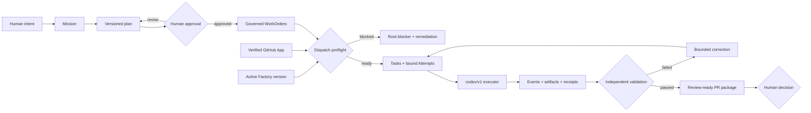
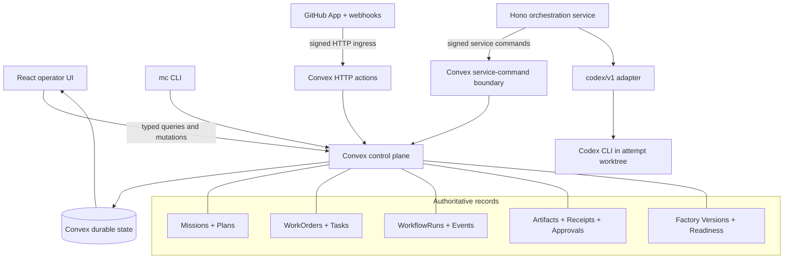

# Mission Control

## AI Software Factory for governed autonomous delivery

Mission Control turns AI coding agents into a governed, measurable software
delivery system. It coordinates human intent, repository access, plans,
WorkOrders, execution agents, policy, evidence, pull requests, and release
decisions without surrendering human authority.

> Mission Control is not another coding assistant. It is the control plane that
> makes autonomous software delivery bounded, inspectable, recoverable, and
> reviewable.

## Project status

Mission Control is in active V1 development.

The governed factory foundation is implemented: repository identity, GitHub App
readiness, immutable Factory versions, activation gates, signed service
commands, the `codex/v1` executor contract, and exact execution bindings are in
the codebase and covered by automated tests.

The next release milestone is the real Codex-to-GitHub pull-request golden path.
The durable worker that claims a bound Attempt, runs Codex, enforces changed-file
scope, pushes through an ephemeral GitHub App token, opens the PR, and reconciles
restart/retry behavior is not yet complete. Until that path is proven against a
sandbox repository through the browser, Mission Control should not be described
as production-ready.

| Capability | Status |
|---|---|
| Mission planning and human plan approval | Implemented |
| Governed WorkOrders, Tasks, Attempts, and evidence records | Implemented |
| GitHub App identity, least-privilege readiness, signed webhooks, and replay ledger | Implemented |
| Immutable Factory configuration, readiness assessment, and activation | Implemented |
| Signed service commands and durable command receipts | Implemented |
| `codex/v1` executor adapter with sandbox, events, health, and cancellation | Implemented |
| Dispatch preflight and immutable execution envelope | Implemented |
| Durable Codex worker through exact GitHub pull request | **Next milestone** |
| Governed deployment and production verification | V1.1 |
| FDE engagement workspace and additional connectors | Post-V1 |

The original repository baseline, approved implementation sequence, and next
milestone are recorded in the
[existing-system assessment](docs/mission-control-existing-system-assessment.md),
[V1 program plan](docs/plans/2026-08-02-feat-ai-software-factory-v1-program-plan.md),
and [current golden-path todo](todos/024-ready-p1-real-codex-github-pr-golden-path.md).

## The delivery contract

Mission Control uses one authoritative hierarchy:

```text
Company
└── Workspace
    └── Repository
        └── Active Factory version
            └── Mission
                └── Approved Plan
                    └── WorkOrder
                        └── Task
                            └── Attempt / WorkflowRun
                                ├── ordered events
                                ├── artifacts and changed files
                                └── verification receipts

Pull Request → Merge → Deployment → Activation → Production Verification
```

Each layer has a separate responsibility:

- A **Mission** captures the intended outcome, constraints, sources, budget,
  stop condition, and acceptance criteria.
- A **Plan** is versioned, reviewable, and must be approved before material
  implementation begins.
- A **WorkOrder** is the governed delivery and acceptance contract released
  from that plan.
- A **Task** is a bounded operational unit inside a WorkOrder.
- An **Attempt** is one immutable execution try against an exact WorkOrder
  revision and Factory version.
- **Evidence** proves or disproves acceptance criteria. A worker report does not
  prove completion.
- Pull request, merge, deployment, activation, and production verification are
  distinct states. None silently implies the next.

## How the factory works



Before a Mission-linked Attempt exists, dispatch revalidates the exact active
Factory version, configuration digest, repository and GitHub access, workflow,
executor, policy, verifiers, host, budget, recovery controls, branch/worktree,
and allowed tools. A blocked check returns one actionable root cause without
creating a run.

## What is implemented

### 1. Company, workspace, and repository boundaries

The control plane models:

`Company → Workspace → Repository → Code Scope`

Repository identity is portable and separate from a developer's local checkout.
Monorepos can define repository-relative code scopes, owning teams, execution
environments, review requirements, and overlap policy. Local execution uses a
separate host binding.

Authorization is resolved server-side. The browser does not decide which
company, workspace, repository, team, or delivery record an operator may act on.

### 2. Mission and plan governance

The Mission workspace supports draft, planning, proposal, rejection, revision,
approval, WorkOrder release, execution, validation, acceptance, cancellation,
and supersession states. Approved plans retain assertions, WorkOrder blueprints,
dependencies, risk, cost, rollback, and independent-validation requirements.

Task completion does not accept a WorkOrder, and WorkOrder completion does not
accept a Mission.

### 3. GitHub App trust boundary

GitHub is the only V1 Git provider. Mission Control records the App installation
identity and capability evidence for an exact workspace repository. It checks:

- repository installation identity;
- exact least-privilege permissions;
- required webhook subscriptions;
- verification freshness; and
- connection degradation, suspension, removal, or revocation.

Webhook HMAC is validated against the untouched request body before parsing.
Every GitHub delivery GUID is recorded in a replay-aware ledger, and duplicates
cannot repeat PR, CI, review, or improvement-loop effects. Installation tokens,
OAuth tokens, App private keys, client secrets, and webhook secrets are never
stored in product records.

See [GitHub App Connection and Webhook Contract](docs/security/github-app-connection.md).

### 4. Versioned Factory configuration

A Software Factory is a thin, repository-bound configuration aggregate. It
references existing platform records instead of creating a second execution
system.

Each immutable Factory version freezes:

- repository;
- workflow version;
- executor adapter and version;
- governance policy;
- environment;
- cost, runtime, and attempt budgets;
- independent verifiers;
- GREEN, YELLOW, or RED risk boundary; and
- pause, resume, cancel, and retry posture.

Readiness checks GitHub, repository access, workflow, `codex/v1`, policy,
budget, verifiers, sandbox host, and recovery controls. Activation requires a
current passing assessment for the exact configuration digest. Material changes
create a new version and leave the previous version auditable.

The UI lives under **Settings → Workspaces & Repositories**.

### 5. Human and service authority separation

Human actions, service commands, GitHub webhooks, and internal scheduler work use
different trust boundaries.

The orchestration service signs outbound commands with a replay-resistant HMAC
envelope containing the service identity, named capability, workspace,
repository, command ID, issue/expiry time, and exact payload digest. Convex
retains accepted, denied, failed, succeeded, and replayed command receipts
without storing credentials or command bodies.

Public clients cannot claim `SYSTEM` or `AGENT` authority to dispatch work.

See [Service Command Authentication](docs/security/service-command-authentication.md).

### 6. Codex executor adapter

V1 supports one production executor contract: `codex/v1`. Deterministic fake
adapters are test fixtures only.

The adapter provides:

- capability discovery;
- configuration validation;
- low-confidence cost/runtime estimates;
- ordered execution events;
- read-only and workspace-write isolation;
- repository-relative allowed paths;
- bounded timeouts;
- cancellation;
- explicit no-resume semantics for V1;
- health reporting; and
- bounded, redacted diagnostics.

The adapter executes an already-approved Attempt. It cannot approve a plan,
widen repository scope, activate a Factory, validate its own work, merge a PR,
or release software.

See [Executor Adapter Contract](docs/architecture/executor-adapter-contract.md).

### 7. Governed execution envelope

Every Mission-linked WorkflowRun can retain the exact Factory version and
digest, repository, host, executor, policy, environment, branch, worktree,
allowed tools, WorkOrder revision, and model-routing lineage used at dispatch.

Dispatch is idempotent and enforces one active mutating Attempt per repository
across Missions. Read-only work may coexist when policy allows it. Historical
runs without the new binding remain visibly marked as legacy rather than being
presented as governed.

### 8. Evidence and operator control

Mission Control already retains WorkOrder events, Attempt events, run artifacts,
approval decisions, verification receipts, PR/CI evidence, audit activity, and
release records. Operator surfaces prioritize required decisions, failed or
stale evidence, blockers, and remediation before routine agent activity.

The evidence model is designed to distinguish pass, fail, stale, unknown,
waived, conflicting, and not-applicable states. The unified end-to-end review
package remains part of the golden-path milestone.

## What remains for the V1 golden path

The next coherent implementation slice is intentionally narrow:

1. Claim one bound pending Attempt with a durable lease.
2. Allocate the approved worktree and server-owned branch.
3. Run `codex/v1` with the frozen prompt, model, tool, timeout, and path scope.
4. Emit ordered execution events and artifacts only through signed service
   commands.
5. Compare the resulting changed files with the approved code scopes.
6. Block PR creation and create a reviewable deviation when scope is exceeded.
7. Mint a short-lived GitHub App installation token at the provider boundary.
8. Push the branch and create the pull request idempotently.
9. Persist exact Mission, plan, WorkOrder, Task, Attempt, Factory, repository,
   branch, head SHA, PR, and changed-file lineage.
10. Prove refresh, process restart, retry, cancellation, and duplicate-delivery
    behavior through the browser against a sandbox repository.

Merge remains a human decision in V1. Governed deployment and production
verification follow in V1.1. Additional Git providers, issue trackers, FDE
engagement workspaces, and autonomous improvement remain deferred until this
path earns the production claim.

## Operator surfaces

The EOS V2 shell uses a route-maturity registry. Live routes are available by
default; Preview and Demo routes remain labeled and can be hidden.

| Route | Operator job | Maturity |
|---|---|---|
| `/v2/command-center` | Triage decisions, blockers, risk, and delivery attention | Live |
| `/v2/missions` | Define outcomes and manage Mission planning | Live |
| `/v2/mission-detail` | Inspect plan, WorkOrders, execution, and acceptance | Live |
| `/v2/control-work-orders` | Govern, dispatch, verify, and accept WorkOrders | Live |
| `/v2/tasks` | Inspect operational Tasks and Attempts | Live |
| `/v2/projects` | Configure workspaces, repositories, GitHub App readiness, code scopes, and Factory versions | Live |
| `/v2/audit` | Review approvals and audit history | Live |
| `/v2/harness-loops` | Inspect governed improvement-loop evidence | Live |
| `/v2/trace-inspector` | Inspect detailed execution lineage | Preview |

## System architecture



Convex is the source of truth. The Hono service hosts orchestration and executor
integration; it does not own a competing delivery lifecycle. Product data is
accessed through Convex queries, mutations, actions, internal functions, and
HTTP actions—there is no separate Express REST backend.

## Repository map

| Path | Responsibility |
|---|---|
| `apps/mission-control-ui/` | React operator application and EOS V2 shell |
| `apps/orchestration-server/` | Hono ingress, service-command client, agent coordination, and `codex/v1` runtime |
| `apps/workflow-executor/` | Standalone executor for versioned workflow graphs |
| `convex/` | Authoritative schema, domain commands, policies, GitHub ingress, evidence, and projections |
| `packages/workflow-engine/` | Workflow execution and executor-adapter contracts |
| `packages/policy-engine/` | Policy evaluation primitives |
| `packages/agent-runtime/` | Agent lifecycle and heartbeat behavior |
| `packages/context-*` | Context routing, manifests, activation, and tooling |
| `workflows/` | Versioned YAML workflow definitions |
| `scripts/mc` | Mission Control CLI |
| `docs/` | Product doctrine, architecture, security contracts, plans, and verification evidence |

## Technology

- React 18, TypeScript, Vite, Tailwind CSS 4, and shadcn/ui
- Convex for durable state, typed server functions, scheduled work, and HTTP
  ingress
- Hono for the orchestration service
- pnpm workspaces and Turborepo
- Vitest for unit and contract tests
- Playwright and Axe for browser and accessibility checks
- Codex CLI as the approved V1 execution runtime

## Local development

### Prerequisites

- Node.js 18 or newer
- pnpm 9 or newer
- A Convex development deployment

### First-time setup

```bash
git clone https://github.com/jaydubya818/MissionControl.git
cd MissionControl
pnpm install
cp .env.example .env.local
npx convex dev
```

On first use, Convex creates or connects a development deployment. Copy the
generated `CONVEX_URL` to `VITE_CONVEX_URL` in `.env.local`, then start the
normal development stack:

```bash
pnpm run dev
```

Open [http://localhost:5173](http://localhost:5173), or the next port printed by
Vite if 5173 is already in use.

### Deterministic Software Factory demo

The supported demo runs from the main repository and starts Convex, the
workflow executor, and the V2 operator UI:

```bash
pnpm run dev:demo
```

In a second terminal:

```bash
pnpm run convex:seed:demo:force
```

Open
[http://localhost:5199/v2/command-center](http://localhost:5199/v2/command-center)
and select **Software Factory Demo** (`sf-demo`). This is a deterministic local
operator demo, not proof of the unfinished real GitHub PR golden path.

Optional knowledge graph import:

```bash
pnpm run import:knowledge-graph:demo
```

See [Run the demo](docs/site/get-started/run-the-demo.md) and
[Run Commands](docs/guides/RUN.md).

## Production-bound configuration

Local demo mode does not require live GitHub credentials. A real GitHub App
connection requires the server-side variables documented in
[GitHub App Connection and Webhook Contract](docs/security/github-app-connection.md),
including the App identity, OAuth client, private key, webhook secret, and
Mission Control callback URL.

Authenticated orchestration additionally requires:

- `ORCHESTRATION_API_TOKEN` for inbound Hono requests;
- `MISSION_CONTROL_SERVICE_COMMAND_SECRET` in orchestration and Convex;
- optional matching `MISSION_CONTROL_SERVICE_ID`; and
- a valid `CODEX_EXECUTABLE` path when the bundled default is unavailable.

Secrets must remain server-side and must never use a `VITE_` prefix.

## Built-in workflows

The repository includes six YAML workflow definitions:

- `feature-dev`
- `bug-fix`
- `code-review`
- `security-audit`
- `quality-audit`
- `loop-engineering`

They are installed into the versioned workflow catalog and snapshotted onto
Attempts so later catalog edits do not rewrite execution history.

## Verification

Run the same primary checks used by CI:

```bash
pnpm run typecheck
pnpm run test
pnpm run lint
pnpm run build
```

Critical browser checks:

```bash
pnpm run test:e2e:critical
```

CI also runs a smoke test, a public Convex runtime-contract guard, skill-quality
gates, unit/contract suites, and the UI build. The hosted E2E job currently
depends on live Convex infrastructure and is non-blocking; production release
evidence must therefore include an explicit local or isolated-environment
browser run.

## Security model

- Human, service, scheduler, webhook, and GitHub installation identities remain
  separate.
- Sensitive actions enforce company, workspace, repository, delivery-record,
  and named-permission scope server-side.
- Factory activation and Mission dispatch fail closed on missing or stale
  evidence.
- External webhook delivery is signed, deduplicated, and replay-aware.
- Service commands are signed, scoped, short-lived, and replay-resistant.
- Installation tokens and service credentials are not stored in product
  records.
- Repository mutation is constrained to an attempt worktree and approved
  repository-relative paths.
- The worker that creates a material change cannot be the only validator.
- Merge remains human-only in V1.

Security and governance contracts:

- [Human and Service Authorization Matrix](docs/security/human-service-authorization-matrix.md)
- [GitHub App Connection](docs/security/github-app-connection.md)
- [Service Command Authentication](docs/security/service-command-authentication.md)
- [Evidence Retention Policy](docs/security/evidence-retention-policy.md)

## Product and architecture documents

- [Mission Control North Star](docs/product/mission-control-north-star.md)
- [V1 Product Strategy](docs/product/mission-control-v1-product-strategy.md)
- [Existing-System Assessment](docs/mission-control-existing-system-assessment.md)
- [AI Software Factory V1 Program Plan](docs/plans/2026-08-02-feat-ai-software-factory-v1-program-plan.md)
- [V1 Product Decisions](docs/decisions/ai-software-factory-v1-decisions.md)
- [Company, Workspace, and Repository Control Plane](docs/architecture/company-workspace-repository-control-plane.md)
- [Executor Adapter Contract](docs/architecture/executor-adapter-contract.md)
- [Graph Engineering](docs/software-factory/GRAPH_ENGINEERING.md)
- [Loop Engineering](docs/software-factory/LOOP_ENGINEERING.md)

## Product doctrine

Mission Control optimizes for approved-plan-to-review-ready-PR time, evidence
completeness, first-pass validation, bounded recovery, operator attention, cost
per accepted WorkOrder, and developer trust.

Agent activity, token count, lines generated, and PR volume are not success
metrics.

## License

MIT
