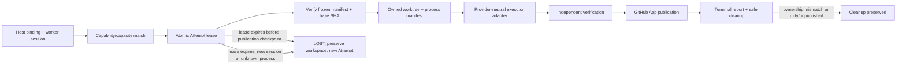

# Worker Runtime Hardening Architecture Audit

## Scope and conclusion

Mission Control already owns the control plane and most of the security-critical
Attempt boundary. The useful work is a narrow runtime-hardening slice around the
existing `workspaceHostBindings`, frozen execution manifest,
`workflowRuns.lease`, signed `attempts.*` service commands, canonical run events,
and Factory Attempt worker.

The reference repository is not a dependency and no code is vendored from it.
Its useful contribution is a concrete worker-side ownership model: stable
identity plus restart session, advertised capacity/capabilities, lease fencing,
durable workspace manifests, explicit process ownership, and fail-closed
cleanup. Mission Control must retain its stronger verification, acceptance,
tenant, GitHub App, and release boundaries.

## Current Mission Control primitives

- **Factory Attempt worker:**
  `apps/orchestration-server/src/factoryAttemptWorker.ts` polls pending/running
  bound Attempts, claims a 60-second lease, renews every 20 seconds, aborts on
  lease loss, runs `codex/v1`, independently verifies the candidate, obtains a
  publication permit, and publishes through the GitHub App boundary.
- **Attempt ownership:** `convex/factory/attempts.ts` atomically claims and
  renews `workflowRuns.lease`; every report and publication mutation requires
  the exact active lease. Signed service commands authenticate the
  orchestration service separately from human and GitHub identities.
- **Executor contract:**
  `packages/workflow-engine/src/executorAdapter.ts` separates adapter,
  cancellation, isolation, health, and event normalization. `codex/v1` is the
  supported production adapter; Loom-shaped observations remain compatible.
- **Frozen configuration:** `convex/lib/executionManifest.ts` freezes Factory
  version/digest, WorkOrder revision, repository and code scope, branch and
  worktree, executor, isolation, model route, prompt/context hashes, timeout,
  quality-contract lineage, and verification requirements.
- **Dispatch and host readiness:** `workspaceHostBindings` records a scoped,
  clean checkout, host identity, policy attestations, and current/max capacity.
  `selectCurrentFactoryHost` is the existing host-selection seam.
- **Cancellation:** `workflowRuns.requestCancellation` records the operator
  request, revokes continuation evidence where required, and clears the lease;
  the worker observes renewal failure and aborts the executor.
- **Restart behavior:** startup polling includes running Attempts and expired
  leases can be reclaimed. Publication checkpoints are independently rechecked
  before resumption. Generic execution paths already have richer stale-claim
  helpers, but are not the supported Factory launcher.
- **Workspace boundary:** `factoryPathScope.ts` and `factoryGitRuntime.ts`
  constrain the worktree path and `mc/` branch and revalidate candidate state.
  Worktree ownership is not yet durably manifested, and automatic cleanup is
  intentionally absent.
- **Observability:** canonical `runEvents`, `runArtifacts`, traces, and trace
  observations already carry Attempt lifecycle and evidence. A second telemetry
  store would be duplication.
- **Runtime contract baseline:** `RUNTIME_CONTRACT_VERSION = 21`; the fresh
  `origin/main` extractor reports 868 public Convex functions and no delta.

## Architecture gap matrix

| Reference concept | Mission Control equivalent | Gap | Recommendation |
| --- | --- | --- | --- |
| Stable worker identity | `workspaceHostBindings.hostId`; service identity | Service identity, host identity, and restart session are conflated or incomplete | Reuse the host binding and add a provider-neutral runtime identity snapshot with server-derived generation |
| Worker enrollment | Signed orchestration service command and project/repository scope | No narrow remote-worker credential or one-time enrollment | Document the future exchange contract only; do not expose a remote listener in this initiative |
| Capability advertisement | Host runtime/model/network/secret attestations; `ExecutorAdapter.capabilities()` | No normalized executor, sandbox, backend, or repository-access advertisement | Add bounded string/object capability fields to the host report and validate them server-side |
| Concurrency/slots | Host `capacity`; local worker hard-coded to one active run; repository mutation exclusion | Claim does not atomically fence worker slot exhaustion | Count active session leases during the claim mutation and reject exhausted capacity |
| Work claiming | Factory worker polling plus `attempts.claim` | Candidate discovery is client-side and capability matching is implicit | Keep polling; make the atomic claim validate the registered worker/session/capabilities |
| Lease token digest | Signed service command plus random `leaseId` stored on the Attempt | `leaseId` is a fencing identity but not a credential; no worker-session binding | Keep credentials in service auth, bind the lease to worker/session/generation, and never treat `leaseId` alone as authentication |
| Heartbeat | `attempts.renew`; host `checkedAt` | Lease heartbeat does not prove the current worker session; host heartbeat lacks runtime session semantics | Fence renewal/report by worker session and keep heartbeats as bounded current state |
| Lease expiry/loss | Legacy expired leases can be reclaimed | Same-Attempt execution recovery can reuse a workspace with unknown process ownership | Treat expired execution as LOST/new lineage; recover only an exact publication checkpoint after local proof |
| Cancellation | Durable cancellation request plus lease revocation/abort | Child PID/process state is not durably associated with the workspace | Add executor process lifecycle observation to the workspace ownership manifest; preserve on uncertainty |
| Worker restart reconciliation | Running-run startup polling | No stable session generation and no fail-closed ownership transfer | New session registration increments generation; unknown prior process/workspace is preserved and the old Attempt is marked lost/retryable |
| Process ownership | Adapter-local AbortController | PID and terminal confirmation disappear with the worker process | Record bounded PID/runtime identity and terminal outcome outside the agent-writable worktree |
| Worktree ownership | Frozen path/branch plus boundary checks | No complete durable ownership tuple; no safe removal primitive | Add an external ownership manifest and remove only through exact, clean, published, process-terminated proof |
| Lost Attempt recovery | Expired claim reuse; explicit WorkOrder retry | Same-run recovery can rewrite runtime meaning after an unknown worker restart | Preserve immutable run evidence; create a new WorkOrder Attempt after LOST unless resuming a publication-only checkpoint |
| Persistent vs disposable compute | `executionEnvironment`; remote sandbox proposal; executor adapter | Backend/provider boundary is documented but not frozen in the manifest | Freeze a provider-neutral execution backend and requirements without provisioning infrastructure |

## Upstream ideas adopted

The following ideas are adopted from the reference at commit
`8c71e44c2113fdf8ab5886a0b4c777926eab9c00`:

- stable worker identity stored separately from the restart/session identity:
  `internal/worker/identity.go`, `internal/worker/manager.go`;
- registration generations and health-driven registration:
  `internal/worker/registration.go`;
- explicit slots and capability advertisement:
  `internal/worker/manager.go`, `internal/protocol/types.go`;
- lease fencing and server-side expiry:
  `internal/controlplane/state.go`, `internal/controlplane/server.go`;
- durable Attempt manifests and fail-closed restart inspection:
  `internal/worker/manifest.go`, `internal/worker/reconcile.go`;
- exact worktree identity and clean-only removal:
  `internal/worker/cleanup.go`, `internal/worker/reconcile.go`;
- one-time enrollment token exchanged for a narrow credential as a future
  interface reference: `internal/controlplane/worker_auth.go`;
- separation of persistent worker and disposable compute backends:
  `ARCHITECTURE.md`, `docs/cloud-run-agents/design.md`.

## Upstream ideas rejected or deferred

- **A second Work/Target/Execution/Attempt control plane:** duplicates Mission
  Control's authoritative hierarchy and is rejected.
- **SQLite schema and Go server/worker transport:** Mission Control's source of
  truth is Convex and its worker is TypeScript; copying these would increase
  operational surface without improving the contract.
- **Worker-owned repository routing or GitHub publication:** conflicts with
  company/workspace authorization, frozen code scopes, GitHub App publication,
  and exact PR-head lineage.
- **Worker-supplied verification or acceptance:** conflicts with
  server-derived verification independence and `workOrders.accept`.
- **Automatic cross-session continuation of an unknown process/worktree:**
  unsafe on Node because a PID can be reused and killing a parent does not prove
  descendant termination. Preserve and require new lineage.
- **Remote TLS listener, VM provisioning, Cloud Run, or exe.dev capacity:**
  explicitly out of scope and remains gated.
- **Heartbeat event per renewal:** high-volume audit noise; only registration,
  state transitions, expiry/loss, recovery, cancellation, and cleanup outcomes
  belong in durable history.

## Frozen execution configuration audit

| Configuration | Current state | Action |
| --- | --- | --- |
| Factory Version/digest | Frozen | Reuse |
| Executor/version | Frozen | Reuse and capability-match |
| Model route | Frozen | Reuse |
| Repository identity | Frozen | Reuse |
| Base SHA | **Not frozen**; worktree creation resolves a branch/ref at execution time | Freeze exact SHA at dispatch and create/diff from it |
| Code scope | Frozen | Reuse |
| Sandbox/isolation profile | Adapter/isolation frozen, backend requirements incomplete | Add provider-neutral backend and capability requirements |
| Timeout/budget | Frozen | Reuse |
| Context package | Hash and compiled prompt frozen | Reuse |
| Quality contract | Digest lineage frozen | Reuse |
| Verification requirements | Frozen in WorkOrder specification | Reuse; never delegate independence to worker |

## Security invariants

1. Worker possession of a lease authorizes only bounded worker mutations.
2. Service authentication, worker identity, lease identity, GitHub App
   identity, verification authority, and human acceptance remain separate.
3. A lease never grants acceptance, verification independence, subject
   manufacture, repository-scope expansion, merge, deploy, or production
   authority.
4. A later configuration edit cannot change an active Attempt's frozen
   manifest or base SHA.
5. Cleanup requires the complete ownership tuple, a terminated executor,
   matching Git worktree registration, a clean tree, and published head proof.
6. Missing, malformed, dirty, mismatched, running, or unpublished workspaces
   are preserved for operator inspection.
7. Cross-session loss produces new Attempt lineage; historical events and
   evidence are never rewritten.

## Primary flow and failure flows

## Institutional and primary-source constraints

- The repository learning at
  `docs/solutions/build-errors/missing-convex-schema-contracts-ci-20260730.md`
  requires schema, consumers, generated types, and tests to land together.
- Convex mutations are serializable transactions, which is the required seam
  for capacity and lease acquisition.
- Internal Convex functions remain the preferred implementation boundary; the
  signed public service action should stay a narrow envelope.
- Git's native `worktree remove` refuses dirty worktrees without `--force`.
  The implementation must retain that protection and never use force for
  automatic cleanup.
