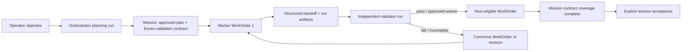

# Make Missions a governed, evidence-backed delivery lifecycle

## What problem this solves

MissionControl has the right delivery primitives—first-class WorkOrders,
governed dispatch, approvals, verification receipts, revisions, execution-run
inspection, and an exception-first Factory Overview. But the EOS **Missions**
views are still mostly a seeded Atlas Checkout narrative. They select WorkOrders
by title and show static milestones and evidence, so an operator cannot start a
real long-running mission, see its truthful status, or trust that its outcome
was independently validated.

The source talk frames the problem well: agent capability is no longer the main
constraint; operator attention is. Its useful answer is not an unbounded
multi-agent swarm. It is a durable mission record with three separated roles:

1. **Orchestrator** — converts an approved objective into a bounded plan,
   milestones, WorkOrders, and a validation contract.
2. **Worker** — executes one WorkOrder against that approved contract and
   leaves a structured handoff.
3. **Validator** — independently verifies the required criteria and end-to-end
   behavior before work can be accepted.

SellerFi/MissionControl should implement those boundaries using the existing
WorkOrder and evidence model rather than creating a second workflow engine.

## Transcript review: what to adopt and what to defer

| Talk principle | MissionControl decision | Why |
| --- | --- | --- |
| Orchestrator / worker / validator separation | Adopt | Existing WorkOrder dispatch, approvals, receipts, and run inspector provide most of the required boundary. |
| Validation contract written before implementation | Adopt | Current acceptance criteria are WorkOrder-local. A Mission needs a frozen, traceable contract that proves the whole objective. |
| Structured handoffs between clean agent contexts | Adopt | Existing artifacts/events record evidence but do not provide one canonical completion/handoff packet. |
| Serial execution with read-only parallel research/review | Adopt as the V1 default | It prevents conflicting repository mutations and makes ownership, cost, and recovery legible. |
| Independent scrutiny and user testing validators | Adopt incrementally | Current receipts can record evidence; V1 needs role separation and a browser/E2E validation lane for UI-bearing work. |
| Different models by role | Adopt as policy/configuration, not hard-coded routing | Model routing already exists. Mission policy should declare role constraints and record the resolved model. |
| Agent direct messaging and negotiation | Defer | It fragments state and duplicates existing durable lifecycle/approval records. |
| Fully autonomous multi-day work | Defer until the V1 lifecycle has production evidence | The system must first prove stop conditions, cost controls, recovery, and trustworthy validation on bounded missions. |

## Product decision and V1 boundary

**Build a first-class Mission parent record that owns one approved objective,
its frozen validation contract, milestones, WorkOrders, handoffs, budget, and
mission-level state.** WorkOrders remain the canonical unit of repository-
changing execution. WorkflowRuns remain the canonical execution record.

V1 is deliberately a governed delivery loop, not a general agent society:

- one active mutating WorkOrder per Mission by default;
- bounded read-only research/review can run in parallel only when no shared
  mutable resource is declared;
- WorkOrders are created only from an approved Mission plan;
- validator work has a separate run/context from the worker that changed code;
- a Mission cannot be marked complete until every validation-contract assertion
  is passed or an explicit, auditable waiver is approved;
- every UI claim is backed by Convex data or visibly labelled as demo/insufficient
  evidence.

This gives operators a trustworthy system to supervise without taking on a
risky autonomous scheduler or unstructured agent communication.

## Current-state evidence

- `convex/workOrders.ts` already owns idempotent creation, dispatch, revision,
  approval, receipt recording, acceptance, and factory overview queries.
- `convex/lib/workOrderDispatch.ts` already prevents duplicate active runs and
  blocks dispatch behind approval gates.
- `convex/schema.ts` already stores `workOrders`, `workflowRuns`,
  `workOrderEvents`, `verificationReceipts`, `runEvents`, and `runArtifacts`.
- `apps/mission-control-ui/src/controlPlane/WorkOrdersView.tsx` and
  `ExecutionRunInspector.tsx` already expose governed work and evidence.
- `apps/mission-control-ui/src/eos/views/MissionPortfolioView.tsx` and
  `MissionDetailView.tsx` currently render the mission narrative from
  `demoData.ts`; the detail view matches WorkOrders by seeded title. These
  screens must not be treated as proof of a real Mission lifecycle.
- `docs/software-factory/verification-receipt.md` records six completed
  WorkOrder/governance slices. The plan below builds on those real contracts,
  rather than replacing them.

## Proposed architecture

### New durable contracts

Additive Convex tables and links; do not modify the legacy Task lifecycle or
replace `workOrders`/`workflowRuns`.

#### `missions`

Owns the outcome and coordination state:

- workspace/tenant/project scope, idempotency key, title, objective, context,
  source-of-truth references, constraints, and owner;
- `DRAFT | PLANNING | AWAITING_PLAN_APPROVAL | READY | IN_PROGRESS | BLOCKED |
  AWAITING_VALIDATION | AWAITING_ACCEPTANCE | DONE | CANCELED | SUPERSEDED`;
- declared budget and observed cost/token/runtime rollups;
- execution policy: `SERIAL_MUTATIONS` for V1, allowed read-only concurrency,
  maximum corrective iterations, explicit stop condition, and escalation rule;
- links to active plan revision, active milestone, current WorkOrder, and
  canonical acceptance record.

Indexes must support project/state, owner/state, current WorkOrder, and
idempotency queries.

#### `missionPlans` and `missionMilestones`

The orchestrator's proposal is versioned and approval-gated. A plan contains
ordered milestones, proposed WorkOrders, dependency edges, role assignments,
and the assertion IDs each WorkOrder is expected to satisfy. It is immutable
once approved; material changes create a new revision and invalidate affected
evidence through the existing WorkOrder revision semantics.

#### `validationContracts` and `validationAssertions`

This is the missing independent definition of done. A contract is created
before worker dispatch and frozen on plan approval. Assertions are atomic,
observable, and implementation-independent:

- stable ID, title, user/business outcome, severity, scope, and owner;
- verification mode: `COMMAND`, `TEST`, `BROWSER`, `MANUAL`, or `CHECKLIST`;
- required evidence type/location, pass condition, and waiver policy;
- linked milestone/WorkOrders and derived coverage/result state.

Keep WorkOrder `acceptanceCriteria` as the execution-level contract. The
mission assertion is the parent obligation; receipt evidence maps to both
levels. No assertion may become `PASS` merely because the worker reports it
complete.

#### `missionHandoffs`

A canonical, immutable packet created at each worker or validator boundary:

- producing role/run/WorkOrder and consumed-by role;
- completed and incomplete assertions; changed files/artifacts; exact commands
  and exit codes; known risks/blockers; required follow-up; cost and timing;
- a truthfulness status (`COMPLETE`, `INCOMPLETE`, `NEEDS_HUMAN_INPUT`), plus
  an explicit "unknown" state—never inferred completion.

Handoffs link to existing `runArtifacts`, `runEvents`, and verification
receipts rather than duplicating raw logs. A validator or next worker cannot
start until its required predecessor handoff is accepted as structurally valid.

#### `missionEvents`

Use a mission-level immutable audit stream for plan proposals/approvals,
milestone changes, handoff submissions, validation outcomes, budget/escalation
events, and final acceptance. Do not overload `activities`, which remains a
general activity feed.

## Implementation phases

### Phase 0 — lock the product contract before code

1. Write `docs/software-factory/governed-missions-contract.md` with the final
   state machine, role permissions, assertion/receipt mapping, serialisation
   rules, stop conditions, and error/recovery states.
2. Define one realistic SellerFi delivery fixture—not a generic Slack clone—
   with 2–3 sequential WorkOrders, one UI/browser assertion, one failed
   validation requiring corrective work, and one approval/waiver path.
3. Decide the initial approval boundary: approving the plan authorizes
   creation/dispatch of its WorkOrders; high/critical WorkOrders retain their
   existing approval gates. Do not silently auto-approve a Mission plan.
4. Specify the V1 model role policy as configuration: planner, worker,
   scrutiny validator, and browser validator each have an allowed model tier,
   tool set, budget ceiling, and fallback. The selected provider/model is
   recorded on its WorkflowRun.

**Exit:** Product Owner approves the contract and fixture. No schema or UI work
starts against an ambiguous execution/autonomy policy.

### Phase 1 — add the Mission domain without a second execution engine

1. Extend `convex/schema.ts` with the additive tables above, validation enums,
   indexes, and optional `missionId` foreign keys on `workOrders`,
   `workflowRuns`, `verificationReceipts`, and `runArtifacts`.
2. Add `convex/missions.ts` for server-owned commands:
   `createDraft`, `submitPlan`, `approvePlan`, `start`, `createNextWorkOrder`,
   `recordHandoff`, `recordValidationResult`, `requestCorrectiveWork`,
   `pause`, `resume`, `cancel`, and `accept`.
3. Add `convex/lib/missionGovernance.ts` for pure, fully tested rules:
   legal transitions, contract coverage, assertion-result derivation, role
   separation, budget/iteration exhaustion, next-eligible WorkOrder selection,
   and acceptance eligibility.
4. Have `convex/workOrders.ts` call the Mission guard before dispatch and after
   run/receipt updates. It must reject a mutating dispatch that is out of order,
   has an invalid predecessor handoff, exceeds the iteration/budget policy, or
   violates the approved plan.
5. Preserve existing direct WorkOrders: `missionId` is optional. Existing queues
   and API consumers continue to work unchanged.

**Exit:** a Mission can exist and govern linked WorkOrders through Convex only;
the existing WorkOrder lifecycle has no behavioural regression.

### Phase 2 — orchestration adapters and structured handoffs

1. Add a Mission-aware orchestration endpoint group in
   `apps/orchestration-server/src/index.ts`; it delegates only to the same
   Convex commands—never re-implements lifecycle rules.
2. Extend Pi receipt packet ingestion so a worker completion records a
   `missionHandoff`, validates required fields, links emitted artifacts/events,
   and refuses a final worker state without an explicit outcome.
3. Add bounded orchestration selection:
   - schedule exactly one mutating WorkOrder per Mission;
   - permit only declared `READ_ONLY` research/review lanes concurrently;
   - use WorkOrder dependencies plus explicit resource/repository locks;
   - emit `BLOCKED` with a human action rather than retrying indefinitely.
4. Materialize validators as separate WorkflowRuns with a different role and
   clean input bundle. Validator input is the contract, handoff, scoped source
   references, and artifacts—not the worker's private conversation.
5. Add a browser-validation adapter for assertions marked `BROWSER`. It records
   deterministic user-flow evidence (test output, screenshot/video reference,
   environment, timestamp) as a receipt; it must report unavailable test
   infrastructure as blocked, never passed.
6. Route corrective work through `requestCorrectiveWork`, preserving assertion
   links and prior failed evidence. Limit retries to the Mission policy and
   require human rescoping when exhausted.

**Exit:** a worker can hand off to an independent validator; a failed assertion
creates visible corrective work instead of a misleading completed mission.

### Phase 3 — replace demo Mission surfaces with truthful live UI

1. Replace title-matching and `demoData` dependencies in
   `apps/mission-control-ui/src/eos/views/MissionPortfolioView.tsx` and
   `MissionDetailView.tsx` with project-scoped `api.missions.list` and
   `api.missions.get` queries. Retain fixtures only behind an explicit demo
   provenance path.
2. Add a Mission creation/planning flow reachable from the left navigation:
   objective, scope, sources, constraints, budget, stop condition, and
   initial validation assertions. It must include loading, empty, validation
   error, draft-saved, approval-required, and success states.
3. Make Mission Detail an operator surface, not an activity wallpaper:
   - current decision gate and explicit next human action;
   - objective, progress, budget, stop condition, and active milestone;
   - assertion coverage matrix with direct receipt/inspector drill-downs;
   - ordered WorkOrder queue, current role/run, and dependency/lock reason;
   - handoff summaries showing completed, unknown, and unresolved work;
   - corrective-work and plan-revision lineage.
4. Link Missions, Work Orders, Run Inspector, Approvals, and Factory Overview
   both directions. A UI route must preserve the selected mission/work order
   in URL state; no title-based inference.
5. Keep the existing calm, exception-and-evidence-first control-plane language.
   Do not add chat transcripts, fake live agent status, or simulated metrics.

**Exit:** an operator can create, approve, monitor, intervene in, and accept a
real Mission entirely through reachable UI surfaces with no demo-only claims.

### Phase 4 — prove the lifecycle with independent tests and evidence

1. Unit-test mission governance in `convex/__tests__/missionGovernance.test.ts`:
   transitions, serial mutation exclusion, role separation, handoff validation,
   contract coverage, budget/iteration stops, stale evidence, corrective work,
   and acceptance/waiver rules.
2. Add Convex integration tests in `convex/__tests__/missions.test.ts` covering
   plan approval → WorkOrder dispatch → handoff → independent validation →
   corrective WorkOrder → passed receipt → mission acceptance.
3. Add view-model tests for mission list/detail and assertion status derivation.
4. Add Playwright flows for desktop and narrow viewport:
   create a draft, reject incomplete plan inputs, approve plan, dispatch only
   the eligible WorkOrder, inspect a failed browser assertion, create corrective
   work, and verify completion/blocked states and accessible feedback.
5. Record the fixture’s actual commands, exit codes, models, costs, handoffs,
   receipts, screenshots, and final decision in
   `docs/validation/YYYY-MM-DD-governed-mission-evidence.md`.
6. Validate through the required demo shell at `http://localhost:5199` using
   `pnpm run dev:demo`; verify every new page is reachable from the left nav.

**Exit:** the team has a reproducible evidence pack for one complete mission,
including an intentionally failed validation and its recovery.

## Validation contract for this feature

| Assertion | Evidence required |
| --- | --- |
| Mission is a real parent record, not a title-matched projection | Convex create/get/list output with linked WorkOrders and stable IDs |
| Plan precedes mutation | Dispatch attempt before plan approval is rejected with an actionable reason |
| No concurrent repository mutation inside one Mission | Integration test and audit event show the second mutating dispatch rejected/queued |
| Workers cannot self-certify an assertion | Worker handoff alone leaves assertion pending; separate validator receipt is required |
| Handoff preserves material context | Schema validation rejects missing outcome, commands/exit codes, risks, or follow-up state |
| Failed validation is recoverable and truthful | Failed receipt blocks completion and produces linked corrective/revision path |
| Acceptance is evidence-backed | Missing/failed/stale mission assertions block Mission acceptance; approved waiver is visible |
| Operator UI is truthful | Live data carries `convex` provenance; demo/offline data is labelled; no silent fallback by title |
| Browser validation works end to end | Playwright evidence is attached to the relevant assertion, or the Mission is blocked with a clear infrastructure reason |
| Existing WorkOrders remain usable | Existing WorkOrder dispatch/governance test suite passes unchanged |

## Risks and mitigations

| Risk | Mitigation |
| --- | --- |
| This becomes a replacement orchestration platform | Keep execution in `workflowRuns` and WorkOrders; Mission is an additive parent/governance layer. |
| Over-parallelism damages repositories or creates incoherent decisions | Default to serial mutations per Mission; explicitly model limited read-only concurrency and locks. |
| Validation turns into worker-authored tests that only confirm implementation | Freeze assertions before dispatch and use separate validator runs/context; require browser/E2E evidence where applicable. |
| UI overstates autonomous completion | The UI derives status only from durable data and uses `blocked`/`insufficient evidence` instead of optimistic inference. |
| Long missions burn budget or loop forever | Persist budgets, stop conditions, max corrective iterations, and explicit escalation records. |
| Model routing becomes opaque | Store role, selected model, policy version, fallback reason, and actual cost on every run. |
| Existing demo views mask missing backend state | Remove demo fallback from production paths and assert provenance in UI tests. |

## Deliberate non-goals

- General-purpose agent-to-agent direct messaging or negotiation.
- Parallel mutating execution inside a single V1 Mission.
- Automatic plan approval, waiver approval, self-approval, deployment, or
  unlimited retry.
- Replacing legacy Tasks or migrating all historical WorkOrders.
- Treating metrics or generated summaries as verification evidence.

## Success metrics after rollout

- Percentage of Mission completions with 100% assertion coverage and no stale
  required evidence.
- Percentage of validator failures that result in a linked corrective WorkOrder
  or explicit approved waiver, rather than silent closure.
- Median human interventions per Mission and time spent in a blocked state.
- Mission cost versus declared budget, segmented by role/model and corrective
  iteration count.
- Number of truthful, live Mission records shown versus demo-only projections.

## Implementation file map

- `convex/schema.ts` — additive Mission, plan, assertion, handoff, and event
  contracts plus links to existing records.
- `convex/missions.ts` — server-owned Mission lifecycle commands and queries.
- `convex/lib/missionGovernance.ts` — pure transition, coverage, and scheduling
  guards.
- `convex/workOrders.ts` and `convex/workflowRuns.ts` — Mission guard/hooks and
  bidirectional lifecycle synchronization.
- `apps/orchestration-server/src/index.ts` and its Convex-call adapter —
  Mission-aware dispatch, handoff, receipt, and validator ingestion.
- `apps/mission-control-ui/src/eos/views/MissionPortfolioView.tsx` and
  `MissionDetailView.tsx` — live, project-scoped Mission UI.
- `apps/mission-control-ui/src/eos/EosSection.tsx` / app navigation — creation
  and detail routes reachable from the left navigation.
- `apps/mission-control-ui/src/controlPlane/WorkOrdersView.tsx` and
  `ExecutionRunInspector.tsx` — Mission links, assertion/receipt drill-downs,
  and contextual return navigation.
- `docs/software-factory/governed-missions-contract.md` — canonical runtime
  contract and operator-facing semantics.
- `docs/validation/YYYY-MM-DD-governed-mission-evidence.md` — execution proof
  for the first real fixture.

## Dependencies and sequencing

The existing WorkOrder/governance/run-inspector slices are prerequisites and
appear to be implemented, per `docs/software-factory/verification-receipt.md`.
The only known pre-existing issue called out there—`pnpm workflows:seed` ESM
loading—must be fixed or bypassed with an approved deterministic fixture before
Phase 4 can claim end-to-end execution evidence. It is not a reason to invent a
parallel Mission runtime.

Start with Phase 0 and Phase 1. Do not start the UI conversion until the Mission
contract, role separation, and evidence mapping are accepted; otherwise the
product will present a polished narrative without a trustworthy control plane.

## References

- Supplied transcript: *Introduction to multi-agent systems and the bottleneck
  of human attention* (0:00–17:57), especially the role architecture (4:04),
  validation contracts (6:34), structured handoffs (8:09), serial execution
  (9:17), and Mission Control monitoring (10:30).
- `docs/brainstorms/2026-07-28-trustworthy-factory-architecture-map.md`
- `docs/software-factory/domain-contracts.md`
- `docs/software-factory/verification-receipt.md`
- `docs/software-factory/LOOP_ENGINEERING.md`
- `docs/software-factory/incremental-delivery-plan.md`
