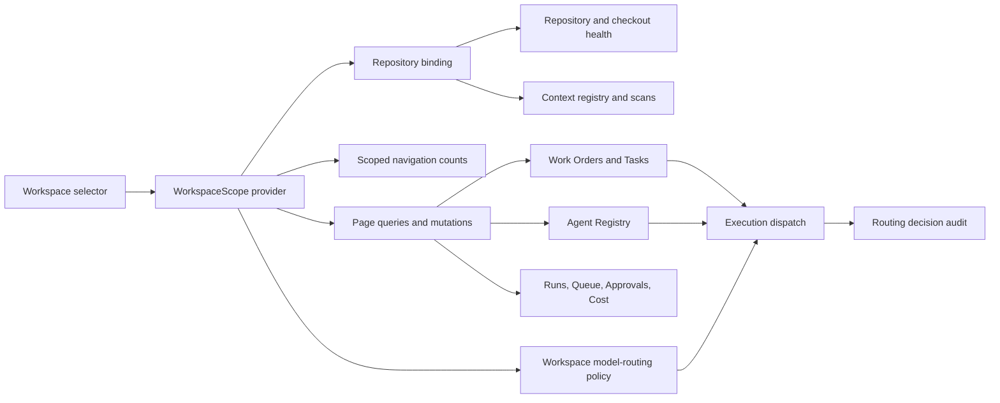

# Software Factory UI Coherence Plan

> **Implementation note:** This is the source plan. During execution, track progress in the repository's todo/progress system; do not rewrite completed steps in this file.

## Goal

Turn the current v2 Software Factory shell into a trustworthy operator product where:

1. the selected workspace is the explicit operating boundary;
2. every visible navigation item opens a working, correctly scoped surface;
3. the Agent Registry is easy to find and agents can be inspected and edited;
4. model selection is controlled by an auditable routing policy;
5. demo, preview, global, and workspace-scoped data are never silently mixed.

The working Work Orders and Tasks flows remain the product backbone. This plan does not replace them; it makes the surrounding shell coherent enough to support them.

## Executive decision

Do **not** wire and promote every current menu item as a V1 feature.

The shell currently exposes more than 40 destinations. Several are good foundations, several are valid global tools, and several are partial, demo-backed, unscoped, or duplicative. Making all of them look production-ready would increase navigation cost and reduce trust.

The recommended V1 approach is:

- keep approximately 15–18 operational destinations in the primary navigation;
- move experimental tools into a collapsed, feature-flagged Labs group;
- hide demo-only and incomplete routes until they meet the same state, scope, and action standards as Work Orders and Tasks;
- consolidate related registries and inspectors as tabs or details rather than top-level pages;
- make route scope and maturity explicit in code: scope is `workspace` or `global`; maturity is `live`, `preview`, `demo`, or `hidden`.

## Audit basis

This plan is based on:

- the three supplied UI screenshots;
- a live audit of `http://localhost:5199`;
- source review of the v2 shell, EOS route renderer, project context, Convex queries, agent management, workflow engine, and model router;
- current committed work through `3210c25` (`feat(factory): harden operator shell and workflow tooling`);
- uncommitted workspace work already present in the checkout, including project creation/repository connection, loop engineering, evidence lineage, recovery, and model-router tests;
- `docs/software-factory/information-architecture.md`;
- `docs/software-factory/UI_STYLE_GUIDE.md`;
- `docs/software-factory/ui-and-capability-assessment.md`;
- `docs/plans/2026-07-12-factory-ui-roadmap.md`.

No external product research is needed before implementation. The repository already contains a clear information architecture and sufficient evidence of the current defects.

## Confirmed findings

### 1. Workspace selection is not a reliable scope boundary

The live audit reproduced the highest-risk defect:

1. open Command Center;
2. select “Software Factory Research Lab”;
3. observe that the selector changes;
4. observe that Command Center still shows the same Mission Control tasks, 14-agent workforce, and Atlas Checkout demo narrative.

The source confirms the cause:

- `App.tsx` owns a `projectId`, but not every v2 route receives it;
- `EosViewRenderer` does not accept or propagate `projectId`;
- multiple EOS views query all tasks, agents, approvals, or projections;
- several views fall back to demo fixtures;
- some pages mix live global queries with demo narrative in the same surface;
- “All Projects” is not a stable mode: selecting it sets `projectId` to `null`, after which the default-selection effect chooses a project again.

This is more than a cosmetic issue. An operator cannot trust that the page describes the workspace selected in the shell.

### 2. The menu points to the wrong Agents experience

The visible EOS menu item **Operations → Agents** routes to `agent-catalog`.

That page is:

- unscoped;
- primarily a capability-profile preview;
- partly demo-backed;
- read-only;
- not the operational registry shown in the supplied screenshot.

The actual Agent Registry lives at `/v2/agents`, supports status controls and project-scoped queries, but is not the destination linked by the EOS navigation.

### 3. Agent editing exists in fragments, not as a coherent flow

The real Agent Registry has a settings gear, but the icon-only affordance is easy to miss. The settings panel is largely read-only:

- identity links elsewhere;
- capabilities point to Gateway/OpenClaw Studio;
- the delete confirmation ends in a “not implemented” toast.

Meanwhile:

- `convex/agents.ts` already exposes an `update` mutation for name, emoji, task types, tools, budgets, and metadata;
- `OrgView.tsx` already contains editing behavior;
- `CreateAgentModal.tsx` captures role, workspace path, spawning, tools, task types, and budgets;
- the schema does not yet contain a model-routing profile or a robust repository/checkout binding.

The result is a discoverability and product-integration problem, not an absence of all editing primitives.

### 4. Model routing exists as a package but is not connected to execution

`packages/model-router` contains routing concepts for:

- task-type overrides;
- risk-based model choice;
- preferred tiers;
- budget downgrade;
- provider selection;
- fallback chains.

However, the current application has no:

- persistent workspace routing policy;
- Agent Registry routing controls;
- operator-facing routing page;
- routing simulator;
- routing decision audit;
- runtime import that makes the package authoritative at dispatch.

The workflow model tier (`FAST`, `BALANCED`, `POWERFUL`) and project default model are useful inputs, but they do not yet form an end-to-end routing system.

### 5. Navigation maturity is inconsistent

The shell visually treats live, partial, global, preview, and demo pages as peers. Only two control-plane stubs are filtered by default. That leaves incomplete routes exposed without a consistent “Preview” treatment.

This conflicts with the existing product principle: exceptions and evidence first, not agent-activity wallpaper or placeholder surfaces.

### 6. The Agent Registry layout will not scale to 20+ agents

The supplied Agent Registry screenshot uses:

- four large KPI cards;
- five status filters;
- three squad controls;
- a search field;
- a two-column agent-card grid;
- icon-only settings.

This produces excess vertical chrome and a large empty canvas with only two agents. At the target scale of 20+ agents, a table/list with explicit status, assignment, model route, budget, and last heartbeat will be faster to scan and operate.

## What already works and should be preserved

| Capability | Current state | Direction |
|---|---|---|
| Work Orders | Strong, project-aware operational surface | Keep as the primary request/outcome object |
| Tasks | Working execution queue | Keep, clarify relationship to Work Orders |
| Factory Board | Project-scoped scheduled work | Keep after route/state verification |
| Pipelines | Project-scoped | Keep |
| Task Graph | Project-scoped | Keep |
| Queue / ATC | Project-scoped | Keep |
| Agent lifecycle controls | Present in real registry | Keep, add explicit detail/edit flow |
| Projects/workspaces | Existing create/update and in-progress repo connection UI | Use as the foundation for workspace settings |
| Workflow model tiers | Present in workflow schema/execution data | Use as an input to routing policy |
| Model router package | Good policy prototype | Harden and integrate at one dispatch boundary |
| Memory | Project-aware | Keep |
| Database explorer | Receives project scope | Keep for administrative users |

## Current route and maturity audit

The labels below describe the product state, not just whether a React component renders.

### Overview and Strategy

| Menu item | Current maturity | Main issue | Recommended disposition |
|---|---|---|---|
| Command Center | Partial | Unscoped live queries mixed with Atlas demo narrative | Keep only after workspace-scope repair and demo separation |
| Missions | Preview | Unscoped queries and demo fallback | Move to Preview or hide until project-scoped |
| Objectives | Live candidate | Project-aware | Keep after state/action audit |

### Delivery

| Menu item | Current maturity | Main issue | Recommended disposition |
|---|---|---|---|
| Work Orders | Live | Demo seed action may appear in normal product | Keep; hide seed controls outside demo mode |
| Tasks | Live | Preserve clear Work Order relationship | Keep |
| Factory Board | Live candidate | Needs end-to-end state verification | Keep |
| Execution | Partial | Scope prop is dropped in EOS renderer; demo/inspector overlap | Rename **Runs & Execution**, scope, then keep |
| Pipelines | Live candidate | Needs route/action verification | Keep |
| Task Graph | Live candidate | Dense secondary view | Keep as Work Order/Tasks secondary view or Delivery item |

### Operations

| Menu item | Current maturity | Main issue | Recommended disposition |
|---|---|---|---|
| Agents | Wrong destination | Opens unscoped demo capability catalog instead of registry | Route to `/v2/agents`; consolidate catalog into registry |
| Queue (ATC) | Live candidate | Needs full error/empty state audit | Keep |
| Approvals & Audit | Partial | Audit view ignores `projectId` and can show cross-workspace records | Keep only after strict scoping |
| Incidents | Live candidate | Verify actions and scope | Keep |
| Cost | Partial | Analytics queries are aggregate/unscoped | Keep only after workspace-scoped cost APIs |

### Intelligence

| Menu item | Current maturity | Main issue | Recommended disposition |
|---|---|---|---|
| Loop Engineering | Active development | New project-aware work exists in dirty tree | Keep behind feature flag until acceptance passes |
| AI Effectiveness | Preview | Unscoped | Move to Preview |
| Factory Health | Preview | Unscoped and/or demo fallback | Merge into Command Center health tab or Preview |
| Environment Readiness | Preview | Unscoped and/or demo fallback | Merge into workspace/repository health |
| Friction & Waste | Preview | Unscoped and/or demo fallback | Move to Preview |
| Recommendations | Preview | Unscoped and/or demo fallback | Move to Preview |
| Evidence Dossiers | Demo | Demo-only surface | Hide from V1 navigation |

### Knowledge

| Menu item | Current maturity | Main issue | Recommended disposition |
|---|---|---|---|
| Discover skills | Global by design | Global scope is not labeled | Keep in a **Catalog** tab with a Global badge |
| Context CDL | Global/informational | Competes with related context routes | Consolidate under **Context Registry** |
| Evaluate Skill | Partial | Child supports project scope but parent does not pass it | Project-scope and make a Context Registry tab |
| Skill Inventory | Partial | Global catalog and workspace installation concepts are mixed | Split Global Catalog from Workspace Inventory |
| Installations | Partial | Must follow selected repo/workspace | Make a Context Registry tab |
| Eval Runs | Partial | Scope is ambiguous | Project-scope and make a Context Registry tab |
| Memory | Live candidate | Project-aware | Keep |
| Docs | Global by design | Scope is not labeled | Keep with a Global badge |

### Governance

| Menu item | Current maturity | Main issue | Recommended disposition |
|---|---|---|---|
| Policies | Partial | Project and tenant/global policy concepts need explicit labels | Keep after scope labeling |
| Identities | Live candidate | Verify project boundary and edit permissions | Keep |
| Deployments | Live candidate | Verify project boundary | Keep |
| QC Rulesets | Live candidate | Verify project boundary and workflow use | Keep |

### Administration and Labs

| Menu item | Current maturity | Main issue | Recommended disposition |
|---|---|---|---|
| Gateway | Partial | Unscoped under EOS | Keep under Settings after scope repair |
| Database | Live admin candidate | Receives project scope; high-power surface | Keep role-gated under Settings |
| Design DNA | Global by design | Not a daily operator destination | Move to Settings/Developer Tools |
| Recorder | Secondary | Needs scope/action audit | Keep in Developer Tools or Labs |
| Test Generation | Secondary | Needs scope/action audit | Keep in Developer Tools or Labs |
| API Import | Secondary | Needs scope/action audit | Keep in Developer Tools or Labs |
| Flaky Steps | Experimental | Product maturity not established | Labs only |
| Gherkin Studio | Experimental | Product maturity not established | Labs only |
| Hybrid Workflows | Experimental | Product maturity not established | Labs only |
| CodeGen | Experimental | Product maturity not established | Labs only |
| Build Pipeline | Experimental/duplicate | Overlaps Pipelines | Labs until differentiated or merge |

## Target information architecture

The primary navigation should represent operator jobs, not every component in the repository.

### Recommended V1 navigation

**Overview**

- Command Center — tabs for Attention, Health, and Cost

**Delivery**

- Work Orders — includes linked Pipelines
- Tasks — includes Task Graph
- Runs & Execution

**Operations**

- Agent Registry
- Queue
- Approvals & Audit
- Incidents

**Knowledge**

- Context Registry
- Memory
- Docs

**Governance**

- Policies & QC
- Identities & Access
- Deployments

**Settings**

- Workspaces & Repositories
- Model Routing
- Gateway & Data — tabs for Gateway, Database, and Developer Tools

**Labs** — collapsed and feature-flagged

- all remaining experimental, preview, and demo surfaces

### Consolidations

- `agent-catalog` becomes a **Capability Evidence** tab in Agent Registry, or remains a labeled Preview page in Labs.
- Discover, CDL, Evaluate, Inventory, Installations, and Eval Runs become tabs under **Context Registry**.
- Pipelines remains directly linkable but appears as a Work Order tab/secondary route rather than a permanent sidebar item.
- Task Graph remains directly linkable but appears as a Tasks tab/secondary route rather than a permanent sidebar item.
- Cost and Factory Health become Command Center tabs instead of primary peers.
- Environment Readiness becomes the health portion of **Workspaces & Repositories**.
- Policies and QC Rulesets become tabs of one Governance surface.
- Recorder, Test Generation, API Import, and Design DNA become **Gateway & Data → Developer Tools** tabs.
- Duplicate Build Pipeline functionality is merged with Pipelines or kept in Labs until it has a distinct operator job.

## Product invariants

These rules should be encoded in tests and shared helpers.

1. Every visible primary route has a declared maturity and scope.
2. A workspace-scoped route cannot query without `projectId`.
3. Global routes display a visible **Global** badge and do not imply they changed with the workspace selector.
4. Demo fixtures render only when explicit demo mode is enabled.
5. A workspace switch clears stale selection/detail state before new data renders.
6. A direct URL never flashes records from the previously selected workspace.
7. Every mutation validates that the target entity belongs to the selected project.
8. Provider credentials are never stored in Convex records or returned to the browser.
9. Every model-routing decision records which policy and rule produced the decision.
10. Every visible navigation destination provides loading, empty, error, and success/action feedback.

## Target workspace and repository contract

### Product model

The selected workspace should resolve to a canonical `WorkspaceScope`:

```ts
type WorkspaceScope = {
  projectId: Id<"projects">;
  projectSlug: string;
  repository?: {
    provider: "github";
    owner: string;
    name: string;
    defaultBranch: string;
    bindingStatus: "unconfigured" | "validating" | "ready" | "degraded" | "error";
    lastValidatedAt?: number;
    lastObservedCommit?: string;
  };
};
```

Do not treat an arbitrary local path stored on the project as universally valid. A checkout path only has meaning on a specific execution host.

Represent local execution bindings separately:

```ts
type WorkspaceHostBinding = {
  projectId: Id<"projects">;
  hostId: string;
  checkoutRoot: string;
  repositorySlug: string;
  observedBranch?: string;
  observedCommit?: string;
  status: "ready" | "missing" | "stale" | "dirty" | "error";
  checkedAt: number;
};
```

This allows the UI to say:

- repository connected;
- default branch;
- checkout ready on executor host;
- current commit;
- checkout missing or stale;
- last context scan status.

### V1 decision: remove “All Projects”

The recommended V1 behavior is to remove “All Projects” from the normal workspace selector.

Reasons:

- it is currently broken;
- most operational pages are designed for a single work context;
- aggregate data requires separate authorization, query, labeling, and UX;
- silently mixing projects is the product's highest trust risk.

A future **Portfolio** view can provide explicit cross-workspace aggregation without changing the meaning of every page.

### Selector behavior

When a workspace is selected:

1. write the workspace ID to the URL or canonical router state;
2. resolve its repository binding;
3. clear selected task, work order, run, agent, and drawer state from the previous workspace;
4. suspend scoped page rendering until the new scope is resolved;
5. execute all queries with the new `projectId`;
6. display repository slug, branch, and health immediately below the selector;
7. show a clear setup state if no repository is connected.

Add **Manage workspaces** to the selector footer. It opens `/v2/workspaces`, not an unrelated administration view.

### Workspace settings page

`/v2/workspaces` should provide:

- workspace name, purpose, owner, status;
- GitHub repository and default branch;
- repository validation result;
- executor-host checkout bindings;
- last observed commit and context scan;
- default workflow/model policy;
- agent count, active work orders, queue depth, and unresolved incidents;
- explicit edit/save/cancel behavior;
- archive flow with impact preview;
- no destructive delete in V1.

## Target data flow



## Agent Registry redesign

### Entry and URL structure

- Change EOS **Operations → Agents** to **Agent Registry** and route it to `/v2/agents`.
- Add `/v2/agents/:agentId` for a shareable detail page, or a URL-backed detail drawer if preserving context is more important.
- Redirect legacy agent destinations where safe.
- Keep active navigation, breadcrumb, URL, and title aligned.

### Registry layout

Replace the agent-card grid with a dense, responsive table/list.

Recommended columns:

- agent and role;
- lifecycle status;
- current assignment/work order;
- effective model route;
- budget used / limit;
- last heartbeat;
- repository/checkout status;
- exception indicator;
- explicit **View** action and overflow menu.

Default sort order:

1. quarantined;
2. offline/stale;
3. budget or policy exceptions;
4. paused;
5. active.

UI changes:

- compress the four large KPI cards into one KPI strip;
- keep status filters but remove redundant counts/controls;
- put squad-level destructive controls in a labeled bulk-actions menu;
- use text labels for primary actions;
- make row click and **View** discoverable;
- preserve bulk pause/resume only if the selected scope and confirmation are explicit;
- retain search and add role/status/model filters.

### Agent detail/edit information architecture

**Overview**

- name, role, emoji/avatar;
- status and heartbeat;
- current work;
- workspace and checkout;
- effective routing summary;
- recent exceptions.

**Assignment & Runtime**

- allowed task types;
- workspace/repository binding;
- runtime/gateway identity;
- spawning permissions and sub-agent limit.

**Capabilities & Tools**

- allowed tools;
- discovered capabilities;
- capability evidence and evaluations;
- missing requirements for assigned workflows.

**Model Routing**

- inherit workspace policy by default;
- optional constrained override;
- effective policy explanation;
- recent routing decisions and fallback events.

**Budget & Limits**

- daily and per-run budget;
- current usage;
- behavior at threshold;
- alerting state.

**Identity & Instructions**

- linked identity/personality;
- instruction source and version;
- contacts/escalation path.

**Activity & Audit**

- lifecycle changes;
- configuration changes;
- task assignments;
- routing decisions;
- quarantine/pause reasons.

### Editing rules

- Reuse and extract the form logic already present in `CreateAgentModal.tsx` and `OrgView.tsx`.
- Use explicit **Edit**, **Save**, and **Cancel**.
- Warn before closing with unsaved changes.
- Validate name uniqueness within the selected project, not globally.
- Separate configuration edits from lifecycle actions.
- Record actor, timestamp, before/after values, and reason for sensitive changes.
- Disable editing while the record is stale or the selected workspace changes.
- Show success confirmation and refreshed effective configuration.

### Agent deletion decision

Do not implement hard deletion in this phase.

Use **Archive/Deactivate** after defining:

- what happens to assigned tasks;
- what happens to routing and identity references;
- whether historical run evidence remains;
- whether the name can be reused;
- who can restore the agent.

Remove the current confirmation path that ends in “not implemented,” or relabel it **Archive** once the lifecycle exists.

## Model routing design

### Operator problem

The operator needs control over cost, quality, latency, and provider failure without manually choosing a model for every task.

The simplest correct design is a centralized workspace policy with explicit inheritance and narrow overrides.

### Precedence

Use this deterministic order:

1. authorized per-run override;
2. workflow step or Work Order model tier;
3. agent override;
4. workspace routing policy;
5. system safe default.

Each decision must expose the winning source and policy version.

### Persistent entities

**`modelCatalog`**

- provider;
- stable model identifier;
- display name;
- capabilities;
- supported tools/modalities;
- availability state;
- cost/latency metadata;
- deprecation status.

**`modelRoutingPolicies`**

- `projectId`;
- name and status;
- default tier/model;
- task-type rules;
- risk-level rules;
- budget and latency caps;
- fallback chains;
- version;
- created/updated actor and timestamp.

**`agentModelOverrides`**

- `projectId`;
- `agentId`;
- allowed override or preferred tier;
- reason;
- expiry;
- actor and timestamp.

**`modelRoutingDecisions`**

- project, Work Order, task, run, and agent references;
- requested tier/capabilities/risk/budget;
- selected provider/model;
- winning rule and policy version;
- alternatives considered;
- fallbacks attempted;
- downgrade/override reason;
- estimated and actual cost/latency;
- outcome and failure classification;
- timestamps.

Provider credentials stay in server/runtime environment configuration. Convex stores credential references and health metadata only.

### Routing page

Add **Settings → Model Routing** at `/v2/model-routing`.

Sections:

1. **Provider health** — configured, available, degraded, rate-limited, unavailable.
2. **Workspace default** — default tier/model and safe fallback.
3. **Rules** — ordered task-type/risk/capability rules.
4. **Fallback chains** — explicit and capability-safe.
5. **Budget and latency guardrails**.
6. **Simulator** — enter task type, risk, capabilities, and budget; show the selected model and explanation without dispatching work.
7. **Decision log** — filterable routing audit linked to runs and agents.

### Runtime integration

Integrate the router at one authoritative dispatch boundary, after task/workflow requirements are known and before a provider request is created.

Do not let individual views, workflow components, and providers each select models independently.

Recommended runtime contract:

```ts
type RouteModelRequest = {
  projectId: Id<"projects">;
  workOrderId?: Id<"workOrders">;
  taskId: Id<"tasks">;
  runId?: Id<"runs">;
  agentId: Id<"agents">;
  taskType: string;
  riskLevel: "GREEN" | "YELLOW" | "RED";
  requestedTier?: "FAST" | "BALANCED" | "POWERFUL";
  requiredCapabilities: string[];
  budgetRemainingUsd?: number;
  latencyTargetMs?: number;
};
```

The resolver returns the selected route and an explanation object that can be persisted as a routing decision.

Safety rules:

- never downgrade a RED/high-risk task to a model that does not meet the required capability policy;
- never fall back to a provider missing required tools or context limits;
- make budget-driven downgrades explicit;
- retry/fallback limits must be bounded;
- provider outages must create an incident or visible exception when the safe chain is exhausted;
- include a feature flag and kill switch;
- keep the current route as a safe rollback until the decision log proves parity.

### Relationship to model competency assessment

The model competency assessment PRD should feed evidence into the catalog and policy recommendations, but it should not block V1 routing.

V1 uses:

- manually curated capability metadata;
- observed provider health;
- actual route outcomes;
- existing workflow tiers.

Later, evaluation results can recommend policy changes. They should not automatically change production routing without approval and a new policy version.

## Cross-cutting UI cleanup

### Shell and header

- Add repository slug, branch, and health beneath the workspace selector.
- Add **Manage workspaces** to the selector.
- Show a visible Global badge on global pages.
- Make Preview/Demo badges consistent and non-dismissable.
- Keep Approvals accessible globally.
- Preserve Chat but persist its collapsed state and auto-collapse it on constrained widths.
- Remove demo-tour chrome from normal product mode.

### Page layout

Apply `UI_STYLE_GUIDE.md` consistently:

- one `PageHeader`;
- compact KPI strip;
- DataTable for operational collections;
- hairline borders and restrained status color;
- no glow/gradient decoration on registry/admin surfaces;
- `max-width` only where it improves readability, not on boards/tables;
- stable height/flex contract across all v2 pages.

### Required states

Every retained route must define:

- initial loading;
- scope-loading after workspace switch;
- empty;
- setup required;
- partial/degraded;
- permission denied;
- offline/backend unavailable;
- action in progress;
- mutation success;
- recoverable action failure.

Skeletons must not remain indefinitely when Convex is unavailable. After a bounded interval or subscription error, show a clear degraded state with retry guidance.

### Action design

- Primary actions use text labels.
- Icon-only actions require tooltips and should not be the only way to edit.
- Destructive actions are separated from routine editing.
- Bulk actions display selected count and workspace name.
- Every toast should describe what changed and link to the affected object when useful.
- No action may end in “not implemented” on a live route.

## Critical user flows and edge cases

### Flow A: Select workspace

**Happy path**

1. Operator selects a workspace.
2. Selector shows repository and branch.
3. prior detail/drawer state clears;
4. page shows scope loading;
5. counts, Work Orders, Tasks, Agents, Queue, Approvals, Cost, and intelligence data refresh;
6. URL and local preference update.

**Edge cases**

- no workspaces exist;
- selected workspace was archived;
- repository is not connected;
- repository exists but is inaccessible;
- executor checkout is missing, stale, dirty, or on the wrong branch;
- some legacy records have no `projectId`;
- operator changes workspace during a mutation;
- backend disconnects during scope transition;
- direct link references an entity from another workspace.

### Flow B: Connect repository

1. Open Workspaces & Repositories.
2. Enter `owner/repository` and default branch.
3. Validate format and repository access.
4. Save binding.
5. Ask execution hosts to report checkout health.
6. Display ready/degraded/error state.
7. Offer context scan when ready.

**Errors must distinguish**

- invalid slug;
- repository not found;
- authentication/permission failure;
- branch not found;
- host checkout not found;
- remote and checkout do not match;
- stale commit;
- scan failed.

### Flow C: Edit agent

1. Navigate through Operations → Agent Registry.
2. Search/filter and open an agent.
3. Review effective configuration.
4. Enter edit mode.
5. Validate and save.
6. Record audit event.
7. Recompute effective routing/capabilities.
8. Show success and updated values.

**Edge cases**

- agent is running a task;
- agent becomes quarantined while form is open;
- another operator edits first;
- selected workspace changes;
- tool/task type is no longer allowed by workspace policy;
- local checkout is unavailable;
- budget is below current usage;
- user lacks edit permission.

### Flow D: Route a task

1. Dispatch assembles project, Work Order, task, risk, capability, tier, agent, and budget context.
2. Router loads the active policy version.
3. Router resolves inheritance.
4. Router filters unsafe/incompatible models.
5. Router selects a route and records the explanation.
6. Provider executes.
7. Actual outcome/cost/latency update the decision.
8. Safe fallback occurs only when policy allows it.

**Edge cases**

- no active workspace policy;
- selected model deprecated;
- provider unavailable/rate-limited;
- budget exhausted;
- conflicting step and agent overrides;
- no model satisfies required capabilities;
- fallback chain exhausted;
- retry would exceed budget;
- policy changes during an active run.

### Flow E: Open a deep link

1. Parse workspace and entity from the URL.
2. Verify access.
3. hydrate workspace scope before rendering entity data;
4. reject cross-workspace entity references;
5. show not-found, access-denied, or archived state without falling back to global data.

## Implementation phases

## Phase 0 — Establish truth in navigation

**Outcome:** The menu stops overstating product maturity.

### Files

- Modify: `apps/mission-control-ui/src/shellV2/eosNavConfig.ts`
- Modify: `apps/mission-control-ui/src/shellV2/navFilter.ts`
- Modify: `apps/mission-control-ui/src/shellV2/AppShellV2.tsx`
- Modify: `apps/mission-control-ui/src/eos/EosSection.tsx`
- Modify: `apps/mission-control-ui/src/sections/PlatformSection.tsx`
- Add: `apps/mission-control-ui/src/shellV2/routeCapabilities.ts`
- Test: shell navigation and deep-link tests

### Tasks

1. Define route metadata:

   ```ts
   type RouteCapability = {
     scope: "workspace" | "global";
     maturity: "live" | "preview" | "demo" | "hidden";
     featureFlag?: string;
     requiredPermission?: string;
   };
   ```

2. Make nav generation filter from this registry.
3. Point **Agent Registry** to `/v2/agents`.
4. Move partial/demo destinations to Preview/Labs or hide them.
5. Add Preview, Demo, and Global indicators.
6. Ensure direct routes to hidden views either redirect safely or display an explicit unavailable page.
7. Align URL, active menu item, breadcrumb, and page title.
8. Remove normal-shell demo tour controls unless demo mode is enabled.

### Acceptance

- No visible primary menu item opens a demo-only page.
- Agent Registry is reachable in one click.
- Every visible route has declared scope and maturity.
- URL, breadcrumb, title, and nav highlight agree.
- Feature flags cannot accidentally promote a route without metadata.

## Phase 1 — Make workspace scope mandatory

**Outcome:** Switching workspaces changes every workspace-scoped page and cannot leak records.

### Files

- Modify: `apps/mission-control-ui/src/App.tsx`
- Add: `apps/mission-control-ui/src/workspace/WorkspaceScopeProvider.tsx`
- Modify: `apps/mission-control-ui/src/eos/EosSection.tsx`
- Modify: `apps/mission-control-ui/src/sections/PlatformSection.tsx`
- Modify: retained primary EOS views, including:
  - `CommandCenterView.tsx`
  - `TraceInspectorView.tsx`
- Modify: `apps/mission-control-ui/src/AuditView.tsx`
- Modify: cost/analytics view and its Convex query modules
- Modify: affected Convex queries and mutations
- Add: multi-project isolation fixtures and tests

### Tasks

1. Introduce `WorkspaceScopeProvider`.
2. Remove the unstable “All Projects” option.
3. Pass `projectId` through `EosViewRenderer`.
4. Make workspace-scoped view props non-optional where possible.
5. Update every workspace query on a retained primary route to require `projectId`.
6. Update mutations to verify entity/project ownership server-side.
7. Fix Audit so it does not ignore `projectId`.
8. Add project filters to cost and analytics APIs.
9. Separate demo fixtures behind explicit demo mode.
10. Remove fallback behavior that substitutes demo data when live data is empty or unavailable.
11. Reset entity selection/drawers on scope change.
12. Prevent stale-query flashes during transitions.
13. Label intentionally global pages.
14. Add a development assertion/log when a workspace route calls an unscoped query.
15. Keep preview/demo routes hidden; scope them only when they are promoted in Phase 5.

### Acceptance

- A two-workspace isolation test proves that no primary page shows records from the other workspace.
- Switching the workspace changes Command Center, Work Orders, Tasks, Agents, Queue, Approvals, Audit, Incidents, Cost, Memory, and workspace Context Registry tabs.
- Empty live data shows an empty state, not Atlas or other demo fixtures.
- “All Projects” no longer silently resets.
- Direct links cannot render an entity belonging to another workspace.

## Phase 2 — Ship Workspaces & Repositories

**Outcome:** The selector points to a real repository context and clearly reports operational health.

### Files

- Extend: current project/workspace UI work already present in the checkout
- Modify: `convex/schema.ts`
- Modify: `convex/projects.ts`
- Add: `convex/workspaceHostBindings.ts`
- Modify: `apps/mission-control-ui/src/App.tsx` workspace selector
- Modify/promote: `apps/mission-control-ui/src/ProjectsView.tsx`
- Modify: orchestration server/agent host-reporting boundary
- Test: repository binding validation and host health

### Tasks

1. Preserve the current create workspace and GitHub connection work.
2. Normalize repository fields into a clear binding contract.
3. Validate repository and branch before reporting `ready`.
4. Add host-specific checkout bindings.
5. Report checkout path, branch, commit, dirty/stale status, and checked time.
6. Show repository health beneath the selector.
7. Add **Manage workspaces**.
8. Add no-repository and degraded-repository states.
9. Scope context scans and installations to the selected repository.
10. Make repository changes auditable.
11. Add an archive flow with impact preview; do not hard-delete workspaces.

### Acceptance

- Selecting a workspace visibly identifies its GitHub repository and branch.
- The UI distinguishes remote repository health from local checkout health.
- A missing or mismatched checkout produces a useful setup/error state.
- Context Registry, Agents, Work Orders, and execution resolve the same workspace/repository identity.

## Phase 3 — Complete Agent Registry and editing

**Outcome:** Operators can find, inspect, configure, and safely manage agents.

### Files

- Modify: `apps/mission-control-ui/src/AgentRegistryView.tsx`
- Modify: `apps/mission-control-ui/src/AgentSettingsPanel.tsx`
- Modify/extract: `apps/mission-control-ui/src/CreateAgentModal.tsx`
- Modify/extract: `apps/mission-control-ui/src/OrgView.tsx`
- Modify: `convex/agents.ts`
- Modify: `convex/schema.ts`
- Add: agent detail/edit route components and tests

### Tasks

1. Replace the card grid with the operational table/list.
2. Add explicit View/Edit affordances.
3. Create the Agent Detail information architecture described above.
4. Extract shared create/edit field groups and validation.
5. Extend `agents.update` for the supported detail fields.
6. Change name uniqueness to project scope.
7. Bind the agent to workspace/repository/host execution context.
8. Add routing inheritance/override display.
9. Add audit history.
10. Add concurrency/stale-edit protection.
11. Replace hard-delete placeholder with archive/deactivate or remove the action.
12. Add full state handling and keyboard/accessibility coverage.

### Acceptance

- Operations → Agent Registry opens the real scoped registry.
- An operator can edit all supported agent configuration and see confirmation.
- Agent detail explains effective workspace, tools, budget, and model route.
- A workspace switch closes/reloads an open agent detail safely.
- No live action ends in a “not implemented” toast.

## Phase 4 — Integrate model routing

**Outcome:** Model choice is centrally controlled, explainable, and visible in run evidence.

### Files

- Harden: `packages/model-router/`
- Modify: `convex/schema.ts`
- Add: `convex/modelCatalog.ts`
- Add: `convex/modelRoutingPolicies.ts`
- Add: `convex/modelRoutingDecisions.ts`
- Modify: workflow/execution dispatch boundary
- Add: `apps/mission-control-ui/src/ModelRoutingView.tsx`
- Modify: Agent Detail Model Routing tab
- Modify: run/execution inspector to display decisions
- Add: policy, simulator, integration, and fallback tests

### Tasks

1. Replace hard-coded prototype model configuration with catalog inputs.
2. Add the persistent entities described above.
3. Implement deterministic inheritance and explanation.
4. Connect one authoritative dispatch boundary.
5. Persist routing decisions.
6. Add provider health ingestion without exposing secrets.
7. Build the workspace Model Routing page.
8. Build the no-side-effect simulator.
9. Display effective route on agents and actual route on runs.
10. Add capability-safe fallback logic.
11. Add canary feature flag and kill switch.
12. Backfill or label legacy runs whose routing decision is unknown.

### Acceptance

- Simulator output matches dispatch output for the same inputs.
- Every new routed run has a decision record and policy version.
- Agent override and workflow tier precedence are deterministic.
- Provider failure follows the configured safe chain.
- Unsafe downgrade and exhausted fallback produce visible exceptions.
- Credentials never reach the browser or Convex document fields.

## Phase 5 — Rehabilitate remaining primary surfaces

**Outcome:** Every retained primary route meets the same scope and state standard.

### Tasks

1. Fix Approvals & Audit isolation.
2. Add scoped Cost/analytics APIs and drill-downs.
3. Project-scope Runs & Execution and remove demo fallbacks.
4. Consolidate Context Registry and pass the selected workspace/repository through evaluation, installations, inventory, and runs.
5. Label truly global Catalog/Docs content.
6. Review Governance scope semantics and add scope badges.
7. Move Gateway and developer utilities into Settings.
8. Decide which Intelligence previews deliver an operator action; hide or merge the rest.
9. Keep all experimental tools in Labs until they pass the launch checklist.

### Acceptance

- Every retained route answers:
  - what needs attention;
  - what evidence supports the state;
  - what action the operator can take.
- Every route has working loading, empty, error, and success states.
- No retained route mixes global, workspace, and demo data without explicit separation.

## Phase 6 — Visual, responsive, and accessibility finish

**Outcome:** The shell feels calm, compact, and finished at real operator scale.

### Tasks

1. Apply the layout contract across all v2 shell pages.
2. Reduce sidebar scrolling through consolidation and progressive disclosure.
3. Standardize PageHeader, KPI strip, filters, DataTable, badges, and empty states.
4. Remove glow/gradient legacy styling from production admin/registry views.
5. Verify Agent Registry with 0, 2, 20, and 100 agents.
6. Verify narrow viewport triage for approvals, incidents, and agent exceptions.
7. Add keyboard navigation, focus management, tooltips, labels, and accessible status text.
8. Persist Chat/sidebar collapse behavior.
9. Add screenshot regression coverage for primary routes.

### Acceptance

- Primary pages are usable at 1280×800 and 1920×1080.
- Narrow layouts preserve triage actions without horizontal page overflow.
- All icon-only secondary controls have accessible names and tooltips.
- Agent Registry remains scannable at 100 agents.
- The v2 UI style scan passes for every touched production view.

## Test strategy

### Unit tests

- route capability filtering;
- workspace-scope reducer/provider;
- selector persistence and no-All-Projects behavior;
- query enablement during scope transition;
- agent edit validation;
- routing precedence;
- capability filtering;
- fallback and budget guardrails;
- simulator explanation.

### Convex tests

Create fixtures for Workspace A and Workspace B with:

- Work Orders;
- tasks;
- agents;
- approvals/audit events;
- incidents;
- model costs;
- context installations;
- routing policies and decisions.

Assert every scoped query returns only the requested workspace.

Assert every mutation rejects cross-workspace IDs even if the browser submits them.

### Browser/e2e tests

1. Select Workspace A and record visible IDs/counts.
2. Select Workspace B.
3. Assert A's Work Orders, tasks, agents, approvals, costs, and demo narrative are absent.
4. Reload a deep route and verify the same scope.
5. Open Agent Registry from the menu.
6. Edit an agent, save, reload, and confirm audit history.
7. Simulate a model route.
8. Dispatch a matching test task and verify the recorded decision matches.
9. Disable the primary provider and verify safe fallback.
10. Verify no-repo, backend-offline, empty, permission-denied, and archived states.
11. Verify nav/title/breadcrumb alignment for every visible route.

### Visual tests

- selector with ready, degraded, missing-repo, and offline states;
- Command Center with exceptions and all-clear state;
- Agent Registry at multiple fleet sizes;
- Agent Detail edit/error/success states;
- Model Routing rules, simulator, and exhausted-fallback state;
- collapsed/expanded sidebar and Chat panel.

## Rollout

### Flags

Use explicit flags for the risky transitions:

- `ui.workspace-scope-v1`;
- `ui.navigation-maturity-v1`;
- `model.routing.v1`;
- existing demo-mode flag for fixture-backed narrative.

### Sequence

1. Ship route maturity metadata and corrected Agent Registry link.
2. Hide incomplete primary destinations.
3. Ship mandatory workspace scope and isolation tests.
4. Ship workspace/repository health.
5. Ship Agent Detail/editing.
6. Run model routing in shadow mode and compare intended vs current route.
7. Enable routing for a canary workspace.
8. Review cost, latency, fallback, and outcome evidence.
9. Expand routing after acceptance.
10. Reintroduce preview surfaces only as they pass the launch checklist.

### Backward compatibility

- Legacy records without `projectId` must not appear in a scoped page by default.
- Provide an explicit migration/report for unscoped records.
- Legacy runs without routing decisions display **Route unknown (legacy)**.
- Preserve existing Work Order and Task URLs with redirects if routes change.
- Keep the previous model selection path behind the kill switch during canary.

## Observability

Track:

- workspace switch latency;
- scope/query errors;
- cross-workspace access rejections;
- repository/checkout degraded time;
- agent configuration mutation failures;
- routing decision volume by policy/model/provider;
- fallback rate;
- unsafe/no-compatible-route incidents;
- cost and latency by selected route;
- navigation to hidden/legacy routes;
- pages that enter an unbounded skeleton state.

## Risks and tradeoffs

| Risk | Decision |
|---|---|
| Wiring every menu item creates feature sprawl | Hide/merge partial surfaces; promote only when launch-ready |
| Removing “All Projects” reduces portfolio visibility | Accept for V1; build an explicit Portfolio later |
| Storing local repo paths on projects creates false portability | Store checkout bindings per execution host |
| Per-agent model selection becomes inconsistent | Use workspace policy by default with narrow audited overrides |
| Fallback can reduce quality silently | Capability/risk gates and persistent decision explanations |
| Agent hard deletion can damage history | Defer; use archive/deactivate |
| Existing dirty workspace work overlaps project settings | Build on it; do not replace or discard it |
| Demo data is useful for sales/testing | Preserve only in explicit demo mode and label it |
| Large scope touches many queries | Phase by operational risk and enforce isolation tests before visual expansion |

## Product-owner decision gates

The plan recommends these defaults:

1. **Remove “All Projects” from V1** and build Portfolio separately.
2. **Hide incomplete routes** instead of wiring all current menu items.
3. **Use host-specific checkout bindings** rather than one local path on the workspace.
4. **Use centralized model-routing policy** with limited agent overrides.
5. **Archive agents/workspaces** instead of hard deletion.
6. **Keep demo narrative only in explicit demo mode**.

If any of these defaults change, update the phase affected before implementation because the data model and test strategy will change.

## Out of scope

- redesigning the successful Work Orders and Tasks domain model;
- productionizing every Labs tool;
- autonomous policy changes based on model evaluations;
- a general multi-provider secret manager;
- a cross-workspace Portfolio product;
- hard deletion of agents, workspaces, or historical evidence;
- broad visual redesign unrelated to route coherence and operational trust.

## Definition of done

This initiative is complete when:

- the selected workspace and repository are visible and authoritative;
- every primary workspace page is strictly project-scoped;
- no page silently shows records from another workspace;
- no normal product page silently substitutes demo data;
- all visible menu links open live or clearly labeled global surfaces;
- Agent Registry is the only primary Agents destination;
- agents can be inspected and edited with validation and audit history;
- model routing is centrally configured, simulated, enforced, and recorded;
- every primary route has loading, empty, error, degraded, and success behavior;
- browser tests cover workspace switching, deep links, agent editing, and routing;
- the shell remains compact and usable for 20+ parallel agents;
- Work Orders and Tasks continue to work without regression.
