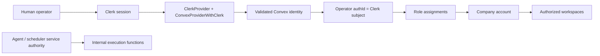

# Clerk Company Authorization Plan

## Overview

Replace anonymous production operation with a Clerk-authenticated human
identity boundary backed by Convex token validation and Mission Control's
existing company RBAC records. Add a company-member administration surface and
enforce server authorization for company/workspace administration without
breaking service-driven agent execution.

## Problem

The company account selector currently has a safe server-shaped API, but local
testing relies on `MC_ALLOW_ANONYMOUS_COMPANY_CONTEXT=1` and the application has
no production authentication provider. Existing registry APIs are public, and
many delivery mutations mix human actions with internal execution callers.

Shipping role-aware dashboards before identity enforcement would create a
cosmetic permission system rather than a trustworthy control plane.

## Architecture

Clerk authenticates humans. Mission Control authorizes actions. Client-selected
company, workspace, role, or operator IDs never establish authority.

## User Flow Contract

| State | Required behavior |
| --- | --- |
| Auth mode loading | Run no unscoped company/workspace queries; show stable loading state |
| Clerk signed out | Show sign-in gate only |
| Clerk token refreshing | Pause protected content; never fall back to demo or legacy |
| Authenticated, no membership | Show exact user ID and administrator recovery guidance |
| One company | Enter automatically and show static company identity |
| Multiple companies | Show company selector above Workspace |
| Company administrator | May manage members, roles, company profile, and workspaces |
| Ordinary member | May inspect authorized scopes; management controls are absent and server-denied |
| Inactive operator/company | Treat as unavailable without leaking other company data |
| Demo mode | Preserve deterministic local operation with a persistent warning badge |
| Invalid configuration | Fail closed with actionable setup instructions |

## Implementation Phases

### Phase 1 — Provider and session boundary

- [x] Add the current Clerk React SDK and Convex auth configuration.
- [x] Add an explicit auth-mode resolver with `clerk`, `demo`, and `legacy`
  modes; production documentation must select `clerk`.
- [x] Replace `ConvexProvider` with `ConvexProviderWithClerk` only in Clerk
  mode and keep deterministic demo/legacy providers explicit.
- [x] Add signed-out, loading/refreshing, invalid-configuration, and
  authenticated application states.
- [x] Add a visible signed-in user control and sign-out path.

### Phase 2 — Membership and RBAC administration

- [x] Define canonical company permission constants without replacing existing
  role permission arrays.
- [x] Add guarded APIs to list members/roles, create exact-subject membership,
  activate/deactivate members, and replace company-scoped role assignments.
- [x] Prevent duplicate tenant/auth-subject and tenant/email membership records.
- [x] Prevent an administrator from removing the last active company owner.
- [x] Audit successful membership and role changes with the authenticated
  operator identity.
- [x] Add member and role administration to the existing Workspaces &
  Repositories settings surface with loading, empty, error, success, and
  confirmation states.

### Phase 3 — Human authorization foundation

- [x] Extend company/workspace helpers to require named permissions.
- [x] Protect company profile and workspace creation with explicit permission
  checks rather than role-name inference alone.
- [x] Guard public registry operator mutations; leave seed/internal execution
  paths explicit and documented.
- [x] Inventory Mission, WorkOrder, Task, approval, evidence, and release public
  mutations by human versus service caller and create the follow-on enforcement
  matrix without silently breaking automation.

### Phase 4 — Verification and rollout

- [x] Add deterministic tests for mode selection, exact-subject membership
  isolation, role policy, last-owner protection, and permission denial.
- [ ] Add authenticated browser automation for Clerk signed-out/loading states
  when the Clerk test application is available.
- [x] Run Convex generation/compilation, typecheck, full tests, and build.
- [x] Browser-test demo mode and configuration-error states with no console
  errors.
- [ ] Browser-test two real Clerk identities in different companies when the
  Product Owner supplies Clerk credentials.
- [x] Update setup, feature-flag, security, and operator documentation.

## Security Invariants

- The Clerk publishable key may be client-visible; Clerk secret keys and
  session tokens must never be committed or stored in Convex records.
- `operators.authId` must match a validated token subject or token identifier.
- Email is display/contact data, never proof of membership.
- A client-provided tenant, workspace, operator, or role ID is re-authorized on
  every server operation.
- Demo access is opt-in and visibly distinct; it cannot become an implicit
  fallback after Clerk failure.
- Human and service authority remain separate so scheduled and overnight work
  is not granted a fabricated human identity.

## Data Integrity

- Schema changes are additive and indexed before new queries rely on them.
- Membership changes and audit records occur atomically in one Convex mutation.
- Role assignment replacement validates that roles belong to the same tenant.
- Deactivation preserves history; member records are not hard-deleted.
- Existing operators without `authId` remain inactive for Clerk access until
  explicitly linked.

## Acceptance Criteria

- [x] No protected company/workspace query runs before Convex confirms Clerk
  authentication in Clerk mode.
- [x] A valid Clerk session with no operator membership sees no company data.
- [x] A member sees only companies linked to the exact validated subject.
- [x] A company administrator can manage membership and roles without using the
  Convex dashboard.
- [x] A non-administrator cannot change membership, roles, company profile, or
  workspace configuration through direct API calls.
- [x] The final active owner cannot be deactivated or stripped of owner access.
- [x] Local demo mode remains browser-operable and visibly labeled.
- [x] Missing Clerk configuration fails closed with actionable guidance.
- [x] Existing golden-path service automation remains functional.
- [x] Tests, typecheck, build, docs, and browser evidence pass.

## Dependencies and Required Owner Input

- Clerk development application and Convex integration activation.
- `VITE_CLERK_PUBLISHABLE_KEY` for the Vite client.
- Clerk issuer domain (or Clerk Frontend API URL) supplied for
  `convex/auth.config.ts`.
- Two test identities for final cross-company isolation verification.

Code can be implemented and demo-tested without these values. Real Clerk login
cannot be claimed complete until the credentials and identities are supplied.

## References

- `docs/product/mission-control-north-star.md`
- `docs/product/mission-control-v1-product-strategy.md`
- `docs/brainstorms/2026-07-31-clerk-company-authorization-brainstorm.md`
- `docs/brainstorms/2026-07-31-company-account-boundary-brainstorm.md`
- Clerk: Integrate Convex with Clerk
- Convex: Convex & Clerk

## Post-Deploy Monitoring & Validation

- Search Convex logs for authentication failures, unauthorized company access,
  last-owner protection, and membership mutation errors.
- Watch sign-in completion, authenticated-with-no-membership rate, and company
  context query failures for 24 hours after enablement.
- Healthy: validated identities resolve only explicit memberships and routine
  agent/scheduler execution remains unchanged.
- Roll back by disabling Clerk UI rollout and restoring the prior application
  provider; never enable anonymous demo access in production.
- Owner: Mission Control product owner and platform operator.
