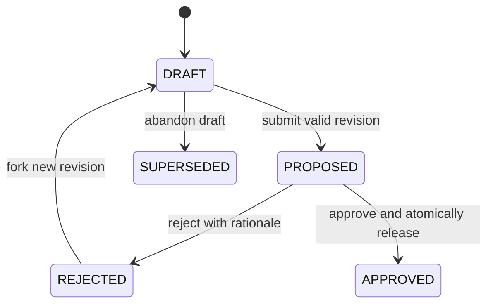

# Complete Mission planning, approval, and WorkOrder release

## Outcome

An operator can open a real Mission, review or revise a versioned execution
plan, submit it for a human decision, reject it with a durable reason, create a
new revision, and approve it once. Approval atomically creates the plan's
linked WorkOrders and validation assertions without dispatching any execution.

This completes the next missing section of the V1 golden path:

```text
Mission draft
  -> plan draft
  -> proposed revision
  -> human decision
  -> approved immutable plan
  -> released WorkOrders
  -> separate dispatch/preflight gate
```

The feature is done only when the full browser journey persists through refresh
and back/forward navigation, duplicate approval cannot create duplicate records,
and every released WorkOrder is traceable to one approved blueprint and its
assertions.

## Product decision

Build this as a bounded vertical slice inside the existing Mission and
WorkOrder domains. Do not create another planning engine, approval authority,
or execution queue.

Approval has one precise meaning in this slice: **authorize and materialize the
approved WorkOrder contract**. It does not dispatch an agent, approve a
high-risk WorkOrder, merge code, or deploy anything. Existing WorkOrder policy
and approval gates remain in force after release.

### Recommended identity sequencing

Production plan approval must not trust `createdBy`, `approvedBy`, or role names
provided by the browser. The current Mission mutations accept those strings and
fall back to `development:local-operator` when no authenticated identity exists.
That is acceptable for local evidence only; it is not production authority.

Recommended sequence:

1. Implement the plan builder, revision contract, validation, and atomic
   materialization behind `missions.plan-release-v1`, default off.
2. Permit local development verification only when an explicit server-side
   development setting is enabled, and label the decision provenance as local.
3. Keep production enablement blocked until the P0 identity/authorization slice
   resolves authenticated human and agent identities, project membership, plan
   author versus approver roles, and separation of duties on the server.

If the Product Owner requires the feature to be production-enabled in the same
release, the authenticated identity subset becomes Phase 0 and expands this
slice. Do not silently ship client-asserted approval authority.

## Why this is next

The Mission draft and canonical detail route are already live, while the next
transition is incomplete:

- `convex/missions.ts` can submit and approve a proposed plan, but the proposal
  is stored partly in untyped `metadata` and receives only shallow validation.
- `approvePlan` creates validation assertions and marks the Mission `READY`, but
  does not create WorkOrders. `start` correctly refuses to start a Mission with
  no released WorkOrder, leaving the current flow at a dead end.
- `convex/workOrders.ts` already verifies that a Mission WorkOrder matches the
  current approved plan, uses idempotent creation, links assertions, creates an
  initial revision, and applies existing WorkOrder governance. That logic
  should be reused, not duplicated in `missions.ts`.
- `MissionDetailView.tsx` already reads live scoped Mission data and exposes
  Overview, Work Orders, Validation, and Activity, but has no Plan workspace or
  plan decision controls.
- The existing roadmap identifies this exact gap as P0.2 and limits it to plan
  authoring, decision, revision, release, and eligibility. Execution,
  validation automation, and final acceptance remain later slices.

## Accepted product boundaries

### In scope

- Persistent plan drafts and immutable submitted revisions.
- WorkOrder blueprint and validation-assertion authoring.
- Repository/workflow/risk/approval scope visible before decision.
- Server-side graph and contract validation.
- Human-readable comparison with the previous plan revision.
- Submit, reject with required rationale, fork revision, resubmit, approve.
- Abandon an unsubmitted plan draft and return to Mission definition without
  deleting history.
- One atomic, idempotent approval-and-release command.
- Initial WorkOrder governance state and serial eligibility explanation.
- Loading, empty, validation-error, decision-pending, success, duplicate,
  stale-revision, and recovery states.
- Stable Mission URL, refresh, back/forward, keyboard, narrow viewport, dark and
  light theme, and accessibility verification.
- Auditable Mission events for plan lifecycle and release.

### Explicitly out of scope

- Generating the plan with an LLM or running a repository-research agent.
- Automatic dispatch or starting the Mission after approval.
- Executor/worktree preflight and secret/tool/network policy.
- Validator execution, evidence collection, corrective work, or final Mission
  acceptance.
- Automatic merge, deployment, feature activation, or rollback execution.
- Rebuilding the global Decision Center in this slice.
- Backfilling or automatically releasing historical approved plans.
- General Task planning (`PlanningModal.tsx`) or legacy Task migration.

## Operator experience

Add a `Plan` tab to the canonical Mission detail route
`/v2/missions/:missionId`. Keep the Mission detail page as the single operator
surface; do not add a separate top-level planning route.

### Draft state

The Plan tab begins with one decision card and one primary action:

- If no plan exists: explain that the Mission definition is saved and prompt
  the operator to create a plan draft.
- If a draft exists: show its save state, revision number, author provenance,
  graph validity, estimated cost, risk summary, and blocking errors.
- The editor contains Plan Summary, WorkOrders, Assertions, and Review sections.
- WorkOrders are edited as ordered cards or rows. Each shows sequence, role,
  mutating/read-only mode, workflow, risk, branch strategy, dependencies,
  required approvals, and linked assertions.
- Assertions show the observable outcome, pass condition, evidence requirement,
  verification method, independence requirement, waiver policy, and WorkOrder
  coverage.
- Save is available for incomplete drafts. Submit remains disabled until the
  server-equivalent validation passes.

### Awaiting decision

Once submitted, the proposed revision is immutable:

- Show the plan summary and a compact dependency diagram.
- Show additions, removals, and changed fields relative to the preceding
  revision; revision 1 compares against an empty plan.
- Put risk, repository, budget, stop condition, WorkOrder count, assertion
  coverage, and unknown values in the decision packet.
- Require a written rationale for either Approve and release or Reject.
- The approval confirmation states the exact number of WorkOrders to be created
  and explicitly states that no execution will start.
- Disable the decision controls when the operator lacks authority, the revision
  is stale, another request is in flight, or the release flag is off.

### Rejected state

- Preserve the rejected revision, decision actor, time, and reason.
- Return the Mission to `DRAFT` and show the rejection as the current required
  action.
- `Create revision` copies the rejected plan into a new editable draft with a
  `basePlanId` link; it never reopens or mutates the rejected row.
- The new comparison uses the rejected revision as its baseline.

### Approved and released state

- Lock the approved revision.
- Show the release receipt: approver, rationale, time, WorkOrder IDs, assertion
  count, and idempotency result.
- Work Orders tab lists released WorkOrders in plan order and links to their
  stable detail selection.
- Show eligibility separately from WorkOrder lifecycle state: first/no-
  dependency WorkOrders are eligible for later dispatch; dependent WorkOrders
  explain which predecessor handoff is missing.
- The next action is `Review released WorkOrders`; do not offer automatic start
  or dispatch from the approval success state.

## Domain contract

### Plan lifecycle



Only a `DRAFT` plan is editable. `PROPOSED`, `REJECTED`, `APPROVED`, and
`SUPERSEDED` rows are immutable except for their one legal server-owned
decision transition. Mission state follows the existing contract:

- creating the first plan draft moves the Mission from `DRAFT` to `PLANNING`;
- abandoning an unsubmitted plan marks that plan `SUPERSEDED` and returns the
  Mission to `DRAFT` without deleting history;
- submitting moves it to `AWAITING_PLAN_APPROVAL`;
- rejecting returns it to `DRAFT` with a required human action;
- approving and releasing moves it to `READY`;
- this slice never moves it to `IN_PROGRESS`.

### Typed plan data

Keep existing fields readable and add optional typed fields to `missionPlans`
so the schema change is additive:

- `basePlanId` for revision lineage;
- `draftVersion` for optimistic concurrency while the editable draft is open;
- first-class `assertions` using the existing assertion shape rather than only
  `metadata.assertions`;
- a submitted repository snapshot (repository plus default branch) so approval
  cannot silently target a project configuration the operator did not review;
- `rollbackApproach` and optional `estimatedCostUsd`;
- `submittedAt` and resolved submitter provenance;
- `decisionReason`, `decidedBy`, `decidedAt`, and actor provenance;
- `releaseIdempotencyKey`, `releasedAt`, and `releasedWorkOrderIds`;
- optional `materializationVersion` for future reconciliation tooling.

Extend each WorkOrder blueprint with the fields the operator must authorize and
the existing WorkOrder creation contract already consumes:

- `priority`, `riskLevel`, optional `modelComplexity`;
- `branchStrategy` and the reviewed workflow ID/version;
- `constraints` and `requiredApprovals`;
- optional per-blueprint cost estimate;
- existing workflow, sequence, role, mutation mode, dependencies, and assertion
  links.

The repository snapshot is resolved from `projects.githubRepo` when the plan is
submitted. Mission constraints and source-of-truth references are copied into
each released WorkOrder snapshot. Approval fails closed if the project
repository has changed since submission; the operator must create and review a
new revision. Do not allow a mutating blueprint to be submitted when the
selected project has no repository configured.

For compatibility, reads may fall back to `metadata.assertions` for historical
plans. New writes use only the typed contract. Do not dual-write indefinitely;
remove the fallback after historical data is either intentionally retained as
legacy or migrated in a separate, reviewed change.

### Verification-method alignment

Mission assertions and verification receipts support `BROWSER`, but WorkOrder
acceptance criteria and `recordVerificationReceipt` currently omit it. Add
`BROWSER` to those WorkOrder validators in the same schema/code change so a
browser assertion is not degraded to `MANUAL` during materialization.

### Plan validation

Create one pure validator in `convex/lib/missionPlan.ts` and reuse equivalent
typed rules in the UI model for immediate feedback. The server remains
authoritative. Approval reruns validation against persisted data; it never
trusts a prior client validation result.

Block submission or approval when any of these are true:

1. The summary or rollback approach is empty.
2. There are no WorkOrder blueprints or no assertions.
3. Blueprint IDs, assertion IDs, or sequence numbers are duplicated.
4. Sequence numbers are not positive integers with a deterministic order.
5. A dependency is unknown, self-referential, cyclic, or ordered after its
   dependent blueprint.
6. A blueprint has no linked assertion or references an unknown assertion.
7. An assertion is not covered by at least one blueprint.
8. A required title, outcome, workflow, pass condition, or evidence requirement
   is empty.
9. A mutating WorkOrder lacks a configured repository or branch strategy.
10. Risk, priority, role, execution mode, verification method, or cost is
    outside its supported range.
11. The plan belongs to another Mission/project, is not the latest proposed
    revision, or is no longer in a decidable state.
12. A client-supplied actor attempts to replace the authenticated server actor.
13. The repository or reviewed workflow version changed after submission.

Return structured errors with stable codes and blueprint/assertion IDs so the
UI can focus the first invalid control and display the same reason after a
server rejection.

## Atomic WorkOrder materialization

Approval and release must be one Convex transaction. A Mission must never be
`READY` with only a partial set of WorkOrders or assertions.

1. Resolve and authorize the decision actor on the server.
2. Load the Mission, selected project, latest proposed plan, and existing
   release rows.
3. If this exact release already completed, return its existing WorkOrders and
   `created: false`.
4. Revalidate plan ownership, latest revision, graph, repository, budget/risk
   contract, actor separation, and feature flag.
5. Create validation assertions from the typed proposed assertions.
6. Materialize every blueprint through one shared WorkOrder creation helper.
   Extract the existing insert/revision/event/governance logic from
   `workOrders.create`; do not reproduce a smaller copy in `missions.ts`.
7. Use deterministic keys derived from Mission plan ID and blueprint ID. Store
   the blueprint ID on the WorkOrder and its release receipt.
8. Convert linked assertions into WorkOrder acceptance criteria and patch each
   `validationAssertion.linkedWorkOrderIds` exactly once.
9. Mark the plan approved/released, store the decision and WorkOrder IDs, set
   `missions.currentPlanId`, transition the Mission to `READY`, and append one
   Mission release event.
10. Return the approved plan, Mission, assertions, ordered WorkOrders, and
    whether the transaction created or reused the release.

Convex transaction rollback is the partial-failure strategy. Do not schedule
one asynchronous materialization mutation per blueprint; that would allow a
half-released plan.

Released WorkOrders start in the existing governed `READY` state. High- and
critical-risk blueprints retain pending WorkOrder approvals. Dependency and
serial eligibility are computed for display and enforced again by the existing
Mission dispatch guard. No WorkOrder is dispatched by this transaction.

## Server API changes

Keep lifecycle writes in `convex/missions.ts`, with pure rules extracted from
the mutation body:

- `savePlanDraft` — create a plan revision or edit the current `DRAFT` row using
  an expected draft version so another tab cannot silently overwrite it;
- `abandonPlanDraft` — close an unsubmitted draft with a reason and return the
  Mission to `DRAFT` for intent changes;
- `submitPlan` — submit an existing draft after full validation;
- `rejectPlan` — require rationale, close the proposed revision, return Mission
  to `DRAFT`, and record required action;
- `forkPlanRevision` — copy an immutable rejected/current plan into a new draft;
- `approvePlan` — become the atomic approve-and-release command;
- `getScoped` — return ordered plan history, normalized typed assertions,
  release receipt, and computed WorkOrder eligibility.

Every mutation accepts `projectId`, `missionId`, relevant record IDs, and an
idempotency key. Actor identity is resolved on the server. All reads and writes
assert Mission/project scope. Mutation responses are sufficient to render a
success or duplicate result without inventing client state.

## Implementation phases

### Phase 0 — decision and contract lock

1. Product Owner confirms the recommended identity sequencing above or expands
   this slice to include authenticated plan-author/approver enforcement.
2. Update `docs/software-factory/governed-missions-contract.md` with the exact
   plan lifecycle, approval-and-release meaning, decision rationale rule,
   revision immutability, and non-dispatch boundary.
3. Define one deterministic fixture with two WorkOrders:
   - first: mutating worker with COMMAND/TEST assertions;
   - second: validator depending on the first with a BROWSER assertion;
   - one rejected revision before the approved revision.

**Exit:** there is no ambiguity about who may approve, what approval
authorizes, or whether release starts execution.

### Phase 1 — pure contract and additive schema

1. Add `convex/lib/missionPlan.ts` for normalized plan types, validation,
   cycle/order checks, revision comparison inputs, and deterministic release
   keys.
2. Add focused unit tests before mutation work.
3. Extend `missionPlans` and blueprint validators with the typed fields above.
4. Add `BROWSER` to WorkOrder acceptance-criterion and receipt validators.
5. Register `missions.plan-release-v1` in `convex/lib/flags.ts`, default off,
   document it in `docs/FEATURE_FLAGS.md`, and cover it with existing flag tests.
6. Keep all new fields optional for existing rows and include a schema-contract
   test so generated types, validators, and consumers land atomically.

**Exit:** invalid plans have deterministic errors and current data remains
readable without backfill.

### Phase 2 — persistent revisions and decisions

1. Implement `savePlanDraft` and `abandonPlanDraft`, refactor `submitPlan` to
   submit a persisted draft, and add `rejectPlan`/`forkPlanRevision`.
2. Resolve actor provenance server-side and reject cross-project record IDs.
3. Add the narrow `PLANNING -> DRAFT` Mission transition used only by an
   audited plan-abandon command; do not create a general backwards transition.
4. Use optimistic concurrency for editable drafts and assign revision numbers
   from the latest persisted revision inside the mutation transaction.
5. Make submitted and decided rows immutable.
6. Append idempotent Mission events for draft creation, submission, rejection,
   revision fork, and decision failure/success where appropriate.
7. Normalize historical `metadata.assertions` only on reads; never silently
   rewrite historical decisions.

**Exit:** a plan survives refresh through author, reject, revise, and resubmit
without losing history.

### Phase 3 — atomic release through the WorkOrder domain

1. Extract one reusable server-owned WorkOrder creation helper from
   `convex/workOrders.ts`, preserving initial revision, activity/event,
   governance refresh, defaults, and existing direct WorkOrder behavior.
2. Make `approvePlan` validate and materialize the full plan in one transaction.
3. Link WorkOrders to Mission, plan, blueprint, assertions, source references,
   and deterministic dependencies.
4. Return ordered release data and make repeated calls safe.
5. Add integration coverage for transaction rollback when a late blueprint is
   invalid and for two concurrent approval attempts.

**Exit:** an approved plan has exactly one complete release and direct
WorkOrder creation has no regression.

### Phase 4 — Mission Plan operator UI

1. Add `apps/mission-control-ui/src/eos/missionPlanModel.ts` for form state,
   structured validation errors, deterministic sorting, graph presentation,
   and field-level revision comparison.
2. Add a focused `MissionPlanWorkspace.tsx` under `eos/views/` and smaller
   blueprint/assertion/decision components only where they reduce complexity.
3. Add the Plan tab to `MissionDetailView.tsx`; retain the existing canonical
   URL and unsaved-change navigation guard.
4. Use `docs/design.md`: exception/evidence first, one primary action per
   decision area, semantic tokens, visible focus, and complete loading/empty/
   error/success/disabled/recovery states.
5. Gate edit and decision controls with the resolved runtime flag and actor
   capability; read-only plan history remains truthful when the flag is off.
6. Link released WorkOrders to the existing WorkOrder surface using stable IDs
   in URL state, not just `onNavigate("control-work-orders")`.

**Exit:** the full plan decision and release journey is operable at the Mission
URL on desktop and narrow viewports.

### Phase 5 — proof and rollout

1. Run focused pure, Convex, UI-model, and component tests.
2. Run affected package typecheck and build; include schema consumers in the
   same verification pass per the documented Convex schema-drift learning.
3. Run the Playwright journey at `http://localhost:5180` for current development
   and `http://localhost:5199` with `pnpm run dev:demo` for the accepted demo
   shell configuration.
4. Verify dark/light themes, keyboard order, visible focus, dialog close and
   recovery behavior, Axe A/AA including target size, browser console errors,
   page errors, and failed requests.
5. Save the final evidence under
   `docs/testing/2026-07-31-mission-plan-release-evidence.md` and link it from
   the relevant in-app docs page if operator semantics changed.
6. Enable the feature flag only for the verified local/project scope. Production
   remains off until the identity gate is satisfied.

**Exit:** the browser-proven flow matches durable Convex state and rollback is
one audited flag change.

## File map

### Expected modifications

- `convex/schema.ts` — additive typed plan/release fields, blueprint fields, and
  BROWSER validator alignment.
- `convex/lib/missionPlan.ts` — pure validation, normalization, comparison, and
  deterministic release-key rules.
- `convex/lib/missionGovernance.ts` — only Mission transition/eligibility rules
  that genuinely belong to governance; do not move form validation here.
- `convex/missions.ts` — scoped plan draft, submission, rejection, revision,
  atomic approval/release, events, and enriched detail read model.
- `convex/workOrders.ts` — shared WorkOrder creation path and existing public
  mutation adapter.
- `convex/lib/flags.ts`, `docs/FEATURE_FLAGS.md` — registered rollout gate.
- `apps/mission-control-ui/src/eos/views/MissionDetailView.tsx` — Plan tab,
  stable WorkOrder links, current decision action.
- `apps/mission-control-ui/src/eos/missionPresentation.ts` — plan-related state
  and next-action wording only if needed.
- `docs/software-factory/governed-missions-contract.md` — approved semantics.

### Expected additions

- `apps/mission-control-ui/src/eos/missionPlanModel.ts`
- `apps/mission-control-ui/src/eos/missionPlanModel.test.ts`
- `apps/mission-control-ui/src/eos/views/MissionPlanWorkspace.tsx`
- `apps/mission-control-ui/src/eos/views/MissionPlanWorkspace.test.tsx`
- `convex/__tests__/missionPlan.test.ts`
- `convex/__tests__/missionPlanRelease.test.ts`
- `tests/e2e/mission-plan-release.e2e.spec.ts`
- `docs/testing/2026-07-31-mission-plan-release-evidence.md`

The exact component split may shrink during implementation. Do not create a
component for every form row or a second plan state store.

## End-to-end flow analysis

| Flow | Expected behavior | Failure/recovery behavior |
| --- | --- | --- |
| First plan draft | Create revision 1, save incomplete work, refresh safely | Validation explains missing fields; no Mission transition to approval |
| Abandon plan draft | Retain the closed draft, record a reason, and return Mission to Draft | No plan or Mission history is deleted |
| Concurrent draft edit | Save only when the expected draft version matches | Show a conflict and preserve the operator's unsaved values for comparison |
| Submit invalid graph | Block on client and server with the same stable field/record targets | Focus first invalid control; retain all edits |
| Submit valid plan | Freeze proposal and move Mission to awaiting approval | Duplicate submit returns the same proposal |
| Stale tab submits | Server rejects a non-latest or decided revision | Reload current revision without discarding a separate local draft silently |
| Reject | Require rationale; freeze rejected plan; Mission returns to Draft | Duplicate rejection returns existing decision; reason remains visible |
| Revise | Fork rejected plan into the next revision and show diff | Original rejected plan stays immutable |
| Approve | Revalidate, record decision, create all assertions/WorkOrders, set Ready | Any error rolls back the whole transaction; UI remains awaiting decision |
| Double approval | First transaction wins; later calls return the existing release | No duplicate WorkOrder, assertion, revision, activity, or event rows |
| Approval after plan changed | Reject stale plan ID/revision | Present current proposal and require a fresh decision |
| High-risk blueprint | Release WorkOrder with its normal pending approvals | Plan approval does not satisfy or bypass WorkOrder risk approval |
| Dependent WorkOrder | Release and show predecessor dependency as not yet eligible | Later dispatch remains server-blocked until the required handoff exists |
| Missing repository/workflow | Draft may save; submission/approval is blocked | Show actionable project or blueprint remediation |
| Repository/workflow changes after submit | Reject approval of the stale reviewed scope | Fork a revision, refresh the snapshot, and require a new decision |
| Browser assertion | Preserve BROWSER method through assertion, criterion, and receipt contract | Never silently relabel it MANUAL |
| Scope mismatch | Read/write returns not found or explicit workspace mismatch | No cross-workspace IDs or data appear |
| Feature flag off | Read-only history remains visible; mutations explain disabled state | Existing Mission draft and WorkOrder flows remain unchanged |
| Legacy approved plan | Display as legacy/unreleased with insufficient release provenance | Never materialize automatically; later reconciliation is explicit |
| Network loss after approval | Refresh reads the durable release receipt and exact WorkOrders | Operator never needs to approve again to discover outcome |

## Acceptance criteria

### Contract and persistence

- [ ] Incomplete plan drafts can be saved and reopened.
- [ ] Proposed, rejected, approved, and superseded plan revisions are immutable.
- [ ] An unsubmitted plan can be abandoned with a reason so Mission intent can
  be edited again without deleting plan history.
- [ ] Rejection requires and retains actor, provenance, time, and rationale.
- [ ] Revision history and diff are deterministic after refresh.
- [ ] Concurrent draft edits cannot silently overwrite a newer saved version.
- [ ] All mutation and query IDs are project/Mission scoped on the server.
- [ ] New schema fields and every consumer compile and deploy together.

### Validation and release

- [ ] Empty plans, empty assertions, duplicate IDs/sequences, unknown edges,
  cycles, self-dependencies, out-of-order dependencies, uncovered assertions,
  and assertion-less blueprints are blocked.
- [ ] Approval reruns server validation against persisted plan/project data.
- [ ] Approval creates every assertion and WorkOrder in one transaction.
- [ ] Each WorkOrder links the Mission, plan, blueprint, ordered sequence, risk,
  workflow, repository snapshot, source references, and acceptance criteria.
- [ ] Each assertion links every corresponding WorkOrder exactly once.
- [ ] Repeated or concurrent approval creates no duplicate rows or events.
- [ ] A failure during any materialization step leaves the plan proposed and the
  Mission awaiting approval with zero partial release records.
- [ ] Approval starts no WorkflowRun and dispatches no agent.

### Operator UI

- [ ] Plan is reachable from the canonical Mission detail URL and left-nav
  Mission journey.
- [ ] The current gate, owner/actor, reason, risk, state, and next action are
  visible together.
- [ ] The decision packet names unknown repository, workflow, budget, and
  evidence values instead of hiding them.
- [ ] Approve and Reject require rationale and prevent duplicate submission.
- [ ] Success confirmation states what was released and that execution did not
  start.
- [ ] Released WorkOrders have stable links and serial eligibility explanations.
- [ ] Loading, empty, validation, server error, stale revision, success,
  disabled, and recovery states are browser-proven.
- [ ] Keyboard, focus, dialog, narrow layout, dark/light theme, and Axe checks
  pass with no console/page/failed-request errors.

### Authority and rollout

- [ ] Client actor labels cannot grant production approval authority.
- [ ] Plan author and approver separation is enforced before production flag
  enablement.
- [ ] High-risk WorkOrder approval remains separate from plan approval.
- [ ] `missions.plan-release-v1` is default off and auditable.
- [ ] Disabling the flag restores the current Mission behavior without deleting
  plan or release history.

## Test plan

### Pure unit tests

- Valid one- and multi-WorkOrder plans.
- Every graph/coverage/input validation failure above.
- Deterministic ordering and release key generation.
- Revision diff for add/remove/change/reorder.
- Eligibility for no dependency, missing WorkOrder, missing/incomplete handoff,
  complete handoff, and active mutation.

### Convex integration tests

- Save draft -> submit -> reject -> fork -> resubmit -> approve.
- Mission/project scope mismatch for every mutation.
- Immutable proposed/rejected/approved rows.
- Actor provenance and separation-of-duties gate.
- Atomic release with two blueprints and three assertion mappings.
- BROWSER criterion preservation.
- High-risk WorkOrder remains approval-gated.
- Duplicate idempotency key and competing approval keys.
- Forced late materialization failure rolls back all writes.
- Existing direct `workOrders.create`, dispatch, revision, governance, and
  Mission draft tests still pass.

### UI/component tests

- Plan tab empty/loading/flag-off states.
- Incomplete draft save and field-targeted validation.
- Graph and assertion coverage presentation.
- Required decision rationale and double-click guard.
- Rejected revision fork and diff presentation.
- Release success and duplicate/recovered success.
- Stable WorkOrder link includes selected ID and workspace.
- Unsaved-change navigation guard covers Plan as well as Mission Overview.

### Playwright journey

1. Open a DRAFT Mission at its canonical URL.
2. Create and save an incomplete plan; refresh and confirm it persists.
3. Add an invalid dependency and uncovered assertion; confirm submit is blocked
   with accessible, field-linked reasons.
4. Correct the plan and submit revision 1.
5. Reject it with a reason; refresh and verify the reason/history.
6. Fork revision 2, change one WorkOrder and assertion, and inspect the diff.
7. Submit and approve with an authorized different actor in the verified auth
   test configuration.
8. Confirm the Mission is Ready, the release receipt exists, and each linked
   WorkOrder appears exactly once in plan order.
9. Confirm no WorkflowRun was created and a dependent WorkOrder explains its
   missing predecessor handoff.
10. Repeat approval/reload and confirm no duplicates.
11. Navigate to a released WorkOrder and back without losing Mission context.
12. Repeat the critical review/decision controls at a narrow viewport and with
   keyboard-only operation.

## Migration, rollback, and operational safety

- All schema changes are additive. Existing Missions and WorkOrders require no
  rewrite.
- Existing plan assertions stored in metadata are read as legacy only.
- Existing approved plans are never auto-released. The UI labels them
  `Legacy approval — release provenance unavailable` and provides no implicit
  repair action.
- Rollback is `missions.plan-release-v1` off. Read-only history remains visible;
  plan mutations and release are disabled.
- Released WorkOrders are durable records and are not deleted on rollback.
- If a release defect is discovered, stop future releases with the flag, retain
  the audit trail, and use a separately approved reconciliation plan. Do not
  delete or rewrite decisions.
- No production enablement occurs without successful schema/typecheck, focused
  tests, browser evidence, and identity gate evidence.

## Risks and mitigations

| Risk | Mitigation |
| --- | --- |
| Partial release leaves a false Ready Mission | One Convex transaction; no scheduled per-blueprint mutations |
| Duplicate approval creates duplicate work | Deterministic per-plan/per-blueprint keys plus persisted release receipt and concurrency tests |
| Plan approval becomes execution approval | Explicit UI copy; no dispatch call; existing WorkOrder gates retained |
| Browser-provided identity grants authority | Default-off flag, server actor resolution, production identity prerequisite |
| Schema and consumers drift | Additive fields, same-change validator/consumer updates, generated-type and schema-contract verification |
| Plan editor becomes an orchestration product | Structured manual contract only; no agent generation or run control in this slice |
| Dependency UI claims work is ready when it is not | Display computed Mission eligibility separately and retain server dispatch guard |
| Historical approved plans are accidentally released | No automatic backfill; explicit legacy label and future reconciliation only |
| BROWSER evidence is degraded during mapping | Align WorkOrder validators in the same schema change and test exact preservation |
| Component sprawl makes Mission Detail fragile | One plan workspace, one pure UI model, shared form primitives, extract only repeated decision components |

## Learned repository guidance applied

The only matching entry in `docs/solutions/` is
`build-errors/missing-convex-schema-contracts-ci-20260730.md`. It establishes
that persisted fields, validators, indexes, generated types, and their consumers
must land and be verified as one atomic schema contract. This plan therefore
does not permit a temporary metadata shim or consumer-first release.

No `docs/solutions/patterns/critical-patterns.md` file exists in the current
repository, and no more specific prior Mission plan-release solution was found.

## References

- `docs/brainstorms/2026-07-31-north-star-product-expansion-brainstorm.md`
- `docs/product/mission-control-north-star.md`
- `docs/product/mission-control-v1-product-strategy.md`
- `docs/software-factory/governed-missions-contract.md`
- `docs/plans/software-factory-implementation-roadmap.md` (P0.2 / PR 2)
- `docs/plans/software-factory-capability-map.md`
- `docs/plans/2026-07-28-feat-governed-missions-plan.md`
- `docs/design.md`
- `docs/solutions/build-errors/missing-convex-schema-contracts-ci-20260730.md`
- `convex/missions.ts`
- `convex/lib/missionGovernance.ts`
- `convex/workOrders.ts`
- `convex/schema.ts`
- `apps/mission-control-ui/src/eos/views/MissionDetailView.tsx`
