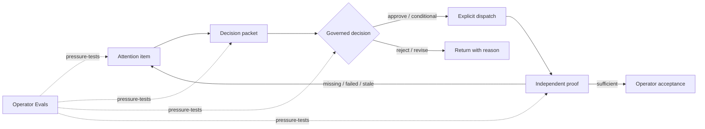

# Add persona-tested operator control loop

## Overview

Build a complete, evidence-first operator workflow on the existing WorkOrder
control plane and an internal persona-engineering harness that evaluates the
same workflow. An operator must be able to see what needs attention, make a
governed decision, dispatch work, and inspect proof without reconstructing the
state from raw activity.

This plan implements the decision-and-evidence slice of the durable
[Mission Control North Star](../product/mission-control-north-star.md):
humans own intent, judgment, governance, and approval; agents own bounded
execution, recovery, validation, and evidence collection.

## Current-State Evidence

- `apps/mission-control-ui/src/controlPlane/WorkOrderApprovalsView.tsx` already
  exposes real `approvalDecisions`, but it compresses evidence to a count and
  does not preview dispatch or proof requirements.
- `convex/workOrders.ts` already owns approval decisions, explicit guarded
  dispatch, verification receipts, and acceptance.
- `apps/mission-control-ui/src/controlPlane/WorkOrdersView.tsx` already exposes
  dispatch and proof inspection through a URL-addressable WorkOrder detail.
- `apps/mission-control-ui/src/eos/views/CommandCenterView.tsx` currently allows
  quick approval and unblock actions without the full decision context.
- The context-package eval framework provides a useful persistence and run
  pattern, but operator evals require different grounding, durability, rubric,
  and human-calibration semantics.
- No relevant `docs/solutions/` entries exist; repository contracts are the
  source of truth.

## Product Contract

## Phase 1 — Governed Operator Workflow

- [x] Add a pure decision-packet model that derives attention reason,
  authority boundary, evidence on hand, missing evidence, dispatch preview,
  and proof requirements without inventing absent fields.
- [x] Enrich `workOrders.approvalQueue` with complete receipt and governance
  context required by the decision packet.
- [x] Replace approval cards with an exception-first master/detail workspace.
- [x] Require a decision reason for every governed decision and conditions for
  conditional approval.
- [x] Show explicit loading, empty, error, decision-in-progress, and success
  confirmation states.
- [x] Link approved work directly to the existing URL-addressable WorkOrder
  dispatch surface and link proof items to the same inspector.
- [x] Remove direct approval/unblock shortcuts from Command Center attention
  rows; opening the governed surface is the only decision action.

## Phase 2 — Operator Persona Eval Contract

- [x] Add durable project-scoped persona profiles, scenarios, eval runs, and
  human calibration observations.
- [x] Seed one grounded Fleet Operator profile and eight scenarios covering
  missing tests, scope violations, blockers, conflicting evidence, missing
  artifacts, retry loops, approved-scope drift, and security findings.
- [x] Store the fixed operating world, task prompt, expected decision rubric,
  prohibited assumptions, and durability variants for every scenario.
- [x] Implement proxy runs that score structural grounding only and visibly
  label them as non-predictive.
- [x] Provide external-run submission and completion commands for later model
  and human results without letting evals authorize production work.
- [x] Aggregate attention, authority, policy, unsupported-assumption, dispatch,
  proof, closure, and durability metrics separately.

## Phase 3 — Operator Evals UI

- [x] Add a left-navigation entry under Intelligence and a live, project-scoped
  Operator Evals page.
- [x] Show persona grounding, scenario coverage, latest run provenance, score
  distribution, prompt-sensitivity warnings, and human calibration status.
- [x] Let operators seed the V1 contract and run the structural proxy with
  clear language about what it does and does not prove.
- [x] Include loading, empty, error, running, completed, and insufficient-human-
  evidence states.

## Flow and Edge-Case Requirements

- Workspace scope must be enforced for reads and mutations.
- Expired, superseded, revoked, or already-decided approvals cannot be acted on.
- Missing evidence blocks claims of readiness; it never silently becomes pass.
- Conditional approval requires at least one explicit condition.
- Approval does not imply dispatch; the UI must show the separation.
- A work order with an active run cannot be redispatched.
- Stale or invalidated receipts remain visible and block acceptance.
- Reordered or reworded eval variants must not change the expected decision.
- Scenario results must record provenance: `PROXY`, `MODEL`, or `HUMAN`.
- Model/human submission must be idempotent and cannot call production
  decision or dispatch mutations.
- Narrow viewports retain the queue → detail → action flow.

## Acceptance Criteria

- [x] An operator can identify the most urgent approval and understand why it
  needs attention without opening raw logs.
- [x] The decision packet exposes action, scope, authority, policy, evidence,
  unknowns, dispatch outcome, and completion proof.
- [x] Decisions are reasoned, audited, and preserve existing WorkOrder guards.
- [x] Approved work is one click from the explicit dispatch surface; completion
  remains blocked until valid proof exists.
- [x] The Operator Evals page is reachable from left navigation and contains
  the grounded V1 persona and eight scenarios.
- [x] Proxy results cannot be mistaken for human validation or model accuracy.
- [x] Unit tests cover derivation, prioritization, scoring, durability, and
  unsafe-assumption detection.
- [x] Relevant Convex and UI tests pass; the production build succeeds.
- [x] Both surfaces are verified from the main repository at
  `http://localhost:5180` in desktop and
  narrow viewport states.

## Risks and Mitigations

- **False confidence from synthetic results:** keep provenance and calibration
  status visible; proxy scores are structural only.
- **Parallel governance models:** use WorkOrder approvals, dispatch, receipts,
  and acceptance as the only operational truth.
- **Decision without context:** remove quick actions and make unknown fields
  explicit in the packet.
- **Large schema blast radius:** use additive tables and functions; do not alter
  existing lifecycle enums.
- **Dirty worktree overlap:** preserve existing model-routing and automation
  changes and limit edits to targeted regions.

## Post-Deploy Monitoring & Validation

- Watch `OPERATOR_EVAL_*`, `APPROVAL_*`, `WORK_ORDER_DISPATCHED`, and receipt
  events for unexpected failures or scope mismatches.
- Healthy: decision mutations retain existing success rates; no evaluation run
  produces production approval or dispatch events; proxy runs complete with
  eight scenarios and explicit `PROXY` provenance.
- Failure/rollback trigger: workspace-scope leakage, decision actions without a
  reason, eval-to-production mutation linkage, or dispatch bypassing governance.
- Validation window: first seven days after deployment. Owner: product operator.
