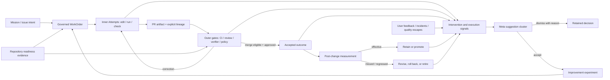

# Productionize the Software Factory Harness

## Executive Summary

Mission Control already implements most of the visible concepts in Dru Knox's
harness-engineering talk: a legible control plane, inner/outer/meta loop
surfaces, bounded improvement cycles, PR gates, repetitive-work detection,
governed automation definitions, a Context Registry, and a Factory Health
scorecard.

The next release should not clone Tessl or add another set of Harness pages. It
should make the existing system truthful, attributable, and operational:

`observed intervention or quality signal -> evidence-backed improvement proposal -> approved factory work -> bounded inner Attempts -> PR-head outer gates -> measured result -> retain, revise, roll back, or retire`

The priority is production confidence, not more conference-inspired UI. The
current implementation has four blockers to that claim:

1. Loop and meta-loop actions accept client-supplied actor labels instead of
   deriving authority from the authenticated company/workspace membership.
2. The Loop Engineering page can juxtapose an unrelated latest PR, an empty
   improvement cycle, and demo suggestions without one shared lineage.
3. Factory Health presents heuristic proxies as real metrics.
4. The lightweight Harness scheduling path creates `PENDING`
   `contextWorkflowRuns`, while the repository already contains a richer,
   governed Automations control plane.

This plan closes those gaps, adds the talk's missing **Agent IT / repository
readiness** layer, and introduces a small number of enhancements that make the
factory improve safely over time: intervention telemetry, measurable
improvement experiments, readiness evidence, quality-floor promotion, and
transparent improvement economics.

## Problem This Solves

An operator needs to answer five questions without reconstructing state from
chat, logs, or unrelated pages:

1. Where did an agent need human correction, takeover, or judgment?
2. Which inner or outer loop should prevent that intervention next time?
3. Is this repository actually ready for unattended agent execution?
4. Did an accepted harness improvement reduce intervention while holding or
   raising quality?
5. Is an automation safe to keep supervised, promote, pause, roll back, or
   retire?

Today, Mission Control can execute many of these mechanics, but it cannot yet
answer all five with authoritative, source-linked data.

## Evidence Reviewed

### Supplied talk

The user-supplied Dru Knox transcript, especially timestamps 30:49–48:38,
establishes the reference model:

- a software factory is a system in which agents produce the product while
  engineers improve the factory;
- **autonomy** measures how little corrective human intervention the agent
  needs;
- **automation** measures how much eligible work can run without exhaustive
  human review;
- **quality** must first remain stable and then improve;
- the inner loop is fast, cheap, and pre-PR;
- the outer loop is more exhaustive and operates at the PR boundary;
- the meta loop mines execution, PR, issue, and user-feedback evidence to
  improve the inner and outer loops;
- the supporting layers are a legible control plane, agent-ready company/repo
  infrastructure, and incremental improvement loops;
- manual takeovers and corrective PR comments should fall while agent-initiated
  PRs and product quality rise.

### Repository and live UI

- Canonical doctrine: `docs/product/mission-control-north-star.md` and
  `docs/product/mission-control-v1-product-strategy.md`.
- Original Tessl-inspired roadmap:
  `docs/plans/2026-07-12-harness-engineering-ui-plan.md`.
- Completed loop integration:
  `docs/plans/2026-08-01-feat-close-loop-engineering-system-plan.md` and
  `docs/testing/three-loop-engineering-results.md`.
- Loop contract: `docs/software-factory/LOOP_ENGINEERING.md`.
- Live route inspected on 2026-08-01:
  `http://localhost:5210/v2/harness-loops?company=wx74rg6ftfvzpq8hhtcjh4qve58b64w8&workspace=wh7dqkd4h1hm7k4psxrkv0x9c58bj89r`.
- The corrected workspace ID resolves to **Software Factory Demo**. The page
  had no Loop Engineering cycles, showed GitHub PR `#200` with two of five
  gates passing, displayed five open 50%-confidence demo suggestions, and
  displayed seven accepted history items. The page produced no browser or
  console errors. The optional `/gateway/status` development proxy reported a
  connection refusal because the separate channel gateway was not running;
  Loop/Convex data still loaded successfully.

## Current-State Assessment

### Keep and strengthen

| Capability | Current implementation | Assessment |
| --- | --- | --- |
| Bounded learning cycle | `loopEngineeringCycles` models research through measurement and one next cycle | Keep; use it as the governed **improvement experiment**, not as a second delivery lifecycle |
| Graph research and verification | `workflows/loop-engineering.yaml` fans out three research lanes, independently verifies, synthesizes, and stops at approval | Keep; this is meta-loop research, not the inner implementation loop |
| Governed implementation | Approved recommendations create mutating `feature-dev` WorkOrders with isolated-worktree policy and bounded attempts | Keep |
| Outer PR history | `harnessPrChecks` retains evaluations by PR/head SHA, computes gates, blocks failed CI, and records merge evidence | Keep; require explicit WorkOrder/Attempt correlation |
| Meta suggestion lifecycle | Real workflow, CI, review, receipt, measurement, and repetitive-work signals create deduplicated suggestions; acceptance creates governed work | Keep; add typed signal lineage, prioritization, and experiment linkage |
| Repetitive-work mining | Repeated WorkOrders plus verification receipts produce automation candidates | Keep; add measured frequency, human-time baseline, risk, and sample confidence |
| Governed automation | `automationDefinitions`, evaluations, decisions, conversion drafts, artifacts, and scheduler already support review-first automation | Make authoritative; retire the parallel Harness scheduling shim |
| Factory Health UI | Autonomy, automation, quality, takeovers, PR comments, agent PRs, spend, and maturity are displayed | Rebuild the metric source contracts before treating values as live |
| Context Registry | Versioned skills, evals, security/quality checks, activation, and automation conversion exist | Connect improvement outcomes back to skill/version effectiveness |
| Unified Loop page | Inner, outer, and meta sections are reachable from the left navigation | Keep one primary surface; make it exception- and lineage-first |

### Gaps that must be fixed before expansion

#### 1. Vocabulary drift

The supplied talk and the original July plan define:

- inner loop -> **autonomy** through fewer corrections while the agent works;
- outer loop -> **automation** through trusted, exhaustive PR-boundary checks;
- meta loop -> **quality** through measured improvement.

`apps/mission-control-ui/src/harness/components/HarnessLoopsDiagram.tsx:4` and
the current Loop contract reverse the first two labels. The implementation plan
completed that reversal intentionally, but the new source material makes the
inconsistency explicit. One vocabulary must be chosen and applied to UI, docs,
metric names, tests, and migration aliases.

**Recommendation:** use the supplied talk's definitions. Preserve old metric
field aliases during migration, but do not continue displaying the reversed
labels.

#### 2. Untrusted actor identity and incomplete workspace authorization

`apps/mission-control-ui/src/harness/components/LoopEngineeringWorkspace.tsx:51`
sends the literal actor `operator` for cycle, approval, evidence, and
measurement actions.
`apps/mission-control-ui/src/harness/views/HarnessMetaLoopView.tsx:84` does the
same for accept/dismiss. The corresponding Convex actions accept these strings
without calling the existing company-access helpers.

This is incompatible with the V1 authorization requirement. Sensitive actions
must derive the actor and permissions server-side, enforce workspace/repository
scope, and retain denied-action audit evidence.

#### 3. False lineage on the primary surface

`apps/mission-control-ui/src/harness/components/HarnessMergeGatesPanel.tsx:25`
requests the latest PR for the workspace when it is not given a PR URL.
`convex/factory/prChecks.ts:511` can fall back to the latest active WorkOrder in
the repository when the branch does not match. On an empty cycle, the page can
therefore show a real but unrelated PR beside demo meta suggestions.

The primary page must never imply that independently selected records belong to
one loop. It should show only cycle/WorkOrder-linked data, or clearly label an
unscoped workspace-wide queue.

#### 4. Proxy metrics presented as observed metrics

The current Factory Health query at `convex/factory/health.ts:17`:

- infers one-shot work from the absence of `retry` or `correction` in Task
  descriptions;
- counts failed/timeout Runs as manual takeovers;
- counts Approvals as human PR comments;
- counts all agent Runs as agent-initiated PRs;
- treats passing CI as bypassed human review;
- substitutes approval rate when no PR checks exist;
- computes the quality trend by comparing the current eval pass rate to itself;
- calls a workspace `FULL_FACTORY` when any issue dispatch, outer-loop record,
  and open meta suggestion exist.

These values are useful placeholders, but they are not safe operating metrics.
Unknown or uncovered data must display as unknown, never as an optimistic
fallback.

#### 5. Two automation paths

`apps/mission-control-ui/src/harness/components/HarnessAutomatePanel.tsx:39` and
`apps/mission-control-ui/src/harness/views/HarnessLaunchView.tsx:15` write
lightweight `contextWorkflowRuns`. Those records are used as schedule
declarations and Factory Health spend inputs, but they are not the authoritative
governed automation lifecycle. Mission Control already has the more complete
`automationDefinitions` contract at `convex/schema.ts:4887` and scheduler.

All new automation must flow through candidate -> conversion draft -> artifact
validation -> review -> approved Definition -> evaluation -> governed
WorkOrder. The lightweight path should become a compatibility projection or be
retired after migration.

#### 6. Missing Agent IT / readiness evidence

Repository connections, host bindings, identities, policies, context packages,
verifiers, runtime configuration, and secret references exist, but no single
assessment proves that an agent can actually build, inspect, test, and operate
the product safely. This is the talk's largest missing layer.

## Product Outcome

An authenticated operator can open Loop Engineering and see one truthful,
clickable factory cycle: the intervention or quality signal that motivated an
improvement, the governed work that changed the harness, the Attempts and PR
gates that proved it, and the measurement that determines whether to retain,
revise, roll back, or retire it.

The same page exposes readiness blockers and the next recommended improvement,
but never creates repository-changing work or raises autonomy without explicit
authority and a quality floor.

## Product Principles

1. **Measure interventions, not activity.** Runs, tokens, and comments matter
   only when connected to an eligible work item and an outcome.
2. **A required approval is not a failure of autonomy.** Corrective direction,
   takeover, and exhaustive review are distinct from policy-required judgment.
3. **No metric without provenance.** Every number shows its period, numerator,
   denominator, sample size, data coverage, freshness, and source drill-down.
4. **Quality is a floor, not an average to game.** Autonomy or automation cannot
   be promoted while acceptance, regression, escape, or rollback thresholds
   worsen.
5. **One improvement at a time in V1.** The operator can maintain a backlog, but
   only one mutating factory improvement per repository runs concurrently.
6. **Acceptance creates governed work.** Suggestions never directly activate a
   rule, skill, verifier, policy, or automation.
7. **Use the existing hierarchy.** Factory improvement work traces through
   Mission -> WorkOrder -> Task -> Attempt -> evidence -> PR -> release.
8. **Keep one primary navigation destination.** Existing Factory Health,
   Automations, Verifiers, Registry, and PR views become drill-downs, not a new
   top-level product suite.

## Canonical Metric Contracts

### Autonomy

**Question:** How often can an agent reach a review-ready result without a
human correcting implementation direction?

Primary measures:

- `zeroCorrectionRate = eligible agent WorkOrders with zero corrective human interventions / completed eligible agent WorkOrders`
- `medianCorrectionsPerWorkOrder`
- `manualTakeoverRate = WorkOrders with an explicit takeover event / eligible agent WorkOrders`

Required events include nudge/correction, scope clarification, takeover,
credential unblock, policy decision, and approval. Only the first three count
against autonomy; the others remain visible as separate bottlenecks.

### Automation

**Question:** How much eligible work reaches merge eligibility without
exhaustive human review?

Primary measures:

- `reviewAutomationRate = eligible PR heads reaching merge eligibility without corrective human review / eligible PR heads`
- `agentInitiatedPrRate = PRs with an agent-originated WorkOrder and verified PR creation receipt / eligible PRs`
- `unattendedCompletionRate = eligible WorkOrders completed inside the approved unattended window without escalation / eligible unattended WorkOrders`

Risk-required plan or merge approval does not reduce the automation rate.
Human-authored code changes, changes-requested reviews, or manual test takeover
do.

### Quality

Do not collapse quality into one opaque score. Show a policy result plus the
underlying measures:

- first-pass acceptance-criteria rate;
- independent verifier/eval pass rate;
- post-merge defect-escape rate;
- rollback/regression rate;
- escaped security, authorization, accessibility, and data-integrity findings;
- user-facing outcome metric when a Mission declares one.

The compact pillar state is `PASS`, `AT RISK`, `FAIL`, or `UNKNOWN`, derived
from versioned thresholds. Promotion is blocked on `FAIL` or `UNKNOWN`.

### Metric integrity

Every aggregate must retain:

- workspace, repository, and optional Mission/WorkOrder scope;
- exact metric definition/version;
- numerator, denominator, excluded count, and exclusion reasons;
- measurement window and comparison window;
- source event IDs and evidence locations;
- sample-size confidence and data-coverage percentage;
- calculated-at timestamp and stale-after threshold.

No current fallback (approvals as comments, Runs as PRs, string inspection as
correction history) may remain in the live metric path.

## Target Architecture

### Authoritative records

Reuse existing records wherever they already own the lifecycle. Add only the
missing normalized telemetry and readiness contracts:

| Concern | Authoritative record |
| --- | --- |
| Intent and outcome | Mission / approved plan |
| Authorized value | WorkOrder |
| Bounded execution | Task and immutable Attempt/workflow run |
| PR/head evaluation | `harnessPrChecks` with explicit artifact lineage |
| Improvement hypothesis and measurement | `loopEngineeringCycles` |
| Improvement proposal | `metaLoopSuggestions` |
| Governed reusable automation | `automationDefinitions` and related artifacts/evaluations/decisions |
| Versioned skill/playbook | Context Registry package/version |
| Human and system intervention | New append-only `factoryInterventionEvents` |
| Normalized meta-loop signal | New append-only `factorySignals` linked to suggestions |
| Reproducible metric result | New `factoryMetricSnapshots` |
| Repository/agent readiness | New `factoryReadinessAssessments` with bounded check results |

Do not add more unbounded arrays to `loopEngineeringCycles` or
`metaLoopSuggestions`. High-volume evidence belongs in indexed child records.

## User Flows

### Flow 1 — First-time repository readiness

1. Operator opens Loop Engineering for a connected workspace.
2. The page shows `Readiness unknown`, not a maturity score.
3. Operator runs a read-only assessment.
4. Mission Control checks repository access, reproducible setup, CLI/API
   operability, sandbox/host binding, scoped credentials, logs, context,
   verifiers, PR integration, and rollback/incident controls.
5. The operator receives evidence-linked `Verified`, `Missing`, `Stale`, or
   `Waived` checks, ordered by blocking impact.
6. Accepting a remediation creates governed factory-improvement work; it does
   not silently change configuration.

### Flow 2 — Human intervention becomes an improvement proposal

1. An agent Attempt fails or a human records a correction/takeover.
2. Mission Control stores one idempotent intervention event with its WorkOrder,
   Attempt, repository, actor, reason, and evidence.
3. The meta loop clusters repeated events by failure class and affected
   surface while retaining each source event.
4. A proposal appears only after configured evidence criteria are met, or as a
   clearly labeled low-confidence single-event candidate for critical impact.
5. The operator reviews frequency, cost, risk, evidence, expected target metric,
   and recommended inner/outer/meta intervention.
6. The operator accepts, defers, merges, or dismisses with a reason.

### Flow 3 — Accepted proposal becomes a measured improvement

1. Acceptance opens an improvement-experiment draft with linked evidence,
   hypothesis, baseline window, target, quality floor, budget, owner, stop
   condition, and rollback condition.
2. The operator confirms and creates governed Mission/WorkOrder scope.
3. Inner Attempts implement and test in an isolated worktree.
4. The exact PR/head SHA is correlated through the implementation receipt, not
   guessed from repository recency.
5. Outer gates evaluate the current head and route failures to bounded
   correction.
6. After accepted merge/release, Mission Control waits for the declared
   measurement window and calculates the result.
7. The operator retains/promotes, revises, rolls back, or retires the change.

### Flow 4 — Repetitive work becomes supervised automation

1. The detector identifies comparable WorkOrders with successful independent
   receipts.
2. The proposal shows sample size, success rate, variance, human minutes, run
   cost, risk, required permissions, and unsupported assumptions.
3. Acceptance opens the existing skill-to-automation conversion flow.
4. The generated or linked artifact is validated and reviewed.
5. The first release is `LEVEL_0` or `LEVEL_1`, review-only and reversible.
6. Scheduled evaluations create governed WorkOrder drafts; they do not dispatch
   mutating work directly.
7. Reliability promotion is a separate operator decision backed by minimum
   sample, quality floor, incident history, and cost.

### Flow 5 — Regression, rollback, and rule decay

1. A measured improvement misses its target, causes a quality regression, or
   becomes obsolete after a model/runtime change.
2. Mission Control suspends future promotion and raises one decision packet.
3. The operator can revise, roll back, or retire with a reason.
4. Historical evidence remains immutable; future metrics exclude retired
   versions without erasing them.

## Flow Permutations and Required States

| Condition | Required behavior |
| --- | --- |
| No authenticated membership | Deny reads/writes outside authorized company/workspace; do not accept a client actor label |
| Demo workspace | Label fixture data and exclude it from production aggregates |
| No cycle selected | Show workspace-wide queues as unscoped; never imply the latest PR belongs to a cycle |
| No GitHub integration | Show outer-loop readiness blocker and exact setup action; no generic `Blocked` state |
| PR lacks explicit WorkOrder artifact link | Retain the event as uncorrelated and require reconciliation; never attach it to the latest WorkOrder |
| Required human approval only | Record governance touch separately; do not count it as corrective intervention |
| Duplicate webhook, correction, or scheduler tick | Apply idempotently and display one source event |
| Two operators accept the same suggestion | One idempotent decision wins; the second sees the resolved result |
| Metric sample is too small | Display sample and `insufficient data`; do not emit a maturity promotion |
| Metric coverage is partial or stale | Display `UNKNOWN`/`STALE` with missing sources |
| Quality worsens while autonomy rises | Block promotion and recommend rollback/revision |
| Readiness check requires a secret | Verify the reference/capability without exposing the value |
| Assessment interrupted | Resume from persisted check state; do not rerun verified checks unnecessarily |
| Automation overlaps a prior run | Enforce the Definition's explicit overlap and catch-up policy |
| Budget, duration, or retry cap reached | Stop and create an operator decision packet |
| Network is slow/offline | Preserve form state, show pending/retry state, and prevent duplicate submissions |
| Narrow viewport | Keep exception, current gate, and primary action above secondary explanation |
| Rollback or retirement | Preserve old decisions, versions, receipts, and measurements |

## Implementation Phases

### Phase 0 — Trust, terminology, and lineage gate

**Goal:** remove conditions that can produce unauthorized or misleading loop
state before adding telemetry.

- [ ] Choose and document the canonical pillar semantics from the supplied
  talk: inner -> autonomy, outer -> automation, meta -> quality.
- [ ] Add temporary read aliases for reversed metric names, update all visible
  copy, and add a contract test that prevents future drift.
- [ ] Replace `ACTOR_ID`, `operator`, `harness-ui`, and
  `harness-automate-ui` in Loop/Meta/Automation actions with authenticated
  operator identity resolved in Convex.
- [ ] Require company/workspace access for every public Loop Engineering,
  Factory Health, meta-loop, readiness, and automation query/action.
- [ ] Enforce permissions for viewing evidence, starting an assessment,
  accepting/dismissing suggestions, approving implementation, activating an
  automation, and rolling back/retiring a rule.
- [ ] Enforce separation of duties for improvement author, implementation
  approver, independent validator, and automation activator where policy
  requires it.
- [ ] Add denied-action audit records without sensitive inputs.
- [ ] Require PR creation to emit an explicit artifact containing WorkOrder,
  Attempt/run, repository, branch, PR URL, and head SHA.
- [ ] Remove the `latest active WorkOrder` fallback from automatic PR lineage.
  Unmatched events remain uncorrelated and visible for reconciliation.
- [ ] Make the outer gate query accept a cycle, WorkOrder, or explicit PR;
  workspace-latest mode must be visibly labeled and must not render inside a
  selected cycle.
- [ ] Mark Loop Engineering `Preview` if any sensitive mutation is not yet
  authorized server-side; restore `Live` only after browser evidence passes.

**Primary files:** `convex/lib/companyAccess.ts`, `convex/loopEngineering.ts`,
`convex/factory/metaLoop.ts`, `convex/factory/prChecks.ts`,
`convex/factory/automationDefinitions.ts`, `convex/skillAutomations.ts`,
`apps/mission-control-ui/src/harness/components/LoopEngineeringWorkspace.tsx`,
`apps/mission-control-ui/src/harness/views/HarnessMetaLoopView.tsx`, and
`apps/mission-control-ui/src/shellV2/routeCapabilities.ts`.

**Exit criteria:** an unauthorized or cross-workspace user cannot read or
mutate loop data; every allowed decision is attributed to a real operator; and
the Loop page cannot display an unrelated PR as part of a selected cycle.

### Phase 1 — Real intervention and outcome telemetry

**Goal:** replace heuristic Factory Health metrics with reproducible facts.

- [ ] Add schema-first `factoryInterventionEvents`, `factorySignals`, and
  `factoryMetricSnapshots` tables with project/repository/entity/time,
  idempotency, and source-event indexes.
- [ ] Define an intervention taxonomy: `CORRECTION`, `TAKEOVER`,
  `SCOPE_CLARIFICATION`, `CREDENTIAL_UNBLOCK`, `POLICY_DECISION`,
  `APPROVAL`, `CORRECTIVE_REVIEW`, and `MANUAL_VALIDATION`.
- [ ] Record intervention events from Attempts, corrective WorkOrders, operator
  decisions, GitHub changes-requested reviews, manual diff/code changes,
  credential blocks, and validation handoffs.
- [ ] Extend GitHub ingestion to retain review author type, review state,
  actionable comment count, PR initiator type, delivery ID, PR/head SHA, and
  explicit lineage. Store sanitized summaries, not secrets or unrestricted raw
  comment bodies.
- [ ] Distinguish agent-created PR receipts from generic agent Runs.
- [ ] Record product-quality outcomes from acceptance criteria, verification
  receipts, incidents, rollbacks, production checks, and user-feedback links.
- [ ] Implement versioned metric calculators for autonomy, automation, quality,
  cost per accepted WorkOrder, and operator attention time.
- [ ] Persist numerator, denominator, exclusions, coverage, sample confidence,
  comparison window, and evidence links in every snapshot.
- [ ] Remove every optimistic Factory Health fallback. Use `UNKNOWN` or
  `INSUFFICIENT_DATA` when a source is missing.
- [ ] Correct the prior-period quality trend and test all zero/partial/stale
  denominator cases.
- [ ] Recalculate maturity from verified capability and outcome thresholds,
  not record existence.

**Primary files:** `convex/schema.ts`, new `convex/factory/signals.ts`, new
`convex/factory/metrics.ts`, `convex/http.ts`,
`convex/lib/githubCiIngest.ts`, `convex/factory/health.ts`,
`convex/lib/factoryHealth.ts`, Attempts/workflow-run completion paths, receipt
and incident ingestion, and `HarnessFactoryHealthView.tsx`.

**Exit criteria:** every displayed pillar value can be drilled to the exact
eligible population and source events; fixture/proxy data cannot enter a live
aggregate.

### Phase 2 — Agent-ready repository assessment

**Goal:** make the talk's Agent IT layer visible and actionable without adding
another configuration maze.

- [ ] Add a versioned, read-only readiness workflow and persisted
  `factoryReadinessAssessments` contract.
- [ ] Assess ten bounded dimensions: intent intake, repository access,
  reproducible setup, CLI/API operability, sandbox/host binding, scoped
  identity/secrets, observable logs, context/playbooks, independent
  verification, and PR/release/recovery controls.
- [ ] Give every check `VERIFIED`, `MISSING`, `STALE`, `WAIVED`, or
  `NOT_APPLICABLE` state with evidence, verifier, checked-at, stale-after, and
  remediation.
- [ ] Reuse repository connection, workspace host binding, identity/access,
  Context Registry, verifier, workflow, environment, and deployment records.
  Do not build duplicate settings tables.
- [ ] Run safe capability probes only; do not reveal secret values, mutate a
  repository, or claim user-facing CLI/API parity from static documentation.
- [ ] Surface blockers in execution preflight and Loop Engineering.
- [ ] Allow the operator to accept one remediation into a draft improvement
  experiment and governed WorkOrder.
- [ ] Re-run only stale, changed, or previously failed checks; persist partial
  progress and recovery.

**Primary files:** new `convex/factory/readiness.ts`, `convex/schema.ts`,
`convex/workspaceHostBindings.ts`, `convex/identity.ts`, Context Registry
queries, WorkOrder preflight code, and new focused components under
`apps/mission-control-ui/src/harness/components/`.

**Exit criteria:** the operator sees exactly why a repository is or is not safe
for agent execution, and every remediation enters the canonical governed work
flow.

### Phase 3 — Evidence-backed improvement backlog and experiments

**Goal:** turn the meta inbox into a prioritized, measurable harness investment
queue.

- [ ] Link each normalized `factorySignal` to at most one active suggestion
  cluster while retaining all source events.
- [ ] Deduplicate within explicit evidence windows; support merge/split of
  incorrectly clustered proposals with audit history.
- [ ] Add proposal fields for affected pillar, frequency, impact, confidence,
  estimated recurrence, risk, suggested loop, expected metric movement,
  measurement cost, and repository scope.
- [ ] Rank proposals with a visible formula based on frequency, impact,
  confidence, reuse, implementation cost, and risk. Do not present unmeasured
  human-time savings as fact.
- [ ] Add `DEFERRED` with review date and owner; keep dismissal reason required.
- [ ] Convert accepted proposals into an improvement-experiment draft using the
  existing Loop cycle model.
- [ ] Require linked signal evidence, baseline window, target, quality floor,
  owner, budget, maximum Attempts/iterations, stop condition, measurement
  window, and rollback condition before approval.
- [ ] Link the experiment to the canonical Mission/WorkOrder hierarchy rather
  than creating an orphan WorkOrder.
- [ ] Support experiment lifecycle:
  `DRAFT -> APPROVED -> IMPLEMENTING -> VALIDATING -> MEASURING -> EFFECTIVE | INEFFECTIVE | REGRESSED -> RETAINED | REVISED | ROLLED_BACK | RETIRED`.
- [ ] Keep current cycle phase compatibility until existing data is migrated;
  do not rewrite historical cycles.
- [ ] Allow one active mutating factory improvement per repository in V1. Show
  queued improvements and the operator-defined weekly cost/capacity budget.
- [ ] Add rule/model decay signals and require a new evaluation before
  retaining a verifier after material model/runtime change.

**Primary files:** `convex/factory/metaLoop.ts`,
`convex/factory/repetitiveTasks.ts`, `convex/loopEngineering.ts`,
`convex/schema.ts`, Mission/WorkOrder linkage, and
`HarnessMetaLoopView.tsx`.

**Exit criteria:** one real repeated correction becomes one prioritized
proposal; acceptance creates one governed experiment; and the final decision
is based on a reproducible post-change measurement.

### Phase 4 — Converge skills, workflows, and recurring automation

**Goal:** make "Automate this" enter the real governed automation lifecycle.

- [ ] Replace direct `factory.workflows.schedule` calls from Harness UI with the
  existing automation candidate/conversion/Definition workflow.
- [ ] Migrate meaningful `contextWorkflowRuns` schedule declarations into
  disabled governed Definitions. Preserve legacy IDs and mark unmigratable rows
  as compatibility-only.
- [ ] Stop using `contextWorkflowRuns` as an automation spend or maturity source
  after migration.
- [ ] Make maintenance catalog entries versioned templates that create
  conversion drafts, not nominal `PENDING` runs.
- [ ] Connect accepted skill/playbook improvements to a Registry package
  version, source commit/hash, security/quality review, eval comparison, and
  activation receipt.
- [ ] Support model/runtime selection only inside the approved Definition,
  including sandbox, repository, permissions, secret references, network
  policy, budget, duration, retries, concurrency, overlap, and catch-up policy.
- [ ] Default all new automations to `LEVEL_0`/`LEVEL_1`; mutating execution
  remains approval-gated.
- [ ] Add shadow/supervised measurement before reliability promotion.
- [ ] Require a separate promotion decision with sample size, verification
  rate, incident history, quality floor, and cost comparison.
- [ ] Add pause, safe-resume, rollback, retirement, and incident-driven
  suspension journeys to the primary decision surface.
- [ ] Keep GitHub as the V1 issue/PR control-plane connector. Defer Linear,
  Jira, and other trackers until the GitHub path is browser-proven.

**Primary files:** `convex/skillAutomations.ts`, `convex/automations.ts`,
`convex/automationScheduler.ts`, `convex/factory/workflows.ts`,
`convex/factory/automationDefinitions.ts`,
`HarnessAutomatePanel.tsx`, `HarnessLaunchView.tsx`, and the existing governed
Automations UI.

**Exit criteria:** every recurring Harness action has a versioned Definition,
explicit authority, bounded runtime, independent verification, measured
outcome, and reversible lifecycle.

### Phase 5 — Consolidated operator experience

**Goal:** make Loop Engineering the calm operating surface for improving the
factory, not an educational wall of adjacent widgets.

- [ ] Replace the three large explanatory cards with a compact, clickable
  inner/outer/meta schematic. Move educational detail into Docs or an optional
  `How loops work` disclosure.
- [ ] Add a top KPI strip for Autonomy, Automation, Quality floor, Intervention
  load, Evidence coverage, and Readiness. Show `Unknown` when appropriate.
- [ ] Default the page to an exception queue: authorization/readiness blockers,
  uncorrelated PR events, failed/stale gates, overdue measurements, regressed
  improvements, and automation incidents.
- [ ] Scope the main flow by Improvement experiment, Mission, WorkOrder, or PR.
  Workspace-wide views must be clearly labeled and must not imply shared
  lineage.
- [ ] Rename `Inner Attempts and Graph execution` to separate two concepts:
  `Improvement research` for the research graph and `Inner implementation
  Attempts` for edit/run/check evidence.
- [ ] Change `Start Loop Engineering cycle` to `Start improvement experiment`
  and require a linked signal or explicit operator-authored hypothesis,
  baseline, target, quality floor, owner, budget, and rollback condition.
- [ ] Show the current decision, reason, risk, missing evidence, safe options,
  recommendation, uncertainty, and automatic resume behavior together.
- [ ] Give every meta proposal direct links to signals, WorkOrder, Task,
  Attempts, PR/head, Registry version, automation Definition, measurement, and
  decision history.
- [ ] Replace generic `50% confidence` demo cards with labeled fixtures or real
  evidence calculations. Demo fixtures remain excluded from live metrics.
- [ ] Route Factory Health, Automations, Verifiers, Registry, and PR details as
  drill-down destinations. Do not add another primary navigation domain.
- [ ] Preserve URL scope, selected experiment, filters, and decision context on
  refresh, back/forward, and workspace switch.
- [ ] Provide loading, empty, error, partial-data, unauthorized, stale,
  blocked, recovery, success, rolled-back, and retired states.
- [ ] Apply `docs/design.md`: semantic tokens, one primary action per decision,
  4.5:1 text contrast, non-color status, visible focus, reduced motion, and
  target-size requirements in dark and light themes.

**Primary files:** `HarnessLoopsView.tsx`,
`LoopEngineeringWorkspace.tsx`, `HarnessLoopsDiagram.tsx`,
`HarnessMergeGatesPanel.tsx`, `HarnessMetaLoopView.tsx`,
`HarnessFactoryHealthView.tsx`, shared factory components, route state, and
Mission Control Docs configuration.

**Exit criteria:** an operator can identify the highest-value factory
improvement, authorize it, inspect its execution and PR proof, and decide its
measured outcome from one browser-operable surface.

### Phase 6 — Migration, verification, and release

**Goal:** ship without corrupting historical evidence or overstating maturity.

- [ ] Add optional schema fields/tables and indexes before changing consumers,
  following the documented Convex schema-drift prevention pattern.
- [ ] Create explicit, idempotent migrations for terminology aliases,
  automation schedule declarations, and metric provenance.
- [ ] Do not backfill intervention events from ambiguous Task descriptions or
  Approvals. Mark pre-instrumentation periods as uncovered.
- [ ] Dual-read old/new metric projections behind a preview flag and compare
  only for debugging; never combine them in a live aggregate.
- [ ] Preserve demo fixtures but add `dataOrigin`/fixture classification and
  exclude them from production metrics and recommendations.
- [ ] Add deterministic fixtures for one complete improvement experiment, one
  uncorrelated PR, one authorization denial, one readiness failure/recovery,
  one ineffective improvement, and one automation suspension.
- [ ] Publish focused browser evidence for desktop and narrow viewports in dark
  and light themes.
- [ ] Promote the route to `Live` only after authorization, refresh/restart,
  failure/recovery, evidence lineage, accessibility, and zero-direct-database
  acceptance gates pass.

**Primary files:** `convex/schema.ts`, migration modules, focused unit and
integration tests, `tests/e2e/`, `docs/testing/`, `docs/software-factory/`, and
`docs/site/software-factory-enhancement/`.

## Recommended PR Sequence

1. **`fix(harness): enforce identity and exact loop lineage`**
   - Phase 0 only; no new metrics or UI redesign.
2. **`feat(factory): record intervention and outcome telemetry`**
   - Schema, ingestion, calculators, and truthful Factory Health projection.
3. **`feat(factory): add evidence-backed readiness assessments`**
   - Read-only Agent IT checks and preflight blockers.
4. **`feat(loops): turn suggestions into measured improvement experiments`**
   - Signal clustering, prioritization, experiment contract, and measurement.
5. **`refactor(automation): converge harness scheduling on governed definitions`**
   - Compatibility migration and real automation lifecycle.
6. **`feat(harness): ship unified software factory improvement workspace`**
   - Final operator UX, accessibility, docs, and browser evidence.

Do not combine these into one integration PR. The schema/authorization and
telemetry changes need independent review before UI consumers depend on them.

## Acceptance Criteria

### Authorization and tenancy

- [ ] Every public query/action enforces authenticated company/workspace access.
- [ ] Client-provided actor strings cannot grant authority or determine audit
  identity.
- [ ] Required roles and separation of duties are enforced server-side.
- [ ] Cross-workspace IDs fail closed without leaking record existence.
- [ ] Denials retain a safe audit record.

### Lineage and truthfulness

- [ ] No PR is automatically linked by repository recency alone.
- [ ] Every scoped card links to one authoritative Mission, WorkOrder, Attempt,
  PR/head, signal, or measurement.
- [ ] Uncorrelated events are visible as uncorrelated and cannot mutate work.
- [ ] Demo/fixture data is labeled and excluded from live metrics.
- [ ] Missing coverage renders `Unknown`, not a substitute metric.

### Metrics

- [ ] Autonomy distinguishes correction/takeover from required governance.
- [ ] Automation uses verified PR and review receipts, not generic Runs.
- [ ] Quality shows versioned policy thresholds and underlying measures.
- [ ] Every metric exposes numerator, denominator, exclusions, period, sample,
  coverage, freshness, version, and evidence.
- [ ] Trend calculations use a real comparison window.
- [ ] Maturity cannot advance on record existence alone.

### Readiness

- [ ] A read-only assessment covers all ten declared dimensions.
- [ ] Each check has evidence, verifier, freshness, and remediation.
- [ ] Secret capability can be verified without exposing secret values.
- [ ] Partial assessment resumes after refresh/restart.
- [ ] Missing critical readiness blocks unsafe dispatch.

### Improvement loop

- [ ] One source event creates at most one normalized signal.
- [ ] Signals cluster without losing individual evidence.
- [ ] Accept/dismiss/defer/merge/split decisions are idempotent and audited.
- [ ] Accepted proposals create a governed experiment and canonical work.
- [ ] Experiments require baseline, target, quality floor, budget, stop,
  measurement, and rollback contracts.
- [ ] A result can be effective, ineffective, or regressed.
- [ ] Rollback/retirement preserves the complete historical record.

### Automation

- [ ] `Automate this` never creates a nominal schedule outside the governed
  Definition lifecycle.
- [ ] New automations start review-only and cannot self-approve or self-promote.
- [ ] Promotion requires a measured sample and passing quality floor.
- [ ] Overlap, catch-up, budget, retry, duration, permissions, secrets, and
  verification policies are enforced.
- [ ] Pause, suspension, safe resume, rollback, and retirement are browser
  operable.

### UX and accessibility

- [ ] Exceptions and required decisions appear before educational or routine
  activity content.
- [ ] One primary action is visible per decision area.
- [ ] URL state survives refresh, back/forward, and workspace switch.
- [ ] All loading, empty, error, partial, stale, unauthorized, blocked,
  recovery, success, rollback, and retirement states are implemented.
- [ ] Dark/light WCAG AA, keyboard, focus containment, target size, reduced
  motion, console, and failed-request checks pass.

## Verification Strategy

### Contract and unit tests

- company/workspace authorization and cross-tenant denial;
- canonical loop vocabulary and metric alias migration;
- PR artifact correlation and uncorrelated-event handling;
- intervention classification and idempotency;
- metric numerator/denominator/exclusion/coverage calculations;
- quality-floor and maturity promotion policy;
- readiness status, freshness, waiver, resume, and secret redaction;
- signal clustering, merge/split, proposal ranking, and lifecycle transitions;
- automation conversion, evaluation, promotion, overlap, catch-up, suspension,
  rollback, and retirement;
- schema/index contract tests before consumer changes.

### Integration tests

- signed GitHub webhook -> explicit PR lineage -> review intervention -> metric
  snapshot -> meta suggestion;
- accepted suggestion -> improvement experiment -> Mission/WorkOrder -> failed
  inner Attempt -> correction -> PR/head -> passing outer gates;
- post-change measurement -> effective and regressed branches;
- readiness failure -> remediation WorkOrder -> re-assessment pass;
- legacy schedule migration -> disabled governed Definition;
- process restart and duplicate webhook/scheduler delivery.

### Browser journeys

1. Authenticated empty workspace with no data and no misleading fallbacks.
2. Uncorrelated PR appears as an exception, is explicitly reconciled, and then
   drives the correct outer panel.
3. Real correction event produces one proposal and one governed experiment.
4. Quality regression blocks promotion and offers revise/rollback/retire.
5. Readiness assessment fails, resumes after refresh, and passes after verified
   remediation.
6. `Automate this` enters review-only conversion and cannot self-activate.
7. Unauthorized/cross-workspace mutation is denied without leaking data.

For every critical journey retain browser, timestamps, test requirement,
screenshots, trace on failure, console/page errors, failed requests, entity IDs,
cleanup status, commit, and CI reference.

## Success Metrics

### Ship gates

- 100% of sensitive Loop/Meta/Automation actions use server-derived identity
  and workspace authorization.
- 100% of scoped PR gates use explicit WorkOrder/Attempt lineage.
- 0 live metric values derived from placeholder proxies or demo fixtures.
- 100% of displayed pillar metrics expose source coverage and freshness.
- 100% of accepted improvement proposals have a baseline, target, quality
  floor, owner, budget, stop condition, and measurement result or explicitly
  pending window.
- 0 autonomy/automation promotions when quality is `FAIL` or `UNKNOWN`.
- 0 direct-database steps in the browser acceptance journey.

### Product outcomes after instrumentation stabilizes

- lower corrective interventions per eligible agent WorkOrder;
- lower manual takeover rate;
- higher review automation rate for policy-eligible PRs;
- higher verified agent-initiated PR rate;
- stable or improving first-pass acceptance and defect-escape rates;
- lower operator review time per accepted WorkOrder;
- higher percentage of meta improvements with measured outcomes;
- measured cost and human time per effective factory improvement;
- fewer stale readiness blockers and uncorrelated PR events.

Do not set percentage improvement targets until at least one complete baseline
window has sufficient coverage and sample size.

## Risks and Mitigations

| Risk | Mitigation |
| --- | --- |
| Teams game autonomy by avoiding recorded corrections | Derive events from durable WorkOrder/Attempt/PR transitions and audit manual classifications |
| Required governance is mistaken for poor autonomy | Separate correction, judgment, credential, and approval event classes |
| PR webhook attaches to the wrong work | Require explicit artifact metadata; quarantine uncorrelated events |
| Sensitive PR/session content leaks into telemetry | Store sanitized classification and links; redact inputs; permission-gate drill-down |
| Metrics encourage lower quality | Versioned quality floor blocks promotion; show underlying measures |
| Small samples produce misleading maturity | Coverage/sample thresholds and `INSUFFICIENT_DATA` state |
| Signal clustering hides distinct failures | Retain immutable source signals and support audited split/merge |
| Meta loop consumes shipping capacity | One active mutating improvement per repository plus explicit weekly budget |
| Automated improvement becomes self-approval | Separate proposal, implementation approval, validation, and promotion decisions |
| Two automation engines drift | Converge UI on governed Definitions and retire compatibility writes |
| Schema changes break generated/runtime contracts | Add schema/index contract first, generated typecheck, migration fixtures, and runtime validation |
| UI becomes another dashboard wall | Exception-first hierarchy, one primary action, compact schematic, drill-downs |

## Deliberate Exclusions

- No Tessl clone or Tessl-specific runtime dependency.
- No new primary navigation domain.
- No unbounded self-improvement loop.
- No self-approval or automatic reliability promotion.
- No automatic high-risk merge.
- No Linear/Jira/Asana connector in this release; prove GitHub first.
- No opaque composite factory score.
- No reconstruction of historical interventions from ambiguous prose.
- No raw secret, full prompt, unrestricted session log, or private PR content in
  metrics.
- No multi-repository concurrent mutation in V1.
- No claim that a backlog disappears; measure accepted outcomes and capacity
  instead.

## Product Owner Decisions

| Decision | Recommended option | Benefit | Tradeoff |
| --- | --- | --- | --- |
| Pillar semantics | Adopt talk semantics: inner/autonomy, outer/automation, meta/quality | Aligns definitions, original July plan, and measurable user behavior | Requires UI/docs/metric alias migration |
| Route maturity during hardening | Temporarily mark Loop Engineering `Preview` until Phase 0 passes | Protects the meaning of `Live` | Reduces perceived completeness during migration |
| Improvement capacity | One active mutating improvement per repository and one operator-set weekly budget | Prevents harness work from crowding out product delivery | Slower parallel improvement |
| Automation ceiling | `LEVEL_1` supervised/review-only by default | Shippable and safe with existing governance | Less unattended execution initially |
| Connector scope | GitHub-only V1 | Finishes one reliable control plane | Delays Linear/Jira parity |
| Factory Health placement | KPI strip and exceptions on Loop Engineering; detailed analytics as a drill-down | One operating surface without deleting useful detail | Requires route/redirect cleanup |

## Documentation Plan

Update after each bounded phase:

- `docs/software-factory/LOOP_ENGINEERING.md` for canonical terminology,
  authorization, telemetry, readiness, experiment, and automation contracts;
- `docs/product/mission-control-v1-product-strategy.md` only if the approved
  product boundary changes;
- Mission Control Docs under Software Factory Enhancement;
- metric definitions and data coverage runbook;
- readiness check catalog and safe-probe runbook;
- GitHub webhook/correlation and uncorrelated-event recovery runbook;
- automation migration, promotion, suspension, rollback, and retirement
  runbooks;
- browser and release evidence under `docs/testing/`.

## Internal References

- `apps/mission-control-ui/src/harness/views/HarnessLoopsView.tsx`
- `apps/mission-control-ui/src/harness/components/LoopEngineeringWorkspace.tsx`
- `apps/mission-control-ui/src/harness/components/HarnessLoopsDiagram.tsx`
- `apps/mission-control-ui/src/harness/components/HarnessMergeGatesPanel.tsx`
- `apps/mission-control-ui/src/harness/views/HarnessMetaLoopView.tsx`
- `apps/mission-control-ui/src/harness/views/HarnessFactoryHealthView.tsx`
- `apps/mission-control-ui/src/harness/components/HarnessAutomatePanel.tsx`
- `convex/loopEngineering.ts`
- `convex/lib/loopEngineering.ts`
- `convex/factory/prChecks.ts`
- `convex/factory/githubCi.ts`
- `convex/factory/metaLoop.ts`
- `convex/factory/repetitiveTasks.ts`
- `convex/factory/health.ts`
- `convex/lib/factoryHealth.ts`
- `convex/skillAutomations.ts`
- `convex/automationScheduler.ts`
- `convex/schema.ts`
- `workflows/loop-engineering.yaml`
- `docs/design.md`
- `docs/solutions/build-errors/missing-convex-schema-contracts-ci-20260730.md`

## Recommendation

Approve Phase 0 first. It is the smallest correct step and protects every later
metric and automation decision. Do not start the readiness UI, scoring, or new
automation work until authenticated authority and exact PR/WorkOrder lineage
are enforced and browser-proven.
