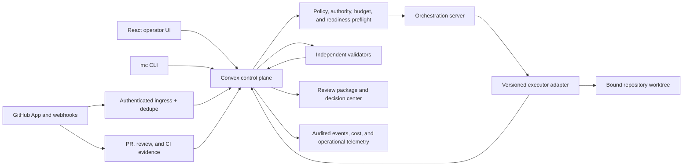
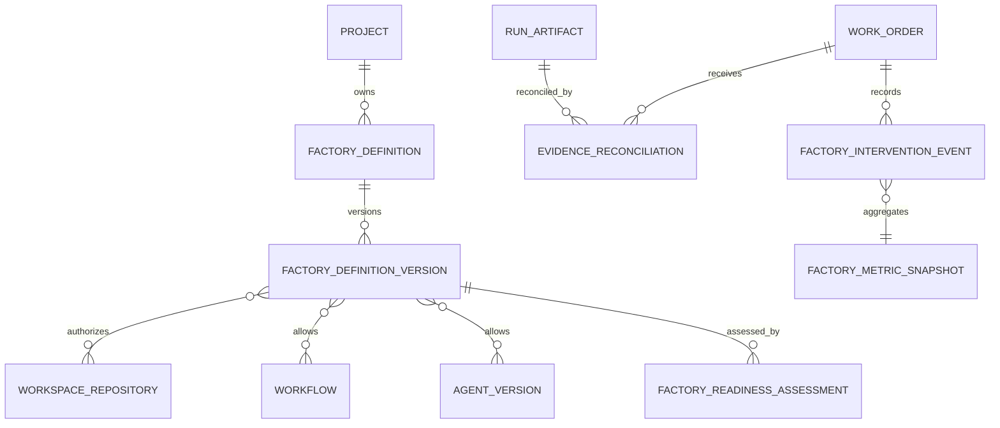

# AI Software Factory V1 Program Plan

## Executive decision

The supplied specification has the right product center: governed outcomes,
explicit human authority, independent validation, durable evidence, and a real
Mission-to-pull-request delivery path. Mission Control should implement that
center by extending the current system.

The specification should not be executed as one release. It currently combines
four programs:

1. the V1 governed software-delivery golden path;
2. enterprise administration and integration breadth;
3. a forward-deployed engineering operating suite; and
4. long-term factory optimization and progressive autonomy.

Trying to ship all four together would delay the sellable path and create
duplicate lifecycle, navigation, and data contracts. The recommended release
boundary is:

> One authenticated operator configures one GitHub-backed factory for one
> repository, creates and approves one Mission plan, lets one governed executor
> complete bounded work with at least one independently validated recovery
> cycle, and returns to a review-ready pull request with a complete evidence
> package. No direct database edits, hidden scripts, self-approval, or automatic
> merge are required to complete the journey.

Everything else in the specification remains on the roadmap, but it must earn
priority after this path is production-proven.

## Problem this solves

Mission Control already contains most of the control-plane primitives, but the
product still has uneven authority boundaries, mixed maturity levels, partial
external-service identity, and several overlapping operating surfaces. This
plan closes the gap between an impressive platform and a trustworthy product a
customer can use for real repository work.

The V1 user problem is simple:

> A developer or technical operator needs to delegate bounded software work
> without surrendering control, reconstructing evidence from logs, or wondering
> whether the system acted outside the approved scope.

## Review of the supplied specification

### What should be adopted

- Outcome-before-activity product positioning.
- Human authority proportional to risk.
- Separation between implementation and validation.
- Existing repositories, CI, and ticket systems remaining systems of record.
- Versioned, immutable approved WorkOrders.
- Evidence, cost, policy, and audit records linked to every material action.
- Progressive autonomy rather than a single autonomous/not-autonomous switch.
- UI operability for all critical paths.
- Incremental implementation that preserves existing functionality.
- A deterministic demo that illustrates, but does not replace, the real path.

### What must change before implementation

| Finding | Risk if implemented literally | Recommendation |
| --- | --- | --- |
| The scope spans V1, enterprise platform, FDE, analytics, and long-term autonomy | No coherent ship boundary | Use the release sequence in this plan and stop at each gate |
| The proposed domain omits `Task` and uses `Agent Run` where Mission Control already has Task, WorkflowRun, Attempt, Run, and artifact contracts | A second execution hierarchy | Preserve `Mission -> Plan -> WorkOrder -> Task -> Attempt/WorkflowRun -> evidence -> PR -> release` |
| `Workspace` is described as the tenant boundary | Conflicts with current `tenant/company -> project/workspace` authorization | Canonicalize Company/Tenant above Workspace/Project; do not add another workspace table |
| `Software Factory` is underspecified as an entity | A duplicate mutable source of truth for agents, policies, workflows, and repositories | Make Factory a thin, versioned configuration aggregate that references existing records |
| GREEN/YELLOW/RED is described as risk while existing records use LOW/MEDIUM/HIGH/CRITICAL and approval policy | Conflicting risk labels and migrations | Treat GREEN/YELLOW/RED as a derived governance band; retain granular risk severity |
| The API section assumes generic versioned endpoints | A parallel REST architecture beside Convex | Use typed Convex queries/mutations/actions and the existing Hono ingress only where a service boundary is required |
| The proposed navigation has thirteen top-level destinations | Recreates the current breadth problem | Keep the existing job-oriented EOS navigation and use tabs/drill-downs |
| Initial integrations include GitHub, GitLab, Jira, Linear, Slack, Jenkins, cloud, scanners, and observability | Connector breadth before one trusted path | Support GitHub first; allow manual Mission intake; add the next connector only after browser proof |
| The FDE module is presented as a minimum platform capability | Delays the first customer outcome and introduces sensitive customer-isolation work | Defer FDE workspaces until tenancy, evidence, and factory templates are proven |
| “Immutable audit trail” and “reasonable performance” are not operationally defined | Completion can be claimed without measurable proof | Define append-only application rules, export/reconciliation behavior, and provisional SLOs |
| Cancellation, webhook replay, partial external failure, and evidence mismatch are mentioned but not fully specified | The system can become stuck or falsely complete | Add explicit recovery, idempotency, reconciliation, and uncorrelated-evidence flows |

## Current-system assessment

This plan is based on the current branch at `21307ae`, the repository contracts,
recent browser evidence, and the active authority/lineage work in the worktree.
The historical UI assessment remains useful, but several of its P0 Mission
findings have since been addressed by the release-to-evidence and Clerk company
authorization work.

| Capability | Current posture | Program disposition |
| --- | --- | --- |
| Company identity and administration | Clerk human identity and company membership exist; demo mode is explicit | Keep; finish domain-level authorization and service identities |
| Company/workspace/repository boundary | `tenants`, `projects`, repository scopes, and host bindings exist | Keep as canonical; document terminology |
| Missions and versioned plans | First-class schema and UI path exist; approved plans can release WorkOrders | Keep and harden against real-repository execution |
| WorkOrders and revisions | Mature governed contract with revisions, supersession, events, approvals, and acceptance | Keep as authorization boundary |
| Tasks and attempts | Real task lifecycle and workflow execution exist | Keep as bounded operational execution; do not replace with `AgentRun` |
| Evidence and run inspection | Verification receipts, run events, artifacts, and inspector exist | Extend into one review package and external-evidence envelope |
| Approvals and separation of duties | First-class decisions exist; enforcement varies by domain and caller type | Consolidate and enforce server-side |
| Agent registry/model routing | Agent templates, versions, instances, identities, and model routing exist | Reuse; add adapter capability checks rather than new agent tables |
| Policies and budgets | Policy, governance, cost, quota, and control records exist | Reuse; connect them to preflight and progression gates |
| GitHub/CI lineage | GitHub ingestion and PR checks exist; exact-lineage hardening is active | Finish before live promotion; add reconciliation for unmatched evidence |
| Workflow definitions and runs | YAML/typed workflows and execution engine exist | Reuse; version and validate through Factory configuration |
| Deployments | Deployment records and UI exist | Keep separate from merge; productionize after the PR golden path |
| Factory configuration | Factory-style views exist, but no single versioned configuration aggregate | Add a thin aggregate only when its guided setup is implemented |
| Loop Engineering | Real cycle/automation foundations exist; primary route remains Preview | Finish authority/lineage, then add measured improvement features |
| Cost/outcome analytics | Data structures exist; some factory metrics remain proxy/demo or incomplete | Instrument facts before promoting dashboards |
| FDE engagement workspace | Missing as a coherent production domain | Defer beyond V1 |

### Existing records to reuse

Do not add parallel tables for concepts already represented by:

- `tenants`, `projects`, `workspaceRepositories`, and repository scopes;
- `missions`, `missionPlans`, `validationAssertions`, and `missionEvents`;
- `workOrders`, revisions, decisions, supersessions, and events;
- `tasks`, `workflowRuns`, `runs`, `runEvents`, and `runArtifacts`;
- `approvalDecisions`, `verificationReceipts`, and existing audit/event records;
- agent templates, versions, instances, identities, and model-routing decisions;
- `workflows`, automation definitions, context packages, policies, costs, and
  deployments.

### Institutional learning to apply

Convex schema and consumers must ship as one atomic contract. The existing
solution at `docs/solutions/build-errors/missing-convex-schema-contracts-ci-20260730.md`
shows that adding consumers before tables, fields, indexes, and generated types
causes both compile-time and deployed-data failures. Every schema-bearing PR in
this program must include schema-contract tests, codegen/typecheck, and an
idempotent migration or explicit proof that no migration is required.

## Canonical product and technical decisions

### 1. Authoritative hierarchy

```text
Company / Tenant
└── Workspace / Project
    └── Repository
        └── Software Factory configuration
            └── Mission
                └── Approved Plan
                    └── WorkOrder
                        └── Task
                            └── Attempt / WorkflowRun
                                ├── Run events and tool calls
                                ├── Artifacts and changed files
                                └── Verification evidence
Pull Request -> Merge -> Deployment -> Activation -> Production Verification
```

Each level owns a distinct decision. Completion at one level never silently
completes its parent or authorizes the next level.

### 2. Software Factory contract

A Software Factory is configuration, not a second orchestration lifecycle. It
references:

- one workspace and one or more explicitly authorized repositories;
- allowed Mission/workflow types;
- approved agent/executor versions and capability requirements;
- repository, host, environment, tool, secret, and network scopes;
- risk/governance, approval, quality, cost, retry, and runtime policies;
- required verifiers and evidence;
- activation status and immutable configuration versions.

V1 supports one mutating repository target per Mission and one active mutating
factory improvement per repository. Multi-repository Missions are deferred.

### 3. Lifecycle compatibility

Do not perform a broad state rename. Map the specification's recommended states
onto current Mission and WorkOrder states through explicit transition adapters
and UI language. New transitions remain server-owned, idempotent, audited, and
policy-validated.

### 4. Governance bands

- **GREEN:** low-risk, reversible, bounded work. It may execute after policy
  preflight but still requires evidence. V1 prepares a PR; it does not auto-merge.
- **YELLOW:** plan approval and human merge approval are required. Execution may
  proceed autonomously inside the approved WorkOrder.
- **RED:** explicit plan approval, restricted executor/tools, independent
  validation, mandatory rollback package, and human release authority.

The band is derived from risk evidence and policy version. It does not replace
the existing granular risk level.

### 5. Interface boundary

- The React UI uses typed Convex functions for product state.
- CLI operations call the same authoritative Convex commands.
- The orchestration server owns agent routing and execution coordination.
- Webhooks, agents, schedulers, and bridges use authenticated service commands
  or internal functions, never borrowed human sessions.
- Provider adapters contain provider behavior only; product policy remains in
  the control plane.

## Target architecture



### Target entity additions

Only add these when their phase begins:



- `factoryDefinitions` and `factoryDefinitionVersions`: stable identity plus
  immutable configuration versions.
- `factoryReadinessAssessments`: versioned read-only readiness results with
  check status, evidence, freshness, remediation, and dependency/root blocker.
- `evidenceReconciliations`: append-only operator decisions for valid but
  uncorrelated PR/CI/review/deployment evidence.
- `factoryInterventionEvents` and `factoryMetricSnapshots`: post-V1 factual
  telemetry; never infer historical events from prose.

Do not add a generic `AgentRun`, `Integration`, `Approval`, `Policy`, or
`CostLedger` table unless a later assessment proves the current contracts
cannot express the required behavior.

## Complete user flows

### Flow 1 — Company, workspace, and GitHub bootstrap

1. An authenticated owner selects or creates a company workspace.
2. The owner installs the Mission Control GitHub App for an explicit repository.
3. Mission Control verifies installation identity, least-privilege permissions,
   webhook signature configuration, and repository access.
4. Missing or excessive permissions produce a blocked readiness item with exact
   remediation.
5. The connection persists across refresh and token renewal without exposing a
   credential value.

### Flow 2 — Configure and activate a factory

1. The operator selects a repository, workflow type, executor, policy bundle,
   budget, and required validators.
2. Mission Control saves a draft factory version.
3. Readiness checks validate repository access, reproducible setup, host/sandbox,
   credentials, tools, context, verification, PR, and recovery capabilities.
4. The operator resolves, waives with authority, or marks checks not applicable.
5. Only a passing version can be activated. Later material changes create a new
   version and may require re-certification.

### Flow 3 — Define, plan, and approve a Mission

1. An operator enters the outcome, business reason, constraints, sources,
   repository scope, stop condition, budget, risk hints, and measurable criteria.
2. A research/planning agent produces cited findings, explicit unknowns, a plan,
   WorkOrder blueprints, dependencies, validation assertions, and rollback.
3. The operator reviews a human-readable diff, comments, rejects, or requests a
   revision.
4. A different authorized identity approves when separation of duties applies.
5. One server-owned idempotent command freezes the approved revision and
   materializes WorkOrders exactly once.

### Flow 4 — Preflight, execute, and recover

1. Before repository mutation, preflight resolves authority, factory version,
   WorkOrder version, repository, branch/worktree, executor, tools, secrets,
   network, capacity, runtime, policy, budget, and required evidence.
2. A Task and immutable Attempt are created under the released WorkOrder.
3. The executor emits structured events, artifacts, cost, and heartbeats.
4. A failed check records classification, diagnostics, hypothesis, and remaining
   recovery budget.
5. A retry is allowed only when it differs from the failed attempt based on new
   evidence. Otherwise the WorkOrder becomes blocked with a decision packet.
6. Pause, cancel, handoff, timeout, lease loss, and restart preserve partial work
   and revoke or retain authority according to policy.

### Flow 5 — Validate, open a PR, and decide

1. The executor creates a PR artifact with exact WorkOrder, Attempt, repository,
   branch, head SHA, and PR identity.
2. GitHub webhooks and CI results are signature-verified, deduplicated, and
   correlated using exact lineage.
3. Independent validators evaluate every frozen assertion against the current
   commit and environment.
4. Failed, stale, unknown, missing, or contradictory evidence blocks acceptance.
5. The review package shows objective, approved plan, deviations, changed files,
   decisions, criteria, evidence, cost, risk, uncertainty, reviewer focus, and
   rollback.
6. The operator accepts, rejects, or requests corrective work. Merge remains a
   separate GitHub/human decision in V1.

### Flow 6 — Release, verify, and roll back

This is V1.1, after the PR golden path ships.

1. A merged commit becomes eligible for a configured non-production deployment.
2. Deployment, activation, and production verification remain distinct states.
3. Health checks and the monitoring window determine retain, disable, or
   rollback recommendation.
4. Any automatic disable/rollback must be explicitly authorized by policy and
   must produce a reviewable rollback package.

### Flow 7 — Improve the factory

This is a bounded post-V1 loop.

1. Repeated corrections, incidents, regressions, cost outliers, or readiness
   blockers produce factual signals.
2. Signals may be clustered into one recommendation with visible provenance.
3. Acceptance creates a governed experiment, never a direct production change.
4. The experiment requires baseline, target, quality floor, budget, owner,
   stop condition, measurement window, and rollback trigger.
5. The outcome is Effective, Ineffective, or Regressed, followed by retain,
   revise, roll back, retire, or re-certify.

## Flow permutations and required states

| Dimension | Required behavior |
| --- | --- |
| Signed out / no membership | No workspace data; explicit sign-in or provisioning state |
| Viewer / Developer / Approver / Admin | Server-enforced read and mutation permissions; UI affordances match but do not grant authority |
| Human / scheduler / webhook / agent | Separate authenticated authority paths with attributable actor type and ID |
| First-time / returning | Guided setup first; resumable factory/Mission state afterward |
| GREEN / YELLOW / RED | Different approval, executor, validator, evidence, and release gates |
| Healthy / degraded / disconnected GitHub | Normal execution, retryable block, or explicit connection remediation |
| Exact / ambiguous / absent external lineage | Auto-correlate exact only; ambiguous and absent remain in reconciliation |
| Successful / failed / stale / conflicting evidence | Progress only on current passing evidence or authorized scoped waiver |
| Duplicate webhook or mutation | Idempotent replay returns prior result without duplicate effects |
| Slow/offline browser | Durable server action, pending state, safe retry, no double submission |
| Executor crash / control-plane restart | Lease expiry, recovery or escalation, preserved attempt and artifacts |
| Concurrent repository mutation | One writer per repository/worktree scope in V1; clear queued blocker |
| Cancellation during external action | Stop new work, attempt provider cancellation, reconcile late provider events |
| Untrusted issue, document, or repository content | Mark as data, not instruction; restrict tool authority and redact sensitive output |
| Desktop / narrow viewport / keyboard / reduced motion | Same decision path, accessible labels, non-color status, stable focus, no hidden primary action |

## Implementation phases

### Phase 0 — Consolidated existing-system assessment and decisions

**Goal:** establish a current, authoritative baseline before another major
implementation batch.

- [ ] Create `docs/mission-control-existing-system-assessment.md` as the
  specification requests, but consolidate rather than duplicate the existing
  capability map, UI audit, verification receipts, and current code state.
- [ ] Inventory routes, maturity, schemas, public/internal functions, UI views,
  workflows, CLI commands, integrations, tests, and current golden path.
- [ ] Mark each capability Complete, Partial, Missing, Duplicated, Obsolete, or
  Preview/Demo-only and cite evidence.
- [ ] Publish one glossary and lifecycle mapping for Company, Workspace,
  Repository, Factory, Mission, Plan, WorkOrder, Task, Attempt, evidence, PR,
  deployment, and verification.
- [ ] Record the Product Owner decisions listed below as ADRs or a decision log.
- [ ] Establish provisional latency, retention, evidence freshness, and recovery
  targets from a measured baseline.

**Exit gate:** the assessment reflects the current branch, not the July 28
baseline, and no unresolved naming decision can create a new table or route.

### Phase 1 — Complete the authority and exact-lineage trust gate

**Goal:** prevent unauthorized mutation and false correlation before adding
new execution or telemetry.

This phase is already active in the current worktree under
`todos/018-ready-p1-harden-harness-authority-lineage.md`.

- [ ] Finish server-derived actor identity for all Loop, Mission, WorkOrder,
  Task, approval, evidence, automation, and release mutations on the golden path.
- [ ] Move scheduler, webhook, Pi bridge, and executor callers to authenticated
  service/internal command boundaries before guarding equivalent human calls.
- [ ] Enforce company/workspace/repository scope and named permissions on every
  golden-path query and mutation.
- [ ] Enforce separation of duties for plan author/approver, worker/validator,
  waiver approver, and release authority where policy requires it.
- [ ] Add safe denied-action audit events.
- [ ] Finish exact PR lineage and keep unmatched evidence explicitly uncorrelated.
- [ ] Keep Loop Engineering at Preview until real Clerk and cross-company browser
  evidence, service ingress, and denied-action audit pass.

**Primary areas:** `convex/lib/companyAccess.ts`, human/service authorization
boundaries, `convex/missions.ts`, `convex/workOrders.ts`, Task transitions,
evidence ingestion, GitHub/PR correlation, route capability metadata, and
focused denial tests.

**Exit gate:** a client-supplied actor or cross-workspace ID cannot read, mutate,
approve, correlate, or accept work; legitimate service execution still works.

### Phase 2 — GitHub App connection, Factory definition, and readiness

**Goal:** make one repository provably ready before dispatch.

- [ ] Select GitHub App installation tokens as the V1 repository identity; use
  the minimum permissions for repository contents, pull requests, checks, and
  required webhook events.
- [ ] Validate `X-Hub-Signature-256` before parsing or processing webhook data;
  persist delivery ID, event/action, repository, installation, received time,
  result, and replay state.
- [ ] Add Factory definition/version schema as an aggregate over existing
  repositories, workflows, agents, policies, environments, budgets, and verifiers.
- [ ] Add the smallest guided UI: repository, workflow, executor, governance,
  budget, validators, validate, activate.
- [ ] Add read-only readiness checks for repository access, reproducible setup,
  CLI/API operability, sandbox/host binding, scoped identity/secrets, logs,
  context, independent verification, PR integration, and recovery.
- [ ] Show Verified, Missing, Stale, Waived, or Not applicable with evidence,
  checked time, expiry, remediation, and root dependency blocker.
- [ ] Re-run only affected or stale checks after a configuration change.
- [ ] Mark material factory, model, runtime, workflow, or policy changes as
  revalidation required.

**Exit gate:** an operator can activate one versioned factory for one repository,
and unsafe dispatch fails closed with an exact, actionable explanation.

### Phase 3 — Real Mission-to-PR execution path

**Goal:** move the existing release-to-evidence capability from a controlled
fixture into a real sandbox repository path.

- [ ] Preserve the current Mission plan, assertion, WorkOrder release, Task, and
  evidence contracts; fill only missing UI and service boundaries.
- [ ] Define a stable executor adapter contract for capabilities, configuration
  validation, estimate, execute events, cancel, optional resume, and health.
- [ ] Support one initial executor/runtime selected by the Product Owner.
- [ ] Bind every attempt to factory version, WorkOrder version, repository,
  branch/worktree, host, executor, model route, tools, and policy decision.
- [ ] Use one server-owned dispatch command for UI, CLI, and orchestration.
- [ ] Enforce one active mutating attempt per repository scope in V1.
- [ ] Create branches and PRs through the GitHub App identity; never store tokens
  in product records or telemetry.
- [ ] Preserve exact plan-versus-change deviations and changed-file scope.
- [ ] Produce a real pull request in a sandbox/test repository without direct DB
  actions or developer-only scripts.

**Exit gate:** one browser-created Mission reaches an exact, review-ready PR in
a real authorized sandbox repository with complete lineage.

### Phase 4 — Durable execution, recovery, and overnight control

**Goal:** make delegated work safe when humans and processes are absent.

- [ ] Add or complete durable claim leases, heartbeats, lease expiry, bounded
  retry, pause, resume, cancel, timeout, handoff, and dead-letter/reconciliation.
- [ ] Classify failure as requirements, policy, environment, dependency, tool,
  code, test, flaky test, merge conflict, provider rate limit, budget, or
  infrastructure.
- [ ] Require diagnostic evidence and a new hypothesis before retrying the same
  failed action.
- [ ] Preserve partial artifacts and make late provider events safe after cancel.
- [ ] Add operator-defined unattended windows, eligible WorkOrders, concurrency,
  spend, retry, duration, and escalation limits.
- [ ] Add a concise morning briefing for completed work, review-ready PRs,
  recoveries, blocked decisions, spend, and remaining risk.
- [ ] Prove control-plane restart and executor crash behavior with deterministic
  integration tests.

**Exit gate:** a forced executor crash and control-plane restart recover or
escalate without duplicate repository mutation, lost evidence, or exceeded
authority.

### Phase 5 — Independent evidence, review package, and cost truth

**Goal:** let a reviewer decide without reconstructing work from activity logs.

- [ ] Normalize evidence for commands, tests, builds, CI, code review, security,
  performance, accessibility, UI captures, APIs, and manual verification.
- [ ] Store producer/verifier identity, factory/WorkOrder/Attempt version,
  repository/commit/environment, artifact hash, created/fresh-until times,
  criterion, result, confidence, and source location.
- [ ] Define Pass, Fail, Stale, Unknown, Waived, Not applicable, and Conflicting
  semantics in one evaluator.
- [ ] Require expiring, scoped waivers with approver, reason, compensating
  control, and affected gate.
- [ ] Add an uncorrelated evidence inbox with candidates and exact match/mismatch
  explanations. Reconciliation creates an immutable decision artifact and never
  silently rewrites history.
- [ ] Generate the review package from durable records, not a final agent summary.
- [ ] Reconcile estimated and actual cost by Mission, WorkOrder, Attempt, provider,
  model/service, and accepted outcome.
- [ ] Keep PR acceptance, merge, deployment, activation, and production
  verification as separate decisions.

**Exit gate:** missing, stale, conflicting, self-produced-only, or uncorrelated
evidence cannot be displayed as completed or accepted.

### Phase 6 — V1 release hardening and browser proof

**Goal:** earn the production claim for one complete path.

- [ ] Build deterministic fixtures for success, approval rejection/revision,
  authorization denial, readiness block/recovery, failed validation/correction,
  webhook replay, uncorrelated evidence, executor crash/restart, budget stop,
  cancellation, and final acceptance.
- [ ] Run the golden path through the UI at `http://localhost:5199` using the
  main-repository demo stack and a safe GitHub sandbox.
- [ ] Verify loading, empty, partial, stale, error, unauthorized, blocked,
  recovery, success, cancel, and retry states.
- [ ] Verify refresh, back/forward, deep links, workspace switching, and process
  restart without losing scope or state.
- [ ] Verify desktop and narrow viewports, dark and light themes, keyboard,
  focus, reduced motion, target sizes, and WCAG 2.2 A/AA automated checks.
- [ ] Capture console, page-error, failed-request, screenshot, trace, test, and
  audit evidence.
- [ ] Update setup, architecture, domain, lifecycle, workflow, adapter,
  integration, security, demo, and deployment documentation to actual behavior.
- [ ] Remove or visibly label demo/proxy fallbacks from every live route and
  metric on the path.

**V1 ship gate:** the full journey works with real scoped data, authorization,
audit, failure/recovery, refresh/restart durability, and deterministic browser
evidence. No direct database mutation or hidden operational bypass is required.

### Phase 7 — Governed deployment and operational hardening (V1.1)

**Goal:** extend trust from review-ready PR to verified production outcome.

- [ ] Add environment promotion policies and release approvals.
- [ ] Support deployment observation first; add provider mutation only after
  authorization and rollback contracts are proven.
- [ ] Add feature-flag, limited-cohort, health-window, smoke-test, disable, and
  rollback decisions.
- [ ] Generate a rollback package containing exact version, dependent config,
  commands/actions, verification steps, evidence, and recovery owner.
- [ ] Add OpenTelemetry-compatible trace correlation across ingress, control
  plane, orchestration, executor, provider actions, and evidence. Store business
  IDs as controlled attributes; do not propagate secrets or sensitive context
  through baggage.
- [ ] Establish operational SLOs and alerts for stuck work, integration health,
  evidence freshness, policy denial, high retry, budget exhaustion, and system
  error rate.

**Exit gate:** merged, deployed, activated, and verified remain independently
auditable, and rollback is browser-operable.

### Phase 8 — Measured factory improvement features

**Goal:** improve the factory without creating a self-authorizing system.

Implement in this order:

1. intervention recorder and weekly operator-attention budget;
2. improvement experiment decision packet with baseline, quality floor, stop,
   measurement, and rollback;
3. shadow cohorts and clearly labeled counterfactual estimates;
4. capability graph and blast-radius preview using Registry/graph data;
5. model/runtime/policy drift re-certification;
6. factory incident review and rollback package generation;
7. outcome economics with confidence and coverage.

Do not build an opaque factory score, self-promotion, self-approval, automatic
high-risk merge, token/agent leaderboards, or historical intervention backfills
inferred from text.

### Phase 9 — FDE and scale (post-V1)

Only begin after the V1 ship gate and at least one stable operating window.

- [ ] Add customer engagement objectives, stakeholders, process discovery,
  exception mapping, ROI assumptions, and rollout status.
- [ ] Isolate customer configuration, credentials, data, and extension versions.
- [ ] Promote customer work into reusable primitives only through reviewed,
  versioned candidates.
- [ ] Add Jira or Linear as the second intake connector based on actual customer
  demand; do not add both by default.
- [ ] Add multi-repository campaigns as child experiments with independent
  authority, evidence, measurement, and rollback.
- [ ] Add connector/evidence adapter SDK contracts for authorization, retention,
  redaction, replay, idempotency, and provenance.

## Recommended pull-request sequence

Each PR must be independently reviewable, reversible through a flag or additive
contract, and leave the application runnable.

1. **`docs(factory): publish current system assessment and canonical contracts`**
   - Phase 0 only; no runtime behavior.
2. **`fix(factory): finish golden-path authority and exact lineage`**
   - Complete the active authority/lineage todo; no new metrics or builder.
3. **`feat(factory): add GitHub App readiness and signed ingress`**
   - Connection health, least privilege, webhook signature/dedupe, no dispatch.
4. **`feat(factory): add versioned factory configuration and activation`**
   - Thin aggregate, readiness UI, validation, no execution rewrite.
5. **`refactor(execution): establish authenticated service commands and adapter contract`**
   - Separate human and service authority; contract tests; no second lifecycle.
6. **`feat(execution): run one governed Mission against a sandbox repository`**
   - Preflight, worktree, executor, branch, exact PR artifact.
7. **`feat(execution): add durable recovery and unattended controls`**
   - Leases, heartbeats, retry, pause/cancel, crash/restart evidence.
8. **`feat(evidence): ship unified gates, reconciliation, and review package`**
   - Criterion evidence, conflicts, waivers, PR/CI/review package, cost.
9. **`test(factory): prove the production golden path in the browser`**
   - State matrix, accessibility, refresh/restart, security, docs, screenshots.
10. **`feat(release): add governed deployment and rollback package`**
    - V1.1 only after PR 9 passes.
11. **`feat(factory): record interventions and measured experiments`**
    - Post-baseline improvement loop; no self-promotion.

Do not combine PRs 2 through 9. Authorization, external ingress, configuration,
execution, durability, and evidence failures have different rollback and review
requirements.

## Delivery capacity and sequencing

- Use one primary implementation stream through PR 8. The domain and authority
  contracts are too coupled to support competing backend implementations.
- The Product Owner approves the eight program decisions and each phase exit.
- A security reviewer is required for authority, GitHub ingress, service
  identity, secret handling, and RED governance changes.
- An independent validator/reviewer owns the Phase 6 release evidence; the
  implementation worker cannot be the only certifier.
- UI, focused tests, documentation, and migration preparation may proceed in
  parallel only after the relevant server contract is frozen.
- Set calendar estimates after Phase 0 measures the remaining gaps at the
  current branch. Track delivery by accepted PR gates, not percentage-complete
  estimates across the entire program.

## Acceptance criteria

### Functional

- [ ] An authenticated user can configure one active factory entirely in the UI.
- [ ] A user can create, revise, approve, release, execute, recover, validate,
  and review one Mission without direct database actions.
- [ ] The path produces one exact GitHub PR and a complete review package.
- [ ] A rejected plan and failed validator produce bounded revision paths.
- [ ] Pause, resume, cancel, retry, handoff, and crash recovery are operable.
- [ ] Uncorrelated external evidence remains unresolved until an audited human
  decision is made.

### Authorization and security

- [ ] Company, workspace, repository, environment, action, tool, and secret scope
  are enforced server-side.
- [ ] Human, webhook, scheduler, and agent authority are distinct and attributable.
- [ ] Cross-company IDs fail closed without leaking record existence.
- [ ] Worker, validator, approver, waiver, merge, and release duties are separated
  according to the active policy version.
- [ ] GitHub App permissions are minimal and webhook signatures/replays are tested.
- [ ] Untrusted external content cannot expand tool authority or become executable
  instruction merely because an agent retrieved it.
- [ ] Secrets and sensitive content are redacted from logs, traces, evidence, and
  exported review packages.

### Evidence and truthfulness

- [ ] Every completion claim maps to current criterion-level evidence.
- [ ] Evidence identifies producer, verifier, commit, environment, artifact hash,
  freshness, source, and governing versions.
- [ ] Unknown, stale, conflicting, waived, synthetic, demo, and not-applicable
  states are visibly distinct.
- [ ] A worker cannot be the only validator for its material change.
- [ ] Fixture or proxy data cannot enter live metrics or maturity claims.
- [ ] Historical decisions, failures, supersessions, and rollbacks are preserved.

### Reliability

- [ ] Creation and external-ingress commands are idempotent.
- [ ] Duplicate webhook delivery cannot duplicate a transition, artifact, cost,
  comment, check, branch, or PR.
- [ ] Browser refresh and backend/executor restart cannot corrupt active work.
- [ ] Cancellation stops new work and reconciles late provider events.
- [ ] Retry requires classified failure, new evidence/hypothesis, and remaining
  budget.
- [ ] One active mutating attempt per repository scope is enforced in V1.

### UX and accessibility

- [ ] Exceptions, required decisions, risk, missing evidence, safe options, and
  recovery appear before routine activity.
- [ ] One primary action exists per decision area.
- [ ] All required loading, empty, partial, error, permission, blocked, recovery,
  success, canceled, and stale states are implemented.
- [ ] URLs preserve company, workspace, entity, tab, and filter scope.
- [ ] Critical journeys pass dark/light, keyboard, narrow viewport, reduced
  motion, and WCAG 2.2 A/AA checks.

### Non-functional provisional targets

These must be confirmed or adjusted after Phase 0 measurement:

- [ ] First useful content on critical operator routes within 2.5 seconds at the
  agreed production test profile.
- [ ] Normal control-plane mutations acknowledge within 750 ms p95, excluding
  declared external-provider execution time.
- [ ] List and event queries paginate; no critical view requires loading an
  unbounded history.
- [ ] A 10,000-event Mission timeline remains operable through pagination or
  virtualization.
- [ ] Audit/evidence retention, redaction, and deletion behavior are documented
  per data class before external customer data is accepted.

## Verification strategy

### Contract and unit tests

- lifecycle transitions and invalid-state rejection;
- factory version immutability and activation;
- risk-to-governance-band mapping;
- company/workspace/repository permissions and separation of duties;
- service-command authentication and scope;
- dispatch idempotency, lock/lease ownership, retry budgets, and cancellation;
- webhook HMAC validation, delivery dedupe, replay, and late-event handling;
- exact lineage and ambiguous/unmatched evidence behavior;
- evidence freshness, conflict, waiver, validator independence, and gates;
- cost estimate/actual reconciliation and budget hard stops;
- schema contracts and migrations.

### Integration tests

- Clerk identity to Convex company/workspace authorization;
- GitHub App installation token renewal and permission failure;
- Mission approval to idempotent WorkOrder release;
- WorkOrder dispatch to Task/Attempt and executor adapter;
- executor crash, lease expiry, restart, and preserved artifacts;
- branch/PR/check/review webhook chain with exact head SHA;
- failed validation to bounded corrective work;
- acceptance package generation from durable records;
- cancel during an external operation followed by late webhook delivery.

### Browser journeys

1. first-time company/workspace/repository/factory setup;
2. missing GitHub permission and successful remediation;
3. Mission draft, plan rejection, revision, approval, and WorkOrder release;
4. preflight block and successful retry after readiness repair;
5. execution failure, classified recovery, independent validation, and PR;
6. stale or conflicting evidence blocks acceptance;
7. uncorrelated PR evidence reconciliation;
8. budget stop, pause/resume, cancellation, and restart;
9. final review package and acceptance;
10. cross-company and insufficient-role denial without data leakage.

### Release evidence

For each critical journey capture:

- test command and result;
- exact commit and configuration versions;
- screenshot and Playwright trace;
- console, page-error, and failed-request report;
- audit/decision/event identifiers;
- external provider identifiers with secrets redacted;
- known limitations and rollback path.

## Success metrics

### V1 ship metrics

- 100% of golden-path steps operable through the UI.
- 0 direct-database or hidden-script steps.
- 0 client-supplied actor authority decisions.
- 0 cross-company authorization findings.
- 100% of WorkOrder criteria are Pass, Fail, Stale, Unknown, Waived, Conflicting,
  or Not applicable; none are implicit.
- 100% of approvals/waivers retain identity, authority, reason, time, scope, and
  policy version.
- 100% of PR and CI evidence on the path has exact repository/head lineage or is
  visibly uncorrelated.
- 0 critical accessibility violations in the release journeys.

### Product outcome metrics after a stable baseline window

- approved-plan-to-review-ready-PR time;
- first-pass criterion and independent-validation pass rates;
- zero-correction and manual-takeover rates;
- operator attention minutes and time to unblock;
- recovery success and repeated-failure rates;
- cost per accepted WorkOrder;
- evidence completeness and freshness;
- defect escape, regression, and rollback rates;
- developer review time and trust score.

Do not use token count, number of agents, lines generated, raw comments, or PR
volume as success metrics.

## Risks and mitigations

| Risk | Mitigation |
| --- | --- |
| Program breadth prevents launch | Enforce phase and PR exit gates; defer FDE and connector breadth |
| A new Factory model duplicates current sources | Thin reference-only aggregate with immutable versions |
| Authorization breaks service execution | Split human and service commands before applying guards |
| External events falsely complete work | Exact lineage, signature validation, dedupe, freshness, and reconciliation |
| Worker self-certifies | Independent validator identity and server-enforced gate |
| Repeated retries burn money or corrupt work | Failure taxonomy, new-hypothesis rule, lock, retry/runtime/cost budgets |
| Convex schema drift breaks deployed data | Atomic schema/consumer PRs, codegen, migration tests, critical-pattern rule |
| Demo success is mistaken for product readiness | Data-origin labels and a real sandbox GitHub journey |
| Prompt injection expands agent authority | Treat retrieved content as untrusted data; fixed tool/policy envelope |
| Audit history is silently changed | Append-only commands, supersession, reconciliation artifacts, export checks |
| Metrics create false confidence | Version, denominator, coverage, freshness, source drill-down, Unknown by default |
| Navigation grows with every capability | Existing route maturity registry and drill-down/tab rule |

## Alternatives considered

### Rebuild around the supplied domain model

Rejected. Mission Control already has mature Mission, WorkOrder, Task,
execution, approval, evidence, agent, workflow, policy, and deployment records.
A rebuild would add migration risk without improving the customer outcome.

### Add every proposed page and integration first

Rejected. Breadth does not prove governed delivery. It increases permissions,
error states, and operational surface before the central path is trustworthy.

### Keep Factory implicit forever

Rejected. A sellable product needs a versioned statement of which repositories,
agents, workflows, policies, budgets, and validators are active. The Factory
aggregate is valuable once it remains thin and references existing records.

### Build a REST API before the product path

Rejected. Convex is the source of truth and already provides typed, reactive
commands. Add Hono endpoints only for authenticated service ingress that Convex
cannot receive directly.

### Auto-merge GREEN work in V1

Rejected. V1 should prove safe PR preparation and evidence. Auto-merge adds
authority and rollback risk without being necessary for the first customer
outcome.

## Product Owner decisions required before implementation expands

Recommended defaults are shown first.

1. **V1 Git provider:** GitHub only (recommended), or GitHub plus GitLab.
2. **Initial executor:** choose exactly one production-supported runtime and one
   fallback/simulated adapter for deterministic tests.
3. **Merge authority:** human merge only in V1 (recommended), or allow a narrow
   GREEN auto-merge policy.
4. **RED execution:** permit sandboxed implementation with explicit approval
   (recommended), or limit Mission Control to planning/review for RED work.
5. **Evidence retention:** define default customer retention periods, export,
   legal hold, redaction, and deletion behavior.
6. **Uncorrelated evidence owner:** Approver/Reviewer (recommended for V1) or a
   new Evidence Steward role.
7. **Production outcome source:** choose the authoritative source for defect
   escapes, incidents, and rollbacks before outcome analytics ship.
8. **Second connector after GitHub:** choose from actual customer demand; do not
   commit to Jira and Linear simultaneously.

## Documentation deliverables

- `docs/mission-control-existing-system-assessment.md`
- canonical glossary and lifecycle mapping
- Factory definition/version contract
- agent/executor adapter contract
- GitHub App permissions, webhook, replay, and recovery guide
- human/service authorization matrix updated to enforced status
- evidence envelope, freshness, waiver, and reconciliation contract
- failure taxonomy and recovery runbook
- cost/budget contract
- V1 demo and real-sandbox setup
- deployment/rollback guide for V1.1
- release verification report and browser evidence index

Documentation must describe actual implemented behavior and route maturity. It
must not present Preview, Demo, proxy, or synthetic behavior as Live.

## External standards and primary references

- [NIST Secure Software Development Framework SP 800-218](https://csrc.nist.gov/pubs/sp/800/218/final) for outcome-based secure development practices.
- [NIST SP 800-218A](https://csrc.nist.gov/pubs/sp/800/218/a/final) as the generative-AI secure-development profile.
- [SLSA v1.2 provenance](https://slsa.dev/spec/v1.2/provenance) as a compatible direction for verifiable artifact provenance; V1 should not claim a SLSA level it has not independently met.
- [GitHub App permissions](https://docs.github.com/en/apps/creating-github-apps/registering-a-github-app/choosing-permissions-for-a-github-app) for least-privilege installation design.
- [GitHub webhook validation](https://docs.github.com/en/webhooks/using-webhooks/validating-webhook-deliveries) for HMAC verification and tamper detection.
- [OpenTelemetry context and propagation](https://opentelemetry.io/docs/specs/otel/context/api-propagators/) for cross-process telemetry correlation.
- [OpenTelemetry baggage security considerations](https://opentelemetry.io/docs/concepts/signals/baggage/) for avoiding sensitive context propagation.

## Immediate next step

Do not start a broad new implementation program yet.

1. Finish and review the active Phase 1 authority/lineage slice.
2. Approve or revise the eight Product Owner decisions above.
3. Create the consolidated current-system assessment at the current branch.
4. Start only PR 3: GitHub App readiness and signed ingress.

The FDE module, additional connectors, outcome dashboards, and self-improvement
features should wait until the V1 browser ship gate passes.
