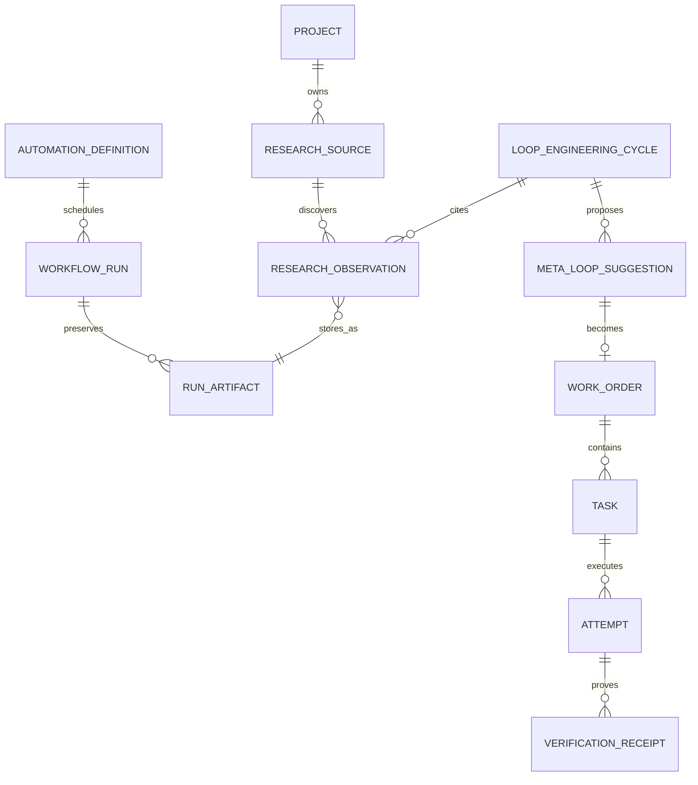

# Governed Continuous Learning for the Software Factory

## Executive Summary

Build a continuous research and improvement capability that monitors an
operator-approved list of X accounts, YouTube creators, and websites; preserves
source provenance; extracts and independently verifies claims; recommends
bounded improvements; implements only approved work; measures the result; and
uses that result to propose the next cycle.

This is a constrained recursive improvement loop, not an autonomous
self-modifying agent. Continuous collection and analysis may run unattended
inside explicit source, cost, and time limits. No external content can authorize
an action. No recommendation can approve itself. Every repository change must
use the existing authoritative hierarchy:

`Mission -> WorkOrder -> Task -> Attempt -> evidence -> pull request -> release`

## Current Research Lab Status

The Research Lab is not complete. The live board verified on 2026-08-08 shows:

- 159 total Tasks and 9% completion;
- 48 Inbox Tasks, many of which are legacy or synthetic browser-evidence
  records requiring a separate hygiene decision;
- `SFRL-108` in Review with a seven-source research packet;
- `SFRL-111` and `SFRL-112` Ready as bounded research retries; and
- `SFRL-113` Ready for independent landscape verification.

The current WorkOrder also has a semantic scope conflict: its desired outcome
is an accessibility audit while the active child research objective concerns
Task Attempt scheduling and reasoned retry. Continuous scheduling must not be
enabled until WorkOrder-to-Task semantic scope is validated, not merely linked
by ID.

## Problem Statement

Mission Control already has most of the delivery and learning primitives:

- durable WorkOrders, Tasks, Attempts, workflow runs, events, artifacts, and
  verification receipts;
- Loop Engineering cycles with sources, claims, recommendations, approval,
  validation, measurement, and bounded next-cycle creation;
- Meta Loop suggestions that become governed work rather than direct changes;
- reviewed automation definitions and scheduled draft creation; and
- evidence lineage through pull request, verification, and measurement.

What is missing is a production-grade intake layer for operator-selected
external sources and a deterministic handoff from new observations to a
governed Loop Engineering cycle. Without that layer, research is manual,
provider constraints are not enforced consistently, repeated content can create
duplicate work, and untrusted web content can enter an agent context without a
clear isolation contract.

## Product Outcome

An operator can add a creator or website to a Research Watchlist, choose a
schedule and budget, and then receive an exception-first decision packet when
new, independently verified evidence suggests a material Software Factory
improvement. Accepting a recommendation creates a normal Mission or WorkOrder.
After implementation and verification, a measured result either closes the
cycle or proposes one bounded next cycle.

## V1 Product Decisions

1. Call the capability **Continuous Learning** in the UI. Describe recursive
   improvement as the measured operating loop; do not market it as unrestricted
   RSI.
2. Extend Loop Engineering, Meta Loop, Automations, and the evidence model. Do
   not create a second Task lifecycle or a separate self-improvement product.
3. Automate read-only discovery and evidence preparation first. Keep source
   approval, recommendation acceptance, repository mutation, policy changes,
   skill promotion, merge, and release under existing governance.
4. Treat every X post, video description, transcript, webpage, feed item, and
   embedded instruction as untrusted data.
5. Use official provider APIs or standards-compliant feeds. Do not ship browser
   scraping or `yt-dlp` as the production ingestion contract.
6. Start with one workspace and one repository: Software Factory Research Lab
   improving Mission Control.

## Goals

- Let the operator manage an allowlisted source watchlist.
- Discover only new or changed material using provider cursors and content
  hashes.
- Preserve canonical URL, provider ID, author, publication time, retrieval
  time, content hash, adapter version, and policy/retention metadata.
- Quarantine external content from privileged tools and instructions.
- Produce source-linked claims, conflicts, limitations, and recommendations.
- Require independent evidence verification before a recommendation can be
  accepted.
- Convert accepted recommendations into governed Missions or WorkOrders.
- Measure whether each implemented improvement was effective, ineffective, or
  regressed.
- Create at most one idempotent next-cycle proposal when the measurement or
  freshness policy warrants it.
- Provide pause, drain, source disable, global kill, budget, and stale-run
  recovery controls.

## Non-Goals

- Unbounded autonomous research or implementation.
- Self-approval, self-merge, self-release, or silent policy promotion.
- Training or fine-tuning models directly from collected creator content.
- Republishing full posts, videos, transcripts, or copyrighted pages.
- Scraping captions from creators the operator does not own or control.
- Monitoring private accounts, private videos, authenticated websites, direct
  messages, comments, or personal viewing behavior in V1.
- Ranking creators or optimizing for content volume, agent activity, or tokens.
- A new primary navigation domain.

## Architecture

### End-to-End Flow

```mermaid
flowchart LR
  O["Operator-approved Research Watchlist"] --> S["Scheduled read-only source run"]
  S --> A["X, YouTube, Web/RSS adapters"]
  A --> Q["Immutable observation + content hash + policy metadata"]
  Q --> Z["Untrusted-content quarantine"]
  Z --> R["Loop Engineering research"]
  R --> V["Independent source and claim verification"]
  V --> M["Meta Loop recommendation candidate"]
  M --> D{"Operator decision"}
  D -->|"Reject / request evidence"| R
  D -->|"Accept"| W["Mission / WorkOrder / Task / Attempt"]
  W --> P["PR + checks + evidence receipts"]
  P --> E["Measured improvement experiment"]
  E -->|"Effective"| C["Retain and close"]
  E -->|"Ineffective or regressed"| B["Roll back, revise, or retire"]
  E -->|"New bounded hypothesis"| N["One next-cycle proposal"]
  N --> D
```



### Canonical Ownership

| Concern | Authoritative record |
| --- | --- |
| Approved source and collection limits | New `researchSources` record |
| Provider cursor and deduplication | New `researchObservations` record plus source cursor |
| Raw or normalized evidence artifact | Existing `runArtifacts` |
| Research question, source ledger, claims, and recommendations | Existing `loopEngineeringCycles` |
| Reusable improvement candidate | Existing `metaLoopSuggestions` |
| Recurring schedule and reviewed execution contract | Existing `automationDefinitions` |
| Intent and implementation authority | Existing Mission / WorkOrder |
| Execution | Existing Task / Attempt / workflow run |
| Independent result evidence | Existing verification receipts and PR checks |
| Post-change outcome and next cycle | Existing Loop Engineering measurement contract |

`contentDrops` must not become the canonical research ingestion store. It
models agent-submitted deliverables and a publishing review lifecycle, not
provider cursors, source permissions, immutable observations, or evidence
lineage.

### Minimal Data Model



#### `researchSources`

- `tenantId`, `projectId`, `kind` (`X_USER`, `YOUTUBE_CHANNEL`,
  `WEBSITE`, `RSS_ATOM`)
- operator-entered locator and resolved canonical provider ID
- display name, canonical URL, enabled state, owner, and approval record
- adapter name/version and authentication mode; secrets remain references only
- schedule definition reference, freshness target, maximum items per run,
  monthly cost ceiling, and retention policy
- allowed content classes and explicit exclusions
- provider cursor, ETag/Last-Modified where applicable, last successful run,
  last error, next retry, and consecutive failure count
- policy review state and policy version
- created/updated actor and immutable source-decision history

#### `researchObservations`

- `tenantId`, `projectId`, `researchSourceId`, `workflowRunId`, and
  `runArtifactId`
- provider item ID, canonical URL, author/channel ID, title, publication time,
  retrieval time, and deletion/supersession state
- normalized content hash, adapter version, language, and media/content type
- source trust classification, safety scan result, detected instruction-like
  content, and quarantine reason
- extraction status, cited claim IDs, and verification decision
- retention, sensitivity, rights/terms reference, and purge timestamp
- unique indexes for `(sourceId, providerItemId)` and `(sourceId, contentHash)`

Large or copyrighted content is not stored inline in Convex. Store a minimum
necessary normalized excerpt or structured extraction in the run artifact,
plus the provider URL and hash. Preserve full content only when the operator has
the right to do so and the retention policy explicitly allows it.

### Adapter Contract

Every adapter implements one read-only contract:

```ts
interface ResearchSourceAdapter {
  validateSource(input: SourceLocator): Promise<SourceValidation>;
  discover(input: DiscoveryCursor): Promise<DiscoveryPage>;
  fetchItem(input: ProviderItemRef): Promise<NormalizedObservation>;
  health(): Promise<AdapterHealth>;
}
```

The adapter cannot create WorkOrders, change repository files, activate skills,
send external messages, or approve recommendations. It may only resolve a
configured source, retrieve permitted content, and emit observations and
receipts.

## Provider Strategy

### X / Twitter

- Resolve an operator-provided handle to a stable user ID.
- Use the official X API v2 user timeline endpoint for posted content.
- Persist `since_id` or the provider pagination cursor and deduplicate by Post
  ID before model processing.
- Retrieve only fields required for research; do not ingest DMs, private data,
  follower graphs, or unrelated replies in V1.
- Read and persist rate-limit headers, usage, estimated cost, and current
  adapter capability on every run.
- Use exponential backoff for `429` and transient `5xx`; pause on exhausted
  credits, revoked credentials, or policy changes.
- Require a monthly spend cap and per-source item cap before activation.

The official documentation checked on 2026-08-08 exposes X API v2 and describes
pay-per-use billing and endpoint-specific limits. No official v2 deprecation
banner was found in the checked pages. Treat pricing and availability as
runtime capabilities, not hard-coded assumptions, and add a provider-policy
drift alert.

### YouTube

- Resolve a creator URL or handle to a channel ID.
- Use the channel's uploads playlist and `playlistItems.list` to discover new
  videos, then `videos.list` for required metadata.
- Store video ID, channel ID, canonical URL, title, description, publication
  time, duration, and explicitly permitted metadata.
- Do not claim that arbitrary creator transcripts are available through the
  official API. `captions.download` requires OAuth authorization and permission
  to edit the video.
- For third-party creators, V1 analyzes official metadata, descriptions,
  linked primary sources, and any transcript the operator lawfully supplies.
- For operator-owned channels, add a separate OAuth-enabled caption capability
  only after credential, scope, deletion, and policy review.
- Do not use `yt-dlp` or undocumented transcript endpoints as the production
  contract.

### Websites and Feeds

- Prefer RSS/Atom or a documented public API.
- For HTML sites, require an allowlisted domain and enforce RFC 9309 robots
  rules, provider terms, crawl delay, and a clear Mission Control user agent.
- Use sitemap discovery only when permitted.
- Use ETag, Last-Modified, canonical URL, publication time, and content hash to
  avoid repeated ingestion.
- Restrict fetching to public HTTP(S) pages; deny local-network addresses,
  redirects outside the allowlist, executable downloads, and unexpected media
  types.
- Set response size, redirect, request count, and elapsed-time limits.
- Preserve removed or changed claims as superseded evidence rather than
  silently rewriting the past.

## Untrusted-Content Security Model

1. **Fetch:** a deterministic adapter retrieves content with no model and no
   privileged tools.
2. **Normalize:** strip active markup, scripts, tracking parameters, hidden
   elements, and unsupported media; compute a hash before analysis.
3. **Quarantine:** label all external text as data. Detect instruction-like or
   encoded payloads and retain the finding without obeying it.
4. **Extract:** a read-only research worker produces structured claims and
   citations. It has no repository, shell-write, secret, messaging, approval,
   or policy tools.
5. **Verify:** a distinct verifier reopens the cited source or approved
   artifact, checks freshness and conflicts, and accepts or rejects each claim.
6. **Recommend:** only accepted claims may support a recommendation.
7. **Execute:** an operator decision creates governed work. The implementation
   agent receives the approved WorkOrder, not the untrusted source content as
   instructions.

Security enforcement belongs outside the model: tool allowlists, network
policy, source allowlists, schema validation, budgets, and state transitions
must remain deterministic.

## Implementation Phases

### Phase 0 — Restore Truth and Authority

**Goal:** make the existing Research Lab safe to schedule.

- [ ] Resolve the accessibility-audit versus retry-research WorkOrder scope
  conflict through an explicit WorkOrder revision or a separate WorkOrder.
- [ ] Produce a reviewed queue-hygiene decision packet for the 48 Inbox legacy
  or synthetic Tasks; do not bulk-cancel them silently.
- [ ] Make Task-board KPIs distinguish canonical status counts from presentation
  groupings.
- [ ] Add a semantic scope assertion: generated Tasks must reference the
  WorkOrder objective, accepted plan section, or explicit source-of-truth ref.
- [ ] Prove pause, drain, cancel, timeout, retry, stale-run recovery, budget,
  concurrency, and quarantine for one read-only workflow.
- [ ] Keep the Research Lab launcher separate from the demo database and keep
  continuous executors off until this phase passes.

**Primary files:** `convex/tasks.ts`, `convex/workOrders.ts`,
`packages/workflow-engine/src/executor.ts`, Task/WorkOrder UI projections,
`scripts/dev-research-lab.mjs`.

**Exit gate:** one semantically valid WorkOrder completes research and
independent verification without duplicate claim, mismatched scope, direct
database repair, or process-restart loss.

### Phase 1 — Source Registry and Policy Envelope

**Goal:** let an operator safely register and validate sources before polling.

- [ ] Add `researchSources` and `researchObservations` schema with tenant,
  project, idempotency, cursor, artifact, retention, and audit indexes.
- [ ] Add server-side permission checks to every query and mutation.
- [ ] Add source lifecycle: `DRAFT -> VERIFIED -> ACTIVE -> PAUSED`, with
  `DEGRADED`, `REVOKED`, and `RETIRED` outcomes.
- [ ] Add exact source validation and preview before activation.
- [ ] Require schedule, item cap, spend cap, retention, exclusions, and policy
  acknowledgement.
- [ ] Record every source activation, pause, credential failure, policy drift,
  and deletion request as an immutable event.
- [ ] Add a Watchlist panel inside Loop Engineering; do not add primary nav.

**Primary files:** `convex/schema.ts`, new `convex/researchSources.ts`, new
`convex/lib/researchSourcePolicy.ts`, `LoopEngineeringWorkspace.tsx`.

**Exit gate:** an authorized Research Lab operator can add, preview, activate,
pause, and retire one website feed; cross-workspace access and invalid/private
network targets fail closed.

### Phase 2 — Read-Only Provider Adapters

**Goal:** ingest new observations reliably without downstream action authority.

- [ ] Define and contract-test the adapter interface and normalized observation
  schema.
- [ ] Implement Web/RSS first because it is cheapest to prove and easiest to
  operate legally.
- [ ] Implement YouTube metadata discovery second.
- [ ] Implement X last, behind an explicit credential and cost gate.
- [ ] Add cursor checkpointing, idempotent replay, content-hash deduplication,
  deletion/supersession handling, and bounded backoff.
- [ ] Store provider response evidence as `runArtifacts` with hash, producer,
  retention, sensitivity, and external location.
- [ ] Add adapter health, quota, cost, last-success, next-run, and policy-drift
  receipts.
- [ ] Add deterministic fixtures for `200`, `304`, `401/403`, `404`, `429`,
  `5xx`, malformed payload, oversized response, redirect escape, and partial
  pagination.

**Primary files:** new `packages/research-adapters/`, `convex/workflowRuns.ts`,
`convex/automationScheduler.ts`, orchestration adapter wiring.

**Exit gate:** each provider can discover one new item, ignore a duplicate,
resume after a failed page, and pause safely when permission, policy, quota, or
budget is unavailable.

### Phase 3 — Evidence Extraction and Independent Verification

**Goal:** turn observations into trustworthy, inspectable knowledge.

- [ ] Add a `continuous-research` workflow snapshot with bounded steps:
  `discover -> normalize -> safety scan -> extract -> verify -> reduce`.
- [ ] Create a Loop Engineering cycle from a reviewed Research Brief containing
  question, scope, exclusions, freshness window, preferred source types,
  required output, and stop condition.
- [ ] Map observations into the existing source ledger without losing rejected,
  stale, contradictory, or unsupported evidence.
- [ ] Require claim-level citations to observation and artifact IDs.
- [ ] Use a distinct verifier identity and frozen workflow/context versions.
- [ ] Prevent sources controlled by the same publisher from counting as
  independent corroboration unless clearly labeled.
- [ ] Make no-new-evidence a valid clean stop.
- [ ] Surface missing, stale, conflicting, rejected, and quarantined evidence as
  exceptions before routine activity.

**Primary files:** `workflows/continuous-research.yaml`,
`convex/loopEngineering.ts`, `convex/lib/loopWorkflowProjection.ts`,
`packages/workflow-engine/src/executor.ts`, Run Inspector and evidence UI.

**Exit gate:** one scheduled source change produces an immutable source ledger,
independent source decisions, accepted/rejected claims, and a clean stop or
recommendation without any repository write capability.

### Phase 4 — Recommendation to Governed Work

**Goal:** ensure learning can improve the factory without bypassing product
authority.

- [ ] Convert only independently accepted claims into a
  `metaLoopSuggestions` candidate.
- [ ] Require a decision packet containing problem, evidence, confidence,
  conflicts, limitations, affected surface, expected outcome, baseline, target,
  quality floor, cost, stop condition, rollback trigger, and pre-mortem.
- [ ] Support operator actions: request evidence, dismiss with reason, accept as
  draft Mission, or attach to an existing Mission.
- [ ] Make acceptance create a versioned plan and governed WorkOrder; never
  directly edit factory code, enable an automation, promote a skill, or change
  policy.
- [ ] Enforce one mutating improvement per repository at a time for V1.
- [ ] Require independent implementation verification and human merge/activation
  decisions under the existing risk policy.

**Primary files:** `convex/factory/metaLoop.ts`, `convex/automations.ts`,
`convex/missions.ts`, `convex/workOrders.ts`, `HarnessMetaLoopView.tsx`.

**Exit gate:** accepting one evidence-backed recommendation creates exactly one
governed implementation chain, while rejection and replay preserve history and
create no duplicate work.

### Phase 5 — Measurement and Bounded Recursion

**Goal:** learn from outcomes rather than from persuasive content.

- [ ] Record the pre-change baseline before implementation begins.
- [ ] Freeze target, quality floor, measurement window, owner, rollback trigger,
  and stop condition at approval.
- [ ] After merge or activation, collect the required verification receipts and
  measurement result.
- [ ] Classify the improvement as `EFFECTIVE`, `INEFFECTIVE`, `REGRESSED`, or
  `UNKNOWN` when evidence is insufficient.
- [ ] Support retain, revise, roll back, retire, or request-more-evidence.
- [ ] Permit at most one idempotent next-cycle proposal from a measured result;
  never auto-accept it.
- [ ] Mark dependent recommendations stale when their source, model, workflow,
  policy, runtime, or provider adapter materially changes.

**Primary files:** `convex/loopEngineering.ts`,
`convex/factory/metaLoop.ts`, verification receipt evaluator, Factory Health
projections.

**Exit gate:** one accepted improvement has end-to-end evidence from source to
measurement, and a missed target produces a reviewable next-cycle proposal
without starting another implementation automatically.

### Phase 6 — Continuous Operations and Operator UX

**Goal:** make the system dependable overnight and calm to operate.

- [ ] Use reviewed `automationDefinitions` to create immutable scheduled
  research WorkOrders/runs; no detached cron-only state.
- [ ] Add global and per-source pause, drain, disable, and kill controls.
- [ ] Add concurrency, daily item, monthly provider cost, model cost, elapsed
  time, retry, and storage limits.
- [ ] Add heartbeats, lease expiry, stale-run recovery, missed-run detection,
  and automatic adapter quarantine.
- [ ] Add a concise digest showing only new accepted evidence, conflicts,
  recommendations, degraded sources, policy drift, spend, and decisions needed.
- [ ] Add loading, empty, degraded, permission-denied, rate-limited, budget-
  exhausted, partial-result, success, and recovery states.
- [ ] Browser-prove source creation, scheduled discovery, duplicate suppression,
  provider failure, evidence verification, recommendation decision,
  implementation linkage, measurement, pause, and restart recovery.

**Primary files:** `convex/factory/automationDefinitions.ts`,
`convex/factory/automationDispatch.ts`, `convex/automationScheduler.ts`,
orchestration server adapter, Loop Engineering and Automations UI.

**Exit gate:** a 24-hour Research Lab pilot survives refresh and process
restart, stays within budgets, produces no duplicate work, and leaves the
operator with an evidence-backed decision packet rather than an activity feed.

## SpecFlow Analysis

### Core Operator Flows

1. **Add source:** paste URL/handle -> resolve canonical identity -> preview
   accessible data and cost -> set schedule/limits -> approve -> activate.
2. **Scheduled discovery:** acquire lease -> fetch from cursor -> persist
   observation/artifact -> checkpoint cursor -> emit receipt -> release lease.
3. **No change:** provider returns no new content or `304` -> record clean run ->
   create no research Task or recommendation.
4. **New evidence:** quarantine -> extract claims -> independently verify ->
   attach accepted/rejected decisions to Loop cycle.
5. **Decision:** operator reviews evidence packet -> requests evidence,
   dismisses, or accepts into a Mission/WorkOrder.
6. **Improvement:** governed Task/Attempt -> PR/checks -> independent evidence ->
   human decision -> release/rollback.
7. **Learning:** measure against frozen baseline -> classify outcome -> close,
   roll back, or propose one next cycle.
8. **Recovery:** credential/rate/policy/network failure -> preserve checkpoint ->
   back off or quarantine -> show exact operator action -> resume idempotently.
9. **Source retirement:** pause -> drain active runs -> revoke credentials ->
   apply retention/deletion policy -> preserve decision history.

### Required Edge Cases

- Handle or channel renamed while provider ID remains stable.
- Post/video/page edited, deleted, made private, or moved.
- Duplicate content appears across multiple sources or syndication URLs.
- Conflicting sources have different publication dates or authority levels.
- A page contains hidden or explicit instructions aimed at the agent.
- A source crosses the configured item, cost, storage, or time budget mid-page.
- Cursor checkpoint succeeds but artifact write fails, and vice versa.
- Scheduler or worker restarts while a page is in flight.
- Two workers attempt to claim the same scheduled source run.
- OAuth credential expires or loses scope.
- X billing or endpoint availability changes.
- YouTube metadata is public but transcript access is not authorized.
- `robots.txt` becomes unavailable, changes, or disallows the path.
- A previously accepted source becomes stale after a provider or policy change.
- A recommendation targets protected, financial, security, authorization, or
  destructive code.
- Measurement data is missing, late, contradictory, or below the quality floor.

## Acceptance Criteria

### Source Governance

- [ ] Only authorized workspace operators can create or activate sources.
- [ ] Every active source has a canonical identity, schedule, cap, retention,
  policy state, and explicit approval.
- [ ] Private/local network targets and cross-workspace records fail closed.
- [ ] Source changes and retirement are audited and idempotent.

### Ingestion

- [ ] New items are discovered incrementally and exactly once by provider ID or
  content hash.
- [ ] Every observation has provenance, timestamps, adapter version, hash,
  artifact link, and policy/retention metadata.
- [ ] Rate limits, provider errors, pagination, restarts, and partial writes
  recover without skipping or duplicating content.
- [ ] Unauthorized YouTube captions are never fetched or represented as
  available.
- [ ] Website fetching honors domain allowlists and robots policy.

### Safety and Evidence

- [ ] External content cannot invoke privileged tools or change instructions.
- [ ] Every material claim cites immutable observations and artifacts.
- [ ] Independent verification records accepted, rejected, stale, conflicting,
  unsupported, and unknown outcomes.
- [ ] Missing or stale evidence cannot become an approved recommendation.

### Governed Improvement

- [ ] Recommendations contain baseline, target, quality floor, budget, stop
  condition, and rollback trigger.
- [ ] Acceptance creates governed work; it never directly mutates the
  repository, policy, skill, verifier, model route, or automation.
- [ ] Implementation, verification, merge, release, and production validation
  remain separate states and authorities.
- [ ] Failed implementation and measurement attempts remain immutable.

### Continuous Operation

- [ ] Scheduled work uses atomic lease, heartbeat, timeout, bounded retry,
  stale-run recovery, concurrency, and budget controls.
- [ ] Pause, drain, kill, source disable, and adapter quarantine work after
  refresh and process restart.
- [ ] No-change runs create no Tasks or suggestions.
- [ ] One measured result creates at most one next-cycle proposal.
- [ ] The browser shows actionable loading, empty, error, degraded, blocked,
  success, and recovery states.

## Verification Strategy

1. Contract tests for source normalization, cursor replay, deduplication,
   policy, and provider error classification.
2. Convex state-machine and tenant-isolation tests for every new mutation.
3. Workflow tests proving external content has no privileged tools and that
   verifier identity differs from the extractor.
4. Adapter integration tests using recorded, redacted provider fixtures.
5. Deterministic scheduler tests for lease collision, heartbeat expiry,
   restart, budget exhaustion, and quarantine.
6. One browser golden path per provider plus one full source-to-measurement path.
7. Security tests for SSRF, redirect escape, oversized content, active markup,
   indirect prompt injection, malicious encodings, and secret exfiltration.
8. Final focused typecheck, affected tests, `git diff --check`, and release-gate
   suite only after the bounded phases pass.

## Success Metrics

- 100% of observations have canonical source, provider ID, retrieval time,
  content hash, adapter version, and artifact lineage.
- 100% of material recommendations cite independently accepted claims.
- 100% of repository mutations trace to an approved WorkOrder and immutable
  Attempt.
- Zero self-approval, cross-workspace disclosure, duplicate scheduled run, or
  hidden execution bypass.
- Zero recommendations created from no-change runs.
- Percentage of sources meeting freshness target, with unknown shown when
  coverage is missing.
- Duplicate and false-positive recommendation rates.
- Human attention minutes per accepted recommendation.
- Cost per independently verified insight and per effective improvement.
- Percentage of implemented recommendations measured after release.
- Effective, ineffective, regressed, rolled-back, and retired improvement rate.

Do not use posts read, videos processed, tokens, Tasks created, agent count, or
recommendation volume as success metrics.

## Risks and Mitigations

| Risk | Mitigation |
| --- | --- |
| External prompt injection controls the agent | Deterministic quarantine, read-only extractor, no privileged tools, independent verifier |
| Provider API cost or rate changes | Capability health check, spend cap, usage receipts, backoff, policy-drift quarantine |
| YouTube transcript access is overstated | Official metadata by default; captions only with owner/edit authorization or operator-supplied transcript |
| Copyright or retention violation | Minimum necessary excerpts, source links, explicit retention/purge policy, no republishing |
| Source volume creates noisy backlog | Item caps, dedupe, significance threshold, no-change clean stop, weekly digest |
| Persuasive creator claim becomes product direction | Independent corroboration, conflicts/limitations, operator decision, measurable experiment |
| Infinite recursive loop | Maximum cycles, one next-cycle proposal, frozen budget and stop condition, no auto-acceptance |
| Existing dirty queue contaminates scheduling | Complete Phase 0 before continuous executor activation |
| Two lifecycles diverge | Reuse Mission/WorkOrder/Task/Attempt and Loop/Meta Loop records; add only source/observation intake models |
| Provider deletion rewrites history | Preserve prior artifact hash and mark observation deleted/superseded |
| Research becomes a new primary product | Keep it inside Loop Engineering and exception-first views |

## Alternatives Considered

### 1. Give one agent a browser and ask it to research forever

Rejected. It has weak deduplication, ambiguous authority, high prompt-injection
risk, poor restart recovery, and no durable provider or cost contract.

### 2. Use `contentDrops` for ingested source material

Rejected as the canonical store. Its lifecycle is designed for deliverables and
publishing review, not immutable external observations and provider cursors.

### 3. Build a separate RSI service

Rejected. It would duplicate orchestration, approvals, Tasks, evidence, and
measurement while creating a hidden authority path.

### 4. Auto-implement every high-confidence recommendation

Deferred. Confidence is not authority, and a high-confidence claim can still be
irrelevant, unsafe, or unmeasurable. V1 automates collection and analysis, then
uses normal approval and WorkOrder execution.

## Dependencies and Prerequisites

- Product Owner decision on the current WorkOrder scope mismatch and Inbox
  hygiene policy.
- X developer application, credentials, and monthly budget approval.
- YouTube Data API project and decision on owned-channel OAuth versus metadata-
  only third-party monitoring.
- Approved website domain list and retention policy.
- Production-ready queue lease, heartbeat, retry, recovery, budget, and kill
  controls.
- Authenticated workspace authorization and independent verifier identity.
- One browser-proven Mission golden path before any repository-changing
  continuous improvement is promoted beyond Preview.

## Recommended Pilot Defaults Requiring Product Owner Approval

- Sources: 3 X accounts, 3 YouTube channels, and 5 RSS/web sources.
- Frequency: daily discovery, weekly recommendation digest, immediate alert only
  for provider/security/policy failures.
- Limits: 100 new observations per day, 10 per source per run, one concurrent
  provider run, one mutating improvement per repository.
- X budget: hard monthly cap configured before activation.
- YouTube: public metadata/description only for third-party creators; no
  transcript scraping.
- Web: RSS/Atom first; HTML only on approved domains that permit crawling.
- Retention: keep provider IDs, URLs, hashes, decisions, and citations; keep raw
  content only for the minimum approved period.
- Autonomy: auto-run read-only discovery and verification; recommendations and
  all mutations require explicit approval.

## Open Product Owner Decisions

1. Should the current mismatched WorkOrder be revised for retry research, or
   should retry research receive a separate WorkOrder while the accessibility
   audit remains authoritative?
2. Approve or revise the pilot source counts, schedule, and X monthly budget.
3. Should creator-supplied/user-supplied transcripts be retained, or processed
   ephemerally into cited claims and hashes?
4. Who owns source activation and retirement: Portfolio Owner, Evidence
   Reviewer, or a dedicated Research Steward role?
5. How many independently accepted sources are required before a recommendation
   may reach the operator when the claim is not based on primary documentation?
6. May a previously approved low-risk recommendation automatically create a
   draft WorkOrder, or should every recommendation first become a draft Mission?

## Documentation Plan

- Add `docs/software-factory/CONTINUOUS_LEARNING.md`.
- Update `docs/software-factory/LOOP_ENGINEERING.md` and the operator runbook.
- Document X, YouTube, and Web/RSS credential, quota, policy, retention, and
  recovery boundaries.
- Add browser evidence under
  `docs/testing/evidence/governed-continuous-learning/`.
- Record provider-policy review dates and adapter versions.

## Internal References

- `docs/product/mission-control-north-star.md`
- `docs/product/mission-control-v1-product-strategy.md`
- `docs/brainstorms/2026-08-02-software-factory-enhancement-backlog-brainstorm.md`
- `docs/plans/2026-08-01-feat-close-loop-engineering-system-plan.md`
- `convex/schema.ts:1682` — run artifacts
- `convex/schema.ts:4741` — Loop Engineering cycles
- `convex/schema.ts:5057` — Meta Loop suggestions
- `convex/schema.ts:5112` — automation definitions
- `convex/loopEngineering.ts:495` — cycle creation
- `convex/loopEngineering.ts:661` — source ledger mutation
- `convex/loopEngineering.ts:1008` — recommendation approval handoff
- `convex/loopEngineering.ts:1257` — measurement
- `convex/loopEngineering.ts:1343` — bounded next cycle
- `convex/factory/metaLoop.ts:177` — suggestion resolution into governed work
- `convex/workflowRuns.ts:627` — immutable run artifact creation

## External References

- X API overview: https://docs.x.com/x-api/overview
- X timelines: https://docs.x.com/x-api/posts/timelines/introduction
- X rate limits: https://docs.x.com/x-api/fundamentals/rate-limits
- X usage and billing: https://docs.x.com/x-api/fundamentals/post-cap
- YouTube Data API reference: https://developers.google.com/youtube/v3/docs
- YouTube playlist items: https://developers.google.com/youtube/v3/docs/playlistItems/list
- YouTube captions authorization: https://developers.google.com/youtube/v3/docs/captions/download
- YouTube developer policies: https://developers.google.com/youtube/terms/developer-policies
- Robots Exclusion Protocol: https://www.rfc-editor.org/rfc/rfc9309.html
- OWASP Top 10 for LLM Applications: https://owasp.org/www-project-top-10-for-large-language-model-applications/

## Delivery Sequence

Ship this as six independently reviewable PRs after Phase 0:

1. source registry and policy contract;
2. Web/RSS adapter and immutable observation pipeline;
3. YouTube metadata adapter;
4. X adapter with cost and rate controls;
5. evidence workflow and recommendation decision packet; and
6. measurement recursion, operational controls, and browser golden path.

Do not begin the next PR until the prior phase has authorization, focused tests,
recovery evidence, and a deterministic browser pass.
