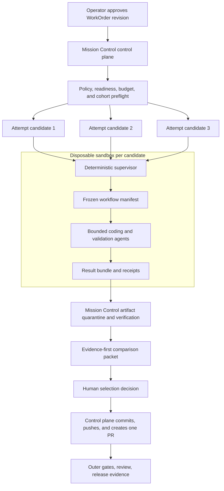

# Remote Sandbox Factory Cohorts

## Executive decision

Mission Control should adopt the supplied video's central idea, but not its
demo-shaped implementation boundary.

The right product is:

> Mission Control remains the authoritative out-of-loop control plane. Each
> approved Attempt may execute in a disposable remote machine that contains a
> small deterministic supervisor and the approved agent workflow. Multiple
> Attempts may later run as a governed comparison cohort, but only one
> human-selected result may be published as a pull request.

This capability must be delivered in two product increments:

1. **Remote execution, N=1:** prove that one governed WorkOrder can run in one
   isolated machine, return a verifiable result, survive control-plane restart,
   and leave no credentials or infrastructure behind.
2. **Best of N, initially N<=3:** fan the same frozen WorkOrder revision and
   base commit into a bounded cohort, compare independently verified evidence,
   record a human selection, and publish only the winner.

Starting with five factories would be premature. Mission Control's current
priority is still one browser-operable Mission-to-PR golden path. Running five
copies before remote lifecycle, cleanup, lineage, and cost attribution are
proven would multiply failure modes rather than quality.

The first provider should be **exe.dev behind a narrow provider interface**.
This is a reversible infrastructure choice, not a new platform program. The
first production risk ceiling should be **GREEN/YELLOW repository work only**.
RED work remains blocked until egress, privilege, identity, and credential
containment are demonstrated rather than assumed.

## Problem this solves

Today the Factory worker and Codex executor run against local worktrees on the
Mission Control host. That is sufficient for a single controlled execution,
but it creates four limits:

- concurrent agents compete for the same host resources and failure domain;
- local credentials and integrations are harder to bound per Attempt;
- unattended work depends on the operator's machine remaining healthy;
- model or harness comparisons cannot run fairly against the same immutable
  input without careful environmental isolation.

Remote sandboxes solve this only if they remain subordinate to Mission
Control's existing governance model. A VM is not a WorkOrder, an agent, or a
second source of truth. It is an execution resource attached to one Attempt.

For the operator, the resulting job is:

> Approve one bounded software outcome, let Mission Control allocate the
> permitted compute and credentials, return only when evidence or a decision is
> required, and receive one review-ready pull request with exact lineage.

## Review of the supplied material

### What should be adopted

- One immutable prompt/specification can be evaluated through multiple
  isolated execution futures.
- Each execution gets its own machine, filesystem, process tree, network
  identity, resource budget, and disposable credentials.
- The host-side orchestrator dispatches and observes; it does not micromanage
  every agent step.
- A deterministic in-box supervisor wraps non-deterministic agents.
- The in-box workflow covers plan, build, test, review, and documentation rather
  than stopping when code is generated.
- One failed candidate does not invalidate successful candidates.
- Live health, gates, spend, artifacts, and failure state remain observable.
- Setup, health check, execution, result collection, and teardown are explicit
  lifecycle stages.
- Model configurations are evaluated as stacks or profiles, not selected from
  a static popularity tier list.
- Cost and quality evidence from each run becomes input to later routing policy.

### What must change for Mission Control

| Supplied concept | Risk if copied literally | Mission Control decision |
| --- | --- | --- |
| Five sandboxes from one prompt | Multiplies unproven lifecycle and cost risk | Prove N=1, then cap initial cohorts at N=3 |
| Out-loop, in-sandbox orchestrator, and ADW agents | Can create three competing planning authorities | Mission Control owns intent and state; the in-box supervisor only executes a frozen manifest; existing workflow steps are the inner factory |
| “The blast radius is the box” | False if the VM has broad credentials, sudo, unrestricted egress, or public services | Bound identity, egress, privilege, credentials, spend, ports, time, and publication authority independently |
| Public application and observability URLs | Leaks previews, source behavior, or internal telemetry by default | Private authenticated proxy URLs only; public preview is a separate later policy |
| SSH into a live box | Useful operational escape hatch can become an unaudited mutation path | Break-glass access is time-bound, audited, and marks the Attempt as human-intervened |
| Each factory completes the full SDLC | Five pull requests create review noise and race publication | Candidates return signed result bundles; only the selected winner is committed/pushed by the control plane |
| Ranked winner | A single opaque score hides failed gates and value judgments | Show independent quality, risk, cost, and runtime axes; hard gates first; human selects the winner |
| Rebootable sandbox | Machine reboot is not execution recovery | Retry and checkpoint semantics remain explicit; V1 remote execution does not claim resumability |
| Model tier list | Becomes stale and encourages benchmark theater | Use approved, versioned lane/model profiles and observed Factory outcomes |

### Product framing

The supplied screenshots are useful architecture illustrations, but they are
not the target interface. Mission Control should not become a neon agent
leaderboard. The operator surface must prioritize:

1. blocked or unsafe candidates;
2. missing or failed evidence;
3. budget and teardown exceptions;
4. the decision required from the operator; and
5. the exact result that will become a pull request.

Agent activity, model branding, token streams, and VM terminals remain
supporting drill-down detail.

## Evidence reviewed

### Repository contracts

- Product doctrine:
  `docs/product/mission-control-north-star.md` and
  `docs/product/mission-control-v1-product-strategy.md`.
- Existing Factory program:
  `docs/plans/2026-08-02-feat-ai-software-factory-v1-program-plan.md`.
- Harness production plan:
  `docs/plans/2026-08-01-feat-productionize-software-factory-harness-plan.md`.
- Enhancement backlog:
  `docs/brainstorms/2026-08-02-software-factory-enhancement-backlog-brainstorm.md`.
- Model-pool direction:
  `docs/brainstorms/2026-07-31-operating-lane-model-pools-brainstorm.md`.
- Current executor boundary:
  `packages/workflow-engine/src/executorAdapter.ts` and
  `docs/architecture/executor-adapter-contract.md`.
- Current host worker and publication authority:
  `apps/orchestration-server/src/factoryAttemptWorker.ts` and
  `apps/orchestration-server/src/codexExecutorAdapter.ts`.
- Immutable manifest compiler:
  `convex/lib/executionManifest.ts`.
- Factory configuration and preflight:
  `convex/lib/factoryConfiguration.ts` and
  `convex/lib/factoryDispatch.ts`.
- Attempt service contract:
  `convex/factory/attempts.ts`.
- Current Pi receipt ingress:
  `apps/orchestration-server/src/index.ts`,
  `convex/factory/piBridge.ts`, and
  `convex/lib/piBridgeEnvelope.ts`.
- Operator surfaces:
  `apps/mission-control-ui/src/workspace/FactoryConfigurationPanel.tsx`,
  `apps/mission-control-ui/src/controlPlane/WorkOrdersView.tsx`,
  `apps/mission-control-ui/src/controlPlane/ExecutionRunInspector.tsx`, and
  `apps/mission-control-ui/src/harness/views/HarnessSoftwareFactoryView.tsx`.

No directly applicable institutional solution was found in `docs/solutions/`.
This plan therefore treats remote lifecycle and teardown as new contracts that
must be documented and tested before production mutation.

### Provider facts verified from primary documentation

- exe.dev exposes VM lifecycle through its CLI and HTTPS command API, including
  machine creation, setup scripts, JSON output, and removal:
  [API](https://exe.dev/docs/api),
  [HTTPS API](https://exe.dev/docs/https-api),
  [`new`](https://exe.dev/docs/cli-new), and
  [`rm`](https://exe.dev/docs/cli-rm).
- exe.dev supports VM-scoped, command-scoped, expiring access tokens and
  ephemeral SSH-key patterns:
  [sandbox guide](https://exe.dev/sandbox) and
  [SSH-key commands](https://exe.dev/docs/cli-ssh-key).
- proxied ports are private by default and public exposure is an explicit
  operation; this must remain a Mission Control policy, not a runner choice:
  [proxy documentation](https://exe.dev/docs/proxy).
- GitHub integrations can be repository-scoped and read-only:
  [GitHub integration](https://exe.dev/docs/integrations-github).
- bearer credentials can be held by exe.dev's HTTP proxy rather than exposed
  as readable VM environment variables:
  [HTTP proxy integration](https://exe.dev/docs/integrations-http-proxy) and
  [integration attachment](https://exe.dev/docs/integrations-attach).
- provider billing and usage are queryable, but quota and concurrency still
  require readiness checks:
  [billing CLI](https://exe.dev/docs/cli-billing),
  [pricing](https://exe.dev/pricing), and
  [usage pricing](https://exe.dev/usage-pricing).
- OpenRouter supports provisioning keys with limits and expiration, and its
  management API can disable or delete those keys:
  [key creation](https://openrouter.ai/docs/api/api-reference/api-keys/create-a-new-api-key)
  and
  [management keys](https://openrouter.ai/docs/guides/overview/auth/management-api-keys).

Two constraints require proof during Phase 0:

1. No documented provider-enforced outbound network allowlist was found. A VM
   running an agent as root with unrestricted egress is not a bounded security
   boundary merely because it is disposable.
2. The exact Codex/Pi/OpenRouter compatibility and hard per-run spend behavior
   must be tested. A claimed cap that the active model path can bypass is not a
   control.

exe.dev has also published a prior security issue involving unintended HTTP
port visibility for shared VMs. The provider fixed it, but Mission Control
should retain regression tests for access classification rather than trusting
defaults: [security notices](https://exe.dev/security).

## Current-system assessment

| Capability | Current posture | Plan disposition |
| --- | --- | --- |
| Authoritative hierarchy | Mission -> WorkOrder -> Task -> Attempt/WorkflowRun -> evidence -> PR exists | Keep; do not introduce “factory run” as a parallel lifecycle |
| Attempt worker | Polls and claims Factory Attempts, but allows one active local execution per worker | Extend the worker through a transport/provider boundary |
| Executor contract | `codex/v1` validates, estimates, executes, cancels, and reports health | Preserve; add remote execution without hiding provider state inside the agent adapter |
| Repository isolation | One local worktree per Attempt | Add remote machine isolation while keeping exact base-SHA and path-scope checks |
| Manifest | Immutable per-step bindings, model config, code scope, prompt, and control-plane-only PR authority | Version to include transport, image, profile, result, and preview contracts |
| Publication | Host worker owns commit, GitHub token, push, and PR creation | Keep as a non-negotiable authority boundary |
| Repository mutation lock | Rejects concurrent mutating runs for one repository | Keep for ordinary runs; add one narrow cohort exception with shared base SHA and unique branches |
| Factory configuration | Versioned references to workflow, executor, agents, budgets, policies, scopes, and recovery | Extend with a sandbox profile reference |
| Host readiness | Local checkout, runtime, network, secrets, and capacity states | Add provider/account/quota/image/integration/cleanup readiness |
| Routing | Versioned lane pools, canaries, and routing decisions exist | Reuse to choose candidate profiles and retain observed results |
| Attempt reporting | Trusted host worker currently signs reporting; the Pi bridge accepts pushed packets | Keep trust host-side; initially pull a hash-chained event spool over SSH/provider exec and translate it through the existing Attempt report contract |
| Pi bridge | Receipt ingestion exists behind `executor.pi-bridge` | Evolve into a real sandbox executor only after N=1 lifecycle is proven |
| Approvals | WorkOrder-scoped `approvalDecisions` supports typed decisions and WorkflowRun linkage | Reuse for cohort winner selection |
| Cost | Budget fields and cost events exist, but external attribution is incomplete | Add Attempt/cohort attribution and measured-provider reconciliation |
| Factory UI | Configuration, WorkOrders, run inspection, health, and schematic views exist | Extend existing pages; add no new primary navigation domain |

## Canonical architecture



The diagram is logical. Every candidate receives a distinct machine and
supervisor instance; no in-box process or filesystem is shared.

### Tier 1: Mission Control out-of-loop orchestrator

Mission Control remains responsible for:

- authenticated intent, approval, risk, policy, and budget;
- immutable WorkOrder revision, execution manifest, and input/context digest;
- provider readiness and allocation;
- credential minting and revocation;
- Attempt claim, lease, cancellation, and terminal state;
- append-only events, receipts, artifacts, and cost attribution;
- independent evaluation and the operator decision packet;
- teardown reconciliation and orphan detection; and
- commit, push, pull request, merge, and release authority.

“Out of loop” means it does not prompt-engineer the agent mid-run. It does not
mean it stops enforcing leases, spend, health, identity, evidence, or cleanup.

### Tier 2: deterministic sandbox supervisor

The supervisor is a small, versioned program distributed in a pinned machine
image. It may:

- verify the signed manifest and base commit;
- configure a repository clone and isolated working directory;
- start approved workflow steps with exact time and resource bounds;
- collect stdout/stderr through the redaction contract;
- emit heartbeats, phase events, verifier receipts, and measured usage;
- stop work when the lease, credential, spend, or runtime limit expires;
- produce a content-addressed result bundle; and
- shut down or wait for explicit teardown after result acknowledgement.

It may not reinterpret the WorkOrder, add agents, change models, broaden code or
network scope, publish Git state, create a PR, merge, deploy, approve its own
work, or retain a global Mission Control credential.

### Tier 3: existing workflow and agent steps

The “software factory in the box” is the existing versioned workflow plus
approved agent/model bindings. It should eventually execute plan, implement,
test, review, and document steps individually, preserving step receipts and
handoff bounds. It is not a new orchestration database.

The first remote N=1 milestone may run the current `codex/v1` compiled prompt
inside the machine to minimize simultaneous changes. True multi-step Pi
execution follows only after the provider lifecycle is reliable.

### Provider boundary

Add a narrow orchestration-server contract, not a general cloud abstraction:

```ts
interface SandboxProvider {
  validateProfile(profile: SandboxProfileSnapshot): Promise<ValidationResult>;
  allocate(request: SandboxAllocationRequest): Promise<SandboxResource>;
  inspect(resource: SandboxResourceRef): Promise<SandboxHealth>;
  start(request: SandboxStartRequest): Promise<SandboxProcessRef>;
  fetchResult(request: SandboxResultRequest): Promise<DownloadedResult>;
  cancel(resource: SandboxResourceRef): Promise<void>;
  terminate(resource: SandboxResourceRef): Promise<TeardownReceipt>;
}
```

Implement `ExeDevSandboxProvider` first. Do not implement a second provider,
Kubernetes scheduler, or general multi-cloud placement layer in this program.
Provider commands must be idempotent or reconciled through stable external
resource names and allocation records.

## Authoritative data contracts

### Records to add

#### `factorySandboxProfiles`

A versioned workspace configuration record with no plaintext secrets:

- provider and provider-account reference;
- immutable image identifier/digest and supervisor version/digest;
- CPU, memory, disk, region, maximum lifetime, and maximum concurrency;
- approved integration types and network posture;
- preview visibility policy;
- credential strategy;
- maximum governance band;
- setup/health contract version; and
- activation/readiness state.

Factory versions reference an immutable profile version. Editing a profile
creates a new version; it never mutates a running Attempt's posture.

#### `sandboxAllocations`

One resource journal record per remote WorkflowRun/Attempt:

- company, workspace, repository, WorkOrder, Task, Attempt, and WorkflowRun IDs;
- provider, provider VM name/ID, and exact profile snapshot/digest;
- requested and observed resource configuration;
- lifecycle state:
  `REQUESTED -> PROVISIONING -> HEALTH_CHECKING -> READY -> RUNNING -> RESULT_READY -> TEARING_DOWN -> TERMINATED`,
  with explicit `FAILED` and `ORPHANED` paths;
- provider operation/idempotency keys;
- event-spool cursor, hash-chain head, and supervisor signing-key fingerprint;
- private preview/observer references and access classification;
- heartbeat, allocation, start, result, and teardown timestamps;
- result bundle digest and acknowledgement; and
- teardown receipt or failure reason.

Create this record before the first external mutation. It is the recovery
journal when provisioning succeeds but the worker crashes before receiving the
provider response.

#### `runtimeCredentialLeases`

Track, but never store, the usable credential:

- allocation and WorkflowRun IDs;
- provider and external key hash/identifier;
- permitted model/provider scope;
- hard monetary limit, expiration, and reset policy;
- lifecycle state, disable/delete verification, and timestamps;
- measured usage and reconciliation state; and
- last revocation error.

Plaintext material is received once by the orchestration server and immediately
placed into the exact VM's off-box HTTP proxy integration. It must not enter
Convex, events, logs, shell history, result bundles, or UI payloads.

#### `factoryExecutionCohorts`

A thin grouping record under one WorkOrder revision:

- strategy: `SINGLE` or `BEST_OF_N`;
- immutable WorkOrder revision, input/context digest, workflow version, base
  repository SHA, and acceptance contract;
- candidate profile snapshots and WorkflowRun IDs;
- candidate count, maximum concurrency, total cost, and total runtime budgets;
- selection contract and state;
- selected WorkflowRun, selection decision, and publication state; and
- cohort-level terminal reason.

Candidate execution remains represented by existing Tasks, Attempts, and
WorkflowRuns. The cohort does not duplicate their state machine.

### Existing records to extend

- `factoryDefinitionVersions`: add immutable sandbox-profile version reference
  and execution-transport policy.
- `workflowRuns`: add cohort ID, candidate index/label, profile digest,
  sandbox-allocation ID, result-bundle digest, and publication eligibility.
- `costEvents`: add WorkflowRun, cohort, external-usage ID, usage source, and
  measured/estimated/reconciled status.
- `executionManifest`: introduce `factory-execution-manifest/v2` with transport,
  profile digest, runner image/supervisor digest, receipt transport,
  result-bundle contract, preview policy, and teardown policy. Continue reading
  v1 records.
- `approvalDecisions`: use
  `approvalType = FACTORY_COHORT_SELECTION`; link the selected WorkflowRun and
  cohort evidence in typed metadata.
- `runEvents`, `runArtifacts`, `verificationReceipts`, and
  `modelRoutingDecisions`: reuse for candidate evidence and observed outcomes.

### Result bundle contract

Every candidate returns a content-addressed archive containing:

- manifest digest and supervisor version;
- repository base SHA and final tree SHA;
- Git bundle or binary-safe patch plus file inventory;
- workflow step outcomes and structured receipts;
- tests, lint, typecheck, build, and independent-review artifacts;
- redacted logs and failure summary;
- token/cost/runtime/resource measurements;
- environment/image/profile digests; and
- a checksum manifest covering every file in the archive, signed by the
  root-owned supervisor's ephemeral key whose fingerprint is recorded on the
  allocation.

The control plane downloads into quarantine and verifies checksums, base SHA,
path scope, file types, size bounds, absence of forbidden material, and expected
workflow receipts before the candidate becomes selectable. A candidate never
pushes its own branch.

## Security and authority model

### Non-negotiable controls

1. **No Mission Control credential in a sandbox.** The current
   `MISSION_CONTROL_SERVICE_COMMAND_SECRET` remains host-side.
2. **Pull-based receipt transport for V1.** The root-owned supervisor appends a
   cursor-based, hash-chained event spool. The trusted outer worker reads it over
   the provider/SSH channel, verifies continuity and the supervisor fingerprint,
   and signs the existing internal service command to Convex. This avoids
   exposing a local control-plane ingress or giving the VM a callback token.
3. **Control-plane-only publication.** GitHub write credentials, commit, push,
   PR creation, merge, and deploy remain outside the sandbox.
4. **Read-only repository access.** Attach only the exact repository using a
   read-only GitHub integration or fetch a control-plane-created source bundle.
5. **Least-privileged runtime.** The agent runs as an unprivileged user without
   sudo. A root-owned supervisor controls firewall, limits, the receipt spool,
   and shutdown.
6. **Pinned supply chain.** Use a prebuilt image pinned by immutable digest.
   Setup verifies supervisor and dependency checksums; it does not curl and
   execute floating installers during each run.
7. **Dedicated provider boundary.** Use a dedicated exe.dev account/team with
   no prod cloud integrations and no unexpected `auto:all` integration.
   Readiness inventories attached integrations and fails closed.
8. **Off-box model secret.** Attach the per-run OpenRouter provisioning key only
   through a VM-scoped HTTP proxy integration. Set a limit and expiration; then
   disable/delete and verify it during teardown.
9. **Private ports only.** Application and observer URLs remain private and
   access-classified. The agent cannot make a port public.
10. **Risk ceiling.** Until egress containment is demonstrated, permit only
    GREEN/YELLOW, non-production, single-repository work with no customer data.

### Egress caveat

Disposable infrastructure limits persistence; it does not by itself prevent
data exfiltration. Phase 0 must prove one of these postures:

- a provider-enforced egress allowlist; or
- a pinned image whose root-owned firewall is immutable to the unprivileged
  agent and allows only the source host, model proxy, and package sources
  required by the manifest.

If neither can be verified, remote execution remains Preview and its governance
ceiling cannot include RED work, production credentials, private package
registries with broad scope, or sensitive customer repositories.

### Audited break-glass access

Mid-run SSH is not normal product flow. An operator may request a short-lived,
VM-scoped, command-scoped credential. Issuance, actor, reason, expiration, and
commands are audited. Opening an interactive shell:

- sets `humanIntervention = true` on the Attempt;
- invalidates autonomy-comparison claims for that candidate;
- does not reveal Mission Control or GitHub write credentials; and
- requires a new independent verifier receipt before selection.

### Teardown completion contract

An Attempt is not operationally closed merely because the agent finished.
Teardown is complete only after Mission Control verifies:

1. the result bundle was acknowledged or intentionally discarded;
2. the final event-spool cursor and hash-chain head were acknowledged;
3. the OpenRouter key was disabled/deleted and verified absent;
4. VM-scoped integrations were detached or deleted;
5. the VM was removed and provider inventory confirms absence;
6. ephemeral SSH access was removed; and
7. a teardown receipt was appended to the Attempt evidence.

An orphan sweeper runs on orchestration-server startup and a recurring schedule.
Any non-terminal allocation past its lease becomes an exception on Command
Center and is reconciled by exact provider ID, never a broad name glob.

## Best-of-N execution contract

### Fair comparison invariants

Every candidate in a cohort must share:

- company, workspace, repository, WorkOrder, revision, and approval decision;
- exact base commit and clean source bundle;
- acceptance criteria, code scopes, verifier contract, and quality gates;
- workflow definition and context/input digest;
- maximum permitted tools, network policy, runtime class, and risk ceiling; and
- independent result evaluation logic.

Approved candidate profiles may vary only the fields declared by the cohort,
initially agent/model binding and its explicit runtime budget. A comparison
becomes invalid if an operator changes instructions for one candidate.

### Creation and locking

Cohort creation is atomic: one cohort, N candidate Attempts/WorkflowRuns under
the same bounded Task, and their budget reservations are created or none are.
The Task remains running until a candidate is selected or the cohort has no
viable result. Existing one-active-Attempt-per-Task and
one-mutating-run-per-repository locks receive a narrow exception only when:

- all candidates belong to the same active cohort and Task;
- all share the same base SHA and WorkOrder revision;
- each runs in a distinct sandbox and branch namespace;
- none can publish; and
- total cohort concurrency and cost are pre-authorized.

This is not a general bypass for concurrent repository mutation.

### Evaluation and recommendation

Hard acceptance and security gates are pass/fail and cannot be averaged away.
Eligible candidates are then compared on separate axes:

- acceptance-criteria and deterministic gate result;
- independent review findings and unresolved risk;
- diff size and scope adherence;
- runtime and failure/recovery count;
- measured model/provider and compute cost; and
- human intervention.

The system may recommend using a transparent lexicographic policy: all hard
gates pass, lower unresolved risk, stronger acceptance evidence, then lower
cost and latency. It must show uncertainty and source artifacts. It does not
produce an opaque composite “agent score.”

### Human selection and publication

The operator records an append-only cohort selection decision with a reason.
Only the selected candidate becomes publication-eligible. The control plane:

1. revalidates the candidate bundle and current target-branch head;
2. blocks publication if the base is stale or requires a new governed
   rebase/retry Attempt;
3. materializes the selected result in a controlled worktree;
4. runs required host-side outer gates;
5. commits and pushes the selected branch; and
6. creates exactly one pull request with cohort and evidence lineage.

There is no automatic winner, result fusion, auto-merge, or publication of all
candidates in the first release.

### Partial outcomes

- One candidate failing does not stop the others.
- A candidate that exceeds budget or lease is canceled and remains visible with
  its evidence.
- If no candidate passes all hard gates, the cohort ends `NO_VIABLE_CANDIDATE`
  and creates no PR.
- Selection may occur before every candidate finishes only through an explicit
  decision that also cancels remaining candidates and records why.
- Loser result bundles remain according to evidence retention policy; loser VMs
  and credentials are still torn down immediately.

## Implementation phases

### Phase 0 — threat model and provider proof

**Goal:** prove the provider, identity, network, spend, and cleanup assumptions
without cloning a private repository or invoking a paid model.

**Documentation**

- Create `docs/architecture/remote-sandbox-execution.md` with the tier and
  authority contracts from this plan.
- Create `docs/security/remote-sandbox-threat-model.md` covering source code,
  credentials, receipt integrity, package supply chain, public previews, result
  tampering, provider compromise, and orphan resources.
- Record the approved risk ceiling and provider-account ownership.

**Provider spike**

- Establish a dedicated exe.dev account/team for Mission Control Preview.
- Inventory and remove unexpected account-wide or `auto:all` integrations.
- Create a pinned test image and unprivileged runner user.
- Implement a developer-only `sandbox doctor` that validates auth, quota,
  image, integrations, private proxy access, SSH/provider event retrieval, and
  delete permission.
- Allocate, health-check, expose one private test port, collect a harmless
  artifact, and tear down three times.
- Kill the local process between allocation and teardown to prove resource
  discovery and reconciliation.
- Test that the runner cannot read proxy-held credentials, use sudo, make a port
  public, modify the root-owned receipt spool, or retain a VM past its deadline.
- Test OpenRouter key creation, effective hard limit/expiration through the
  exact intended agent path, disable/delete, and usage reconciliation.
- Test current Codex and planned Pi client compatibility with the chosen
  OpenRouter/exe.dev gateway path. Record evidence; do not infer compatibility.

**Exit gate**

- Three clean lifecycle runs with zero orphaned VM, key, integration, or SSH
  resource.
- Restart recovery succeeds from the resource journal.
- No plaintext secret appears in provider metadata, VM environment inspection,
  logs, receipt payloads, or artifacts.
- Private port access is denied to an unauthenticated/non-member user.
- Egress and non-root posture are documented and reproducible.
- Product Owner approves the risk ceiling and spend-control evidence.

If the exact model route cannot enforce the claimed hard budget, mutating remote
execution does not proceed through that route.

### Phase 1 — provider lifecycle and control-plane foundation

**Goal:** make remote resources first-class, recoverable execution resources
without yet running repository mutations.

**Backend**

- Add the `SandboxProvider` contract and `ExeDevSandboxProvider` in the
  orchestration server.
- Add profile, allocation, and credential-lease schema with tenant/workspace
  authorization, indexes, validators, and immutable snapshot rules.
- Extend Factory readiness with provider auth, quota, capacity, pinned image,
  integration inventory, SSH/provider event retrieval, and cleanup permission.
- Add cursor-based event-spool ingestion with hash-chain verification,
  per-event idempotency keys, and existing host-side internal service signing.
- Add lifecycle saga, startup reconciliation, recurring orphan sweeper, and
  explicit teardown receipts.
- Add `executor.remote-sandbox` feature flag, disabled by default.

**Canary**

- Dispatch a read-only, deterministic canary that checks out a public fixture,
  executes a checksum/test command, reports heartbeats, returns an artifact,
  and tears down.
- Restart the orchestration server while the canary runs.
- Exercise cancellation during provisioning, running, result collection, and
  teardown.

**Exit gate**

- Read-only canary is fully operable through typed control-plane commands.
- Restart, duplicate event, broken hash chain, timeout, cancellation, and
  partial-delete paths
  converge to one truthful terminal state.
- Allocation/provider drift appears as an operator exception, not a silent log.
- Remote flag off leaves current local execution unchanged.

### Phase 2 — governed remote Attempt, N=1

**Goal:** complete one safe real WorkOrder in one remote sandbox and produce one
control-plane-owned pull request.

**Manifest and dispatch**

- Add `factory-execution-manifest/v2` and preserve v1 decoding.
- Add execution transport and sandbox-profile version to Factory configuration.
- Refactor `FactoryAttemptWorker` to select local or remote transport from the
  frozen Factory version. Do not create a second polling/claiming worker.
- Preserve Attempt lease, cancellation, status, evidence, and publication
  contracts across transports.

**Remote execution**

- Begin with the current `codex/v1` behavior inside the sandbox only if Phase 0
  proves client compatibility and effective spend limits.
- Provide repository input through a read-only GitHub integration or verified
  source archive. No GitHub write token enters the machine.
- Produce and fetch the result bundle; validate in quarantine.
- Materialize the result into a host-controlled worktree only after validation.
- Reuse the current control-plane commit, push, and pull-request path.
- Emit measured compute/model usage, heartbeats, phase events, result receipt,
  and teardown receipt.

**Minimum operator slice**

- Extend the existing Factory configuration and WorkOrder dispatch surfaces
  with remote profile/readiness, maximum cost/runtime, and **Run remotely**.
- Extend the existing run inspector with allocation, heartbeat, result
  validation, cancellation, and teardown state.
- Implement loading, unavailable, running, failed, canceled, success, and
  cleanup-exception states needed for the N=1 browser exit gate.

**Exit gate**

- One GREEN/YELLOW WorkOrder against a designated safe repository produces one
  PR with exact Mission/WorkOrder/Task/Attempt/manifest/base-SHA lineage.
- Changed files remain inside approved scopes and all required host-side gates
  pass.
- No sandbox-held identity can push, create a PR, merge, or deploy.
- Orchestration restart does not duplicate execution or publication.
- VM, access, integration, and model key cleanup is verified.
- Browser evidence covers dispatch, live inspection, success, failure,
  cancellation, and cleanup exception states.

### Phase 3 — full deterministic in-box workflow and Pi adapter

**Goal:** run the approved Factory workflow step-by-step in the sandbox instead
of treating the whole workflow as one compiled agent prompt.

**Execution**

- Add `pi/sandbox-v1` behind its own capability flag after the N=1 lifecycle is
  stable.
- Have the trusted outer worker ingest Pi receipt packets from the sandbox spool
  into the authoritative Attempt report path; remove any duplicate receipt or
  terminal-state authority.
- Execute the frozen workflow graph with existing workflow-engine semantics.
- Resolve each step's approved agent/version/model route before dispatch and
  include the decision in the manifest.
- Bound handoff context size and use content-addressed artifacts between steps.
- Run plan, implementation, deterministic tests, independent review, and docs
  stages with explicit skip/failure semantics.
- Independently validate high-value receipts outside the implementing agent.
- Reconcile OpenRouter usage with Mission Control cost events.

**Exit gate**

- One N=1 remote Attempt completes the intended plan/build/test/review/document
  workflow with per-step evidence.
- The in-box supervisor cannot change the workflow, route, scope, or budget.
- Failure at every step yields a clear recovery action and truthful terminal
  state.
- Cost attribution reaches candidate, Attempt, workflow step, model route, and
  provider resource without double counting.

### Phase 4 — best-of-N cohorts

**Goal:** execute and compare multiple governed candidates without weakening
repository safety or publication authority.

**Backend**

- Add cohort schema, typed queries/mutations, atomic candidate creation, budget
  reservation, and lifecycle aggregation.
- Add narrow cohort exceptions to the one-active-Attempt-per-Task and
  repository mutation locks; ordinary retries remain sequential.
- Cap initial candidate count and concurrency at three.
- Use approved lane/model profiles; do not accept arbitrary model strings at
  dispatch.
- Continue healthy candidates when a peer fails; support explicit straggler
  cancellation.
- Add independent bundle evaluation and an evidence-first comparison packet.
- Reuse `approvalDecisions` for winner selection.
- Gate publication on selection, fresh target-branch lineage, host-side outer
  verification, and winner-only eligibility.
- Feed measured candidate outcomes back into model-routing evaluation data, but
  do not automatically change production routing.

**Exit gate**

- One best-of-three cohort starts from the same frozen input and base SHA.
- At least one test run includes a failed candidate while the cohort continues.
- The operator can trace every comparison value to source evidence.
- One append-only decision selects one candidate and creates exactly one PR.
- An all-failed cohort creates no PR and clearly requests a new operator
  decision.
- Every candidate VM, key, integration, event spool, and access path is
  reconciled after the cohort.

### Phase 5 — cohort decision experience and production polish

**Goal:** make remote execution and cohort selection calm, evidence-first, and
fully operable through existing Mission Control surfaces.

**Factory configuration**

Extend `FactoryConfigurationPanel` with:

- local/remote execution transport;
- sandbox profile and immutable version;
- provider readiness and quota;
- image/supervisor digest;
- credential strategy and verified spend control;
- private-preview policy;
- maximum risk band, runtime, candidate count, and concurrency; and
- explicit unavailable/degraded reasons.

**WorkOrder dispatch and detail**

- Harden the **Run remotely** N=1 slice introduced in Phase 2.
- Expose **Compare variants** only after the Phase 4 flag is enabled.
- Before dispatch, show candidate profiles, shared invariants, maximum total
  cost/runtime, concurrency, and required final selection.
- Show one cohort as a section inside the existing WorkOrder detail, not a new
  primary navigation destination.
- Present candidates in a comparison matrix with hard gates, evidence, risk,
  diff scope, cost, runtime, failure, and intervention axes.
- Make the recommendation explainable and secondary to the operator decision.
- Require an explicit selection reason and confirmation of the one result that
  will be published.

**Execution inspector**

Extend `ExecutionRunInspector` with:

- allocation and supervisor timeline;
- provider, VM/resource ID, profile/image/manifest digests;
- private preview and observer access classification;
- live heartbeat, workflow stage, spend, and remaining budget;
- result-bundle validation and publication eligibility;
- cancellation and recovery actions; and
- teardown checklist/receipt with orphan escalation.

**Command Center and Factory Health**

Show only actionable remote exceptions by default:

- provider unready or quota exhausted;
- sandbox unhealthy or heartbeat stale;
- budget/lease exceeded;
- receipt-chain or artifact integrity failure;
- teardown pending/orphaned;
- no viable cohort candidate; and
- winner selection required.

The existing Harness Software Factory diagram may become a real projection of
the authoritative records with drill-down links. It remains Preview/supporting
detail until it uses real data; synthetic “agent activity” must not become the
product center.

**Required UI states**

Each surface needs loading, empty, unavailable, permission denied, provisioning,
running, partially failed, canceled, no viable candidate, success, stale
lineage, teardown pending, teardown failed, and fully cleaned states. Support
keyboard navigation, visible focus, semantic status text beyond color, dark and
light themes, responsive dense layouts, and direct links to evidence.

### Phase 6 — hardening and rollout

**Goal:** earn production confidence through bounded rollout rather than a
feature-label change.

- Keep all remote and cohort flags off by default.
- Canary N=1 on a fixture repository, then Mission Control itself, then one
  non-critical real repository.
- Hold best-of-N at N=3 until a meaningful N=1 outcome baseline exists.
- Add chaos tests for worker death, event-stream interruption, provider timeout,
  VM death,
  key revocation failure, corrupt result, stale base, and provider inventory
  drift.
- Reconcile provider billing, OpenRouter usage, and Mission Control cost records
  on a schedule; surface discrepancies.
- Define operational SLOs for allocation, heartbeat, cancellation, teardown,
  orphan detection, and cost reconciliation.
- Produce deterministic browser evidence on the current development UI at
  `http://localhost:5180`. Verify Research Lab/demo projections separately on
  their documented launch commands and ports; do not substitute seeded demo
  state for the real golden path.
- Complete security review, runbook, alerting, backup/export, and incident
  exercises before removing Preview.

**Production promotion gate**

Remote Factory execution remains Preview until it:

- uses real company/workspace/repository authorization;
- audits every external mutation and operator decision;
- survives control-plane refresh/restart and provider retry;
- handles failure, cancellation, recovery, and cleanup deterministically;
- proves exact WorkOrder-to-PR lineage;
- prevents sandbox publication authority;
- attributes and reconciles real cost;
- has no unresolved critical/high threat-model finding; and
- has repeatable browser evidence for the golden path and exceptions.

## Suggested pull-request sequence

Each PR should be independently reviewable and keep existing local execution
working.

1. **Architecture, threat model, and provider proof** — docs, decision records,
   spike scripts/tests, and evidence only.
2. **Sandbox schema and typed contracts** — profile versions, allocations,
   credential leases, validators, indexes, authorization, migrations, and
   contract tests.
3. **exe.dev provider and lifecycle saga** — doctor, allocation, health,
   private proxy, cleanup, reconciliation, and flags.
4. **Receipt spool and read-only canary** — cursor/hash verification,
   idempotent ingestion, restart/cancel tests, and teardown receipt.
5. **N=1 result bundle and control-plane publication** — manifest v2, remote
   transport in the existing worker, quarantine, host validation, and PR.
6. **Pi sandbox workflow** — step execution, receipt convergence, independent
   validation, per-step usage, and failure recovery.
7. **Cohort data and dispatch** — atomic creation, reservations, approved
   profiles, concurrency cap, and narrow repository-lock exception.
8. **Comparison, selection, and winner publication** — evaluation packet,
   approval decision, stale-base handling, and one-PR invariant.
9. **Operator UI** — configuration, dispatch, run inspection, cohort decision,
   exception states, accessibility, and browser tests.
10. **Hardening and rollout** — chaos, security, reconciliation, SLOs, runbooks,
    browser evidence, and Preview promotion review.

Do not combine schema, provider integration, full Pi workflow, cohorts, and UI
into one PR. That blast radius would make lifecycle and authority regressions
too difficult to isolate.

## Failure and recovery matrix

| Failure | Required system behavior |
| --- | --- |
| Provider unconfigured or authentication expired | Readiness blocks dispatch with one owner/action; no Attempt or budget charge |
| Quota or concurrency exhausted | Keep WorkOrder approved but undispatched; show capacity exception and retry policy |
| Duplicate dispatch/provision request | Idempotency key resolves to one allocation; extra resource is reconciled as an orphan |
| Worker dies after external creation | Startup sweeper finds exact provider resource from journal and resumes or tears down |
| VM setup/health check fails | Capture setup evidence, revoke credentials, remove resource, fail or retry under policy |
| Callback is duplicated or reordered | Per-event idempotency and monotonic state rules prevent duplicate side effects |
| Callback is lost while VM runs | Heartbeat becomes stale; inspect provider, cancel or reconcile; do not falsely fail healthy work immediately |
| Control plane restarts | Lease/resource journal restores observation without a second agent run |
| VM reboots | Mark interruption; resume only if a declared checkpoint contract exists, otherwise create a new Attempt |
| Cancel during provisioning | Reconcile any late-created resource, revoke key, and end canceled after cleanup |
| Cancel during execution | Stop supervisor/process, collect bounded failure evidence, revoke and tear down |
| Cancel during result collection | Preserve acknowledged artifact state, prevent publication, and tear down deterministically |
| Spend/runtime cap reached | Supervisor stops, key expires/disables, candidate fails with measured partial evidence |
| Model unavailable or rate limited | Retry only within manifest policy; do not silently switch models |
| Result missing/corrupt | Candidate is ineligible; preserve validation failure; no materialization or PR |
| Base SHA or path scope mismatch | Quarantine and fail candidate as an integrity violation |
| Candidate bundle includes secret | Quarantine, redact access, trigger security event, revoke/teardown, and block cohort selection |
| One cohort candidate fails | Continue other candidates; show failed candidate and its cost/evidence |
| All candidates fail hard gates | End `NO_VIABLE_CANDIDATE`; no selection and no PR |
| Operator selects before all finish | Require explicit cancel-stragglers decision; preserve all completed evidence |
| Target branch changes before publication | Block publication; require governed rebase/retry rather than silently applying stale diff |
| Unauthorized/private preview access | Deny and audit; readiness or security gate fails on policy regression |
| Key revoke succeeds but VM delete fails | Credential blast radius closes; allocation remains teardown exception until provider confirms removal |
| VM deletes but usage telemetry lags | Close infrastructure lifecycle, keep cost reconciliation provisional, and alert on SLO breach |
| Browser refresh mid-decision | Rehydrate authoritative state; no client-only selection or transient publication authority |

## Verification strategy

### Contract and unit tests

- manifest v1/v2 parsing, canonical digesting, and immutable snapshot behavior;
- profile/risk/preview/budget validation;
- allocation and cohort transition matrices;
- event cursor, hash continuity, duplicate/replay handling, and idempotency;
- result bundle signature/checksum, base SHA, path scope, size, and
  forbidden-file rules;
- teardown completion predicate;
- candidate eligibility and transparent recommendation ordering;
- budget reservation/release and cost reconciliation;
- winner-only publication and stale-base rejection; and
- tenant/workspace/repository authorization on every new query/mutation.

### Provider integration tests

- create/inspect/start/private-proxy/fetch/cancel/delete;
- provider timeout, malformed JSON, command rejection, and rate limit;
- restart after each external lifecycle transition;
- no public port and no account-wide integration attachment;
- expiring command-scoped access;
- key-limit effectiveness, expiry, disable/delete, and absence verification;
- orphan enumeration using exact tags/IDs; and
- repeatable cleanup without broad destructive commands.

Use a provider test account and explicit budget. Live provider tests remain
separate from deterministic CI and must still produce machine-readable evidence.

### End-to-end golden paths

1. N=1 read-only canary.
2. N=1 remote real WorkOrder -> validated bundle -> host gates -> one PR ->
   complete teardown.
3. N=1 cancel and retry with a new Attempt.
4. Best-of-three with three passing candidates and one human selection.
5. Best-of-three with one failure and two eligible candidates.
6. Best-of-three with no viable candidate and no PR.
7. Selected result becomes stale before publication and is blocked.
8. Orphan/key-revocation exception is visible and recoverable.

### Browser verification

- Test authenticated operator, unauthorized company member, and refresh/reload.
- Verify dispatch confirmation, live progress, private preview access, cost,
  result validation, selection, publication, cancellation, and cleanup.
- Exercise loading, empty, error, partial, success, stale, and recovery states.
- Capture dark/light desktop screenshots of affected v2 shell pages.
- Run keyboard-only flows, Axe/accessibility checks, and console/network error
  review.
- Confirm all additions are reachable through existing left navigation and
  deep links.

### Security verification

- Threat-model review before Phase 1 and before Production promotion.
- Search VM environment, process list, filesystem, logs, result bundle, and
  provider metadata for seeded canary secrets.
- Attempt privilege escalation, receipt-spool tampering, public-port change,
  forbidden egress, GitHub write, result tampering, and replay.
- Verify audit records for provider mutation, break-glass access, selection,
  publication, credential revoke, and teardown.

## Metrics and learning contract

Do not claim that best-of-N improves quality until Mission Control has an N=1
baseline. Record facts first:

- allocation success and p50/p95 time to ready;
- orphan rate and p50/p95 time to complete teardown;
- credential-revocation and cost-reconciliation lag;
- Attempt success, retry, cancellation, and human-intervention rate;
- acceptance/gate pass rate by immutable agent/model profile;
- time and cost per eligible candidate and selected PR;
- proportion of cohorts with zero, one, or multiple viable candidates;
- selection reasons and whether the system recommendation was accepted;
- PR review findings, rework, CI regression, merge, and post-merge outcomes; and
- quality gain, if any, relative to the incremental cohort spend.

Routing policies may consume these outcomes only through a separate governed
evaluation/promotion process. One cohort must never silently rewrite model
ranking or production routing.

## Product Owner decisions required before implementation

| Decision | Recommendation | Tradeoff |
| --- | --- | --- |
| First provider | exe.dev behind the narrow `SandboxProvider` contract | Fastest path using the supplied architecture; introduces one external dependency without committing to multi-cloud |
| Initial risk ceiling | GREEN/YELLOW only | Protects real repositories while egress and privilege controls mature; RED work waits |
| Executor order | Prove lifecycle with N=1; keep `codex/v1` only if hard spend/client compatibility is verified; then add `pi/sandbox-v1` | Minimizes simultaneous change; may require skipping remote Codex if the budget path is not enforceable |
| Cohort size | N<=3 and concurrency<=3 | Enough to validate best-of-N economics without the cost and UI complexity of five |
| Winner authority | Human selection, no auto-winner, auto-fusion, auto-merge, or deploy | Slower than full autonomy; preserves judgment and trust for V1 |
| Preview policy | Private authenticated URLs only | Safer default; public demos require a later explicit policy |
| Publication | Winner bundle only; host control plane commits/pushes/creates PR | Adds result-transfer work; keeps write credentials and governance outside the box |
| VM retention | Delete immediately after acknowledged bundle; optional explicit 30-minute inspection hold later | Limits cost and exposure; reduces casual postmortem access, which durable artifacts must replace |
| Provider identity | Dedicated account/team with unexpected automatic integrations removed | Adds account setup; materially reduces hidden blast radius |
| Spend defaults | Product Owner must set per-candidate USD/runtime and per-cohort USD/runtime limits before Phase 2/4 | Hard limits are product policy and cannot be guessed from the video |

Implementation should not start until these decisions, the Phase 0 threat
model, and explicit authority to create provider/OpenRouter resources are
approved.

## Explicit non-goals

- A general-purpose VM/cloud management product.
- Kubernetes, multi-cloud scheduling, or a second sandbox provider in V1.
- Replacing Convex, WorkOrders, Tasks, Attempts, WorkflowRuns, or approvals.
- N=5 or unbounded fan-out in the initial release.
- Opaque agent leaderboards or static public model tiers.
- Automatic winner selection, result fusion, merge, deploy, or production
  activation.
- Public-by-default previews or observability.
- Production secrets, customer data, or RED workloads inside early sandboxes.
- General interactive SSH as the primary way to operate the Factory.
- Claiming pause/resume from VM reboot without deterministic checkpoints.
- Using seeded demo telemetry as proof of the real execution path.

## Definition of done

This program is complete when an authenticated operator can:

1. configure and activate a versioned, ready remote-sandbox Factory profile;
2. approve one bounded WorkOrder and dispatch either one candidate or a capped
   best-of-three cohort from the UI;
3. observe real health, stage, evidence, spend, risk, and teardown state without
   opening a terminal;
4. receive independently validated, comparable result bundles from isolated
   machines that have no publication authority;
5. record a human selection with source-linked evidence;
6. create exactly one control-plane-owned PR from the selected result with exact
   Mission-to-Attempt lineage;
7. recover deterministically from provider, worker, event transport, artifact,
   candidate, and cleanup failures; and
8. verify that every VM, event spool, integration, model key, and ephemeral
   access path is closed or presented as an actionable exception.

Until all eight are true through real data and repeatable browser evidence, the
capability remains Preview.
