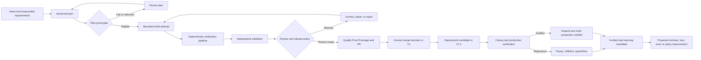
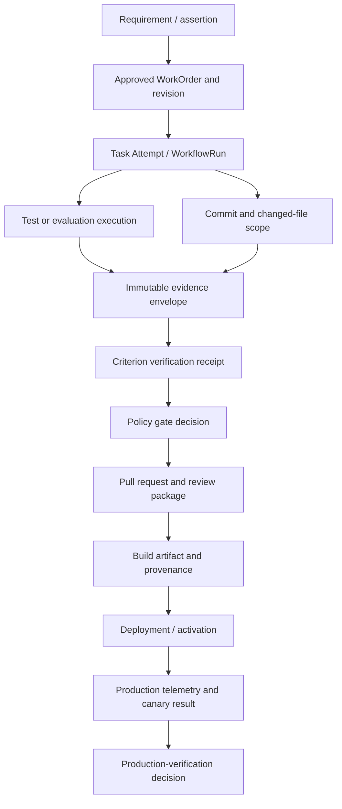

# Continuous Quality Proof for the Software Factory

## Executive decision

Add a continuous quality system that makes every governed transition prove its
eligibility with current, attributable evidence:

`Intent -> Plan -> Build -> Verify -> Validate -> Release -> Observe -> Learn`

The system will not promise defect-free software. It will make a narrower,
credible guarantee:

> Mission Control does not advance governed work unless the active quality
> contract is satisfied by sufficient, current, independently produced evidence
> under the applicable policy version.

This is an extension and consolidation of the current Mission, WorkOrder,
Task, Attempt, receipt, QC, approval, PR, and deployment contracts. It is not a
new QA lifecycle, a second run engine, or a new primary navigation domain.

The delivery boundary remains production-minded:

- **V1:** prove one real Mission from approved intent to an evidence-backed,
  review-ready pull request. Merge remains human-only.
- **V1.1:** extend the same contract through deployment, canary, production
  verification, and browser-operable rollback.
- **Post-V1:** use measured Agent Reliability, Change Risk, and Artifact
  Confidence to increase bounded autonomy. Do not begin with auto-merge.

## What problem this solves

Mission Control already records many of the right facts, but quality is still
fragmented across Mission assertions, WorkOrder criteria, verification
receipts, QC runs and findings, PR checks, release-gate evaluations, deployment
records, and preview UI surfaces. That creates four launch risks:

1. A worker or model summary can still look more authoritative than the tools
   that actually ran.
2. A passing score can obscure missing, stale, conflicting, self-produced, or
   incorrectly correlated evidence.
3. Release gates remain partly shadow-only, and the repository's E2E CI job is
   currently allowed to fail without blocking the workflow.
4. Operators must reconstruct why a change is safe from several pages and
   record types instead of receiving one criterion-level decision package.

The desired operator outcome is simple:

> For any Mission, WorkOrder, pull request, or release candidate, show what
> must be true, what evidence exists, what is missing or invalid, which policy
> decided the gate, who must act next, and what the system will do afterward.

## Product principles

1. **Evidence over assertion.** Agent prose is context, never proof.
2. **Hard gates over blended scores.** A critical failure cannot be averaged
   away.
3. **One authoritative hierarchy.** Preserve
   `Mission -> Plan -> WorkOrder -> Task -> Attempt -> evidence -> PR -> release`.
4. **Independent judgment.** The producer cannot be the only verifier for a
   material change.
5. **Risk-proportional governance.** More consequential or irreversible work
   requires stronger evidence and authority.
6. **Fail closed.** Missing identity, lineage, policy, evidence, or freshness
   produces `UNKNOWN` or `BLOCKED`, never an inferred pass.
7. **Append-only truth.** Supersede or invalidate evidence; do not silently
   rewrite it.
8. **Production is a verification environment.** Merge, deploy, activate, and
   production-verify remain distinct states.
9. **Learning proposes; policy disposes.** Incidents may propose tests, evals,
   or rules, but cannot promote them without governed review.
10. **Exceptions first.** The UI leads with blockers, required decisions,
    risk, and evidence gaps—not agent activity wallpaper.

## Definitions

Use these terms consistently in product copy, schema, docs, and policy:

| Term | Meaning in Mission Control |
| --- | --- |
| Quality assurance | Preventive system design: requirements, policies, workflows, standards, and review practices that reduce defect creation. |
| Verification | Objective evidence that the implementation satisfies its specified contract: “Did we build it according to the approved plan?” |
| Validation | Evidence that the resulting behavior solves the intended user or operational need: “Did we build the right outcome?” |
| Evaluation | A measured assessment, especially for probabilistic AI behavior, performed under a versioned dataset, harness, rubric, model, and budget. |
| Evidence | An immutable, attributable observation produced by a tool, environment, verifier, or approved human procedure. |
| Finding | A defect, risk, gap, conflict, uncertainty, or policy violation derived from evidence. |
| Gate | A deterministic policy decision over a frozen contract and current evidence. |
| Waiver | A scoped, expiring authorization to proceed despite a named unmet control, with compensating controls. |
| Quality Proof Package | The reviewable contract, evidence graph, findings, decisions, provenance, limitations, and rollback information for one governed subject. |

## Scope and non-goals

### In scope

- Executable, versioned quality contracts for Mission plans and WorkOrder
  revisions.
- Pre-code plan validation and risk review.
- Deterministic build, lint, test, analysis, security, dependency, and browser
  evidence ingestion.
- AI-specific evals for agent workflows and AI product features.
- Independent verifier orchestration and separation of duties.
- One evidence envelope and one policy evaluator across acceptance, PR, and
  release gates.
- Risk-based human approval and explicit waiver lifecycle.
- A unified Quality surface and generated Quality Proof Package.
- Progressive release verification, automated pause/rollback, and learning
  from escaped defects in V1.1.

### Not in scope

- Claiming that released software has no defects.
- Replacing the repository's test frameworks with a Mission Control-specific
  framework.
- Supporting every Git, CI, scanner, or observability provider in V1.
- Auto-merging low-risk changes in V1.
- Letting an LLM grade its own implementation as sufficient release evidence.
- Treating code coverage, an LLM score, or a numeric confidence value as a
  release decision by itself.
- Creating a separate `QualityTask`, `AgentRun`, or deployment lifecycle.
- Rewriting historical records to imply independence, signatures, or lineage
  that was not captured at the time.

## Current system assessment

| Existing capability | Current source | Keep / change |
| --- | --- | --- |
| Versioned Mission plans and validation assertions | `convex/schema.ts`, `convex/missions.ts`, `convex/lib/missionPlan.ts` | Keep as the intent and approved-plan contract; enrich requirement types and freeze a quality-contract hash. |
| WorkOrder acceptance criteria and revisions | `convex/schema.ts`, `convex/workOrders.ts`, `convex/lib/workOrderGovernance.ts` | Keep as the governed delivery and acceptance boundary. |
| Verification receipts, run events, and artifacts | `convex/schema.ts`, `convex/workOrders.ts`, `convex/workflowRuns.ts` | Keep, but normalize evidence identity, subject, lineage, freshness, integrity, and independence. |
| Mission handoffs and independent validator role | `convex/lib/missionExecution.ts`, `convex/lib/missionGovernance.ts` | Keep and expand to policy-selected verifier profiles. |
| QC runs, findings, rulesets, artifacts, and metrics | `convex/qcRuns.ts`, `convex/qcRulesets.ts`, `convex/schema.ts` | Adapt into the canonical evidence path; do not make QC a parallel release authority. |
| Change-risk policies | `convex/context/changeRisk.ts`, `convex/lib/riskClassifier.ts` | Consolidate tool risk, change risk, and release consequence into versioned policy inputs. |
| PR/CI evidence | `convex/factory/codeReviewWizard.ts`, `harnessPrChecks` | Retain exact repository/head correlation; unmatched evidence remains uncorrelated. |
| Shadow release gate | `convex/governance/releaseGateAutomation.ts`, `convex/governance/deployments.ts` | Preserve shadow evaluation, then add measured enforcement modes. Current activation must not stay permissive indefinitely. |
| Quality UI | `apps/mission-control-ui/src/sections/QualitySection.tsx`, QC views, harness quality views | Consolidate under one `/v2/quality` surface with stable evidence deep links. |
| Evidence lineage panel | `apps/mission-control-ui/src/controlPlane/EvidenceLineagePanel.tsx` | Reuse the interaction pattern, but drive it from canonical contract/evidence lineage rather than a page-specific projection. |
| CI workflow | `.github/workflows/ci.yml` | Preserve current fast gates; quarantine and repair flaky E2E before converting it from `continue-on-error` to an enforced required check. |

### Institutional learning to apply

The high-severity solution in
`docs/solutions/build-errors/missing-convex-schema-contracts-ci-20260730.md`
documents a prior failure where release-gate consumers landed without the full
Convex table, field, index, and generated-type contract. Every phase below must
ship schema, indexes, producers, consumers, generated types, and focused tests
atomically. A local compatibility shim is not an acceptable integration plan.

## Target lifecycle



### Gate semantics

Every governed gate returns one of these states:

| State | Meaning | Progression |
| --- | --- | --- |
| `ELIGIBLE` | All hard requirements pass; required approvals and independent evidence are current. | May advance to the named next state. |
| `INELIGIBLE` | One or more hard controls failed. | Block; require correction, rejection, or an allowed waiver. |
| `UNKNOWN` | Required evidence, identity, policy, lineage, environment, or correlation is missing or ambiguous. | Block and explain remediation. |
| `STALE` | Evidence was once usable but no longer covers the active revision, commit, environment, or freshness window. | Block until reverified. |
| `WAIVER_REQUIRED` | Policy allows a waiver but no valid authorized waiver exists. | Route to the named approver. |
| `AWAITING_HUMAN` | Technical evidence is sufficient, but policy reserves the decision for a human. | Present a decision packet; do not auto-advance. |

`WARN` may exist as a finding severity, but not as an ambiguous release state.

### Complete operator and system flows

#### Flow 1 — Define and prove the contract

1. An author creates or revises a Mission plan.
2. The deterministic compiler reports missing, ambiguous, duplicate, uncovered,
   or unmeasurable requirements inline.
3. An independent plan reviewer records architecture, security, test, dependency,
   migration, and recovery findings.
4. The server evaluates the plan proof under the selected policy version.
5. A failed or unknown proof returns the plan for revision; an eligible proof
   allows the authorized human approval decision.
6. Approval freezes the contract snapshot/hash and materializes WorkOrders and
   validation assertions idempotently.

#### Flow 2 — Build, verify, and correct

1. Dispatch pins the contract, WorkOrder revision, repository scope, execution
   policy, verifier profile, environment, tools, runtime, and budgets.
2. The builder performs a bounded Attempt and emits events, changes, and raw
   artifacts.
3. Deterministic checks produce normalized evidence envelopes.
4. Failure creates a classified finding and bounded corrective path. The same
   action cannot repeat without new diagnostic evidence or a new hypothesis.
5. A correction creates a new Attempt and exact-head evidence; prior evidence
   remains historical and becomes stale where its subject no longer matches.

#### Flow 3 — Independently validate and accept

1. Policy selects required verifier roles from contract category and risk.
2. Each verifier evaluates the frozen artifact and records evidence/findings;
   it cannot modify the artifact under evaluation.
3. Conflicting, inconclusive, or self-produced-only results block and explain
   the next safe action.
4. The evaluator computes requirement states and WorkOrder eligibility.
5. Technical eligibility moves the WorkOrder to its human decision when policy
   requires one; it does not silently accept or merge.

#### Flow 4 — Waive, reject, or reconcile

1. An authorized actor requests a waiver or evidence reconciliation against an
   exact requirement, subject, revision, and gate.
2. The request names the gap, duration, impact, compensating control, and owner.
3. A distinct authorized approver accepts, rejects, or requests more evidence.
4. Approval never changes the original evidence result; it creates a separate,
   expiring decision consumed by the evaluator.
5. Expiry, revocation, material change, or compensating-control failure reopens
   the affected gate.

#### Flow 5 — Review and release

1. Mission Control generates the proof package and exact-head required check.
2. New commits immediately invalidate head-specific eligibility.
3. A human reviews, requests correction, rejects, or merges in V1.
4. In V1.1 the release authority selects an approved rollout policy.
5. The system deploys progressively, compares candidate and control, expands on
   pass, holds on inconclusive evidence, and rolls back or escalates on failure.

#### Flow 6 — Learn from an escape or false gate

1. A defect, rollback, operator overturn, noisy gate, or invalid evaluation is
   linked to the exact release and decision lineage.
2. Root-cause analysis classifies whether the gap was in intent, evidence,
   test/eval validity, correlation, policy, implementation, or operations.
3. The system proposes a bounded regression, contract, policy, or instruction
   improvement.
4. Acceptance creates ordinary governed work; the learning cannot approve or
   activate itself.
5. A measured follow-up determines whether the improvement reduced escapes
   without unacceptable delay, flakiness, or cost.

### Flow permutations and required behavior

| Dimension | Required behavior |
| --- | --- |
| First attempt / correction / retry | Preserve every Attempt; require a classified failure and new evidence or hypothesis before repeat work. |
| Low / medium / high / critical risk | Select different evidence, independence, approval, rollback, and release policies without changing the canonical lifecycle. |
| Exact / ambiguous / unmatched lineage | Exact may be evaluated; ambiguous or unmatched remains uncorrelated and blocked until audited reconciliation. |
| Pass / fail / error / inconclusive / conflict | Do not collapse tool errors or inconclusive results into product failures; all non-pass states remain explicit and policy-evaluated. |
| Current / stale / revoked evidence | Only current evidence is usable; stale and revoked records remain visible and trigger targeted re-verification. |
| Local / CI / staging / production | Record environment fingerprints; one environment's result does not silently satisfy another environment's contract. |
| Deterministic tool / LLM grader / human procedure | Apply source-specific sufficiency and calibration rules; no source receives universal authority. |
| Healthy / degraded / unavailable provider | Persist pending/degraded state, bounded retry, timeout, and safe escalation; provider outage yields `UNKNOWN`, never pass. |
| Unchanged / changed contract, code, tool, environment, or policy | Re-evaluate materiality and invalidate only affected evidence where safe; full reopen for policy-selected critical changes. |
| Browser refresh / control-plane restart / executor crash | Resume from durable state and idempotency keys without duplicate checks, transitions, or evidence. |
| Cancellation before / during / after external execution | Stop new work, request provider cancellation where possible, ingest late results without advancing canceled work, and expose cleanup state. |
| Normal / emergency delivery | Use the same evidence model; emergency policy may reduce latency or defer named checks only through explicit human break-glass authority and mandatory follow-up. |
| Human / agent / scheduler / webhook / executor | Authenticate distinct caller types and retain their real authority, source, and identity; never trust a client-supplied actor label. |
| Desktop / narrow viewport / keyboard / reduced motion | Preserve the same decision path and evidence meaning with accessible controls and non-color status. |

### Version and material-change semantics

- An Attempt executes under pinned contract, WorkOrder, repository, runtime,
  tool, verifier-profile, and execution-policy versions for reproducibility.
- Acceptance, merge, and release evaluate the exact artifact against the current
  gate policy as well as the frozen contract. A newer policy may demand
  additional proof, but may not retroactively invent a pass.
- An emergency deny/quarantine policy may stop an active Attempt when a newly
  discovered vulnerability or authority failure makes continuation unsafe.
- A material requirement change creates a new plan/WorkOrder revision and
  invalidates affected evidence through revision/reopen records. It never
  patches the approved contract in place.
- A new commit, changed environment fingerprint, changed verifier configuration,
  or changed evaluation harness invalidates only evidence whose declared scope
  no longer matches, unless policy requires a full reopen.
- Policy upgrades record whether in-flight work may finish its Attempt, must
  pause before the next tool call, or must stop immediately. The default is to
  finish a safe local step but re-evaluate before any governed transition.

## Quality Contract

### Product decision

Treat the approved `missionPlan` revision as the top-level Quality Contract.
Do not add a competing contract lifecycle. Materialize and hash a normalized
contract compiled from:

- Mission outcome, business reason, source-of-truth references, constraints,
  budget, stop condition, and risk hints;
- functional requirements and acceptance criteria;
- non-functional requirements for performance, security, reliability,
  accessibility, privacy, scalability, and operability;
- architecture constraints and protected boundaries;
- expected failure modes, negative cases, recovery behavior, and rollback;
- required test and evaluation scenarios;
- independent verifier requirements;
- evidence sufficiency, freshness, environment, and lineage rules;
- required approvals, waiver policy, and release authority; and
- Definition of Done.

WorkOrder criteria remain the scoped, executable projection of that approved
contract. `validationAssertions` remain the Mission-level outcome projection.

### Contract item shape

The exact validator belongs in a design document before implementation, but the
minimum normalized item is:

```ts
type QualityContractItem = {
  requirementId: string;
  category:
    | "FUNCTIONAL"
    | "SECURITY"
    | "RELIABILITY"
    | "PERFORMANCE"
    | "ACCESSIBILITY"
    | "PRIVACY"
    | "OPERABILITY"
    | "AI_BEHAVIOR"
    | "ARCHITECTURE";
  title: string;
  statement: string;
  passCondition: string;
  criticality: "MUST" | "SHOULD" | "INFORMATIONAL";
  riskLevel: "LOW" | "MEDIUM" | "HIGH" | "CRITICAL";
  sourceRefs: Array<{ kind: string; location: string; version?: string }>;
  expectedEvidence: Array<{
    kind: string;
    minimumCount: number;
    allowedProducerRoles: string[];
    independent: boolean;
    allowedEnvironments: string[];
    freshnessHours?: number;
  }>;
  waiver: {
    allowed: boolean;
    approverRoles: string[];
    maximumHours?: number;
    compensatingControlRequired: boolean;
  };
};
```

### Contract compiler

On plan submission, a deterministic compiler must:

1. normalize identifiers and source references;
2. reject duplicate or unowned requirements;
3. ensure every `MUST` item has a measurable pass condition;
4. ensure every requirement maps to at least one WorkOrder;
5. require an independent Validator WorkOrder where policy demands it;
6. verify that rollback, migration, and recovery requirements exist for
   relevant change classes;
7. resolve the applicable versioned quality profile and policy;
8. produce a canonical JSON snapshot and content hash; and
9. record unresolved ambiguity as a blocking finding, not an invented default.

### Plan proof gate

Before code generation, run two layers:

- **Deterministic plan checks:** completeness, IDs, mappings, policy, risk,
  required evidence, dependency pinning, migration/rollback fields, ownership,
  and forbidden scope.
- **Independent plan review:** requirements coverage, architecture alignment,
  security implications, missing edge cases, dependency risk, test strategy,
  operational readiness, and plan-versus-budget feasibility.

The reviewing agent may produce findings, but the server-owned evaluator decides
whether those findings and deterministic checks satisfy the gate.

## Evidence architecture

### Requirement-to-evidence graph



The graph must answer both directions:

- “Why do we believe this requirement is satisfied?”
- “Which requirements and releases depend on this evidence?”

### Canonical evidence envelope

`verificationReceipts` currently encode a criterion verdict and require a
completed WorkOrder run. That is appropriate for acceptance, but too narrow for
plan checks, uncorrelated external CI, build provenance, or production
telemetry. Add an additive canonical evidence-envelope record and keep the
receipt as the criterion-level decision that consumes one or more envelopes.

Minimum envelope fields:

```ts
type EvidenceEnvelope = {
  evidenceId: string;
  schemaVersion: number;
  tenantId: Id<"tenants">;
  projectId: Id<"projects">;
  subject: {
    type: "MISSION_PLAN" | "WORK_ORDER" | "ATTEMPT" | "COMMIT" | "PR" | "BUILD" | "DEPLOYMENT";
    id: string;
    revision?: string;
  };
  kind:
    | "COMMAND"
    | "COMPILE"
    | "LINT"
    | "STATIC_ANALYSIS"
    | "TEST"
    | "SECURITY_SCAN"
    | "DEPENDENCY_SCAN"
    | "AI_EVAL"
    | "BROWSER"
    | "REVIEW"
    | "PROVENANCE"
    | "DEPLOYMENT"
    | "TELEMETRY"
    | "MANUAL";
  result: "PASS" | "FAIL" | "ERROR" | "CANCELED" | "INCONCLUSIVE";
  producer: { actorType: string; actorId: string; role: string };
  verifier?: { actorType: string; actorId: string; role: string };
  lineage: {
    missionId?: string;
    planId?: string;
    workOrderId?: string;
    taskId?: string;
    attemptId?: string;
    workflowRunId?: string;
    repositoryId?: string;
    commitSha?: string;
    pullRequestId?: string;
    buildDigest?: string;
    deploymentId?: string;
  };
  environment: { name: string; fingerprint?: string };
  tool: { name: string; version?: string; configHash?: string };
  artifactIds: Id<"runArtifacts">[];
  payloadHash: string;
  signature?: { format: string; reference: string; verifiedAt?: number };
  startedAt?: number;
  recordedAt: number;
  validUntil?: number;
  provenance: "LIVE" | "SYNTHETIC" | "DEMO" | "IMPORTED" | "LEGACY";
  confidence?: number;
  limitations?: string[];
};
```

### Integrity and provenance rules

- Hash evidence payloads and artifacts at ingestion.
- Bind evidence to the exact repository, commit, WorkOrder revision,
  environment fingerprint, tool version, and policy version.
- Verify signatures and signer identity when the source supports attestations.
- Use GitHub artifact attestations for distributable release artifacts where
  plan and account tier permit it; verify attestations before treating them as
  provenance evidence.
- Preserve raw provider references and redacted normalized summaries.
- Store secrets, full logs containing sensitive content, and large artifacts
  outside ordinary Convex fields; retain scoped references and hashes.
- Mark imported historical evidence `LEGACY`; never infer independent
  verification or signed provenance.
- Invalidate through a new record or explicit invalidation metadata. Never
  mutate a historical `PASS` into a different original outcome.

### Evidence sufficiency

Evidence is usable only when all are true:

1. the producer is authenticated and authorized for the claimed role;
2. the subject and exact revision/commit/build/deployment lineage match;
3. the evidence kind is allowed by the contract;
4. the environment satisfies the contract;
5. the evidence and any signatures pass integrity verification;
6. the evidence is within its freshness window;
7. independence rules are satisfied;
8. there is no newer conflicting evidence; and
9. the active policy version accepts the source and tool version.

## Policy, risk, confidence, and autonomy

Do not expose one overloaded “Trust Score.” Separate four concepts:

| Concept | Question answered | Release authority |
| --- | --- | --- |
| Release Eligibility | Are all hard controls satisfied right now? | Authoritative, deterministic gate result. |
| Change Risk | What is the consequence and blast radius if this change is wrong? | Selects required controls and human authority. |
| Artifact Confidence | How complete and persuasive is the evidence for this specific artifact? | Informational and explanatory; cannot override hard gates. |
| Agent Reliability | How has this agent performed on comparable governed work over time? | May constrain future assignment/autonomy; never proves the current artifact. |

### Risk classification

Compute risk from explainable inputs, not an opaque model score:

- protected paths and owned systems;
- authentication, authorization, secrets, and tenant isolation;
- payments, financial calculations, customer data, or regulatory logic;
- schema/data migration and irreversibility;
- infrastructure, deployment, network, dependency, or build-chain changes;
- public API and contract compatibility;
- blast radius, affected users, and rollback time;
- new external permissions or tool capabilities;
- AI prompt, tool, memory, evaluator, or model-routing changes; and
- uncertainty, novelty, and missing ownership.

Recommended governance matrix:

| Risk | Typical changes | Minimum governance in V1 |
| --- | --- | --- |
| Low | Docs, copy, isolated style, test-only changes | Deterministic checks, exact scope, review-ready PR; human merge remains required. |
| Medium | Business logic, APIs, dependencies, ordinary UI flows | Independent requirements validation, affected tests, CI, review package, human merge. |
| High | Auth, permissions, customer data, infrastructure, critical dependencies | Security and architecture verifier, negative/adversarial tests, required specialist approval, rollback proof. |
| Critical | Financial calculations, destructive migrations, regulated or production-control workflows | Multiple named approvals, specialized validation, tested rollback/recovery, canary and production verification. |

### Hard constraints

Examples that must block regardless of numeric confidence:

- required acceptance criteria not at 100% usable evidence;
- critical or high unwaived security findings;
- missing or mismatched repository/head/build lineage;
- worker is the sole verifier where independence is required;
- architecture constraint violation;
- missing tested rollback for a critical reversible-change policy;
- unknown tenant, actor, environment, or policy version;
- unresolved evidence conflict;
- failed required check; or
- expired waiver or evidence.

### Artifact Confidence

If the product displays a numeric summary, label it **Artifact Confidence** and
show its components and coverage. Initial dimensions may include:

- requirement coverage;
- evidence strength and source diversity;
- test and evaluation adequacy;
- security assurance;
- architecture compliance;
- performance and reliability evidence;
- observability and rollback readiness; and
- independent review coverage.

Do not publish decimal precision that the underlying evidence cannot support.
Begin with bands (`Insufficient`, `Limited`, `Moderate`, `Strong`) and a
dimension breakdown. Add a percentage only after calibration against escaped
defects and reviewer outcomes.

### Policy modes and rollout

Every gate policy has an explicit mode:

1. `OBSERVE_ONLY` — collect evidence and coverage; no decision claim.
2. `SHADOW` — calculate the decision and compare it with actual operator
   decisions; never block.
3. `ENFORCED` — block the named transition.
4. `EMERGENCY_BYPASS` — time-limited, named human authority with a mandatory
   reason, compensating control, incident link, and post-event review.

Promotion from shadow to enforced requires measured false-positive,
false-negative, unknown, latency, flake, and operator-overturn rates.

## Verification and validation automation

### Deterministic pipeline

AI-generated code is untrusted input to this pipeline:

`scope check -> compile/typecheck -> lint -> static analysis -> unit -> contract -> integration -> security -> dependency -> coverage -> build -> browser/E2E -> artifact provenance`

The active Quality Contract and detected change risk select the required
stages. The agent may propose tests or interpret failures; it may not forge or
replace the tool output.

### Fast and complete lanes

| Lane | Purpose | Target feedback | Examples |
| --- | --- | --- | --- |
| Attempt loop | Cheap feedback while building | Seconds to a few minutes | Focused typecheck, changed package tests, contract tests, scoped lint. |
| WorkOrder verification | Prove scoped acceptance | Under 10 minutes when practical | Required unit/integration tests, policy-selected security and browser checks. |
| PR gate | Prove exact head is review-ready | Repository-dependent | Full required CI, exact-head lineage, code review, build and evidence package. |
| Release gate | Prove artifact/environment readiness | Policy-dependent | Provenance, SBOM/dependency results, config compatibility, smoke/performance checks. |
| Production verification | Limit and detect customer impact | Defined canary window | Candidate-vs-control SLOs, errors, latency, security events, feature/business signals. |

Cost-aware test selection may reduce redundant work only when the policy records
why a test was omitted. Protected-path or contract changes can always expand to
the full suite.

### Test portfolio

Each repository quality profile can select from:

- unit and component tests;
- API and consumer-driven contract tests;
- integration and end-to-end tests;
- regression and characterization tests;
- property-based and invariant tests;
- negative, authorization, and cross-tenant tests;
- failure, timeout, retry, idempotency, cancellation, and recovery tests;
- migration forward/rollback and data-integrity tests;
- concurrency and race-condition tests;
- performance, load, resource, and reliability tests;
- security, secret, dependency, and supply-chain scans;
- accessibility and visual/browser tests; and
- mutation testing on risk-selected or historically fragile code.

Coverage is a diagnostic. A threshold may prevent severe under-testing, but
coverage does not prove that assertions are meaningful. Mutation survival,
escaped-defect history, assertion quality, boundary coverage, and independent
test review provide stronger evidence.

### Test quality controls

- Track flakiness separately from product failure.
- A flaky required test never silently becomes a pass. It becomes `UNKNOWN` or
  `WAIVER_REQUIRED` until quarantined under an approved policy.
- Limit automated retries and record every attempt. A pass-after-retry remains
  distinguishable from a clean pass.
- Require owners, expiry, and remediation WorkOrders for quarantined tests.
- Detect tests that were deleted, skipped, loosened, or changed with the
  implementation they are supposed to verify.
- Allow an independent Test Agent to add adversarial coverage after the builder
  finishes, but preserve human-readable rationale and tool results.
- Maintain hermetic fixtures where possible; record network, time, randomness,
  model, and external-service dependencies where not possible.

## AI-specific evaluation

Apply this when Mission Control changes agent prompts, tools, policies, memory,
model routes, evaluation logic, or ships a feature whose behavior depends on a
model.

### Required eval dimensions

- task success against representative user outcomes;
- requirement and rubric satisfaction;
- tool selection, argument accuracy, and authorization compliance;
- harmful or irreversible action rate;
- prompt injection and goal-hijack resistance;
- memory/context poisoning and cross-tenant leakage;
- hallucination and unsupported-claim rate;
- retrieval relevance, citation accuracy, freshness, and conflict handling;
- refusal correctness and safe escalation;
- failure recovery, bounded retry, and completion signaling;
- output variance and minimum reliability across repeated trials;
- latency, tokens, cost, wall time, retries, and cost per successful outcome;
- behavior under long context, compaction, tool failure, and partial state; and
- regression against a frozen baseline and challenger configuration.

### Eval validity contract

Every result must identify:

- the claim the evaluation is designed to support;
- dataset/version, sampling method, scenario distribution, and golden-set owner;
- model/provider/version, reasoning configuration, prompt, tools, policy,
  memory, and context versions;
- harness version, environment, timeouts, retries, token/turn/time/cost budget;
- grader type, rubric, grader version, calibration sample, and human audit rate;
- number of trials, variance or confidence interval where meaningful;
- known contamination, broken-task, reward-hacking, refusal, and scorer-shortcut
  checks; and
- limitations and conditions under which the result should not be generalized.

An LLM grader is evidence, not a ground truth oracle. Critical or subjective
claims require calibrated human review or deterministic outcome checks. Golden
sets must be versioned, permissioned, reviewed, and updated from real failures
without leaking protected evaluation answers into the builder context.

### Independence controls

- Prefer a different agent instance, prompt, and role for verification.
- For high-risk work, use a different model or deterministic tool where that
  materially reduces correlated failure.
- Do not reveal hidden adversarial cases to the builder.
- Record reviewer disagreements and operator overturns.
- Prevent the verifier from changing the code under evaluation; corrections
  create a new builder Attempt and new evidence.
- The Quality Judge evaluates structured evidence under policy and cannot
  mutate the artifact, waive its own finding, or approve release.

## Quality Proof Package

Generate the package from durable records, never from a final agent summary.

Minimum contents:

- Mission, approved plan revision, contract hash, WorkOrders, and exact scope;
- requirement-to-evidence matrix with explicit `PASS`, `FAIL`, `UNKNOWN`,
  `STALE`, `WAIVED`, `NOT_APPLICABLE`, and `CONFLICTING` states;
- implementation diff, changed files, commits, PR, and build digest;
- deterministic checks with commands, versions, environments, and results;
- independent review and outstanding findings;
- security, architecture, reliability, performance, accessibility, and AI eval
  summaries required by policy;
- risk classification, policy version, gate decisions, waivers, and approvals;
- deviations from the approved plan and unresolved uncertainty;
- deployment, activation, production-verification, and rollback data when they
  exist;
- evidence hashes/signatures and export timestamp; and
- known limitations and the exact next human decision.

Recommended status labels:

- `NOT_READY`
- `REVIEW_READY`
- `MERGE_APPROVED`
- `DEPLOYMENT_ELIGIBLE`
- `CANARY_VERIFIED`
- `PRODUCTION_VERIFIED`
- `ROLLED_BACK`
- `QUARANTINED`

If the product later calls this a “Software Quality Certificate,” the UI and
export must state what was proven and avoid implying defect-free or regulatory
certification.

## Production verification and recovery (V1.1)

### Progressive delivery contract

`build artifact -> attest -> deploy inactive -> smoke -> limited canary -> observe -> expand -> full activation -> verify`

For each stage record:

- candidate and control versions;
- audience/cohort and exposure percentage;
- start time, minimum observation window, and maximum exposure;
- SLO/error-budget allocation;
- health metrics and business/customer-impact signals;
- absolute and candidate-versus-control thresholds;
- sample sufficiency and inconclusive conditions;
- pause, rollback, and human-escalation thresholds; and
- operator, policy, and automation decisions.

Monitor at minimum error rate, latency, saturation, security events, dependency
health, critical business transactions, feature adoption where relevant, AI
task success, cost per transaction, and behavioral drift. Compare canary and
control directly; a global aggregate can hide a failing small cohort.

### Automated response

- `PASS`: expand only to the next approved stage.
- `INCONCLUSIVE`: hold exposure, gather more data within budget, or escalate.
- `FAIL`: stop expansion and execute the pre-authorized rollback or kill switch.
- rollback failure: open a critical incident and transfer authority to the
  named human owner.
- late or conflicting telemetry: invalidate production verification and reopen
  the release decision.

Every critical release must prove rollback before broad activation. “Rollback
documented” is not equivalent to “rollback tested.”

## Continuous learning

Production evidence closes the loop:

`incident or defect -> root cause -> missed requirement/control -> regression test or eval -> contract/policy proposal -> governed implementation -> measured outcome`

Enhancements:

- link every escaped defect to the release, requirement, evidence, agent,
  policy, and verifier that missed it;
- distinguish missing test, bad test, bad requirement, invalid eval, stale
  evidence, wrong correlation, policy gap, and ignored signal;
- propose one idempotent remediation WorkOrder per accepted root cause;
- add a regression case to the appropriate versioned suite or golden set;
- measure whether the new control catches the historical failure and what cost
  or latency it adds;
- lower Agent Reliability or autonomy only from attributable evidence and a
  sufficient comparison class;
- never auto-promote a rule, prompt, skill, policy, or memory item from one
  incident; and
- retain rollback or retirement for quality controls that create noise without
  reducing escaped defects.

## Operator experience

### Information architecture

Implement the existing IA decision: one `/v2/quality` surface with tabs, not
another navigation domain.

1. **Overview** — release eligibility, blockers, expiring evidence/waivers,
   current risks, and required decisions.
2. **Requirements & Evidence** — contract tree and bidirectional evidence graph.
3. **Runs** — deterministic tests, QC runs, AI evals, browser checks, and
   production verification, with distinct types.
4. **Findings** — open, waived, disputed, resolved, recurring, and escaped
   defects.
5. **Environments** — fingerprints, parity, readiness, and evidence freshness.
6. **Policies** — readable version, simulation, shadow outcomes, enforcement,
   and change history.
7. **Trends** — evidence completeness, first-pass rate, escaped defects,
   flakiness, recovery, quality cost, and operator overturns.

Stable deep links:

```text
/v2/quality?workspace=<id>&tab=overview
/v2/evidence/:evidenceId
/v2/quality/contracts/:contractId
/v2/quality/findings/:findingId
/v2/quality/runs/:runId
```

`contractId` is the approved `missionPlan` ID presented in quality language;
it is not a second contract entity.

### Interaction requirements

- Show the exact blocker, owner, age, safe options, and next automatic action.
- Explain why evidence is stale, conflicting, insufficient, or uncorrelated.
- Provide a policy simulation before enabling enforcement.
- Make waivers explicit, scoped, expiring, and visually distinct from passes.
- Put the Quality Proof Package on Mission, WorkOrder, PR/review, and release
  detail pages without duplicating its source of truth.
- Support loading, empty, partial, stale, error, permission-denied, blocked,
  recovery, success, and canceled states.
- Preserve workspace, entity, tab, filter, and selection through refresh and
  back/forward navigation.
- Meet the requirements in `docs/design.md`: dark/light, keyboard, visible
  focus, non-color status, narrow viewport, reduced motion, and WCAG 2.2 A/AA.

### Human/agent action parity

Every operator outcome needs an authorized agent or service command where
appropriate:

| Operator outcome | Agent/service capability | Authority rule |
| --- | --- | --- |
| Inspect a contract and gaps | Read contract, evidence, findings, and gate explanation | Read permission and workspace scope. |
| Run or rerun verification | Request a named verification profile for an exact subject | Execute permission; server selects allowed tools/environment. |
| Add a finding | Record a structured finding against evidence/subject | Verifier identity retained; no release decision. |
| Propose correction | Create a bounded remediation WorkOrder | Existing Mission/WorkOrder authority. |
| Request waiver | Submit waiver request with compensating control | Cannot approve own request. |
| Decide waiver or release | Human decision command | Named permission and separation of duties. |
| Quarantine evidence/test/eval | Propose or execute per policy | High-impact changes require approval. |
| Generate proof package | Read-only deterministic projection | No mutation authority required. |

The UI and agents must read and mutate the same Convex records through
server-owned commands so state updates reactively and no hidden CLI-only path
exists.

## Data and service design

### Additive schema direction

Prefer the smallest set of additive records:

- enrich `missionPlans.assertions` and `validationAssertions` with requirement
  category, criticality, source IDs, risk, and evidence-policy fields;
- add contract hash, schema version, and frozen quality-profile/policy version
  fields to `missionPlans`; the immutable approved plan is the snapshot, so do
  not create a duplicate contract document;
- add `evidenceEnvelopes` for normalized, immutable evidence that may exist
  before or outside a WorkOrder receipt;
- add canonical `qualityFindings` because current `qcFindings` requires a QC
  run and cannot cleanly represent plan, requirement, PR, release, production,
  conflict, waiver, or invalid-eval findings; adapt and retire `qcFindings`
  incrementally rather than weakening its historical contract;
- enrich `verificationReceipts` with consumed evidence-envelope IDs, evaluator
  version, independence result, and gate decision reference;
- add canonical `qualityGateDecisions` for any governed subject, policy mode,
  requirement result, blocking reason, and full evaluated input set;
  `releaseGateEvaluations` remains a legacy shadow adapter during migration;
- add append-only `evidenceReconciliations` for ambiguous external evidence and
  `evidenceInvalidations` for non-revision invalidation causes; keep existing
  revision/reopen records authoritative for WorkOrder material changes; and
- evolve `qcRulesets` into versioned quality-profile inputs by adding immutable
  version/supersession fields and freezing the selected normalized profile on
  the approved contract. Do not let an editable ruleset change an approved
  contract retroactively.

Do not add a generic unindexed polymorphic graph as the first implementation.
Use explicit subject type/id plus the indexes required by the golden path, and
add graph projections after query patterns are proven.

### Adapter contracts

```ts
interface EvidenceAdapter {
  validateConfiguration(): Promise<ConfigurationResult>;
  ingest(input: ProviderEvent): Promise<EvidenceEnvelopeDraft[]>;
  reconcile(input: EvidenceEnvelopeDraft): Promise<CorrelationResult>;
  health(): Promise<AdapterHealth>;
}

interface QualityGateEvaluator {
  evaluate(input: {
    subject: GovernedSubject;
    contractHash: string;
    policyVersion: string;
    evidenceIds: string[];
    now: number;
  }): Promise<GateDecision>;
}
```

Adapters normalize evidence. They do not decide acceptance, approve waivers,
merge, deploy, or broaden permissions.

### Query and retention constraints

- Index by workspace, subject, requirement, WorkOrder, run, commit, deployment,
  status, freshness, and idempotency keys required by the implemented journeys.
- Paginate histories and graph edges; never load an unbounded Mission ledger.
- Apply the approved retention decision: one year for audit/decisions, 90 days
  for execution evidence, and 30 days for sensitive temporary data, subject to
  later customer/legal requirements.
- Preserve durable hashes and minimal decision metadata after bulky artifact
  expiry when policy permits.
- Redact secrets and personal/customer data at ingestion and export.

## Implementation phases

### Phase 0 — Freeze terminology, baseline, and enforcement boundary

**Goal:** prevent a second QA system and measure the path before changing
authority.

- [ ] Record this plan's definitions and Quality Contract decision in the
  canonical glossary/architecture docs.
- [ ] Inventory every current quality producer, consumer, route, mutation,
  score, ruleset, and release gate against the current branch.
- [ ] Map Mission assertions, WorkOrder criteria, QC findings, PR checks, and
  release gates to one proposed evidence vocabulary.
- [ ] Measure current CI duration, failure, flake, retry, E2E non-blocking,
  evidence completeness, and operator-overturn baselines.
- [ ] Confirm the V1 enforcement boundary: plan, WorkOrder acceptance, and
  review-ready PR; production deployment enforcement remains V1.1.
- [ ] Define the exact first repository and golden-path fixture: Mission Control
  plus the approved safe GitHub sandbox.

**Exit gate:** one reviewed mapping names the authoritative owner and
disposition of every existing quality record and page; no unresolved naming
decision can create a table or route.

### Phase 1 — Compile executable Quality Contracts

**Goal:** make “done” machine-readable before code generation.

- [ ] Extend plan/assertion validators for categories, criticality, measurable
  pass conditions, required evidence, independence, freshness, failure modes,
  rollback, and waiver policy.
- [ ] Build the deterministic contract compiler and canonical hash.
- [ ] Add quality-profile templates for low, medium, high, and critical change
  classes; profiles are versioned defaults, not silent overrides.
- [ ] Add deterministic plan validation and independent plan-review findings.
- [ ] Block plan approval in shadow first, then enforce only after replaying the
  current golden-path fixtures and measuring false blocks.
- [ ] Show contract gaps and remediation in `MissionPlanWorkspace.tsx` and the
  Mission decision packet.

**Exit gate:** a plan cannot be approved in enforced mode with an uncovered
`MUST` requirement, missing measurable pass condition, required rollback gap,
or absent independent-verifier mapping.

### Phase 2 — Normalize and secure evidence

**Goal:** make tool output attributable, comparable, current, and reusable
across gates.

- [ ] Add the evidence-envelope schema, indexes, validators, and generated
  types in the same PR as its first producer and reader.
- [ ] Build adapters for current WorkflowRun artifacts/receipts, QC runs,
  GitHub PR/check evidence, browser evidence, and manual verification.
- [ ] Add exact subject, repository, head SHA, environment, tool/config version,
  producer identity, hash, provenance label, and freshness.
- [ ] Add signature verification fields and an initial GitHub artifact
  attestation adapter for release artifacts where supported.
- [ ] Add explicit uncorrelated, conflicting, invalid, legacy, demo, and
  synthetic states.
- [ ] Backfill existing records as `LEGACY` without inventing independence,
  signatures, or exact lineage.

**Exit gate:** every new golden-path completion claim consumes normalized
evidence; missing or ambiguous correlation remains visibly unresolved.

### Phase 3 — Ship one policy evaluator and staged enforcement

**Goal:** make the server, not the model or page, decide eligibility.

- [ ] Implement one pure evaluator for evidence sufficiency, hard constraints,
  approvals, waivers, independence, freshness, conflict, and lineage.
- [ ] Version all policy inputs and persist the full decision explanation.
- [ ] Consolidate tool risk, change risk, protected paths, blast radius, and
  release consequence into an explainable change-risk packet.
- [ ] Run `OBSERVE_ONLY`, then `SHADOW`, and compare decisions with operator
  outcomes.
- [ ] Enforce WorkOrder acceptance first.
- [ ] Publish an exact-head GitHub required check only after webhook identity,
  replay, and correlation are proven.
- [ ] Repair or quarantine E2E flakiness with owner/expiry, then remove
  `continue-on-error` for the golden-path required journey.
- [ ] Preserve emergency bypass as an audited human-only break-glass path.

**Exit gate:** a failed, missing, stale, conflicting, uncorrelated, unauthorized,
or self-produced-only requirement cannot be accepted or reported green.

### Phase 4 — Orchestrate independent and adversarial verification

**Goal:** improve the evidence, not just the number of checks.

- [ ] Select verifier profiles by contract category and change risk.
- [ ] Add independent Requirements, Test, Security, Architecture, Review, and
  Risk verifier roles using the existing workflow/orchestrator contracts.
- [ ] Keep verifier findings structured and read-only against the evaluated
  artifact.
- [ ] Add adversarial test generation for boundaries, authorization, failure,
  recovery, concurrency, and misuse cases.
- [ ] Add risk-selected mutation testing and property/invariant checks.
- [ ] Implement flake classification, bounded rerun semantics, quarantine
  governance, and recurring remediation.
- [ ] Add AI eval datasets, harness/version capture, repeated-trial metrics,
  grader audits, injection/memory/tool tests, and cost per successful outcome.

**Exit gate:** the builder cannot be the sole material verifier, and one seeded
bad implementation is rejected by an independent tool-backed control in every
required high-risk category.

### Phase 5 — Consolidate the Quality operator surface and proof package

**Goal:** let one operator understand and act without reconstructing logs.

- [ ] Implement `/v2/quality` with Overview, Requirements & Evidence, Runs,
  Findings, Environments, Policies, and Trends.
- [ ] Redirect legacy QC routes and remove duplicate primary navigation items
  only after stable deep links and feature-flag rollback exist.
- [ ] Add requirement/evidence graph drill-down and reverse impact lookup.
- [ ] Generate the Quality Proof Package from durable records.
- [ ] Embed the current gate and proof summary in Mission, WorkOrder, PR review,
  and release details.
- [ ] Add policy simulation, shadow comparison, waiver expiry, evidence expiry,
  and uncorrelated-evidence queues.
- [ ] Verify all loading, empty, partial, stale, blocked, error, permission,
  recovery, and success states in the browser.

**V1 exit gate:** one real Mission reaches a human-reviewable PR with a complete,
current proof package and no hidden database/script step.

### Phase 6 — Govern release and production verification (V1.1)

**Goal:** extend proof from source/head to running customer behavior.

- [ ] Separate build, merge, deployment, activation, canary, expansion, and
  production-verification states.
- [ ] Generate and verify release artifact provenance and dependency/SBOM
  evidence for the selected build path.
- [ ] Add versioned rollout policies with limited cohorts, health windows,
  candidate/control metrics, and exposure budgets.
- [ ] Add automated pause, kill switch, and rollback commands under explicit
  pre-authorization and escalation policy.
- [ ] Add OpenTelemetry-compatible correlation across CI/CD and runtime events;
  treat current CI/CD semantic conventions as release-candidate guidance and
  version the adopted mapping.
- [ ] Prove rollback and recovery in a safe environment before broad activation.

**Exit gate:** a degraded canary automatically stops expansion, rolls back or
escalates as policy defines, preserves all evidence, and reopens governed work.

### Phase 7 — Calibrate learning, reliability, and bounded autonomy

**Goal:** increase autonomy only from demonstrated outcomes.

- [ ] Link defects, incidents, rollbacks, reviewer disagreements, and waivers to
  the responsible evidence and policy history.
- [ ] Calibrate Artifact Confidence bands against escaped defects and reviewer
  decisions before showing a percentage.
- [ ] Compute Agent Reliability by comparable task/risk class with minimum
  sample sizes, recency, uncertainty, and dispute/repair workflows.
- [ ] Use `Agent Reliability x Change Risk x Artifact Evidence` only to select
  assignment and approval policy; retain hard constraints.
- [ ] Promote proposed tests, evals, instructions, and policies through the
  existing governed Continuous Learning/Meta Loop.
- [ ] Consider narrow auto-merge only after a separate Product Owner decision,
  sustained production evidence, protected-branch enforcement, and tested
  rollback.

**Exit gate:** measured quality improves without hiding instability, increasing
escaped defects, or silently expanding agent authority.

## Delivery sizing and dependencies

Calendar estimates should be set only after Phase 0 measures the current branch.
Use accepted PR gates rather than a percentage-complete estimate for the whole
program.

| Phase | Relative size | Must follow | Primary expertise |
| --- | --- | --- | --- |
| 0. Baseline and decisions | M | Active authority/lineage assessment | Product, architecture, QA, Convex |
| 1. Quality Contract | L | Phase 0 vocabulary and policy boundary | Convex contracts, requirements, UI forms |
| 2. Evidence envelope | XL, split across adapters | Phase 1 frozen subject/requirement identifiers | Convex, integrations, security/provenance |
| 3. Gate evaluator | XL, staged rollout | Phases 1–2 and service identity | Policy, authorization, GitHub/CI |
| 4. Independent verification | XL, profile by profile | Enforced evidence semantics | Workflow engine, testing, security, AI evals |
| 5. Quality surface | L | Stable read models from Phases 1–4 | Product design, React, accessibility, browser QA |
| 6. Production verification | XL, V1.1 | Exact artifact lineage and deployment authority | Release engineering, observability, SRE |
| 7. Calibration/autonomy | L initially, ongoing | Stable production outcome history | Analytics, policy, product governance |

Minimum ownership for each enforcing slice:

- one contract/backend owner;
- one independent validator who did not implement the slice;
- one operator-UX owner for decision and recovery states; and
- a security or release specialist when the slice changes identity, evidence
  integrity, GitHub enforcement, deployment, or rollback.

## Recommended pull-request sequence

Keep blast radius reviewable. Do not combine schema foundation, policy
enforcement, UI consolidation, and production rollout in one PR.

1. `docs(quality): freeze quality contract and evidence semantics`
2. `feat(quality): compile versioned mission quality contracts`
3. `feat(quality): add plan proof checks in observe-only mode`
4. `feat(evidence): add canonical immutable evidence envelopes`
5. `feat(evidence): adapt workflow receipts and QC runs`
6. `feat(evidence): ingest exact-head GitHub and browser evidence`
7. `feat(policy): add versioned gate evaluator in shadow mode`
8. `feat(policy): enforce WorkOrder acceptance and waiver rules`
9. `feat(verification): orchestrate independent verifier profiles`
10. `feat(quality-ui): consolidate quality and proof package`
11. `ci(quality): require stable golden-path E2E and Mission Control check`
12. `feat(release): enforce provenance, canary, and rollback gates` (V1.1)
13. `feat(learning): calibrate artifact and agent reliability` (post-V1)

Each PR includes focused schema/contract tests, generated type validation,
authorization checks, migration/compatibility proof, and a rollback path.

## Migration and compatibility

1. Add fields/tables and readers without changing existing decisions.
2. Dual-write normalized evidence from current producers behind a feature flag.
3. Compare old projections and new evaluator outputs in shadow mode.
4. Mark historical records `LEGACY`; do not infer missing facts.
5. Backfill only stable, directly provable lineage.
6. Enforce WorkOrder acceptance before PR or deployment enforcement.
7. Redirect legacy QC routes only after the unified surface passes browser proof.
8. Retire duplicate decision code after a measured parity window and explicit
   rollback checkpoint.

Rollback must disable new enforcement while preserving records. It must never
delete gate decisions, waivers, findings, or evidence collected during the
rollout.

## Alternatives considered

### Add a standalone QA product and lifecycle

Rejected. It would duplicate Mission, WorkOrder, Task, Attempt, QC, evidence,
approval, and release records and force operators to reconcile competing truth.

### Extend verification receipts to represent every kind of evidence

Rejected. Receipts are criterion verdicts tied to completed WorkOrder runs.
Plan proof, uncorrelated CI, build provenance, and production telemetry can
exist outside that lifecycle. A general immutable envelope plus a receipt that
consumes envelopes preserves both responsibilities.

### Make the quality or trust score the release gate

Rejected. Weighted averages can hide critical failures and create false
precision. Release Eligibility remains a hard policy result; Artifact
Confidence is explanatory only.

### Enforce all existing QC and E2E checks immediately

Rejected. Current release evaluation is shadow-only and E2E is non-blocking.
Immediate enforcement would turn existing noise, flakiness, and correlation
gaps into a delivery outage. Observe and shadow before enforcing one gate at a
time.

### Use only independent agent reviewers

Rejected. Agent diversity can reduce some correlated errors, but it is not a
substitute for compilation, tests, scanners, exact lineage, authorization,
production telemetry, or human authority for consequential decisions.

### Include production auto-merge and full autonomous release in V1

Rejected. The first sellable promise is a review-ready PR with complete proof.
Production rollout and calibrated autonomy add blast radius before that path is
proven.

## Documentation deliverables

- Quality Contract schema, compiler, versioning, and material-change rules.
- Evidence envelope, adapter, integrity, freshness, reconciliation, and
  invalidation contract.
- Quality finding, verification receipt, waiver, and gate-decision semantics.
- Risk classification and separation-of-duties matrix.
- AI evaluation dataset, harness, grader, validity, and reporting guide.
- GitHub required-check and artifact-attestation integration guide.
- Flaky-test quarantine and remediation runbook.
- Quality Proof Package format and operator decision guide.
- V1.1 canary, SLO, pause, rollback, and production-verification runbook.
- Migration guide for legacy QC, release-gate, and evidence records.
- Deterministic browser-evidence index under `docs/testing/` for every promoted
  live capability.

Documentation must describe actual enforcement mode and data provenance. It
must not label observe-only, shadow, preview, demo, synthetic, or legacy
behavior as production proof.

## Acceptance criteria

### Contract and planning

- [ ] Every approved Mission plan has a canonical contract snapshot, hash,
  schema version, policy version, and source references.
- [ ] Every `MUST` requirement has a measurable pass condition, required
  evidence, mapped WorkOrder, and waiver rule.
- [ ] Risk-relevant changes require explicit failure, migration, recovery, and
  rollback requirements.
- [ ] Plan review findings block approval when the deterministic policy says
  evidence is insufficient.

### Evidence and verification

- [ ] Every completion claim maps to current criterion-level evidence.
- [ ] Evidence records producer, subject, exact revision/commit/environment,
  tool/config version, result, artifacts, integrity hash, and provenance.
- [ ] Required independent verification cannot be satisfied by the builder
  identity or the same unapproved role.
- [ ] `FAIL`, `UNKNOWN`, `STALE`, `CONFLICTING`, `WAIVED`, synthetic, demo,
  imported, and legacy evidence remain visibly distinct.
- [ ] A deleted, skipped, loosened, flaky, or pass-after-retry test is not
  displayed as an ordinary clean pass.
- [ ] Uncorrelated external evidence cannot advance governed state.

### Governance and security

- [ ] Workspace, repository, environment, actor, service, tool, and action
  authority are enforced server-side.
- [ ] Approver, worker, verifier, waiver approver, merger, and release roles are
  separated according to policy.
- [ ] High-impact agent actions require policy-selected human approval and
  least-privilege execution.
- [ ] Agent goal hijack, tool misuse, identity/privilege abuse, memory poisoning,
  unexpected code execution, and insecure agent communication have contract
  tests where applicable.
- [ ] Secrets and sensitive content are redacted from evidence, telemetry, and
  exports.

### Gate and release behavior

- [ ] One evaluator produces a durable, explainable decision for the exact
  subject, contract, evidence set, and policy version.
- [ ] Hard failures cannot be overridden by Artifact Confidence.
- [ ] Shadow-to-enforced promotion retains comparison metrics and an approved
  rollout decision.
- [ ] GitHub required checks accept only the configured app/source and exact
  head SHA.
- [ ] Merge remains human-only in V1.
- [ ] In V1.1, a failed or inconclusive canary cannot expand to full activation.

### Reliability and recovery

- [ ] Ingestion and evaluation are idempotent under duplicate provider events,
  retries, refresh, and process restart.
- [ ] Evidence history is append-only with explicit supersession/invalidation.
- [ ] Cancellation stops new verification work and reconciles late results.
- [ ] Policy/evaluator failure yields `UNKNOWN`, not `PASS`.
- [ ] Rollback is tested for critical releases and can be initiated through the
  governed UI.

### UX and accessibility

- [ ] Operators can answer “why is this blocked?” and “why is this eligible?”
  without reading raw logs.
- [ ] Every blocker shows owner, age, reason, safe options, and next behavior.
- [ ] Waivers, stale evidence, and uncertainty do not use color alone.
- [ ] Stable URLs open evidence, contract, finding, run, and decision details
  after refresh.
- [ ] Critical journeys pass dark/light, keyboard, narrow viewport, reduced
  motion, and WCAG 2.2 A/AA verification.

### Non-functional provisional targets

Confirm after Phase 0 baseline:

- [ ] Contract compilation and gate evaluation complete within 750 ms p95,
  excluding external tools/providers.
- [ ] Fast Attempt feedback completes in under 3 minutes p95 for the initial
  repository profile.
- [ ] Required PR feedback completes in under 10 minutes p95 when no external
  provider is degraded.
- [ ] Duplicate evidence ingestion produces one canonical envelope and an
  auditable duplicate receipt/event.
- [ ] A 10,000-record evidence history remains usable through indexed queries,
  pagination, and progressive graph loading.
- [ ] Gate availability and evaluator error rates have explicit SLOs before
  enforcement can block production delivery.

## Verification strategy for this feature

### Contract and unit tests

- contract normalization, stable hash, duplicate IDs, and coverage;
- policy selection and hard-constraint precedence;
- producer/verifier independence matrix;
- evidence lineage, integrity, freshness, invalidation, and conflict;
- risk classification, protected paths, and human-approval selection;
- waiver scope, approval, expiry, and compensating controls;
- Artifact Confidence excludes or penalizes unusable evidence without changing
  Release Eligibility;
- idempotency and schema/index contract tests; and
- migration rules that prevent historical trust inflation.

### Integration tests

- plan submission -> contract compile -> plan proof -> approval/revision;
- WorkOrder dispatch -> tool evidence -> independent receipt -> acceptance;
- failed check -> corrective Attempt -> fresh superseding evidence;
- exact GitHub head check -> required check -> review package;
- duplicate/replayed webhook -> one evidence envelope;
- uncorrelated PR or CI evidence -> blocked reconciliation queue;
- evaluator outage -> `UNKNOWN` and safe retry;
- expired waiver/evidence -> automatic reopening/block; and
- cancellation/restart -> preserved evidence and no duplicate transition.

### AI eval tests

- frozen golden tasks and adversarial hidden cases;
- repeated trials across prompt/tool/model changes;
- goal hijack, prompt injection, poisoned memory, tool misuse, privilege, and
  exfiltration attempts;
- correct refusal/escalation for missing authority;
- long-horizon completion, recovery, and budget behavior;
- grader calibration against human/deterministic outcomes; and
- reward-hacking, contamination, broken-case, and harness-drift checks.

### Browser journeys

1. create a plan with a missing measurable requirement and repair it;
2. view plan proof findings and approve a passing revision;
3. run a WorkOrder whose builder tests pass but independent validation fails;
4. correct the change and inspect superseded/fresh evidence;
5. attempt acceptance with stale, conflicting, and uncorrelated evidence;
6. request, reject, approve, expire, and reopen a waiver;
7. inspect a Quality Proof Package and exact-head PR check;
8. switch workspaces and prove no cross-workspace evidence leakage;
9. refresh/restart during verification and recover without duplicate evidence;
10. V1.1: fail a canary threshold, stop expansion, and complete rollback.

Browser evidence includes screenshots, trace, console/page/network errors,
created entity IDs, exact commit/config versions, audit decisions, and cleanup.

## Success metrics

### V1 ship metrics

- 100% of golden-path `MUST` requirements have explicit evidence state.
- 100% of acceptance and proof-package evidence has exact or explicitly
  uncorrelated lineage.
- 0 worker-only certifications where independence is required.
- 0 shadow/demo/synthetic results presented as enforced/live proof.
- 0 bypasses without actor, reason, scope, expiry, compensating control, and
  incident/review linkage.
- 0 critical accessibility findings in the governed quality journeys.
- 1 real Mission reaches a review-ready PR with a complete proof package and no
  direct database step.

### Outcome metrics after baseline

- first-pass requirement and independent-validation pass rate;
- defect escape and escaped-severity rate;
- change fail and deployment rework rate;
- failed deployment recovery time;
- validation failure found before PR vs after PR vs production;
- flaky required-check rate and quarantine age;
- evidence completeness, freshness, and conflict rate;
- operator overturn rate for shadow/enforced gate decisions;
- time from approved plan to review-ready PR;
- developer review time and confidence;
- verification compute/cost per accepted WorkOrder;
- AI task success, variance, and cost per successful outcome; and
- rollback and repeated-failure rates.

Do not optimize token volume, number of agents, generated lines, total checks,
or raw coverage as primary outcomes.

## Risks and mitigations

| Risk | Mitigation |
| --- | --- |
| Plan duplicates the existing V1 program | Treat this as the detailed quality/evidence slice and preserve the existing phase dependencies and V1 boundary. |
| New records create another quality hierarchy | Keep plan/assertion/criterion/receipt authoritative; add an envelope for evidence that cannot fit the receipt lifecycle. |
| Gate noise blocks delivery | Observe, shadow, measure, repair flakes, then enforce one transition at a time. |
| Numeric score creates false confidence | Separate Release Eligibility, Change Risk, Artifact Confidence, and Agent Reliability; hard gates always win. |
| AI reviewers share the builder's blind spots | Require deterministic tools, distinct roles, hidden adversarial cases, and model diversity for selected high-risk checks. |
| Test generation inflates quantity but not value | Track mutation survival, escaped defects, boundary coverage, and independent test review. |
| Evaluation benchmark is invalid | Version harness/budget/dataset/grader; audit contamination, reward hacking, broken cases, variance, and scorer shortcuts. |
| Historical data looks more trustworthy after migration | Mark it `LEGACY`; never infer identity, independence, signatures, or lineage. |
| Evidence storage becomes expensive or sensitive | Hash and reference large artifacts, paginate, redact at ingestion, and apply approved tiered retention. |
| Convex schema and consumers drift | Ship schema/index/producer/consumer/codegen/tests atomically per the documented critical learning. |
| E2E enforcement becomes flaky | Establish flake ownership and quarantine policy before removing `continue-on-error`; never silently accept retries. |
| Release automation expands blast radius | V1 stops at review-ready PR; V1.1 starts with limited canary, pre-authorized rollback, and human release authority. |
| Quality UI adds navigation sprawl | Consolidate existing QC and harness surfaces under `/v2/quality`; use tabs and contextual deep links. |
| Learning loop self-modifies policy unsafely | Learning produces a proposal and governed WorkOrder; it cannot approve or activate itself. |

## Product Owner decisions before implementation

Recommended defaults are first. These do not block the planning document, but
they must be recorded before the named implementation phase.

1. **V1 enforcement boundary:** WorkOrder acceptance and review-ready PR
   (recommended); defer deployment/activation enforcement to V1.1.
2. **Product language:** use `Artifact Confidence` plus `Release Eligibility`
   (recommended); do not launch a single generic `Trust Score`.
3. **Quality Contract owner:** approved Mission plan revision (recommended);
   avoid a second contract lifecycle.
4. **Initial evidence source set:** WorkflowRun/receipt, QC, GitHub, and browser
   adapters (recommended); defer additional CI/scanner providers.
5. **Release provenance:** GitHub artifact attestations for distributable
   artifacts where supported (recommended), with a provider-neutral envelope.
6. **E2E enforcement:** make the stable Mission golden path a required check
   after a measured flake-remediation window (recommended).
7. **High-risk verifier diversity:** deterministic tools plus a distinct
   verifier role, with a different model for selected critical AI judgments
   (recommended).
8. **Certificate language:** `Quality Proof Package` in V1 (recommended);
   evaluate customer-facing “certificate” language only after production proof.

## Additional recommendations

### Must have for a credible V1

- Contract compiler and plan proof before code.
- Canonical evidence envelope and exact lineage.
- One server-owned evaluator with hard-gate precedence.
- Independent validator enforcement.
- Explicit freshness, conflict, waiver, legacy, and uncorrelated states.
- Required stable golden-path CI and browser proof.
- One calm Quality surface and review package.

### Strong V1 enhancements if they do not delay the golden path

- Change-impact-based verification profiles.
- Protected-path and architecture-boundary policies.
- Flake governance and pass-after-retry visibility.
- Risk-selected mutation and property tests.
- Policy simulation and shadow comparison.
- Evidence reverse-impact lookup.

### V1.1 enhancements

- Signed build provenance and SBOM/VEX evidence.
- Candidate-versus-control canary analysis.
- Automated pause, kill switch, and rollback.
- Production SLO, business-signal, cost, and drift verification.
- Incident-to-regression automation.

### Later, only after calibration

- Artifact Confidence percentage.
- Agent Reliability-driven assignment/autonomy.
- Cross-repository contracts and release trains.
- Multi-provider evidence adapter SDK.
- Customer-facing compliance mappings or quality certificates.
- Narrow auto-merge for sustained low-risk, strongly evidenced change classes.

## Research basis

Primary and authoritative sources checked on 2026-08-11:

- [NIST Secure Software Development Framework SP 800-218](https://csrc.nist.gov/pubs/sp/800/218/final) defines outcome-based secure-development practices across the SDLC.
- [NIST SP 800-218A](https://csrc.nist.gov/pubs/sp/800/218/a/final) extends the SSDF for generative AI and should be used with SP 800-218.
- [NIST AI Risk Management Framework resources](https://www.nist.gov/itl/ai-risk-management-framework/ai-risk-management-framework-resources) and [NIST AI 600-1](https://nvlpubs.nist.gov/nistpubs/ai/NIST.AI.600-1.pdf) support lifecycle risk management and TEVV for generative AI. AI RMF 1.0 is under revision, so Mission Control mappings must be versioned rather than hard-coded as permanent.
- [DORA continuous delivery guidance](https://dora.dev/capabilities/continuous-delivery/) and [test automation guidance](https://dora.dev/capabilities/test-automation/) support continuous testing, reliable automated suites, and fast feedback throughout delivery.
- [DORA's 2026 delivery metrics](https://dora.dev/guides/dora-metrics/) use change lead time, deployment frequency, failed deployment recovery time, change fail rate, and deployment rework rate; use these alongside Mission Control's evidence and outcome metrics.
- [SLSA v1.2](https://slsa.dev/spec/v1.2/) and its [provenance model](https://slsa.dev/spec/v1.2/provenance) provide a compatible direction for artifact provenance. Mission Control must not claim a SLSA level it has not independently met.
- [GitHub artifact attestations](https://docs.github.com/en/actions/concepts/security/artifact-attestations) provide signed build provenance but explicitly do not guarantee artifact security; verification and policy remain required.
- [GitHub rulesets](https://docs.github.com/en/enterprise-cloud%40latest/repositories/configuring-branches-and-merges-in-your-repository/managing-rulesets/available-rules-for-rulesets) support required checks, expected check sources, code scanning, quality results, and merge controls for exact repository enforcement.
- [OWASP Top 10 for Agentic Applications 2026](https://genai.owasp.org/initiatives/agentic-security-initiative/) covers goal hijacking, tool misuse, identity/privilege abuse, supply-chain risk, memory poisoning, cascading failures, and other agent-specific threats relevant to verifier profiles.
- [OWASP guidance on excessive agency](https://genai.owasp.org/llmrisk/llm062025-excessive-agency/) recommends minimum privilege, acting in the user's authorization context, and human approval for high-impact actions.
- [Google SRE canary guidance](https://sre.google/workbook/canarying-releases/) supports partial, time-limited rollout, candidate-versus-control evaluation, gradual expansion, and automatic pause or rollback.
- [OpenTelemetry CI/CD semantic conventions](https://opentelemetry.io/docs/specs/semconv/cicd/) provide a useful correlation direction but are currently release-candidate status; adopted mappings must be versioned.
- [OpenAI's 2026 evaluation playbook](https://openai.com/index/trustworthy-third-party-evaluations-foundations/) emphasizes explicit claims, harness/tool/budget disclosure, and validity checks for reward hacking, contamination, broken tasks, refusals, and related distortions.
- [OpenAI's 2026 coding-evaluation audit](https://openai.com/index/separating-signal-from-noise-coding-evaluations/) is a timely warning that an impressive benchmark score can be invalid when tasks or graders are broken; evaluation-data quality needs its own QA pipeline.

## Immediate next step

Do not start with the score, certificate, production canary, or a new dashboard.

1. Finish the active authority, service-identity, and exact-lineage trust gate
   already required by the V1 program.
2. Execute Phase 0 as a bounded assessment and decision record.
3. Implement only the contract compiler and observe-only plan proof first.
4. Add normalized evidence before any new enforcement.
5. Promote one WorkOrder acceptance gate from shadow to enforced only after the
   replay and false-block evidence is reviewed.
