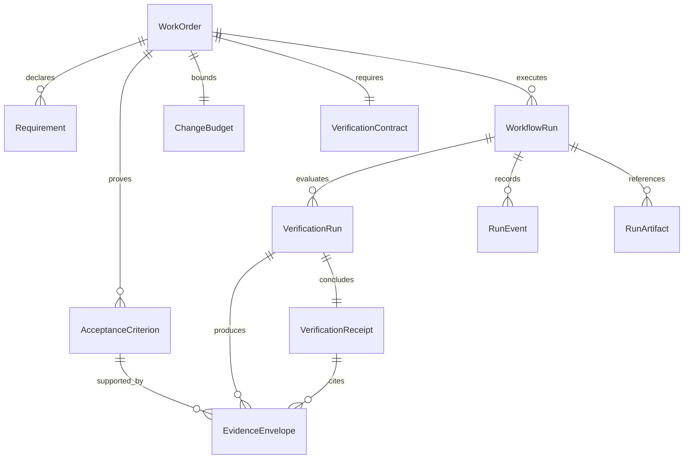

# Verification-first WorkOrder vertical slice

## Decision

Implement one production-shaped P0 slice in the existing delivery hierarchy:

`Governed WorkOrder -> bound Attempt -> candidate commit -> deterministic verification -> immutable evidence -> verification receipt -> verified pull request`

The slice stops at a human-reviewable pull request. It does not auto-merge,
deploy, create learned gates, or calculate a generic trust score.

## Repository audit

### What already exists

| Concern | Existing authority | Assessment |
| --- | --- | --- |
| Intent and plan | `missions`, `missionPlans`, `validationAssertions` | Versioned intent, approved plans, assertions, rollback, and independent-validator roles already exist. |
| Work contract | `workOrders`, `workOrderRevisions`, `workOrderEvents` | WorkOrders already own outcome, criteria, constraints, risk, approvals, revision validity, acceptance, reopen, and supersession. |
| Execution | `tasks`, `workflowRuns`, `runEvents`, `runArtifacts` | The canonical Task/Attempt engine already has snapshots, retries, leases, pause/resume states, artifacts, and ordered structured events. |
| Inspection | `WorkOrdersView`, `ExecutionRunInspector`, `EvidenceLineagePanel` | Existing operator surfaces already expose WorkOrder governance, criteria, receipts, run timelines, files, artifacts, and evidence lineage. |
| Orchestration | Hono orchestration server, `FactoryAttemptWorker`, workflow engine | The current worker claims a frozen attempt, runs `codex/v1` in an attempt-specific worktree, enforces code scopes, commits, pushes, and opens a PR. |
| Sandbox | `ExecutorAdapter`, `CodexV1ExecutorAdapter`, remote sandbox contract | An execution-provider boundary and local/worktree-backed V1 implementation exist. Multi-provider execution remains an extension point. |
| GitHub | GitHub App readiness, installation tokens, signed webhooks, exact PR/head correlation | The factory has a real least-privilege PR path and exact lineage; merge remains human-only. |
| Governance | `approvalDecisions`, policy envelopes, change-risk policy, signed service commands | Risk approvals and service authorization exist. Tool-risk and change-risk vocabularies are partially duplicated. |
| Verification | Criterion-level `verificationReceipts`, QC, PR checks, verifier registry | Missing evidence already blocks WorkOrder acceptance, but no server-owned attempt-level verification engine decides whether a PR may be created. |
| Evidence | `runArtifacts`, criterion receipts, PR/CI evidence reconciliation | Artifact lineage is real, but there is no canonical immutable evidence envelope with result, producer, exact revision, provenance, and check/criterion linkage. |
| CLI/API | `scripts/mc`, Convex queries, Hono WorkOrder endpoints | Existing commands expose WorkOrder governance and run evidence; verification-run status and final receipt are not yet first-class. |
| Trust/learning | agent reliability inputs, meta-loop suggestions, automation reliability | Useful foundations exist, but verified-outcome telemetry and learned-gate provenance are not unified. |

### What can be reused

- Extend `workOrders`; do not introduce a second ticket/spec object.
- Keep `workflowRuns` as the Attempt record and `runEvents` as its ordered event stream.
- Keep `runArtifacts` for durable/logical artifact references.
- Keep criterion receipts as the WorkOrder acceptance evidence boundary.
- Add an attempt-level receipt to the same receipt history rather than adding a competing receipt lifecycle.
- Freeze the executable WorkOrder specification inside the existing Factory execution manifest.
- Run verification inside the current attempt-specific worktree before the GitHub push/PR boundary.
- Use the existing signed Factory-attempt report channel to persist verification results.
- Extend the current WorkOrder and run inspector UI; do not add a new primary navigation domain.

### What is missing

1. Structured WorkOrder requirements, negative constraints, data boundaries,
   change budget, explainable risk reasons, and a machine-readable verification
   contract.
2. A deterministic `VerificationEngine` and verifier interface with explicit
   `PASS`, `FAIL`, `SKIPPED`, `NOT_CONFIGURED`, and `ERROR` results.
3. Machine enforcement of maximum files/lines, allowed/denied paths, dependency,
   schema, migration, and verification-infrastructure constraints.
4. Immutable evidence envelopes bound to the WorkOrder revision, Attempt,
   candidate commit, check, criterion, producer, artifact, hash, and provenance.
5. One durable attempt-level verification receipt with an explicit verdict and
   criterion/gate coverage.
6. Verification-before-PR sequencing. The current worker creates the PR from
   executor-reported commands before independent deterministic proof exists.
7. Operator and CLI projections for the final receipt and its evidence.

### Architectural conflicts and duplicated concepts

- `verificationReceipts` currently mean criterion decisions. The new overall
  receipt will be an additive `WORK_ORDER` scope in the same table; legacy rows
  remain `ACCEPTANCE_CRITERION` by default.
- `runArtifacts` are artifact references, not sufficient evidence records.
  `evidenceEnvelopes` will reference them and carry normalized proof metadata.
- Tool risk uses `GREEN/YELLOW/RED`; WorkOrder change risk uses
  `LOW/MEDIUM/HIGH/CRITICAL`. This slice preserves both and adds a deterministic
  change-risk assessment without renaming the established tool policy.
- QC, PR checks, and release gates remain producers/adapters. They do not become
  a second acceptance authority.

## Spec-flow decisions

- A legacy WorkOrder without a verification contract remains operable under its
  existing lifecycle, but its attempt-level verification state is honestly
  `NOT_CONFIGURED`; it is never displayed as verified.
- A WorkOrder with an `ENFORCED` verification contract cannot produce a PR
  unless every mandatory check passes and every mandatory acceptance criterion
  has usable evidence.
- A failed or missing mandatory verifier produces `NOT_VERIFIED`.
- A change-budget or protected-path violation produces `BLOCKED` and no PR.
- A technically passing result that still requires a named human decision
  produces `REQUIRES_HUMAN_REVIEW` and no automatic PR creation in this slice.
- Verification commands execute without a shell, inside the frozen worktree,
  with a bounded timeout and a command-policy decision. Missing configuration,
  denial, timeout, and process errors remain distinct non-pass results.
- Duplicate report delivery is idempotent. Historical evidence and receipts
  remain append-only; a new attempt creates new records.
- Browser refresh and process restart use stored WorkOrder/run/receipt state;
  no live model session is required to inspect results.

## Domain extension

The logical `Requirement`, `AcceptanceCriterion`, `ChangeBudget`, and
`VerificationContract` shapes remain embedded in the versioned WorkOrder
snapshot. Attempt results are separate append-only records because they repeat.

## Implementation

### 1. WorkOrder executable specification

- Add optional, strongly validated requirement, acceptance-evidence,
  positive/negative constraint, data-boundary, autonomy, change-budget,
  risk-reason, and verification-contract fields.
- Validate identifiers and mappings during WorkOrder creation.
- Deterministically classify the minimum risk and retain human-readable reasons.
- Freeze the complete spec into `factory-execution-manifest/v1`.

### 2. Verification plane

- Add a provider-neutral verifier contract and orchestration engine.
- Implement command, change-budget, negative-constraint, and acceptance-evidence
  verifiers.
- Treat independent AI review as a configured verifier category; if absent it
  returns `NOT_CONFIGURED`, never `PASS`.
- Commit locally, verify the exact candidate SHA, persist proof, and only then
  push/create the PR when verdict is `VERIFIED`.

### 3. Durable evidence and receipt

- Add `verificationRuns` and `evidenceEnvelopes` with indexes needed by the
  WorkOrder and run inspectors.
- Extend `verificationReceipts` with receipt scope, verification-run linkage,
  overall verdict, checks, coverage, violations, risk, source/candidate revision,
  and evidence IDs.
- Extend typed run/work-order events for verification lifecycle and budget/policy
  outcomes.

### 4. Operator, API, and CLI

- Project latest verification run, overall receipt, and evidence from existing
  WorkOrder/run queries.
- Add WorkOrder Specification, Verification, Evidence, Receipt, and specific
  Needs Attention content to the existing detail page and run inspector.
- Add one composable `mc work-order inspect` command that returns the existing
  WorkOrder summary plus specification, runs, receipt, and evidence without
  creating a second CLI hierarchy.
- Include the concise receipt summary in the PR body.

## Acceptance criteria

- [x] Structured WorkOrder specs validate requirement, criterion, check, and evidence mappings.
- [x] Explainable risk reasons and an enforceable change budget are persisted.
- [x] Mandatory `FAIL`, `SKIPPED`, `NOT_CONFIGURED`, or `ERROR` checks prevent `VERIFIED`.
- [x] Missing criterion evidence prevents `VERIFIED` even when ordinary commands pass.
- [x] File/line budget excess and denied/protected paths block the attempt before PR creation.
- [x] Verification evidence is immutable and bound to the exact candidate SHA and WorkOrder revision.
- [x] One durable receipt explains the verdict, coverage, checks, violations, risk, and human action.
- [x] Verification lifecycle is visible through structured events.
- [x] WorkOrder and run inspectors show the spec, verification, evidence, receipt, and specific blockers.
- [x] API/CLI projections expose summary, events, artifacts, verification, receipt, and evidence.
- [x] A configured, passing fixture reaches a verified PR package.
- [x] Missing evidence, budget violation, failed check, and missing verifier fixtures cannot become verified.

## Validation

- Focused unit tests for spec validation, risk, command policy, budget/path
  enforcement, verifier result semantics, coverage, receipt generation, and PR
  summary generation.
- Convex contract tests for schema/index/producer/query compatibility and
  idempotent immutable persistence.
- Orchestration tests for verification-before-PR and all required failure paths.
- UI model/component tests for coverage and blocker projections.
- Repository typecheck, lint, build, relevant full tests, and browser verification
  on `http://localhost:5180` with EOS flags enabled.

## Explicitly deferred

- Auto-merge, deployment, canary, production verification, and rollback.
- Automatic trust promotion or a generic trust score.
- Autonomous learned-gate creation.
- Full provider fleet for sandboxes, CI, security, and observability.
- A new `/v2/quality` primary surface; contextual verification must prove value first.
