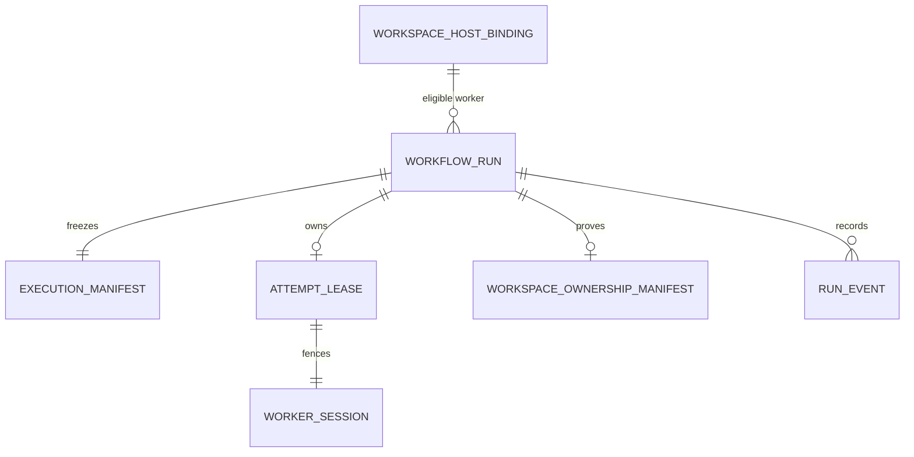

# Worker Runtime Leases and Recovery V1

## Problem

Mission Control's verification-first Factory worker has atomic leases and
governed publication, but its runtime identity, restart session, base commit,
process/worktree ownership, and cleanup proof are incomplete. A stale worker can
be fenced by lease expiry, but a replacement cannot determine whether reusing
or removing the old workspace is safe.

## Proposed solution

Extend the existing host binding, Factory Attempt lease, execution manifest,
executor lifecycle, and Git runtime. Do not add a new scheduler, acceptance API,
verification model, telemetry platform, dependency, or remote provider.

## Data and authority flow

The worker session and workspace manifest are additive snapshots on the
existing records/filesystem boundary, not new product-level entities.

## Implementation phases

### 1. Worker registration and capability matching

- [x] Add a bounded provider-neutral runtime snapshot to
      `workspaceHostBindings` and its report mutation.
- [x] Derive generation server-side when the session ID changes.
- [x] Report the orchestration worker's stable ID, process session, backend,
      executor capabilities, sandbox capabilities, repository access, slots,
      readiness, and heartbeat.
- [x] Add pure capability/readiness/capacity matching and deterministic denial
      reasons.
- [x] Keep existing host reports and Loom/codex-shaped executor data compatible.

### 2. Session-fenced leases and reconciliation

- [x] Bind new Factory leases to worker/session/generation without treating the
      lease ID as a credential.
- [x] Require the same active lease and worker session for renew, report, and
      publication authorization.
- [x] Atomically reject capability mismatch, stale session, draining worker,
      and exhausted slots.
- [x] Classify pending, active, recoverable, lost, canceled, retryable, and
      failed runtime states.
- [x] Preserve publication-checkpoint recovery after exact local proof; close
      all expired execution leases as LOST with a canonical event and new
      Attempt requirement.

### 3. Frozen base and provider-neutral execution boundary

- [x] Report and validate the host's exact default-branch commit.
- [x] Freeze `baseSha`, execution backend, and required runtime capabilities in
      the Attempt manifest and digest.
- [x] Create and diff worktrees from the frozen SHA, never a mutable branch
      lookup.
- [x] Keep executor adapter and WorkOrder/Attempt identity independent of the
      compute provider.

### 4. Process and workspace ownership

- [x] Add a protected ownership manifest outside the agent-writable worktree.
- [x] Persist exact repository, Attempt, worker/session/lease, branch/path,
      manifest digest, base SHA, process state, publication proof, and cleanup
      state.
- [x] Extend the executor lifecycle with bounded process-start and
      process-terminated observations.
- [x] Refuse existing-worktree adoption or lease transfer without complete
      ownership and termination proof.
- [x] Implement clean, published, exact-path `git worktree remove` without
      force; preserve every mismatch, dirty tree, unpublished head, active or
      unknown process.

### 5. Events, tests, and operations

- [x] Record worker registration/state transitions, Attempt lease/recovery/loss,
      cancellation, process termination, and cleanup outcomes in existing
      canonical stores.
- [x] Avoid durable heartbeat event spam.
- [x] Add deterministic unit/integration coverage for registration,
      capabilities, slots, leases, restart/loss, cancellation, process loss,
      immutable lineage, cleanup, executor compatibility, and authority
      isolation.
- [x] Add the local golden path and negative stale-worker/cleanup-mismatch paths.
- [x] Document operations, recovery, security invariants, and future enrollment.

## Flow completeness

| Flow | Expected outcome |
| --- | --- |
| First registration | Generation 1, READY only after bounded capabilities and fresh heartbeat |
| Same session heartbeat | Current state updates without durable event spam |
| Restart with new session | Generation increments; old session cannot renew or report |
| Eligible claim | Capability and slots pass atomically; exact worker/session lease is returned |
| Capacity exhausted | Claim rejected without changing Attempt history |
| Server restart | Active execution may renew only in the original session; expired execution becomes LOST, while an exact publication checkpoint can recover |
| Worker/process disappearance | Lease expires; unknown workspace is preserved; old Attempt becomes LOST/retryable |
| Operator cancellation | Lease mutations fence immediately; process aborts; cancellation history remains authoritative |
| Successful publication | Exact PR-head proof permits clean-only cleanup |
| Dirty/mismatched/unpublished cleanup | Workspace remains for operator inspection |
| Remote enrollment | No runtime path in V1; interface and credential requirements only |

## Acceptance criteria

- [x] Stable worker identity and restart session are distinct and
      provider-neutral.
- [x] Claim, renew, report, and publication are fenced by active lease and
      worker session.
- [x] Capability mismatch and slot exhaustion are deterministic and atomic.
- [x] The exact base SHA and execution requirements are immutable at dispatch.
- [x] Late writes from worker A fail after worker B/new lineage owns work.
- [x] Cross-session unknown process/workspace state fails closed as LOST.
- [x] Cleanup proves the full ownership tuple and never uses forced/global
      deletion.
- [x] Dirty, lost, mismatched, and unpublished workspaces are preserved.
- [x] Verification independence, subject creation, GitHub App lineage,
      `workOrders.accept`, merge, and release authority remain unchanged.
- [x] No paid infrastructure, VM, account, Clerk, or deferred-PR changes occur.
- [x] Focused tests, full typecheck/tests, runtime-contract guard, and the
      deterministic golden path pass.

## Risks and mitigations

- **Overlapping execution models:** use only the supported Factory Attempt path;
  do not promote generic `executions.*` into a second launcher.
- **False process ownership:** a PID alone is insufficient and may be reused;
  any missing lifecycle confirmation preserves the workspace.
- **Host report races:** derive generation and claim capacity in serializable
  Convex mutations; never trust client-reported occupied slots as the fence.
- **Schema drift:** land optional schema, validators, consumers, generated
  contracts, and tests atomically, following the documented repository lesson.
- **Contract churn:** run the extractor against the exact base and increment
  only for the optional host-report validator delta.
- **Cleanup data loss:** use exact-path `git worktree remove` without force and
  preserve on every ambiguity.

## Deferred work

Remote listener/enrollment deployment, per-worker credentials, credential
revocation UI, disposable compute adapters, exe.dev/Cloud Run capacity,
cross-host artifact transfer, hostile-code sandboxing, and automated salvage of
preserved workspaces remain separate promotion-gated initiatives.

## References

- `docs/architecture/worker-runtime-hardening-audit.md`
- `docs/decisions/worker-runtime-leases-recovery.md`
- `docs/architecture/executor-adapter-contract.md`
- `docs/architecture/remote-sandbox-execution.md`
- `docs/security/service-command-authentication.md`
- [owainlewis/factory architecture](https://github.com/owainlewis/factory/blob/8c71e44c2113fdf8ab5886a0b4c777926eab9c00/ARCHITECTURE.md)
- [owainlewis/factory worker contract](https://github.com/owainlewis/factory/blob/8c71e44c2113fdf8ab5886a0b4c777926eab9c00/docs/worker.md)
