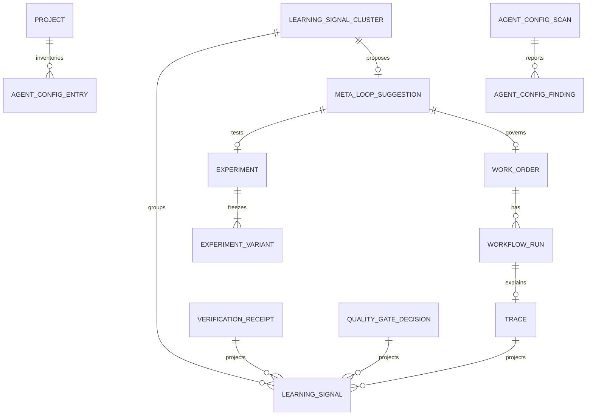

# Factory Learning and Continuous Improvement V1

## Overview

Build a governed vertical slice that converts deterministic execution evidence
into repository-scoped signals, recurring clusters, structured improvement
candidates, human-approved canonical experiments, and eventually a governed
WorkOrder. Add a read-only Agent Configuration Registry and integrate the
experience into the existing Factory surface.

The change must preserve every current authority boundary. Learning is an
advisory projection with no acceptance, verification, publication, merge,
routing, Factory Version, or governance mutation power.

## Research summary

- Architecture audit:
  `docs/architecture/2026-08-16-factory-learning-gap-analysis.md`.
- Target architecture:
  `docs/architecture/factory-learning-continuous-improvement.md`.
- Governance decision:
  `docs/decisions/factory-self-improvement-governance.md`.
- Agent Configuration Registry:
  `docs/architecture/agent-configuration-registry.md`.
- Product reference: [Blume](https://blume.codes/) for evidence-backed repeated
  steering suggestions only; no UI/storage/implementation copying.
- Institutional learning: every new Convex consumer/table/index/generated type
  must ship atomically and pass the runtime-contract extractor.

## SpecFlow analysis

### Operator flows

1. **No evidence yet**: Factory shows a truthful empty state, processing policy,
   and how signals are created. No candidate is fabricated.
2. **Refresh evidence**: an authorized operator runs a bounded deterministic
   scan. The UI reports inserted, duplicate, clustered, and candidate counts.
3. **Review candidate**: operator sees problem, evidence count, affected
   recipe/model/config, proposed change, expected benefit, risk, and lineage.
4. **Disposition**: operator may dismiss with reason, snooze until a date,
   reject with reason, or prepare an experiment. All decisions are audited.
5. **Approve experiment**: operator selects an existing dataset and enabled
   evaluators, reviews baseline/candidate configs, and explicitly approves.
6. **Experiment result**: canonical experiment metrics appear with sample size,
   observed deltas, and a low-sample label when appropriate. There is no
   automatic significance or promotion claim.
7. **Promote**: only an operator can turn a reviewed candidate into a governed
   WorkOrder. Existing WorkOrder approval/verification/publication/acceptance
   remains authoritative.
8. **Agent setup**: operator inspects the last synced config inventory and
   drift. Remediation is a suggested WorkOrder, never a direct edit.

### Error and recovery flows

- Missing workspace/repository: disable refresh and explain the missing scope.
- Extraction failure: retain source data, report error, allow retry.
- Duplicate evidence: return an idempotent success count, not a new signal.
- Missing experiment dataset/evaluator: disable approval with an exact next
  action and link to Observability/Evals.
- Stale/deleted candidate: close review state and refresh the list.
- Unauthorized review: fail closed through existing Factory permissions.
- Scan not yet synced: Agent Setup shows the exact CLI command and no fake rows.
- Candidate already processed concurrently: return current lifecycle state.
- Experiment failed/canceled: show terminal state and retain evidence; allow a
  new explicitly approved design rather than mutating history.

### Flow gaps resolved in this plan

- Mobile is supported as responsive inspection, but dense Factory operation is
  optimized for desktop.
- Offline writes are not queued; Convex errors are explicit and retryable.
- Snooze stores an absolute timestamp and does not delete the candidate.
- Dismiss means “not actionable now”; reject means “proposed change is not
  acceptable.” Both retain reasons.
- Configuration coverage gaps are informational unless an explicit
  contradiction exists.
- Scheduled processing is opt-in and reuses the existing Factory scheduler.

## Data model

New persisted models are projections only:

- `learningSignals`;
- `learningSignalClusters`;
- `agentConfigurationScans`;
- `agentConfigurationEntries`;
- `agentConfigurationFindings`.

`metaLoopSuggestions`, `experiments`, and `experimentVariants` are extended or
reused rather than duplicated.

## Implementation phases

### Phase 1 — documentation and deterministic domain model

- [x] Record the architecture gap analysis and authority map.
- [x] Record Factory Learning architecture and governance ADR.
- [x] Record Agent Configuration Registry and canonical-intent decision.
- [x] Add typed signal taxonomy, normalization, cluster aggregation,
  candidate mapping, experiment recommendation, and authority invariants.
- [x] Add deterministic unit fixtures for recurrence, duplicate suppression,
  repository isolation, automation opportunities, context misses, routing
  feedback, and experiment comparisons.

### Phase 2 — Convex projections and governed actions

- [x] Add atomic Convex tables/indexes and generated contracts.
- [x] Add bounded deterministic extraction from verification, quality gates,
  Attempts/retries/recovery, traces, and human decisions.
- [x] Add incremental aggregation and existing-meta-loop candidate creation.
- [x] Add candidate review actions: dismiss, snooze, reject, and approve a
  canonical experiment.
- [x] Link completed canonical experiment results and allow human promotion to
  the existing governed WorkOrder action.
- [x] Add opted-in scheduled processing through the existing Factory scheduler.
- [x] Prove learning records cannot affect acceptance or verification paths.

### Phase 3 — Agent Configuration Registry

- [x] Add bounded tracked-file discovery, digest, scope, precedence, and
  last-changed commit extraction.
- [x] Add deterministic intent normalization and drift detection.
- [x] Add explicit scoped sync to Convex and read-only queries.
- [x] Add CLI and deterministic scanner/drift tests.

### Phase 4 — Factory operator experience

- [x] Add Overview, Improvements, Signals, Experiments, and Agent Setup tabs to
  the existing Factory route.
- [x] Implement Basic/Intermediate/Advanced disclosure without changing
  authority.
- [x] Add loading, empty, error, success, disabled, and recovery states.
- [x] Add focused UI model/component tests and navigation coverage.
- [x] Add operator documentation to the in-product docs site.

### Phase 5 — qualification and delivery

- [x] Run targeted deterministic tests continuously.
- [x] Run Convex code generation, typecheck, lint, relevant integration tests,
  and full build.
- [x] Run the runtime contract extractor and increment version only if the
  public validator contract changed.
- [x] Start `pnpm run dev:demo` on port 5199 and validate the full operator flow
  with a real browser in dark and light themes.
- [x] Capture screenshot, accessibility, console, page-error, and failed-request
  evidence under `docs/validation/evidence/`.
- [x] Write the testing/qualification report and remaining P1/P2 scope.
- [x] Commit with the repository operator identity, push the branch, and open a
  draft PR. Do not merge.

## Acceptance criteria

### Functional

- [x] Three identical repository-scoped correction/failure signals create one
  cluster and at most one candidate.
- [x] The same evidence cannot create duplicate signals or candidates.
- [x] Signals cannot cross project or repository scope.
- [x] Deterministic automation opportunity signals can propose replacing
  repeated model/tool interpretation with a gate/script without fabricating
  savings.
- [x] An operator can inspect evidence, dismiss, snooze, reject, or approve an
  experiment.
- [x] Experiment approval reuses canonical datasets/evaluators/experiments and
  freezes two configurations.
- [x] Experiment comparison labels low sample sizes and never auto-promotes.
- [x] Repository/config changes can be initiated only through a governed
  WorkOrder.
- [x] Agent configuration scan reports path, harness, scope, digest,
  precedence, last commit, overlaps, and contradictions without editing files.

### Authority and security

- [x] All learning/config projections declare `acceptanceAuthority: false`.
- [x] Learning APIs have no path to verification receipts/evidence envelopes,
  WorkOrder acceptance, Factory Version mutation, routing policy mutation,
  publication, merge, credential handling, or worker fencing.
- [x] Candidate and config queries enforce workspace permissions.
- [x] Review actions are authenticated, audited, bounded, and fail closed.
- [x] Secret-looking configuration excerpts are redacted and file scans exclude
  untracked env/credential state.

### Non-functional

- [x] V1 performs zero LLM calls during extraction or clustering.
- [x] Every scan is bounded by rows, files, bytes, evidence count, and time
  window.
- [x] UI follows `docs/design.md`, uses semantic tokens/shared components, and
  is keyboard operable with WCAG AA contrast.
- [x] Runtime contract and generated Convex types remain synchronized.

## Risks and mitigations

- **Parallel framework sprawl**: reuse meta-loop and Observability/Evals.
- **False correlations**: deterministic identities only; show counts and
  evidence; no causal or significance claim.
- **Self-governance bypass**: explicit non-authority fields, separate governed
  WorkOrder, and authority tests.
- **Token furnace**: no semantic/LLM processing in V1; bounded incremental scan.
- **Configuration leakage**: tracked allowlist, size limits, redaction, no raw
  unbounded content persistence.
- **Schema/runtime drift**: atomic schema/functions/tests and runtime extractor.

## Post-deploy monitoring and validation

- Search activities for `FACTORY_LEARNING_`, `LEARNING_CANDIDATE_`, and
  `AGENT_CONFIG_` actions.
- Watch extraction duplicate rate, candidate creation count, scan duration,
  bounded-row caps, rejected cross-scope references, and Convex validator
  errors.
- Healthy: idempotent refreshes, no cross-scope rows, no learning-linked
  acceptance or verification writes, and experiments remain operator-created.
- Roll back/disable processing on any authority-boundary violation, unbounded
  scan, secret exposure, duplicate storm, or unexplained runtime-contract
  mismatch.
- Validation window: first 24 hours after deployment. Owner: Mission Control
  operator.
