# Spec-Driven Mission Intake V1

## Problem

Mission Control governs execution and acceptance well once a human-approved
Plan exists, but the intent entering that Plan is still mostly a mutable Mission
draft. Operators cannot inspect immutable requirements history, see which
project principles governed a decision, resolve deterministic ambiguities, or
prove that a Plan covers the exact approved specification it claims to
implement.

This plan adds the missing pre-Plan contract while preserving one execution and
acceptance path.

## Outcome

Ship one browser-operable Mission golden path:

```text
Define Mission
  -> write/revise Spec
  -> resolve bounded clarification findings
  -> pass deterministic Spec Quality gate
  -> finalize exact Spec revision
  -> create Plan bound to that revision
  -> submit with Spec-to-Plan consistency proof
  -> human approves Plan
  -> existing Quality Contract and WorkOrders are materialized
```

The Plan remains execution authority. WorkOrders retain requirement,
verification, evidence, and acceptance authority. Spec intake cannot dispatch,
verify, publish, accept, merge, route models, mutate Factory Versions, or alter
harness capabilities.

## Approved design prerequisite

Implementation begins only after the Product Owner approves these decisions:

1. Store the Constitution as an immutable per-project planning artifact linked
   to existing `governancePolicies` and optional `policyEnvelopes`, not inside
   those mutable runtime-policy records.
2. Keep Mission Spec content immutable. Saving creates a revision; Finalize
   appends an approval decision after a passing deterministic evaluation.
3. Bind a new/forked Plan to the current finalized Spec and Constitution.
   Changing either later requires an explicit new Plan revision.

Architecture record:
`docs/architecture/2026-08-16-spec-driven-mission-intake-audit.md`.

## Non-goals

- Installing GitHub Spec Kit or running its CLI inside Mission Control.
- A second orchestrator, agent loop, task table, planning engine, acceptance
  API, template installer, chat store, or generic policy engine.
- LLM-generated clarification or semantic analysis in V1.
- Automatic Plan generation, approval, dispatch, evidence creation, acceptance,
  publication, or merge.
- Backfilling fabricated Specs onto historical Missions.
- A new top-level navigation item or standalone Spec Kit surface.
- Changing the generic harness lifecycle introduced by PR #112.

## Authority and data flow

```mermaid
flowchart LR
  C["Project Constitution revision"] --> S["Mission Spec revision"]
  S --> G["Deterministic Spec Quality evaluation"]
  G --> D["Finalize decision"]
  D --> P["Mission Plan revision"]
  P --> A["Human Plan approval"]
  A --> Q["Quality Contract projection"]
  Q --> W["Existing WorkOrders"]
  W --> X["Attempts and harness execution"]
  X --> V["Existing verification and evidence"]
  V --> E["Existing WorkOrder and Mission acceptance"]
  M["Factory Memory"] -. "advisory context" .-> S
  L["Factory Learning"] -. "advisory improvement" .-> C
```



No reverse edge from Spec, Memory, Learning, or harness execution may invoke
approval, verification, publication, or acceptance.

## SpecFlow analysis

### Primary operator flow

1. Operator opens a DRAFT Mission and selects `Specification`.
2. Empty state explains the active Constitution and creates the first Spec
   revision from existing Mission objective/scope without fabricating content.
3. Operator completes outcome, personas/stories, requirements, acceptance and
   verification expectations, constraints, non-goals, risks, edge cases, and
   source references.
4. Save inserts an immutable revision with attribution and digest.
5. Evaluate returns structured blocking/advisory findings. The UI groups them by
   section and gives one exact next action per blocking finding.
6. Operator answers bounded clarification items by creating another revision.
7. A passing exact evaluation enables Finalize. Finalize records an append-only
   decision and does not authorize execution.
8. Operator creates a Plan already bound to the finalized Spec, evaluation, and
   Constitution revisions.
9. Plan author maps Spec requirements/expectations to assertions and WorkOrder
   blueprints. Coverage is visible before submission.
10. Server-side submission reruns lineage and consistency checks. Blocking
    findings retain the Plan in DRAFT; advisories remain visible.
11. Existing Plan review and human approval atomically compile the Quality
    Contract and materialize existing WorkOrders without dispatch.

### Revision and concurrency flows

- Saving from a stale base revision fails with the current revision identity and
  preserves the operator's client draft for reconciliation.
- Editing a finalized Spec creates a new revision. It never changes the old row
  or its bound Plans.
- A newer Spec does not make an older DRAFT Plan silently point elsewhere. The
  Plan displays `bound to revision N`; the operator explicitly forks/rebases a
  new Plan revision to adopt revision N+1.
- Activating a new Constitution affects future Spec/Plan bindings only. Existing
  lineage remains valid and inspectable.
- Concurrent Finalize calls are idempotent for the same Spec/evaluation and
  reject conflicting stale inputs.
- Rejecting a Plan does not reopen or mutate the Spec; revision work is explicit.

### Failure and recovery flows

- **No active Constitution:** block first Spec finalization and link an
  authorized operator to project governance setup.
- **Missing repository/code scope:** show a blocking finding and link to Mission
  scope fields; no Plan creation.
- **Evaluation failure:** retain the revision and findings; allow correction via
  a new revision.
- **Advisory-only findings:** allow Finalize and Plan submission while retaining
  the warnings in lineage.
- **Digest/ID mismatch:** fail closed with no Plan status transition.
- **Spec/Plan contradiction:** keep Plan DRAFT and identify the exact source and
  target IDs.
- **Unauthorized read/write:** use existing workspace/project permissions; do
  not reveal content across tenants.
- **Deleted or inaccessible policy reference:** fail closed for new finalization
  and submission; historical detail renders the stored ID/digest honestly.
- **Backend/network error:** preserve unsaved input locally, show retry, and do
  not imply that a revision or decision was saved.
- **Legacy Mission/Plan:** render an explicit legacy-lineage state; do not block
  existing approved/in-progress work.
- **Feature disabled:** `missions.spec-intake-v1` retains the current Mission
  and Plan flow unchanged.

## Implementation phases

### Phase 1 — pure contracts and immutable persistence

- [ ] Add typed validators and pure domain types for Constitution content,
  Mission Spec content, stable requirement/story/criterion/check IDs,
  clarification entries, quality findings, and lineage digests.
- [ ] Add `projectConstitutionRevisions` with project/revision indexes,
  canonical digest, attribution, exact governance policy references, principles,
  required sections, coding/testing, security, UX/accessibility, architecture,
  performance, dependency and verification constraints, and required checklist
  definitions.
- [ ] Add a nullable `currentConstitutionRevisionId` pointer to `projects`; an
  activation mutation changes only this pointer and never revision content.
- [ ] Add `missionSpecRevisions` with Mission/revision indexes, immutable typed
  content, Constitution lineage, source attribution, canonical digest, and base
  revision ID.
- [ ] Add `missionSpecDecisions` as append-only Finalize decisions tied to an
  exact revision and evaluation.
- [ ] Add `missionSpecQualityEvaluations` with ruleset version, immutable result,
  structured findings, exact Spec/Constitution digests, and attribution.
- [ ] Add `currentSpecRevisionId` to the Mission as a mutable DRAFT-only pointer.
- [ ] Add migration/read compatibility for absent fields and historical rows;
  never manufacture a revision or decision.
- [ ] Ship schema, indexes, public validators, generated types, consumers, and
  contract tests atomically.

### Phase 2 — deterministic clarification and quality gate

- [ ] Implement a side-effect-free evaluator in a focused library, separate
  from the existing execution Quality Gate state machine.
- [ ] Check required sections, bounded field sizes, ambiguous placeholders,
  stable-ID uniqueness, Given-When-Then completeness, measurable outcomes,
  acceptance/verification testability, repository/scope completeness,
  contradictory constraints/non-goals, Constitution inheritance, and unresolved
  clarifications.
- [ ] Return stable finding codes, `BLOCKING`/`ADVISORY` severity, field or
  artifact IDs, plain-language explanation, and one suggested next action.
- [ ] Bound evaluation by deterministic maximum stories, requirements,
  criteria, checks, risks, edge cases, sources, clarifications, and findings.
- [ ] Represent deterministic clarification prompts as findings. Answers are
  persisted only in a new immutable Spec revision; do not create a chat thread
  or invoke a model.
- [ ] Add authenticated, workspace-scoped mutations/queries to create a
  Constitution revision, activate it, save a Spec revision, evaluate, finalize,
  and list exact history.
- [ ] Audit every mutation with actor, source, project, Mission, revision,
  digest, idempotency key, and outcome.

### Phase 3 — exact Plan binding and consistency

- [ ] Add `missionSpecRevisionId`, `missionSpecDigest`,
  `missionSpecEvaluationId`, `projectConstitutionRevisionId`, and Constitution
  digest to `missionPlans`.
- [ ] Bind these fields when `savePlanDraft` creates or forks a Plan. Preserve
  the binding on every draft save.
- [ ] Reject a new Plan when its Spec is not finalized against a passing current
  evaluation. Do not reinterpret `finalized` as execution approval.
- [ ] Extend Plan assertions and/or deterministic mapping metadata so every
  assertion names its source Spec requirement/acceptance IDs.
- [ ] Add a pure cross-artifact analyzer for MUST requirement coverage,
  acceptance expectation coverage, blueprint coverage, repository/code scope,
  non-goal conflicts, Constitution rules, required checklist disposition,
  rollback requirements, and exact digest lineage.
- [ ] Run the analyzer during `submitPlan`; keep the Plan DRAFT on blocking
  findings and persist/return an explainable evaluation.
- [ ] Repeat exact lineage and blocking checks in `approvePlan` to prevent stale
  or bypassed clients from materializing WorkOrders.
- [ ] Preserve all current Plan validation, separation of duties, approval
  attribution, atomic Quality Contract compilation, assertion creation, and
  WorkOrder materialization behavior.

### Phase 4 — Quality Contract and WorkOrder derivation

- [ ] Advance the Quality Contract schema with exact Constitution, Spec,
  evaluation, and Plan source IDs/digests plus deterministic requirement and
  criterion mappings.
- [ ] Keep `compileApprovedPlanQualityContract` pure and canonical. The approved
  Plan remains its source aggregate; no independently mutable Quality Contract
  table is introduced.
- [ ] Add one optional immutable `missionSpecLineage` block to Mission-derived
  WorkOrders. It records exact Spec/Constitution/Plan IDs and digests plus
  requirement, criterion, assertion, and checklist mappings without changing
  the existing WorkOrder acceptance model or polluting general requirement
  validators with Mission-only fields.
- [ ] Map evidence-bearing Spec expectations into current
  `acceptanceCriterionValidator`, `verificationCheckValidator`, and evidence
  requirements. Map requirements-quality-only checks into lineage, not evidence.
- [ ] Prove every MUST Spec requirement has an assertion and every assertion is
  covered by a WorkOrder before approval.
- [ ] Prove Spec checks cannot set criterion status, create receipts/evidence,
  waive verification, accept a WorkOrder/Mission, publish, merge, alter an
  Attempt lease, or alter routing.

### Phase 5 — templates, checklists, and Progressive Factory recipes

- [ ] Extend the existing typed recipe catalog with structured Spec defaults,
  required section IDs, and explicitly versioned checklist references. Recipes
  still resolve only to existing canonical workflows/Factory Versions.
- [ ] Express repository type, team type, risk profile, and product type as
  bounded recipe inputs that select those existing defaults; do not create a
  new preset/bundle runtime.
- [ ] Keep project checklist definitions versioned inside the exact Constitution
  revision. Snapshot applicable recipe checks into the Spec/evaluation lineage.
- [ ] Support explicit `SATISFIED`, `NOT_APPLICABLE` with reason, and `MISSING`
  dispositions for requirements-quality checklist items.
- [ ] Separate checklist categories:
  requirements quality, governance constraint, and evidence-bearing verification
  expectation. Only the last category may compile into WorkOrder verification.
- [ ] Do not add a general template/plugin installer or duplicate Factory recipe
  persistence in V1.

### Phase 6 — integrated Mission UX

- [ ] Add `Specification` to existing Mission detail tabs; do not add top-level
  navigation.
- [ ] Reuse `useFactoryExperienceLevel` and `ExperienceLevelSelector` so Basic,
  Intermediate, and Advanced disclose the same underlying records.
- [ ] Basic: show outcome, stories/personas, measurable completion, completeness,
  active Constitution, and one primary next action.
- [ ] Intermediate: add requirements, criteria, verification expectations,
  constraints, non-goals, risks, edge cases, sources, checklist, and
  clarification workflow.
- [ ] Advanced: add immutable history, IDs/digests, Constitution/policy lineage,
  coverage matrix, raw finding codes, and exact Plan bindings.
- [ ] Add a structured editor whose Save action creates one revision rather than
  one write per keystroke.
- [ ] Add explicit Evaluate, Finalize, Revise, and Create/Fork Plan actions with
  correct disabled reasons and success confirmations.
- [ ] Update `MissionPlanWorkspace` to show the bound Spec/Constitution revision,
  coverage and submission blockers; server remains authoritative.
- [ ] Implement loading, empty, unsaved, save-success, stale-conflict,
  evaluation-fail, advisory-pass, finalized/read-only, legacy, unauthorized,
  backend-error, and recovery states.
- [ ] Follow `docs/design.md` and the local design skill references; use existing
  semantic tokens and shared components.

### Phase 7 — Factory Memory, Learning, and harness boundaries

- [ ] Add immutable Constitution and Mission Spec revision sources to Factory
  Memory with project/Mission scope, digest, author, and source provenance.
- [ ] Ensure retrieval stays advisory. Frozen Plan/Quality Contract lineage wins
  over retrieved text, and Context Packages cannot rebind a Plan.
- [ ] Add optional Spec revision/finding lineage to Factory Learning signals and
  deterministic extractors for repeated ambiguity, missing coverage, retry, and
  review-failure correlation.
- [ ] Require recurring evidence before creating a human-reviewed suggestion to
  improve a Constitution rule, recipe default, or clarification check.
- [ ] Preserve `acceptanceAuthority: false`; no suggestion auto-mutates a
  Constitution, Spec, template, recipe, governance policy, routing decision, or
  Factory Version.
- [ ] Pass the approved Spec digest/summary to harness execution only through
  existing frozen Plan/Quality Contract/context lineage.
- [ ] Add negative contract tests proving harness adapters cannot call Spec
  create/evaluate/finalize APIs or any execution/acceptance authority through
  the Spec module.

### Phase 8 — qualification and launch evidence

- [ ] Add unit tests for canonical hashing, immutable revision behavior,
  bounded evaluation, every finding code, advisory/blocking separation,
  checklist disposition, and deterministic ordering.
- [ ] Add Convex contract tests for tenant/project scope, authorization,
  idempotency, concurrency, attribution, active Constitution changes, finalize,
  exact Plan binding, stale digests, legacy compatibility, and fail-closed
  submission/approval.
- [ ] Extend Plan, Quality Contract, WorkOrder compiler, Mission governance,
  Factory Memory, Factory Learning, and generic harness regression suites.
- [ ] Add the initiative's required regression cases explicitly: incomplete
  Spec blocks Plan submission; exact revision binding; no silent rebind;
  WorkOrder-to-Spec/Plan traceability; conflicting requirements; preserved
  non-goals; criterion-to-verification coverage; advisory-only Learning; and no
  Spec path to verify, accept, publish, merge, alter leases, or alter routing.
- [ ] Add UI model/component tests for progressive disclosure, revision states,
  coverage, blockers, and all empty/error/success states.
- [ ] Run `pnpm run ci:prepare`, focused tests, `pnpm run typecheck`,
  `pnpm run lint`, full `pnpm test`, `pnpm run build`, and
  `pnpm run qualify:factory`.
- [ ] Run `pnpm run ci:runtime-contract` against the exact implementation base.
  Increment `RUNTIME_CONTRACT_VERSION` exactly once only when the extractor
  confirms the intended public delta.
- [ ] Start the requested development profile on port 5199 and use a real
  browser to verify the complete Mission-to-approved-Plan flow in light and dark
  themes, desktop and narrow viewport.
- [ ] Capture deterministic screenshots, accessibility results, console/page
  errors, failed requests, and data lineage evidence under `docs/validation/`.
- [ ] Run the repository CI-equivalent suite and confirm the Vercel preview is
  healthy. Record any environment-only limitation rather than claiming a pass.
- [ ] Record a launch/rollback report and final `MERGE`, `PARTIALLY MERGE`, or
  `HOLD` recommendation with evidence.
- [ ] Preserve the repository operator's Git identity, commit the approved
  implementation, push this isolated branch, and create a draft PR with `gh`.
  Do not mark it ready, deploy production, or merge.

## Acceptance criteria

### Functional

- [ ] A project has attributable immutable Constitution history and one current
  revision linked to existing governance policy structures.
- [ ] Every saved Mission Spec revision is immutable, attributable, scoped, and
  digest-addressed.
- [ ] Clarification and quality findings are deterministic, bounded,
  explainable, and tied to exact revisions.
- [ ] Blocking findings prevent Finalize and Plan submission; advisories do not
  grant or remove execution authority.
- [ ] Every new Plan binds exactly one finalized Spec/evaluation/Constitution
  lineage and cannot be silently rebound.
- [ ] A later Spec/Constitution revision leaves historical Plans, Quality
  Contracts, WorkOrders, evidence, and acceptance intact.
- [ ] Spec-to-Plan analysis covers requirements, criteria, assertions,
  blueprints, repository/code scope, non-goals, rollback, and checklists.
- [ ] Human Plan approval still atomically creates the existing Quality Contract
  projection, validation assertions, and WorkOrders without dispatch.
- [ ] Progressive Factory recipe selection seeds Spec/Plan inputs while
  canonical workflow and Factory Version authority remain unchanged.
- [ ] Legacy Missions and Plans remain readable and operational without
  fabricated lineage.

### Authority, security, and trust

- [ ] Only existing WorkOrder/Mission mutations decide verification,
  publication, acceptance, and completion.
- [ ] Spec, Memory, Learning, recipe, and harness code have no authority path to
  dispatch, receipts/evidence, acceptance, publication, merge, lease mutation,
  routing, or Factory Version mutation.
- [ ] Every query/mutation enforces workspace/project scope and existing
  permissions; cross-tenant IDs fail closed.
- [ ] Every create/evaluate/finalize/activate decision is attributable,
  idempotent, and audited.
- [ ] No sensitive source content, secrets, or unbounded excerpts are persisted
  in findings, memory, logs, activities, or learning signals.

### UX and operability

- [ ] The feature is reachable from the existing Mission route with no new
  top-level navigation.
- [ ] Basic, Intermediate, and Advanced modes expose increasing detail without
  changing records or authority.
- [ ] The operator always sees the active revision, status, blocking reason,
  exact next action, and success confirmation.
- [ ] Loading, empty, stale/conflict, failed, advisory, finalized, legacy,
  unauthorized, and recovery states are browser verified.
- [ ] Keyboard operation, focus states, semantic labels, contrast, responsive
  layout, console cleanliness, and network errors pass launch evidence review.

## Runtime contract

Current baseline is `v26`. This initiative is expected to add real public Convex
schema and function contracts, so an implementation will likely require one
atomic increment. The guard, not the plan, decides. Do not bump for documentation
or reserve a number in advance.

## Risks and mitigations

- **Second governance framework:** Constitution is authored planning lineage and
  references existing runtime policy; it does not evaluate Attempts or gates.
- **Spec becomes acceptance:** enforce one-way compilation and negative
  authority tests; checklists never create evidence.
- **Revision sprawl:** explicit Save revision, bounded content, indexed history,
  and compact default UI; no keystroke snapshots.
- **Stale silent rebinding:** exact IDs/digests on Plan and Quality Contract;
  explicit fork/rebase only.
- **Template sprawl:** extend current recipes and Constitution revisions; no
  installer or generic template runtime.
- **Overbuilt AI clarification:** deterministic rules only in V1. Learning may
  recommend rule changes but cannot edit them.
- **Legacy breakage:** optional schema fields, honest legacy UI, feature-flagged
  enforcement, no synthetic backfill.
- **Schema/runtime drift:** atomic model/API/UI/test delivery, generated type
  regeneration, and runtime-contract guard.
- **Factory regression:** retain exact Plan approval, WorkOrder derivation,
  harness, verification, publication, and acceptance tests plus full Factory
  qualification.

## Rollout and monitoring

- Register default-off `missions.spec-intake-v1` in the existing project-scoped
  feature-flag system and enable it first on a seeded/demo project.
- Monitor spec evaluation count/duration, finding-code distribution, finalize
  failures, stale-binding rejects, Plan-submission rejects, digest mismatches,
  authorization failures, and Convex validator errors.
- Healthy means deterministic repeat evaluations, zero cross-project access,
  no silent rebinding, no acceptance/verification writes from Spec code, and no
  regression in the Mission golden path.
- Disable the flag and stop new Spec-bound submissions on any authority leak,
  digest instability, cross-tenant disclosure, unbounded evaluation, or runtime
  mismatch. Existing immutable records remain readable.
- Validation window: first 24 hours after enablement. Owner: Mission Control
  operator.

## Reference material

- [GitHub Spec Kit](https://github.com/github/spec-kit)
- [Specification template](https://github.com/github/spec-kit/blob/main/templates/spec-template.md)
- [Constitution template](https://github.com/github/spec-kit/blob/main/templates/constitution-template.md)
- [Clarification command](https://github.com/github/spec-kit/blob/main/templates/commands/clarify.md)
- [Analyze command](https://github.com/github/spec-kit/blob/main/templates/commands/analyze.md)
- [Checklist command](https://github.com/github/spec-kit/blob/main/templates/commands/checklist.md)
- `docs/product/mission-control-north-star.md`
- `docs/product/mission-control-v1-product-strategy.md`
- `docs/software-factory/governed-missions-contract.md`
- `docs/software-factory/verification-first-domain-contracts.md`
- `docs/software-factory/verification-and-gate-state-machines.md`
- `docs/architecture/2026-08-15-progressive-factory-experience-audit.md`
- `docs/architecture/factory-memory-context-intelligence.md`
- `docs/architecture/factory-learning-continuous-improvement.md`
- `docs/architecture/executor-adapter-contract.md`
