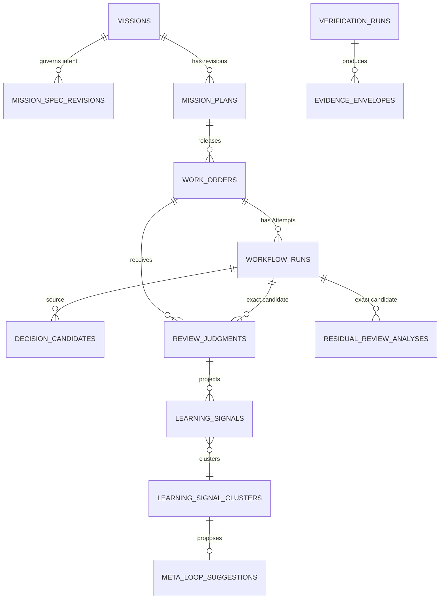

# Review Intelligence & Alignment V1

## Outcome

Move the primary human review flow from reconstructing intent and behavior from
a generated diff toward reviewing frozen intent, implementation decisions,
verified behavior, exact evidence, architecture, and residual risk. Raw source
diffs remain directly available and human review, WorkOrder acceptance, GitHub
publication, and merge remain separate decisions.

This plan implements the accepted direction in
`docs/architecture/2026-08-17-review-intelligence-alignment-v1-audit.md`.

## Product boundary

- Extend the existing WorkOrder and Execution Run Inspector experience.
- Extend `buildReviewPackage`; do not persist a Review Package aggregate.
- Reuse canonical verification records; do not create another verifier or
  acceptance store.
- Add only bounded advisory persistence required for implementation decisions,
  review judgments, and optional residual findings.
- Reuse Factory Learning for repeated-correction promotion.
- Keep residual AI analysis default-off and outside acceptance eligibility.
- Do not implement Review Intelligence V2, autonomous review approval,
  autonomous acceptance, or human-free merge.

## Research and institutional context

- Repository research found an existing fail-closed review projection in
  `convex/lib/reviewPackage.ts`, used by WorkOrder detail and
  `ExecutionRunInspector`. It already rejects self-verification, malformed
  evidence, stale WorkOrder revisions, repository/PR mismatch, missing GitHub
  App lineage, and non-current CI.
- The prior operational-hardening plan established the key invariant: generate
  review state from durable canonical records, never a worker's final summary.
- The continuous-quality plan requires explicit `UNKNOWN`, `STALE`, and
  conflicting semantics and treats an LLM grader as evidence, not truth.
- `docs/solutions/` contains no applicable review/evidence learning and has no
  critical-patterns file. The only stored solution concerns a different Convex
  schema CI failure.
- [Devin Review](https://docs.devin.ai/work-with-devin/devin-review) informs
  semantic diff organization and reviewer navigation.
- [Aviator Verify](https://www.aviator.co/verify) informs criterion-to-evidence
  presentation and deterministic-over-advisory semantics.

## User flows and resolved specification gaps

### Reviewer flow

1. Enter from WorkOrder detail or an exact Attempt deep link.
2. See loading, unavailable, unauthorized, incomplete, blocked, or review-ready
   state without optimistic substitution.
3. Review Intent, criterion matrix, exact evidence, failure/recovery history,
   implementation decisions, semantic groups, residual advisory findings, then
   raw diff.
4. Change Basic / Intermediate / Advanced disclosure without changing data or
   authority.
5. Record a comment, clarification request, change request, residual-risk
   acknowledgment, architecture concern, correction, or Review Package approval.
6. Separately invoke `workOrders.accept` only when canonical acceptance is
   eligible. GitHub merge remains outside this action.

### Decision-candidate flow

1. A human or signed orchestration service captures a bounded decision from one
   exact Attempt/session reference.
2. Secret-shaped content is redacted before persistence; full prompts and raw
   terminal histories are rejected.
3. Reviewers accept or reject the proposal as advisory input.
4. Acceptance never mutates Spec, Plan, Quality Contract, or WorkOrder.
5. A separately created governed Spec revision, Plan revision, or ADR can be
   linked as the resolution. Existing execution remains bound to the original
   lineage.

### Review-correction learning flow

1. A human records a typed correction against an exact candidate.
2. Factory Learning creates at most one signal for the same normalized correction
   and WorkOrder, preserving the review-judgment ID and candidate SHA.
3. Three distinct WorkOrders with the same normalized correction can activate
   one existing learning cluster and Improvement Candidate.
4. Existing human experiment approval, completed experiment, Mission, submitted
   Plan, and separate Plan approval rules remain unchanged.

### Residual-analysis flow

1. The feature flag is enabled explicitly.
2. Canonical currentness must recompute `VERIFIED` for the exact candidate.
3. A signed service reports bounded findings from a reviewer identity distinct
   from the implementation actor, with model/provider/prompt/context digests and
   null-preserving telemetry.
4. Every finding is `ADVISORY`. A finding that contradicts deterministic
   evidence is labeled as contradicted and cannot alter the verified result.
5. Exact candidate/context digest makes reporting idempotent and cacheable.

### Failure and recovery behavior

- Candidate/PR head changes reactively make prior review judgments, decisions,
  and residual analysis historical rather than current.
- Direct URLs survive refresh and back/forward because the existing WorkOrder
  and inspector routes remain canonical.
- Query/mutation authorization fails closed across workspace/repository scope.
- Mutation errors remain visible and retryable without duplicate records.
- Slow loading keeps the previous result from being presented as current.
- No offline mutation queue is introduced in V1.

## Data model

The Review Package stays a derived read model. The following three tables carry
only advisory human/agent judgment that does not exist canonically elsewhere.

### Decision Candidate

- workspace, repository, Mission, WorkOrder, source Attempt/session references;
- exact candidate SHA when available;
- category: requirement clarification, architecture, compatibility, rejected
  approach, scope, security tradeoff, or testing;
- attributable origin (`HUMAN` or `AGENT`) and derived actor identity;
- bounded redacted summary, rationale, optional source reference and content
  digest;
- proposed target: Spec, Plan, WorkOrder, ADR/documentation, informational only;
- status: proposed, accepted-for-revision, rejected, superseded, resolved;
- optional linked resulting governed artifact ID/type/revision/digest;
- `acceptanceAuthority: false`, idempotency key, timestamps.

### Review Judgment

- exact WorkOrder, source Attempt, candidate SHA, tree SHA, PR identity;
- action: comment, request clarification, request change, acknowledge residual
  risk, architecture concern, correction, approve Review Package;
- optional correction taxonomy:
  `REPEATED_REVIEW_CORRECTION`, `ARCHITECTURAL_REVIEW_PATTERN`,
  `MISSING_ACCEPTANCE_CRITERION`, `MISSING_DETERMINISTIC_GATE`,
  `REPEATED_SECURITY_COMMENT`, `REPEATED_SCOPE_CORRECTION`,
  `REVIEW_DISCOVERED_REQUIREMENT`, `POST_VERIFICATION_HUMAN_DEFECT`;
- authenticated human actor, bounded redacted summary/rationale, source refs;
- immutable exact-lineage snapshot, advisory authority flag, idempotency.

Review Package approval is represented only as a Review Judgment. It is not an
approval decision, acceptance receipt, publication permit, or merge decision.

### Residual Review Analysis

- exact WorkOrder/source Attempt/candidate/tree/Verification Subject/Plan and
  evidence-set digests;
- exact context digest and cache key;
- reviewer identity distinct from executor identity;
- provider/model/model-version/prompt digest and optional token/cost telemetry;
- bounded findings with category, severity, summary, affected files, evidence
  refs, deterministic-conflict flag, and `ADVISORY` authority label;
- status, failure summary, timestamps, idempotency, `acceptanceAuthority: false`.

## Review Package V2 projection

### Intent

- Mission ID/objective;
- exact Spec revision ID/number/digest and Constitution lineage;
- only the requirements relevant to the WorkOrder;
- approved Plan ID/revision/summary and relevant assertions;
- Quality Contract digest;
- WorkOrder ID/revision, desired outcome, constraints, risk, verification
  contract digest, Definition of Done, and rollback.

### Criterion evidence matrix

Each row preserves arrays of exact IDs rather than flattening them into prose:

`Spec Requirement → Plan Assertion → WorkOrder Criterion → Verification Check → Evidence Envelope → Result`

The row exposes verification method, verifier identity, receipt ID, subject/plan
IDs and digests, evidence IDs/references/hashes, currentness, integrity issue,
and status. `UNKNOWN`, missing, stale, failed, or contradictory evidence remains
non-success. Spec checklist completion is never included as delivery evidence.

### Change and recovery

- deterministic path-based groups: Authentication, Persistence, Verification,
  UI, Configuration, Migration, Tests, Documentation, Dependencies, Other;
- exact file path, artifact/event lineage, and diff link in every group;
- notable dependency/config/schema/migration indicators;
- failed source/verification Attempts, retries, stale-candidate/PR events,
  recovery summaries, and unresolved handoff risk.

### Decisions and residual uncertainty

- current and historical Decision Candidates with origin/trust/status;
- exact-candidate Review Judgments;
- advisory residual findings after verified evidence;
- missing telemetry, unverified non-blocking conditions, unresolved risk, and
  contradictions.

### Identity and raw review

- exact Spec/Plan/WorkOrder/Attempt/Verification Subject/Plan/receipt/envelope/
  Quality Gate/PR provider IDs and digests;
- candidate SHA, tree SHA, PR head SHA, connected GitHub App installation;
- worker, harness, manifest, Factory Version, and currentness;
- raw PR/files-changed link and code-diff artifact reference.

## Authorization and security

- Reads reuse `requireAuthorizedDeliveryScope` and exact delivery-record checks.
- Human writes derive actor identity from the authenticated workspace membership;
  no client-provided human authority.
- Agent/harness writes enter only through a new replay-resistant signed service
  command bound to the exact Attempt/workspace/repository.
- Decision acceptance and Review Judgment creation require delivery-update or
  approval permissions appropriate to the action; neither can call acceptance.
- Bounded-text helpers remove control characters, secret-shaped values, URLs
  containing credentials, and known token/key formats before persistence.
- Reject raw prompts, terminal transcripts, oversized excerpts, HTML, unbounded
  metadata, cross-workspace references, and lineage mismatch.
- React renders summaries as escaped text only; external links accept safe HTTP(S)
  schemes and exact GitHub PR lineage where required.

## Authority invariants

- Spec Finalize = planning-ready only.
- Plan approval = WorkOrder release.
- Harness authority = `NONE`.
- Worker and Remote Sandbox = execution only.
- Factory Memory and Factory Learning = advisory.
- Observability/Evals = diagnostic.
- Decision Candidate and residual analysis = advisory.
- Review Package = projection.
- Independent Verification = canonical verification.
- GitHub App = controlled publication.
- Review Package approval = acknowledgment only.
- `workOrders.accept` = canonical acceptance.
- GitHub merge = separate provider action.

## Implementation phases

### Phase 0 — audit and plan

- [x] Create a fresh isolated worktree from exact latest `origin/main`.
- [x] Record exact main/runtime/System Qualification/Generic Harness/Spec Intake/
      Factory Learning/Execution Routing baselines.
- [x] Audit current primitives and external product references.
- [x] Publish capability matrix and authority decision.
- [x] Complete flow analysis and resolve V1 defaults in this plan.

### Phase 1 — advisory domain and security boundary

- [x] Add explicit validators and the three advisory tables to `convex/schema.ts`.
- [x] Add `convex/lib/reviewIntelligence.ts` for canonical digests, semantic
      grouping, bounded redaction, finding conflict semantics, and pure tests.
- [x] Add `convex/reviewIntelligence.ts` authorized reads/mutations for human
      Decision Candidates and Review Judgments.
- [x] Add signed service-command ingestion for Attempt Decision Candidates and
      residual analyses, bound to exact workspace/repository/Attempt lineage.
- [x] Register residual analysis default-off without enabling production flags.
- [x] Add duplicate, unauthorized, cross-workspace, untrusted-origin, secret,
      oversize, and self-review tests.

### Phase 2 — canonical Review Package V2

- [x] Extend `factoryReviewReadModel` to load exact frozen Mission/Spec/Plan,
      all relevant Attempts, verification results/envelopes, gate decisions,
      advisory records, and exact diff artifacts.
- [x] Extend `buildReviewPackage` with intent, full criterion matrix, semantic
      groups, attempts/recovery, decisions, residual uncertainty, exact IDs/
      digests, currentness, and raw-diff links.
- [x] Preserve current V1 fields during rollout so existing callers and fixtures
      remain readable.
- [x] Add focused projection tests proving `UNKNOWN` never becomes success and
      deterministic evidence wins over contradictory advisory findings.

### Phase 3 — review judgments into Factory Learning

- [x] Extend Factory Learning source taxonomy only with `REVIEW_JUDGMENT`; keep
      the existing signal/cluster/candidate/experiment lifecycle.
- [x] Project typed correction category into `reasonCode` rather than creating a
      second learning taxonomy or table.
- [x] Deduplicate identical corrections per WorkOrder/signature so three comments
      on one candidate cannot create an Improvement Candidate.
- [x] Require three distinct WorkOrders before the existing cluster threshold can
      produce an Improvement Candidate.
- [x] Map missing-gate/regression corrections to existing candidate types and
      retain `acceptanceAuthority: false` and `autoPromote: false`.
- [x] Test idempotency, repository isolation, duplicate suppression, experiment
      approval, attempted self-promotion, and governed Mission/Plan continuation.

### Phase 4 — existing-surface UX

- [x] Read `docs/design.md` and `.claude/skills/design/` before editing UI.
- [x] Rework `ReviewEvidencePackage` to the required Intent → Criteria → Evidence
      → Failure/Recovery → Decisions → Changes → Residual → Raw Diff order.
- [x] Respect the existing Basic / Intermediate / Advanced experience selector;
      presentation never changes authority or record selection.
- [x] Add clear VERIFIED/FAILED/UNKNOWN/STALE and ADVISORY labels that do not rely
      on color alone.
- [x] Add authorized Review Judgment actions with loading, error, success, and
      duplicate-safe states. Keep `Accept WorkOrder` separate.
- [x] Preserve direct WorkOrder/Run Inspector links and raw PR diff navigation.
- [x] Add component tests for all disclosure levels, empty/failure states,
      advisory contradiction, focus order, unsafe links, and long IDs/files.

### Phase 5 — golden path, failure matrix, and qualification

- [x] Add one deterministic fixture from Mission through accepted WorkOrder,
      review correction, Learning cluster, and Improvement Candidate.
- [x] Prove the correction does not alter accepted lineage, revision proposals
      require a new governed artifact, and candidates cannot self-promote.
- [x] Cover stale candidate, stale PR head, failed verification, missing evidence,
      UNKNOWN criterion, untrusted decision, rejected decision, unauthorized
      decision, cross-workspace access, duplicate correction, advisory
      hallucination/contradiction, learning duplicates/self-promotion, and
      secret-shaped prompt input.
- [x] Extend `scripts/system-factory-e2e-qualification.mjs` with Review
      Intelligence tests and configurable evidence output while preserving its
      canonical composed runner.
- [x] Write new evidence under
      `docs/testing/evidence/review-intelligence-v1/`; do not modify
      `system-factory-e2e-v1` or `system-factory-e2e-v2`.

## Validation matrix

- Focused Review Package, Decision Capture, Review Judgment, residual authority,
  Factory Learning, and golden-path suites.
- Existing Mission Spec, Plan, Quality Contract, WorkOrder, Verification Factory,
  exact-currentness, GitHub App, Generic Harness, worker/runtime, Remote Sandbox,
  Factory Memory, Observability/Evals, and Execution Routing suites.
- Full repository tests, TypeScript, lint, skill lint, runtime guard, production
  build, orchestration startup smoke, and `git diff --check`.
- `pnpm run qualify:factory` through its extended composed runner with the new
  evidence output directory.
- Browser E2E on port 5180 for this active worktree unless local runtime ownership
  requires the documented 5199 demo path.
- Desktop 1440×900, tablet 1024×768, mobile 390×844; light/dark; Basic/
  Intermediate/Advanced; deep links; refresh; back/forward; keyboard; visible
  focus; no horizontal overflow; zero console/page/request errors; targeted axe
  WCAG A/AA.
- Navigate intent → criterion → envelope/verification → changed code without
  losing exact lineage.

## Runtime contract decision

Started at v29. The extractor against exact base
`e9d6b93e2edd5cf81beddd627abfbb67e7f85086` found seven public additions:
five Review Intelligence query/mutation contracts and two signed service-command
actions. The runtime advanced exactly once to v30; the guard now passes with
that explicit delta.

## Risks and mitigations

| Risk | Mitigation |
| --- | --- |
| Review Package becomes a second truth store | Keep it a pure/rebuildable projection; persist only genuinely new advisory judgment |
| AI finding looks authoritative | Literal `ADVISORY` label in schema and UI; no field/path consumed by acceptance or gate logic |
| Currentness race while reviewing | Bind every action/finding to exact source Attempt/candidate/tree/PR and re-project historical state after head changes |
| Reviewer correction creates noisy learning | Normalize, redact, idempotently dedupe per WorkOrder/signature, then require three distinct WorkOrders |
| Decision Candidate silently changes intent | No mutation path to governed artifacts; require separately created revision and link it afterward |
| Secret leakage from sessions | Structured summaries only, strict size caps, deterministic redaction, reject raw transcript metadata |
| Expensive render | All rendering uses deterministic Convex projections; residual model work is precomputed, optional, cached, and default-off |
| Scope sprawl into review control plane | No new navigation domain, verifier, acceptance mutation, merge action, or autonomous approval |

## Acceptance criteria

- [x] One exact WorkOrder/candidate/PR Review Package answers intent, changes,
      proof, failures/recovery, decisions, and uncertainty.
- [x] Every criterion row preserves exact source IDs/digests and never upgrades
      UNKNOWN/missing/stale/advisory data to success.
- [x] Semantic groups are deterministic-first and preserve full file lineage.
- [x] Decision Candidates are bounded, attributable, redacted, advisory, and
      incapable of rebinding governed history.
- [x] Human corrections enter existing Factory Learning with independent
      repetition, isolation, idempotency, and no self-promotion.
- [x] Residual findings are optional, cached, attributable, visibly ADVISORY,
      post-verification only, and authority-free.
- [x] Basic/Intermediate/Advanced review order is implemented in WorkOrder and
      Run Inspector, with raw diff always available.
- [x] Review Package approval remains distinct from `workOrders.accept`,
      publication, and merge.
- [x] The golden path and entire failure matrix pass.
- [x] Existing V2 qualification evidence is byte-for-byte unchanged.
- [x] The extended composed qualification, browser matrix, accessibility, full
      tests, runtime guard, and build pass.
- [ ] A draft PR is created; no production flag is enabled and no merge occurs.

## Publication

After all evidence is captured, commit with the repository's configured author,
push `codex/review-intelligence-alignment-v1-20260817`, create a draft PR with
`gh`, wait for GitHub CI and Vercel terminal states, and report `MERGE`,
`PARTIALLY MERGE`, or `HOLD` with exact limitations.
