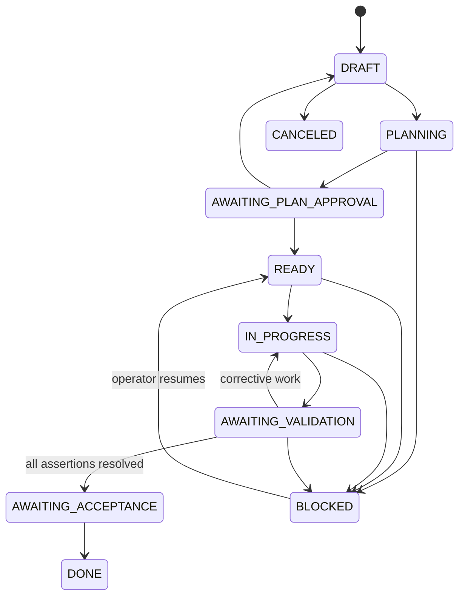

# Governed Missions Contract

## Purpose

A Mission is the durable, governed parent record for one approved outcome. It
coordinates existing WorkOrders and WorkflowRuns; it does not replace their
execution or governance responsibilities.

## V1 execution policy

- Exactly one repository-mutating WorkOrder may be active within a Mission.
- Read-only research or review may run concurrently only when the approved plan
  marks it `READ_ONLY` and no shared mutable resource is declared.
- The orchestrator creates or releases WorkOrders only from an approved plan.
- A worker produces a structured handoff. A distinct validator verifies
  assertions from the frozen contract; a worker handoff is never proof of pass.
- A Mission stops when it reaches acceptance, cancellation, budget exhaustion,
  maximum corrective iterations, or an explicit blocked/escalation state.

## Plan approval and WorkOrder release

- A Mission plan is editable only while its plan status is `DRAFT`.
- Creating a plan draft moves the Mission to `PLANNING`. An operator may
  abandon that unsubmitted draft with a reason; the plan becomes immutable and
  the Mission returns to `DRAFT` without deleting history.
- Submission freezes the proposed revision and moves the Mission to
  `AWAITING_PLAN_APPROVAL`.
- Rejection requires a durable rationale, freezes the rejected revision, and
  returns the Mission to `DRAFT`. Further work forks a new revision.
- Approval authorizes one exact repository/workflow/WorkOrder contract. It
  atomically creates all linked validation assertions and WorkOrders, then
  moves the Mission to `READY`.
- Approval never dispatches an agent, starts a WorkflowRun, satisfies a
  WorkOrder risk approval, merges code, or deploys software.
- Approval and materialization are idempotent. A Mission cannot be `READY`
  with only a partial plan release.
- Historical approved plans without a release receipt are treated as legacy
  and are never materialized automatically.
- Production plan authority must be derived from authenticated server identity
  and project roles. The local development operator fallback is evidence-only
  and must remain behind a default-off release flag.

## Roles and permissions

| Role | May do | May not do |
| --- | --- | --- |
| Orchestrator | Propose plans, sequence eligible WorkOrders, request corrective work, escalate | Approve its own plan or mark assertions passed |
| Worker | Execute one released WorkOrder, emit artifacts and handoff | Dispatch concurrent mutations, self-certify a Mission assertion |
| Validator | Record independent evidence and pass/fail/blocked result | Alter worker source, waive an assertion, approve acceptance |
| Operator | Approve plan, approvals, waivers, budget changes, cancellation, and final acceptance | Treat unknown or missing evidence as a pass |

## State transitions

## Validation contract

The contract is versioned and immutable after plan approval. Every assertion
must define an ID, outcome, verification method, pass condition, required
evidence, linked WorkOrders, and waiver policy. Allowed methods are `COMMAND`,
`TEST`, `BROWSER`, `MANUAL`, and `CHECKLIST`.

Mission acceptance requires every assertion to be `PASS` or explicitly waived
by an authorized operator. Failed, stale, missing, or unknown evidence blocks
acceptance. A receipt must point at an independent validator run when the
assertion requires independent validation.

## Handoff contract

Every worker and validator boundary records a handoff with:

- producer role, WorkOrder, and WorkflowRun;
- complete/incomplete/unknown assertion IDs;
- commands and exit codes executed;
- evidence artifacts and changed-file references;
- known risks/blockers, next action, and required owner;
- outcome: `COMPLETE`, `INCOMPLETE`, or `NEEDS_HUMAN_INPUT`.

The next role cannot begin unless the prior handoff is structurally complete.
Missing facts are represented as `unknown`, never inferred.

## Recovery and escalation

- Failed validation creates a linked corrective WorkOrder or requests a material
  plan revision; it cannot close the Mission silently.
- Reaching the configured corrective-iteration or budget limit transitions the
  Mission to `BLOCKED` with an explicit human action.
- Plan changes that affect an assertion invalidate affected validation evidence.
- All lifecycle commands are idempotent and recorded as Mission events.
