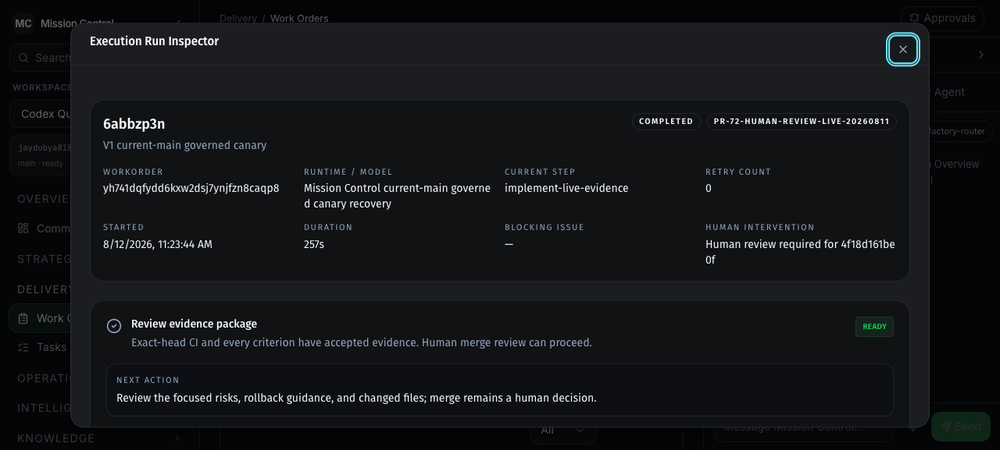

# V1 Production Qualification Receipt

Date: 2026-08-12

Decision: **GO for exact commit
`59b2ec2bfc91539dbba6fe71237d3cacb04957f8` only.**

This receipt records the governed canary, five-release staging eligibility,
exact production promotion, and rollback boundary used for the V1 go/no-go
decision. It does not authorize hundred-agent scheduling or new connectors.

## Governed canary

| Evidence | Recorded value |
| --- | --- |
| WorkOrder | `yh741dqfydd6kxw2dsj7ynjfzn8caqp8` |
| Completed Attempt | `6abbzp3n` / `ys7d4pdqp0pcqxmzcxwm8c9jvx8cbqcx` |
| Source revision | `55512d4c718e9bf5311931604279b3d87e785cbc` |
| Verified candidate | `4f18d161be0fe7955f1ae995e88803a161df9f9f` |
| Independent receipt | `xh75jxzzjnnpwrrf91dq485r7n8caa7t` |
| Human review | `ks7b0ncwkn4kk2t9rsdkxjn81x8caxf9` |
| Pull request | [#84](https://github.com/jaydubya818/MissionControl/pull/84) |
| GitHub Actions run | [31627775839](https://github.com/jaydubya818/MissionControl/actions/runs/31627775839) |
| Exact-head CI evaluation | `zh76zxqqzkpnn39r22yjr7gzks8cb5r6` / `PASS` |
| Merge commit | `59b2ec2bfc91539dbba6fe71237d3cacb04957f8` |

The agent could edit one approved documentation path and had no GitHub
publication authority. Independent verification passed the negative-space
constraints, the one-file/40-line change budget, and the frozen content check.
Human approval then authorized only the exact candidate, and the same paused
Attempt consumed a single-use publication permit before the control plane
created PR #84.

Two negative attempts remain intentionally preserved: one failed before
publication because the selected local key did not belong to the configured
GitHub App, and one failed before execution because its frozen branch did not
match the preserved WorkOrder workspace. An expired lease was then reclaimed
after the local backend restarted. None of these failures created a PR or
weakened the successful Attempt's evidence.

## Browser refresh proof

After GitHub CI completed, a credential-free server action fetched PR #84 and
its provider-authored checks, bound the exact head SHA to the Attempt, and
persisted a PASS evaluation. A full browser reload continued to show:

- review package `READY` with no blockers;
- base `55512d4c71` to head `4f18d161be`;
- PR `OPEN` and exact-head CI `PASS`;
- all three acceptance criteria accepted;
- explicit rollback guidance.

## Staging qualification

The isolated Factory control plane is Convex `gallant-cassowary-27`.

| Evidence | Recorded value |
| --- | --- |
| Staging WorkOrder | `h97r65apkmcr8dmq73gt2cn0q18ca9r2` |
| Staging Attempt | `tn7f68m2c3rh96xyr3hq81p76d8cb92v` |
| Release | `k17ye5t202bep0sefxeehf2fjx8camsf` |
| Vercel staging deployment | `dpl_51z4DdbVJDPWbC1JdfB8qQ5HJkwH` |
| Release state | `VERIFIED` |
| Verification attempts | `1` |

The exact PR #84 merge was independently fetched from GitHub, human-approved
for staging, built by Vercel from Git source, and verified by the Factory. The
provider-authored provenance endpoint matched the merge SHA and deployment ID;
smoke and health returned HTTP 200.

Production eligibility reported `eligible: true`, `candidateVerified: true`,
and five distinct verified release IDs:

1. `k17w03cm6xhb81p8yh92k7hbz58cba8k`
2. `k17p3fd2eqyb3ctdr4w22y89498cb74z`
3. `k17k18gs71yh2qy7nb4fz2e4fx8ca42g`
4. `k17ha06k346qxqxfhtqj8z5wms8candn`
5. `k17ye5t202bep0sefxeehf2fjx8camsf`

## Production decision and evidence

Production received a fresh approval only after the current merge was staging
VERIFIED and the eligibility gate passed. Vercel automatic production-domain
assignment remained disabled while the governed runner created deployment
`dpl_9rjCjXX6m8FKUPVrMKRZk44fP2DH` from exact Git SHA `59b2ec2`.

Mission Control recorded PASS evidence for production provenance, smoke, and
health before promotion. It then recorded a human-confirmed promotion receipt
for that same deployment ID. Vercel reports:

- production target: `dpl_9rjCjXX6m8FKUPVrMKRZk44fP2DH`;
- ready state: `READY`;
- ready substate: `PROMOTED`;
- commit: `59b2ec2bfc91539dbba6fe71237d3cacb04957f8`;
- release state: `PROMOTED`.

The verified and promoted deployment IDs are identical. That resolves the
earlier deployment-identity mismatch and is the basis for the GO decision.

## Rollback boundary

The previous production target remains provider-resolved and READY:

- deployment: `dpl_7BiXeSGrTuVvF2augiugvkHy1BDJ`;
- commit: `623047c705f676e892e45ee1a4199116538a89f3`.

If rollback becomes necessary, a human must restore that provider deployment,
confirm the different restored commit, and record the provider rollback ID,
evidence URL, and rationale through `recordProductionRollback`. That transition
is intentionally irreversible in the release ledger and requires a corrective
WorkOrder before another release.

No production rollback receipt was fabricated: the promoted canary passed, so
no rollback occurred. The concrete prior deployment, explicit procedure, and
server-enforced rollback contract are the rollback-readiness evidence.

## Deferred work

Hundred-agent scheduling and additional connectors remain deferred. The next
gate is an operational soak window covering unattended lease recovery,
provider latency, alerting, and operator response on this single governed path.
Scaling breadth before that soak would turn a proven release transaction into
an unproven fleet system.

## Validation summary

- GitHub Actions run `31627775839`: build, typecheck, smoke, unit, lint, and
  E2E jobs passed for exact PR head `4f18d161`.
- `pnpm run lint`: passed, including repository typecheck and all skill lint.
- `pnpm run typecheck`: passed across all TypeScript workspaces.
- `pnpm test`: passed, including 53 UI test files / 234 UI tests, 73 Convex
  test files / 518 Convex tests, and every package test suite.
- `pnpm run build`: passed for the UI, orchestration server, workflow executor,
  and all buildable packages.
- Browser reload: persisted the exact run inspector at `READY`; screenshot is
  stored beside this receipt.
- Vercel: current production target, Mission Control promotion receipt, and
  exact verified deployment all resolve to
  `dpl_9rjCjXX6m8FKUPVrMKRZk44fP2DH`.
