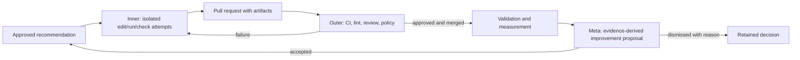

# Three-Loop Engineering Audit

**Date:** 2026-08-01  
**Workspace:** Software Factory Research Lab  
**Workspace ID:** `sn71gskbdemgf4z1trt9zdmm5h8bde69`  
**Historical result:** Partial.  
**Resolution:** Implemented on 2026-08-01. See
`docs/testing/three-loop-engineering-results.md` for verification and release evidence.

## Desired Model

1. **Inner loop — drives automation:** an approved agent edits, runs targeted
   checks, diagnoses failures, and repeats until the change is ready for a pull
   request.
2. **Outer loop — drives autonomy:** CI, lint, independent review, policy, and
   approval evaluate the pull request and return failures to bounded correction
   attempts until the change is merged or stopped.
3. **Meta loop — drives quality:** real execution, CI, review, and measurement
   evidence produces governed improvement proposals that re-enter the inner and
   outer loops.

## Executive Scorecard

| Loop | Existing capability | Live Research Lab evidence | Result |
| --- | --- | --- | --- |
| Inner | Task/Attempt contracts, isolated-worktree fields, `feature-dev` workflow, read-only Codex worker | No repository-mutating worker is connected; the current Codex worker explicitly forbids file changes | **Partial** |
| Outer | WorkOrder approvals, verification receipts, PR/CI ingestion, review lenses, merge-gate calculation | Research Lab webhook is not configured; its only PR-check row references MissionControl PR 36 and is failed | **Partial** |
| Meta | Loop cycle schema, measurements, next-cycle action, suggestion inbox, repetitive-work detector | No Research Lab suggestions exist; the preview inbox auto-seeds demo suggestions when empty | **Preview / incomplete** |
| Research graph | Parallel research, independent verification, synthesis, explicit gate, durable run | Selected graph is 8/8 complete with 3/3 verification and concurrency 3 | **Working** |
| Closed-loop projection | Workflow output should update cycle evidence and phase | Selected completed graph still shows cycle phase `RESEARCH`, with 0 sources, 0 claims, 0 recommendations, 0 validations, and 0 measurements | **Missing** |

## Evidence

### Browser

The Graph Engineering page is browser-operable and refresh-persistent:

- URL:
  `http://localhost:5199/v2/harness-loops?workspace=sn71gskbdemgf4z1trt9zdmm5h8bde69`
- Selected run: `loop-engineering@vlegacy`
- Graph status: Completed
- Nodes complete: 8/8
- Independent verification: 3/3
- Parallel limit: 3
- Browser errors: none

At the same time, the page presents the cycle at Research and asks the operator
to record its first source. Screenshot:
`docs/testing/evidence/three-loop-engineering-audit/graph-complete-cycle-stale.png`.

### Durable Data

The Research Lab has two `loopEngineeringCycles` records. Both remain at
`RESEARCH` with empty ledgers. The selected cycle
`zn7ba4hw0b68z4gpp168hnkzn58bdps6` has a completed workflow run whose context
already contains research source ledgers, accepted claims, synthesis
measurements, stop condition, approval ID, approval evidence digest, and
operator approval.

This proves the workflow output exists and the missing behavior is a projection
and lifecycle-integration gap, not a research-execution gap.

### Inner-Loop Runtime

`packages/workflow-engine/src/executor.ts` is a durable scheduler. It creates
canonical Tasks and waits for explicit deliverables; it does not edit a
repository. `scripts/codex-factory-worker.ts` is deliberately read-only.
The `feature-dev` workflow describes planning, implementation, tests, PR
creation, and review in prompts, but no connected runtime enforces those tool
actions or produces repository artifacts end to end.

### Outer-Loop Runtime

GitHub pull-request and check-run ingestion, review lenses, mutation-testing
signals, and merge-gate calculation are implemented. The Research Lab project
does not have a webhook secret or GitHub integration configured. Its persisted
PR-check evidence is not for its configured research repository.

### Meta-Loop Runtime

The Improvement Loop is correctly marked Preview in route capabilities. It has
three critical gaps:

1. The UI invokes `seedDemoSuggestions` automatically whenever the real inbox
   is empty.
2. Repetitive-task proposals write payload type `AUTOMATION_CANDIDATE`, while
   the acceptance mutation only creates an automation definition for
   `REPETITIVE_TASK_AUTOMATION`.
3. Accepting `SKILL_UPDATE`, `MAINTENANCE`, or `RULE_RETIRE` currently
   changes only suggestion status; it does not create governed implementation,
   validation, or measurement work.

### Terminology Mismatch

`HarnessLoopsDiagram.tsx` currently labels the inner loop as "Drives autonomy"
and the outer loop as "Builds automation." That is reversed from the supplied
operating model, where the fast inner edit/run/check loop drives automation and
the governed outer PR loop drives autonomy. The replacement surface must use
one vocabulary consistently in UI, documentation, analytics, and tests.

## Flow Analysis

The existing system implements most boxes independently. The missing contract is
the reliable, idempotent handoff between them.

## Flow Permutations

| Condition | Required behavior |
| --- | --- |
| No mutating runtime configured | Keep implementation actionable and explain the missing runtime; never claim completion |
| Targeted check fails | Preserve the failed Attempt, create a bounded correction Attempt, and keep evidence |
| CI fails after PR update | Correlate by WorkOrder, Attempt, PR, and head SHA; return to correction without duplicating work |
| Approval rejected | Require a reason and return to an actionable revision state |
| Browser refresh or executor restart | Restore the same loop, attempt, PR, checks, gate, and evidence |
| Duplicate webhook or scheduler tick | Apply idempotently and display one event |
| Max iterations, cost, or time reached | Stop and require an operator decision |
| No recommendation after measurement | Complete as a clean stop; do not fabricate implementation |
| Meta proposal accepted | Create governed work; do not directly mutate repository policy |
| Meta proposal later regresses quality | Retain original evidence and support rollback or rule retirement |

## Institutional Learning Applied

The only repository solution document,
`docs/solutions/build-errors/missing-convex-schema-contracts-ci-20260730.md`,
shows that automation features previously reached consumers before their full
Convex schema contract existed. The implementation must therefore add optional
schema fields and indexes first, validate generated types, and avoid a temporary
local validator shim.

## Decision

Do not add a fourth loop engine or a new primary navigation domain. Complete the
existing contracts and consolidate Graph Engineering and Improvement Loop into
one truthful Loop Engineering experience with drill-down views for Attempts,
PR/CI evidence, and improvement proposals.
